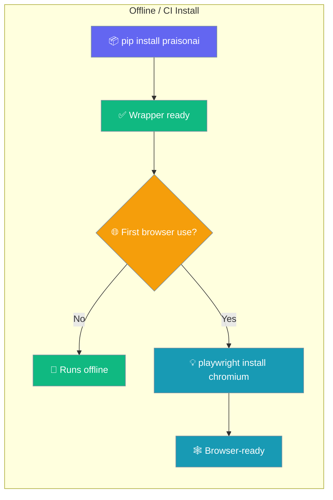
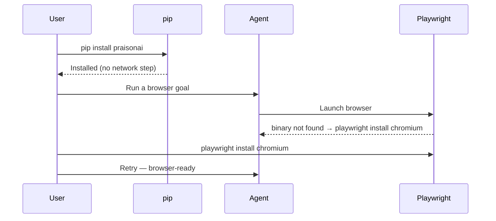
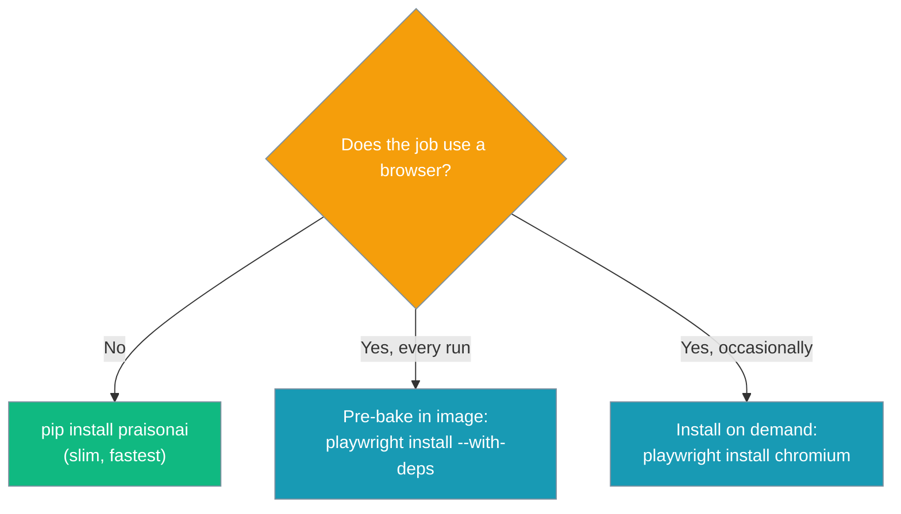

`pip install praisonai` performs no network step at install time — browser binaries are provisioned on demand, so installs succeed in offline, air-gapped, sandboxed, and CI environments.



## Quick Start

<Steps>
<Step title="Run on the slim install">

The default install needs no browser and no network step — agents run offline.

```python
from praisonaiagents import Agent

# Runs on the slim install — no browser needed.
agent = Agent(instructions="Summarise today's AI news headlines")
agent.start("Give me 5 bullets")
```

</Step>
<Step title="Add a browser only when you need one">

Provision the browser engine on demand the first time an agent drives a browser.

```bash
playwright install chromium
# Docker / CI (adds OS-level deps):
playwright install chromium --with-deps
```

```python
from praisonaiagents import Agent

agent = Agent(name="browser-agent", instructions="Browse the web and complete tasks in Chrome.")
agent.start("Go to google and search praisonai, then summarise the top result.")
```

</Step>
</Steps>

---

## What "No Network Step" Means

`pip install praisonai` installs the wrapper and SDK without pulling any browser engines.

- `setup.py` no longer runs `python -m playwright install` after install.
- `praisonai[browser]` and `praisonai[all]` install the Python packages but not the browser binaries.
- First browser-tool use surfaces `Playwright <browser> binary not found. Install it on demand: playwright install <browser>` if binaries are missing.



---

## Recipes

Pick the recipe that matches your environment.

### Docker image with browsers pre-baked

```dockerfile
FROM python:3.11-slim
RUN pip install praisonai[browser] && \
    playwright install chromium --with-deps
```

### CI job that only needs the SDK (no browsers, fastest)

```yaml
- run: pip install praisonai
- run: python your_agent_script.py
```

### CI job that DOES use the browser

```yaml
- run: pip install "praisonai[browser]"
- run: playwright install chromium --with-deps
- run: python your_browser_agent.py
```

### Air-gapped install

Point `pip` at a private PyPI mirror and pre-stage a Playwright browser bundle, then set `PLAYWRIGHT_BROWSERS_PATH` so Playwright finds the pre-downloaded engines without reaching the network.

```bash
export PIP_INDEX_URL=https://your-mirror.internal/simple
export PLAYWRIGHT_BROWSERS_PATH=/opt/playwright-browsers
pip install "praisonai[browser]"
```

---

## Common Patterns

Choose between pre-baking browsers and installing on demand based on how often your pipeline touches a browser.



---

## Best Practices

<AccordionGroup>
  <Accordion title="Pre-bake browsers in your Docker image">
    Run `playwright install chromium --with-deps` in the image build so cold starts are fast and reproducible.
  </Accordion>
  <Accordion title="Use --with-deps in Docker / CI">
    `--with-deps` installs the OS-level libraries Chromium needs, avoiding cryptic launch failures on slim base images.
  </Accordion>
  <Accordion title="Pin Playwright and its browser channel">
    Pin the `playwright` version and browser channel in reproducible environments so upgrades are deliberate.
  </Accordion>
  <Accordion title="Prefer the slim install for browser-free pipelines">
    Use `pip install praisonai` (slim) for jobs that never touch a browser — faster installs and smaller images.
  </Accordion>
</AccordionGroup>

---

## Related

<CardGroup cols={2}>
  <Card title="praisonai-browser Package" icon="box" href="/features/praisonai-browser-package">
    Standalone browser tier — install, CLI, and imports.
  </Card>
  <Card title="Browser Agent" icon="globe" href="/features/browser-agent">
    Setup, CLI reference, and supported actions.
  </Card>
  <Card title="Installation" icon="download" href="/installation">
    All six packages and how to pick the right one.
  </Card>
  <Card title="Browser CLI" icon="terminal" href="/cli/browser">
    Full `praisonai browser` command reference.
  </Card>
</CardGroup>
