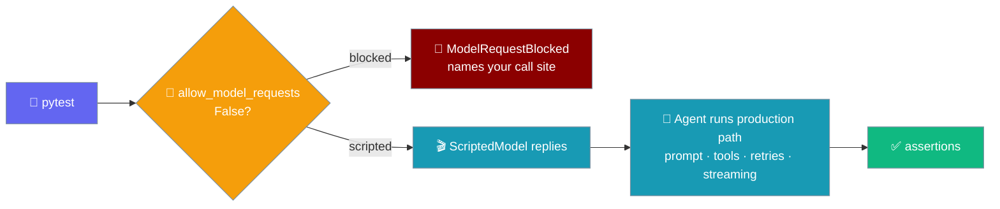
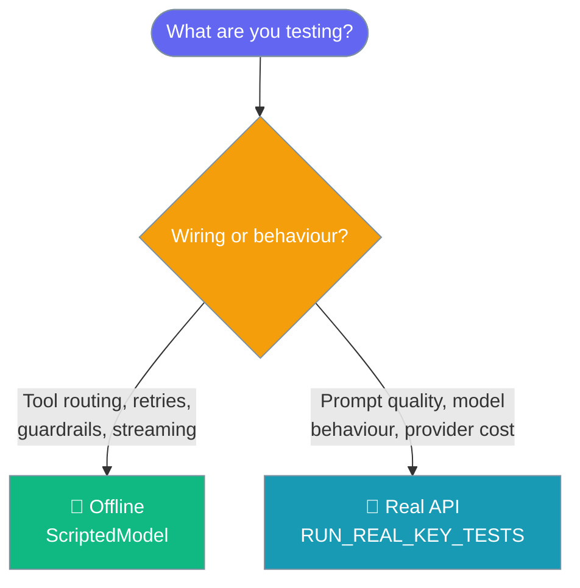

Run agent tests offline — no API keys, no network, no bill — with `ScriptedModel` in place of a real provider and a hard gate that blocks any real request.

<Tabs>
<Tab title="Python">
```python
from praisonaiagents import Agent, ScriptedModel

model = ScriptedModel(["Paris."])
agent = Agent(instructions="You are a geography bot.", llm=model)

assert agent.start("What is the capital of France?") == "Paris."
assert model.requests[0].last_user_message == "What is the capital of France?"
```

`ScriptedModel` subclasses the real `LLM`, so everything around the call — system prompt assembly, tool schemas, the tool loop, streaming, async — runs production code; only the provider-facing methods are replaced.


</Tab>
<Tab title="TypeScript">
```ts
import { Agent, ScriptedModel, allowModelRequests } from 'praisonai';

allowModelRequests(false);            // nothing in this suite may reach a provider

const model = new ScriptedModel(['Refunded order A1.']);
const agent = new Agent({ instructions: 'Support bot.', llm: model });

expect(await agent.chat('refund order A1')).toBe('Refunded order A1.');
expect(model.requestCount).toBe(1);
expect(model.requests[0].prompt).toBe('refund order A1');
```

`ScriptedModel` subclasses the real `BaseLLM`, replacing only `generate` / `generateStream` / `generateText` / `streamText` / `generateObject`. Prompt assembly, tool schemas, and the response shape all run production code — the double cannot drift from the real client because it *is* the real client with its network boundary swapped out.

```mermaid
graph LR
    P[🧪 jest] --> G{🚦 allowModelRequests<br/>false?}
    G -->|blocked| X[🚫 ModelRequestBlocked<br/>names your call site]
    G -->|scripted| S[🎬 ScriptedModel replies]
    S --> A[🤖 Agent runs production path<br/>prompt · tools · streaming]
    A --> Assert[✅ expect(...)]

    classDef test fill:#6366F1,stroke:#7C90A0,color:#fff
    classDef gate fill:#F59E0B,stroke:#7C90A0,color:#fff
    classDef bad fill:#8B0000,stroke:#7C90A0,color:#fff
    classDef run fill:#189AB4,stroke:#7C90A0,color:#fff
    classDef ok fill:#10B981,stroke:#7C90A0,color:#fff

    class P test
    class G gate
    class X bad
    class S,A run
    class Assert ok
```

<Note>
**TypeScript differs from Python in a few ways:**
- Method / helper naming is camelCase (`allowModelRequests`, `noModelRequests`, `modelRequestsAllowed`, `requestCount`) rather than snake_case.
- `noModelRequests` takes a function (`await noModelRequests(async () => { ... })`); Python uses a `with` context manager.
- Scripting a tool call is **Python-only** for now — `ScriptedModel.tool_call(...)` does not yet exist in TS. Scripts are strings or `(req) => string` callables. Track parity on the [TS parity issue](https://github.com/MervinPraison/PraisonAI/pull/4964).
- The request gate uses a **counter** from day one, so an inner `noModelRequests()` scope exiting first cannot re-enable requests while an outer scope is still open.
- `ModelRequestBlocked` is a regular `Error` subclass. A `try { ... } catch (e) { ... }` around an agent call will catch it — rethrow, or check `e instanceof ModelRequestBlocked`.
</Note>
</Tab>
</Tabs>

## Quick Start

<Tabs>
<Tab title="Python">
<Steps>
<Step title="Install and gate the suite">
Add the gate to `conftest.py` so nothing in the suite can reach a provider.

```bash
pip install praisonaiagents
```

```python
# conftest.py
from praisonaiagents import allow_model_requests

allow_model_requests(False)   # nothing in this suite may reach a provider
```
</Step>

<Step title="Script one text reply">
```python
from praisonaiagents import Agent, ScriptedModel

model = ScriptedModel(["Paris."])
agent = Agent(instructions="Geography bot.", llm=model)

assert agent.start("Capital of France?") == "Paris."
```
</Step>

<Step title="Script a tool call + follow-up">
```python
from praisonaiagents import Agent, ScriptedModel

def refund(order_id: str) -> str:
    return f"refunded {order_id}"

model = ScriptedModel([
    ScriptedModel.tool_call("refund", {"order_id": "A1"}),
    "Refunded order A1.",
])
agent = Agent(instructions="Support bot.", llm=model, tools=[refund])

assert agent.start("refund order A1") == "Refunded order A1."
```
</Step>

<Step title="Assert on what the agent sent">
```python
assert model.request_count == 2                 # tool turn, then the follow-up
assert model.requests[0].tool_names == ("refund",)   # tools offered on turn 1
assert model.requests[0].last_user_message == "refund order A1"
```
</Step>
</Steps>
</Tab>
<Tab title="TypeScript">
<Steps>
<Step title="Install and gate the suite">
Add the gate to a Jest setup file so nothing in the suite can reach a provider.

```bash
npm install praisonai
```

```ts
// jest.setup.ts
import { allowModelRequests } from 'praisonai';

allowModelRequests(false);   // nothing in this suite may reach a provider
```
</Step>

<Step title="Script one text reply">
```ts
import { Agent, ScriptedModel } from 'praisonai';

const model = new ScriptedModel(['Paris.']);
const agent = new Agent({ instructions: 'Geography bot.', llm: model });

expect(await agent.chat('Capital of France?')).toBe('Paris.');
```
</Step>

<Step title="Script a reply from the request">
Script entries may be plain strings **or** functions of the recorded request (parity with Python's lambda).

```ts
import { Agent, ScriptedModel } from 'praisonai';

const model = new ScriptedModel([(req) => `You said: ${req.prompt}`]);
const agent = new Agent({ instructions: 'Echo bot.', llm: model });

expect(await agent.chat('hello')).toBe('You said: hello');
```
</Step>

<Step title="Assert on what the agent sent">
```ts
expect(model.requestCount).toBe(1);
expect(model.requests[0].prompt).toBe('hello');
```
</Step>
</Steps>
</Tab>
</Tabs>

## Canonical example

<Tabs>
<Tab title="Python">
```python
# conftest.py
from praisonaiagents import allow_model_requests
allow_model_requests(False)          # nothing in this suite may reach a provider
```

```python
from praisonaiagents import Agent, ScriptedModel

def refund(order_id: str) -> str:
    return f"refunded {order_id}"

model = ScriptedModel([
    ScriptedModel.tool_call("refund", {"order_id": "A1"}),
    "Refunded order A1.",
])
agent = Agent(instructions="Support bot.", llm=model, tools=[refund])

assert agent.start("refund order A1") == "Refunded order A1."
assert model.request_count == 2
assert model.requests[0].tool_names == ("refund",)
```
</Tab>
<Tab title="TypeScript">
```ts
// jest.setup.ts
import { allowModelRequests } from 'praisonai';
allowModelRequests(false);           // nothing in this suite may reach a provider
```

```ts
import { Agent, ScriptedModel } from 'praisonai';

const model = new ScriptedModel(['Refunded order A1.']);
const agent = new Agent({ instructions: 'Support bot.', llm: model });

expect(await agent.chat('refund order A1')).toBe('Refunded order A1.');
expect(model.requestCount).toBe(1);
expect(model.requests[0].prompt).toBe('refund order A1');
```

<Note>
Scripting a tool call is **Python-only** today — there is no `ScriptedModel.toolCall(...)` in TS. Script entries are strings or `(req) => string` callables. A scripted model driving a retryable guardrail is a common test pattern — see [Retry preserves the conversation](./guardrails#retry-preserves-the-conversation).
</Note>
</Tab>
</Tabs>

## How it works

<Tabs>
<Tab title="Python">
`ScriptedModel` is a real `LLM` subclass that replaces only the methods which talk to a provider — nothing else.

- System prompts are assembled normally, tools are serialised to real schemas, scripted tool calls are dispatched through the agent's own executor, and results are fed back as real tool messages.
- Replies are built as genuine `litellm.ModelResponse` objects, parsed by the same code path a live response would take — so the double cannot drift from reality.
- When the agent asks for one more reply than the script holds, the double raises `ScriptExhausted` (usually the script is one reply short — after a tool call the agent comes back for a follow-up answer).

A script entry may be a `str` (a final answer), a `ScriptedModel.tool_call(...)`, a list of tool calls, a `ScriptedReply`, or a callable receiving the `RecordedRequest`:

```python
from praisonaiagents import ScriptedModel

# A reply that depends on what the agent actually sent:
model = ScriptedModel([lambda req: f"You said: {req.last_user_message}"])
```
</Tab>
<Tab title="TypeScript">
`ScriptedModel` extends the real `BaseLLM` and replaces only `generate` / `generateStream` / `generateText` / `streamText` / `generateObject`. Everything else runs production code.

- Prompt assembly, tool schemas, and the response shape all run the real client — the double cannot drift because it *is* the real client with its network boundary swapped out.
- When the agent asks for one more reply than the script holds, the double throws `ScriptExhausted`.

A script entry is a plain string (a final answer) or a callable receiving the `RecordedRequest`:

```ts
import { ScriptedModel } from 'praisonai';

// A reply that depends on what the agent actually sent:
const model = new ScriptedModel([(req) => `You said: ${req.prompt}`]);
```
</Tab>
</Tabs>

## The request gate

<Tabs>
<Tab title="Python">
`allow_model_requests(False)` blocks all six litellm request sites and both OpenAI client properties process-wide. Any attempt to reach a provider raises `ModelRequestBlocked`, whose message names the offending call site in **your** code.

```python
from praisonaiagents import Agent, allow_model_requests, ModelRequestBlocked

allow_model_requests(False)

agent = Agent(instructions="…", llm="gpt-4o")   # a real model, no script
try:
    agent.start("hello")
except ModelRequestBlocked as e:
    print(e.provider)    # e.g. "litellm.completion"
    print(e.call_site)   # "<your_test>.py:42 in test_thing" — the line to fix
```

Call `allow_model_requests(True)` to restore normal behaviour, or scope a single block with `no_model_requests()`:

```python
from praisonaiagents import Agent, no_model_requests

with no_model_requests():
    Agent(instructions="…", llm="gpt-4o").start("hello")   # raises ModelRequestBlocked
```

<Warning>
**`ModelRequestBlocked` and `ScriptExhausted` derive from `BaseException`, not `Exception` — on purpose.** The agent's tool loop catches `Exception` broadly and turns failures into a `None` answer. An ordinary exception raised from inside the double would reach your test as a mysterious `None`, hiding the very thing the test needs to be told ("your script is one reply short", "a real request leaked"). Deriving from `BaseException` lets these escape the loop — the same reasoning pytest uses for its own outcome exceptions. Do not wrap your agent calls in a bare `except Exception` that would swallow them.
</Warning>
</Tab>
<Tab title="TypeScript">
`allowModelRequests(false)` turns off real provider calls for the whole process. Any attempt to reach a provider throws `ModelRequestBlocked`, whose message names the offending call site. `modelRequestsAllowed()` is a predicate you can check directly.

Scope a single block with `noModelRequests()` — it takes a function and blocks real requests for its duration:

```ts
import { Agent, noModelRequests } from 'praisonai';

await noModelRequests(async () => {
  const agent = new Agent({ instructions: '…', llm: 'gpt-4o' });
  await agent.chat('hello');   // throws ModelRequestBlocked
});
```

<Note>
The gate uses a **counter**, not a saved-and-restored boolean. An inner `noModelRequests()` scope exiting first cannot re-enable requests while an outer scope is still open — nested scopes compose safely.
</Note>

<Warning>
`ModelRequestBlocked` is a regular `Error` subclass, not a `BaseException`. The Agent's turn loop does not swallow it, but a `try { ... } catch (e) { ... }` block wrapping an agent call **will** catch it. Either rethrow, or check `e instanceof ModelRequestBlocked`.
</Warning>
</Tab>
</Tabs>

## When to use offline vs. real-API testing



Offline tests assert what the agent *does* — which tool it calls, in what order, with what arguments. For prompt quality and model behaviour, use [Real API Testing](./real-api-testing).

## `ScriptedModel` configuration

<Tabs>
<Tab title="Python">
| Option | Type | Default | Description |
|--------|------|---------|-------------|
| `script` | `Iterable[str \| ScriptedReply \| ScriptedToolCall \| dict \| callable]` | `()` | Ordered replies. Strings are text answers; use `ScriptedModel.tool_call(...)` for a tool call; a callable receives the `RecordedRequest`. |
| `model` | `str` (keyword-only) | `"scripted/model"` | Fake model id reported by the agent. Set a real id (e.g. `"gpt-4o"`) to exercise model-specific behaviour while still answering from the script. |
| `**llm_kwargs` | — | — | Forwarded to the underlying `LLM`. |

Inspection surface after a run:

| Attribute / method | Returns | Use |
|--------------------|---------|-----|
| `model.request_count` | `int` | How many turns the agent sent. |
| `model.requests` | `tuple[RecordedRequest, …]` | Every request, in order. |
| `requests[i].tool_names` | `tuple[str, …]` | Tool schemas offered on that turn. |
| `requests[i].last_user_message` | `str \| None` | Most recent user message text. |
| `requests[i].system_prompt` | `str \| None` | The assembled system prompt. |
| `requests[i].params` | `dict` | Every completion param sent (`tool_choice`, `response_format`, …). |
| `requests[i].tool_results` | `tuple[dict, …]` | Tool-result messages in that request's history. |

`ScriptedReply`, `ScriptedToolCall`, and `RecordedRequest` are importable from `praisonaiagents.model_harness` when you need to build or type them explicitly.
</Tab>
<Tab title="TypeScript">
The constructor takes an ordered script and an optional config:

```ts
new ScriptedModel(
  script: Array<string | ((request: RecordedRequest) => string)>,
  config?: Partial<LLMConfig>,   // model defaults to "scripted/test-model"
)
```

Inspection surface after a run:

| Attribute / method | Returns | Use |
|--------------------|---------|-----|
| `model.requestCount` | `number` | How many completions the agent asked for. |
| `model.requests` | `RecordedRequest[]` | Every request the agent sent, in order. |
| `model.requests[i].prompt` | `string` | The last user-message text on turn *i*. |
| `model.requests[i].systemPrompt` | `string \| undefined` | The assembled system prompt. |
| `model.requests[i].options` | `LLMGenerateOptions \| undefined` | The full options object passed to `generate`. |
| `model.remaining` | `number` | Replies left unconsumed. |
| `model.reset()` | `void` | Rewind so the same instance can drive another run. |
| `model.extend(...entries)` | `void` | Append more replies to the script. |
</Tab>
</Tabs>

## Best Practices

<AccordionGroup>
<Accordion title="Gate the whole session in a fixture">
Put `allow_model_requests(False)` in a session-scoped fixture (or `conftest.py`) so a forgotten mock cannot leak a real call and quietly bill you.
</Accordion>

<Accordion title="Script the arguments the agent will really produce">
Assert `requests[i]` reflects the call you expect — a scripted `tool_call("refund", {"order_id": "A1"})` should mirror what your instructions steer the model toward.
</Accordion>

<Accordion title="Prefer real ModelResponse shapes">
Script with strings and `ScriptedModel.tool_call(...)` rather than inventing raw provider dicts — the helpers build genuine `litellm` response objects that the production parser understands.
</Accordion>

<Accordion title="Never mix scripted and real in one session">
Keep offline tests and `RUN_REAL_KEY_TESTS` integration tests in separate sessions. `allow_model_requests(False)` blocks the whole process, so a real-API test in the same run would fail with `ModelRequestBlocked`.
</Accordion>
</AccordionGroup>

## Related

<CardGroup cols={3}>
<Card title="Real API Testing" icon="key" href="./real-api-testing">
  Gated integration tests against live providers.
</Card>
<Card title="Guardrails" icon="shield-halved" href="./guardrails">
  Test guardrail wiring offline with scripted replies.
</Card>
<Card title="Tools" icon="wrench" href="./tools">
  How the tool loop the double exercises works.
</Card>
</CardGroup>
