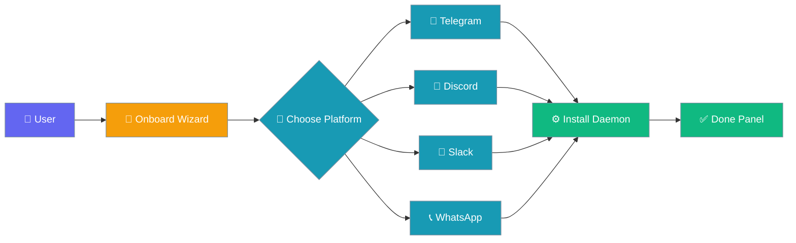
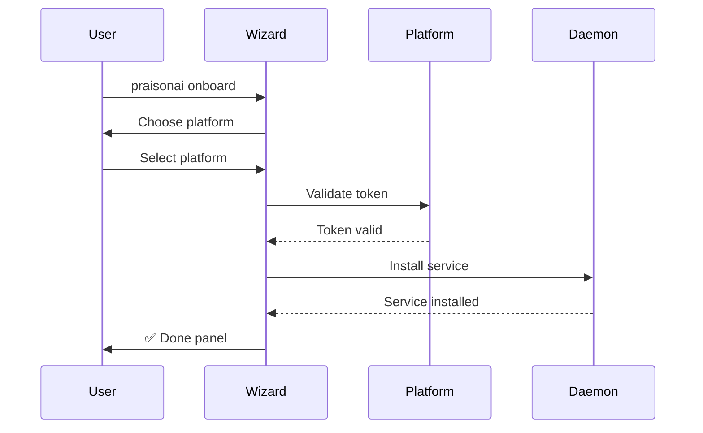
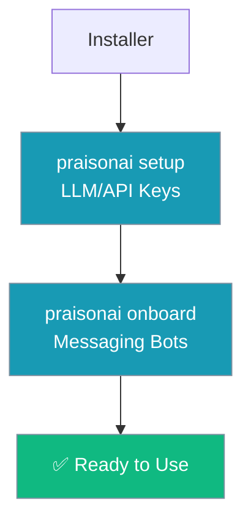
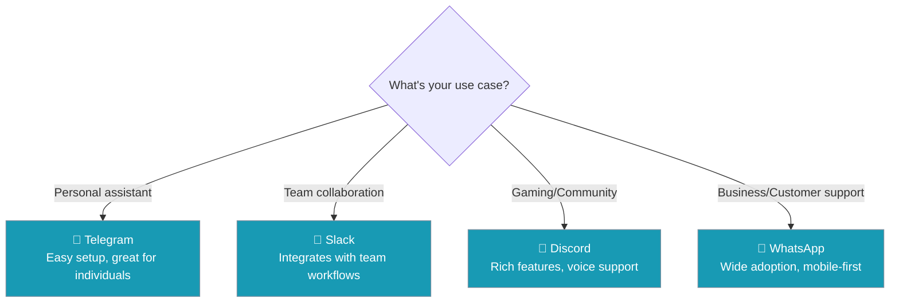

Interactive wizard that configures messaging bots and sets up the daemon services to run them.



## Quick Start

<Steps>
<Step title="Run the onboard wizard">
Launch the interactive bot setup wizard:

```bash
praisonai onboard
```

The wizard prompts you to choose a platform and walks you through token setup.
</Step>

<Step title="Pick your platform">
Select from the supported messaging platforms:

```
Choose a platform:
1. Telegram
2. Discord  
3. Slack
4. WhatsApp
```

Each platform has different token requirements and setup steps.
</Step>

<Step title="Paste your token">
Follow the platform-specific instructions to get your bot token, then paste it when prompted:

```
Enter your bot token: <paste_token_here>
```

The wizard validates the token and installs the daemon service.
</Step>
</Steps>

---

## How It Works



The onboarding process follows these phases:

| Phase | Description |
|-------|-------------|
| **Platform Selection** | Choose Telegram, Discord, Slack, or WhatsApp |
| **Token Entry** | Paste the bot token for your chosen platform |
| **Validation** | Wizard tests the token with the platform API |
| **Daemon Install** | Sets up the platform daemon (launchd/systemd/Windows Task) |
| **Configuration** | Writes config files to `~/.praisonai/` |
| **Completion** | Shows the ✅ Done panel with all connection details |

---

## What Gets Installed

When onboarding completes successfully, the wizard installs:

| Component | Location | Purpose |
|-----------|----------|---------|
| **Platform daemon** | System service (launchd/systemd/Windows Task) | Keeps bot running in background |
| **Bot configuration** | `~/.praisonai/config/` | Stores tokens and settings |
| **Gateway auth token** | `~/.praisonai/gateway/` | Authentication for web dashboard |
| **Dashboard URL** | Printed in Done panel | Local web interface |

---

## The ✅ Done Panel

When onboarding completes, you'll see a comprehensive summary panel:

```
✅ Bot onboarding complete!

Dashboard: http://127.0.0.1:8082 (localhost only)
Start bot: praisonai bot start
Gateway status: praisonai gateway status
Health check: curl http://127.0.0.1:8080/health
Info endpoint: curl http://127.0.0.1:8080/info
Auth token: abc123...

Run 'praisonai doctor' if you encounter any issues.
```

This panel contains everything you need to:
- Access the web dashboard
- Start/stop your bot
- Check service health
- Authenticate API requests

---

## Re-running Onboarding

The wizard is **idempotent** - safe to run multiple times:

```bash
# Update an existing bot's token
praisonai onboard

# Switch from Telegram to Discord
praisonai onboard
```

Re-running the wizard will:
- Update tokens and configurations in place
- Restart the daemon service with new settings
- Preserve existing chat histories and agent memory

---

## Relationship to Setup

PraisonAI has two configuration commands that run in sequence:



- **`praisonai setup`** - Configures LLM providers (OpenAI, Anthropic, etc.)
- **`praisonai onboard`** - Configures messaging bots (Telegram, Discord, etc.)

Both are called automatically by the installer, but can be run independently.

---

## Common Patterns

### Skip onboarding during install

```bash
# Skip during installation
curl -fsSL https://praison.ai/install.sh | bash -s -- --no-onboard

# Or via environment variable
PRAISONAI_NO_ONBOARD=1 curl -fsSL https://praison.ai/install.sh | bash
```

### Run onboarding separately later

```bash
# Install first without onboarding
curl -fsSL https://praison.ai/install.sh | bash -s -- --no-onboard

# Set up LLM keys
praisonai setup

# Set up messaging bot when ready
praisonai onboard
```

### Switch platforms

```bash
# Currently using Telegram, switch to Discord
praisonai onboard
# Choose Discord and enter Discord bot token
```

### Re-generate auth token

```bash
# Run onboarding again to get a fresh auth token
praisonai onboard
```

---

## Which Platform Should I Use?



Choose based on:

| Platform | Best For | Setup Difficulty | Features |
|----------|----------|------------------|----------|
| **Telegram** | Personal use, experimentation | Easy | Rich bot API, inline keyboards |
| **Discord** | Gaming communities, developer teams | Medium | Voice channels, rich embeds |
| **Slack** | Business teams, professional workflows | Medium | Thread support, workspace integration |
| **WhatsApp** | Customer support, global reach | Hard | Business accounts required |

---

## Best Practices

<AccordionGroup>
<Accordion title="Start with Telegram for testing">
Telegram has the simplest setup process and most permissive API limits. Use it for initial testing before moving to your target platform.
</Accordion>

<Accordion title="Keep tokens secure">
Bot tokens are stored in `~/.praisonai/config/`. Ensure this directory has proper permissions (600) and exclude it from version control.
</Accordion>

<Accordion title="Test the dashboard connection">
After onboarding, visit the dashboard URL from the Done panel to confirm the web interface is working and authentication is set up correctly.
</Accordion>

<Accordion title="Use 'praisonai doctor' for troubleshooting">
If bots aren't responding or services seem down, run `praisonai doctor` for diagnostic information and common fixes.
</Accordion>
</AccordionGroup>

---

## Related

<CardGroup cols={2}>
  <Card title="Installation Guide" icon="download" href="/docs/install/installer">
    Complete installer documentation including onboarding flow
  </Card>
  <Card title="Dashboard" icon="layout-dashboard" href="/docs/cli/dashboard">
    Web dashboard for managing agents and monitoring bots
  </Card>
  <Card title="Bot Security" icon="shield" href="/docs/best-practices/bot-security">
    Security best practices for messaging bots
  </Card>
  <Card title="Quick Install" icon="bolt" href="/docs/install/quickstart">
    One-liner installation including onboarding prompt
  </Card>
</CardGroup>