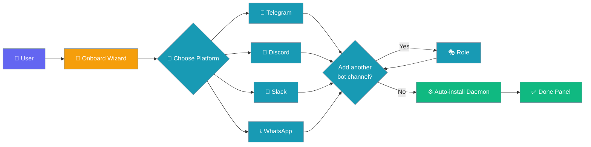
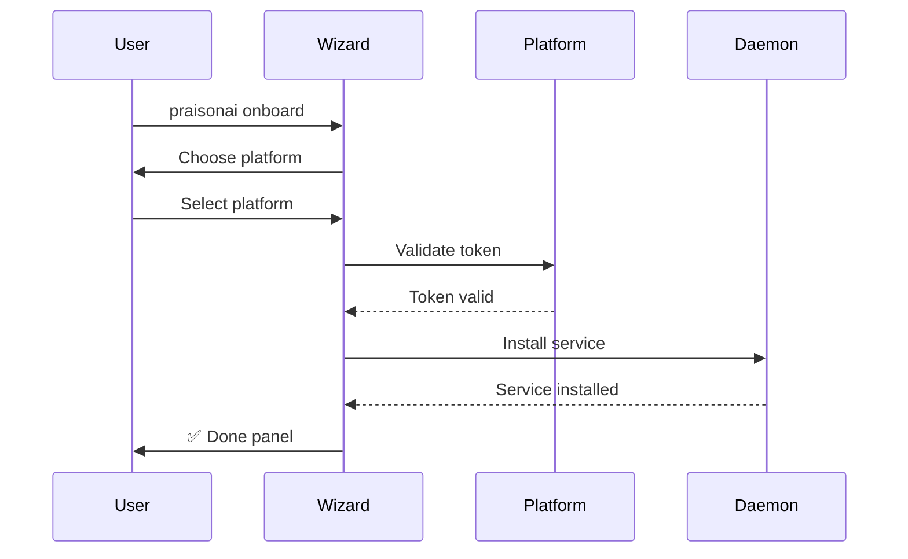
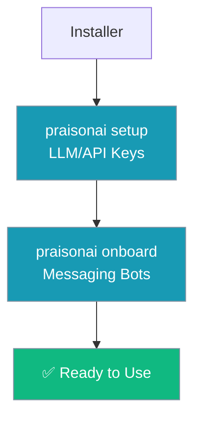
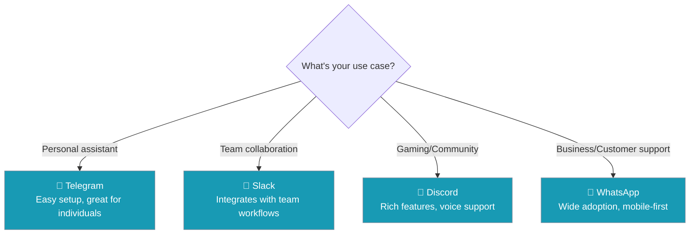

```python
from praisonaiagents import Agent

agent = Agent(name="onboard-agent", instructions="Onboard users and configure their environment.")
agent.start("Set up my PraisonAI environment with default settings.")
```


Interactive wizard that configures messaging bots and automatically installs the daemon service to run them in the background.

The user runs the wizard, picks a channel, and the daemon installs so bots stay online.



## Quick Start

<Steps>
<Step title="Simple Usage">
```bash
# Zero prompts once you have the token — wizard configures the bot
# and installs the background daemon automatically.
praisonai onboard
```

<Note>
Once tokens are collected, the daemon is installed automatically by default. Run `praisonai gateway uninstall` if you don't want it.
</Note>
</Step>

<Step title="With Configuration">
The wizard guides you through channel setup with an interactive flow:

1. **Choose first platform** — Telegram, Discord, Slack, or WhatsApp
2. **Enter bot token** — Hidden input, validated against the platform API  
3. **Add another bot channel?** — Create multiple bots on the same platform for different roles
4. **Enter role** (if adding more) — Role name like `cfo`, `ops`, `content` for specialized agents
5. **Configure security** — Allowed user IDs for each channel (comma-separated)

The wizard automatically generates environment variables following the `PLATFORM_<ROLE>_BOT_TOKEN` convention.
</Step>

<Step title="You're done">
The wizard writes bot configuration to `~/.praisonai/bot.yaml`, stores tokens/secrets in `~/.praisonai/.env` only (chmod 600), and shows the ✅ Done panel with your dashboard URL.
</Step>
</Steps>

---

## How It Works



The onboarding process follows these phases:

| Phase | Description |
|-------|-------------|
| **Platform Selection** | Choose Telegram, Discord, Slack, or WhatsApp |
| **Token Entry** | Paste the bot token for your chosen platform and validate it against the platform API |
| **Security Setup** | Set allowed user IDs (or leave blank for open access) |
| **Daemon Install** | Sets up the platform daemon (launchd/systemd/Windows Task) |
| **Configuration** | Writes config files to `~/.praisonai/` |
| **Completion** | Shows the ✅ Done panel with all connection details |

---

## What The Wizard Writes

| File | Contents |
|------|----------|
| `~/.praisonai/bot.yaml` | Channel configurations, multi-platform/multi-role routing, token env-var references, specialized agents |
| `~/.praisonai/.env` | Bot token(s) with role-based naming, `*_ALLOWED_USERS`, `GATEWAY_AUTH_TOKEN` (chmod 600) |

| Component | Location | Purpose |
|-----------|----------|---------|
| **Platform daemon** | System service (launchd/systemd/Windows Task) | Keeps bot running in background |
| **Bot configuration** | `~/.praisonai/config/` | Stores tokens and settings |
| **Gateway auth token** | `~/.praisonai/.env` (mode `0600`) | Authentication for web dashboard |
| **Dashboard URL** | Printed in Done panel | Local web interface |

Agent name (`assistant`) and instructions (`"You are a helpful AI assistant."`) use sensible defaults — edit `~/.praisonai/bot.yaml` to customise. The file contains the full schema as inline documentation.

### Generated bot.yaml example

```yaml
channels:
  telegram:
    token: ${TELEGRAM_BOT_TOKEN}
    allowed_users: ${TELEGRAM_ALLOWED_USERS}
    ack_emoji: "⏳"            # Show processing indicator during long agent operations
    done_emoji: "✅"           # Replace ack_emoji when operation completes
```

<Note>
If you leave `TELEGRAM_ALLOWED_USERS` empty, you must also set `unknown_user_policy: "allow"` for the bot to reply to anyone (since [PR #1885](https://github.com/MervinPraison/PraisonAI/pull/1885)). For production, set `TELEGRAM_ALLOWED_USERS` to your user IDs and leave `unknown_user_policy` at the default `"deny"`.
</Note>

Ack and done emojis are pre-populated so freshly onboarded bots give visible feedback during long agent operations from the start.

<Note>
**Upgrading?** Older `bot.yaml` files may contain a `home_channel` key (for example, `home_channel: ${TELEGRAM_HOME_CHANNEL}` or the equivalent for Discord / Slack / WhatsApp). This was never read by the gateway and is safe to delete. Re-running `praisonai onboard` and accepting the overwrite regenerates a clean file.
</Note>

<Note>
Auth token is now auto-persisted to `~/.praisonai/.env` with secure permissions (mode `0600`) and shown as fingerprint `gw_****XXXX` in logs for security.
</Note>

---

## The ✅ Done Panel

When onboarding completes, you'll see a comprehensive summary panel with four main sections:

```
╭─ ✅ Done ──────────────────────────────────────────────────────╮
│ Setup complete! Your bot is now running in the background.     │
│                                                                │
│ 🦞 Dashboard UI:                                               │
│   praisonai claw          → http://127.0.0.1:8082              │
│                                                                │
│ Gateway endpoints:                                             │
│   Health (public):  http://127.0.0.1:8765/health               │
│   Info (authed):    http://127.0.0.1:8765/info?token=…         │
│   Token abcd…wxyz stored in ~/.praisonai/.env as               │
│   GATEWAY_AUTH_TOKEN                                           │
│                                                                │
│ Manage the daemon:                                             │
│   praisonai gateway status     # is it running?                │
│   praisonai gateway logs       # tail the logs                 │
│   launchctl kickstart -k gui/$(id -u)/ai.praison.bot           │
│   praisonai gateway uninstall  # remove the daemon             │
│                                                                │
│ Re-run or reconfigure:                                         │
│   praisonai onboard            # change tokens / add platforms │
│   praisonai gateway start      # run in foreground (no daemon) │
│   praisonai doctor             # diagnose the whole stack      │
╰────────────────────────────────────────────────────────────────╯
```

The headline changes based on daemon install success:
- **Success**: "Setup complete! Your bot is now running in the background."
- **Failed**: "Setup complete! Configuration complete."

---

## Re-running Onboarding

The wizard is **idempotent** - safe to run multiple times:

```bash
# Update an existing bot's token
praisonai onboard

# Switch from Telegram to Discord
praisonai onboard
```

Re-running the wizard will:
- Update tokens and configurations in place
- Skip daemon installation if already installed and running (prints `✓ Daemon already installed and running`)
- Preserve existing chat histories and agent memory

The config file path is **always** `~/.praisonai/bot.yaml` (no longer prompted for). When re-running, the overwrite prompt now says `{path} exists. Overwrite with fresh config?` with `Kept existing file` on decline.

<Note>
If the daemon is already installed, re-running `praisonai onboard` is a no-op for the daemon service. Only configuration files are updated.
</Note>

---

## Adding Multiple Bots on the Same Platform

The wizard now supports creating multiple specialized bots on the same platform for different roles:

```bash
# Example wizard flow
praisonai onboard
# Choose telegram
# Enter first bot token
# "Add another bot channel?" → Yes
# "Role for this Telegram bot?" → cfo
# Enter CFO bot token
# "Add another bot channel?" → Yes  
# "Role for this Telegram bot?" → ops
# Enter Ops bot token
```

This creates environment variables with role-based naming:
```env
TELEGRAM_BOT_TOKEN=123456789:ABC...          # Main bot
TELEGRAM_CFO_BOT_TOKEN=987654321:DEF...     # CFO bot
TELEGRAM_OPS_BOT_TOKEN=456789123:GHI...     # Ops bot
TELEGRAM_ALLOWED_USERS=123456789,987654321
```

The generated `bot.yaml` will contain multiple channels routing to specialized agents. See the [Multi-Channel Bots guide](/docs/features/multi-channel-bots) for complete documentation.

---

## Relationship to Setup

PraisonAI has two configuration commands that run in sequence:



- **`praisonai setup`** - Configures LLM providers (OpenAI, Anthropic, etc.)
- **`praisonai onboard`** - Configures messaging bots (Telegram, Discord, etc.)

Both are called automatically by the installer, but can be run independently.

<Note>
**"First-run onboarding" and "bot onboarding" are two distinct flows.** First-run onboarding (`praisonai setup`) sets up LLM credentials and is triggered automatically when you first invoke `praisonai` or `praisonai run` without API keys. Bot onboarding (`praisonai onboard`, this page) is an optional step for configuring Telegram/Discord/Slack/WhatsApp bots. See [First-run Onboarding](/docs/features/first-run-onboarding) for the credential setup flow.

`praisonai --init` is safe to run before or after `setup` — if no provider is configured it surfaces setup guidance rather than a stack trace, so onboarding can proceed in either order.
</Note>

---

## Common Patterns

### Skip onboarding during install

```bash
# Skip during installation
curl -fsSL https://praison.ai/install.sh | bash -s -- --no-onboard

# Or via environment variable
PRAISONAI_NO_ONBOARD=1 curl -fsSL https://praison.ai/install.sh | bash
```

### Run onboarding separately later

```bash
# Install first without onboarding
curl -fsSL https://praison.ai/install.sh | bash -s -- --no-onboard

# Set up LLM keys
praisonai setup

# Set up messaging bot when ready
praisonai onboard
```

### Switch platforms

```bash
# Currently using Telegram, switch to Discord
praisonai onboard
# Choose Discord and enter Discord bot token
```

### Re-generate auth token

```bash
# Run onboarding again to get a fresh auth token
praisonai onboard
```

---

## Which Platform Should I Use?



Choose based on:

| Platform | Best For | Setup Difficulty | Features |
|----------|----------|------------------|----------|
| **Telegram** | Personal use, experimentation | Easy | Rich bot API, inline keyboards |
| **Discord** | Gaming communities, developer teams | Medium | Voice channels, rich embeds |
| **Slack** | Business teams, professional workflows | Medium | Thread support, workspace integration |
| **WhatsApp** | Customer support, global reach | Hard | Business accounts required |

---

## Best Practices

<AccordionGroup>
<Accordion title="Start with Telegram for testing">
Telegram has the simplest setup process and most permissive API limits. Use it for initial testing before moving to your target platform.
</Accordion>

<Accordion title="Keep tokens secure">
Bot tokens are stored in `~/.praisonai/.env`. Ensure this file has proper permissions (600) and exclude it from version control.
</Accordion>

<Accordion title="Test the dashboard connection">
After onboarding, visit the dashboard URL from the Done panel to confirm the web interface is working and authentication is set up correctly.
</Accordion>

<Accordion title="Use 'praisonai doctor' for troubleshooting">
If bots aren't responding or services seem down, run `praisonai doctor` for diagnostic information and common fixes. If you onboarded multiple bots on one platform and see `Unknown channel 'telegram_<role>'` from `praisonai doctor`, upgrade to a release that includes [PR #1772](https://github.com/MervinPraison/PraisonAI/pull/1772). Older releases incorrectly rejected the multi-channel YAML their own onboard wizard produced.
</Accordion>
</AccordionGroup>

<Card title="Bind-Aware Authentication" icon="shield" href="/docs/features/gateway-bind-aware-auth">
  Gateway and UI security behavior based on bind interface
</Card>

---

## Related

<CardGroup cols={2}>
  <Card title="Installation Guide" icon="download" href="/docs/install/installer">
    Complete installer documentation including onboarding flow
  </Card>
  <Card title="Dashboard" icon="layout-dashboard" href="/docs/cli/dashboard">
    Web dashboard for managing agents and monitoring bots
  </Card>
  <Card title="Bot Security" icon="shield" href="/docs/best-practices/bot-security">
    Security best practices for messaging bots
  </Card>
  <Card title="Quick Install" icon="bolt" href="/docs/install/quickstart">
    One-liner installation including onboarding prompt
  </Card>
</CardGroup>