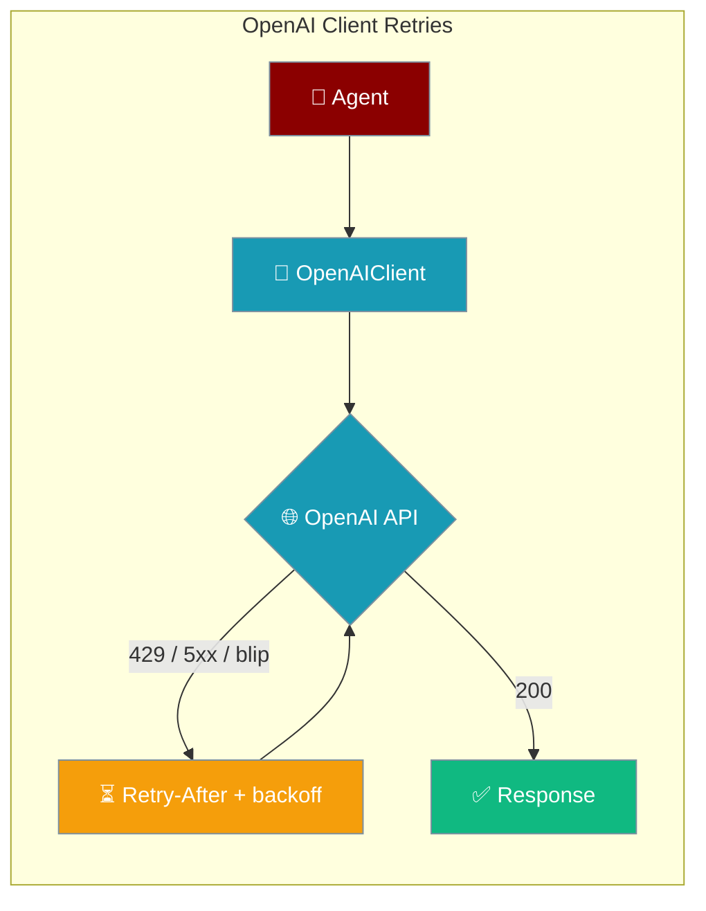
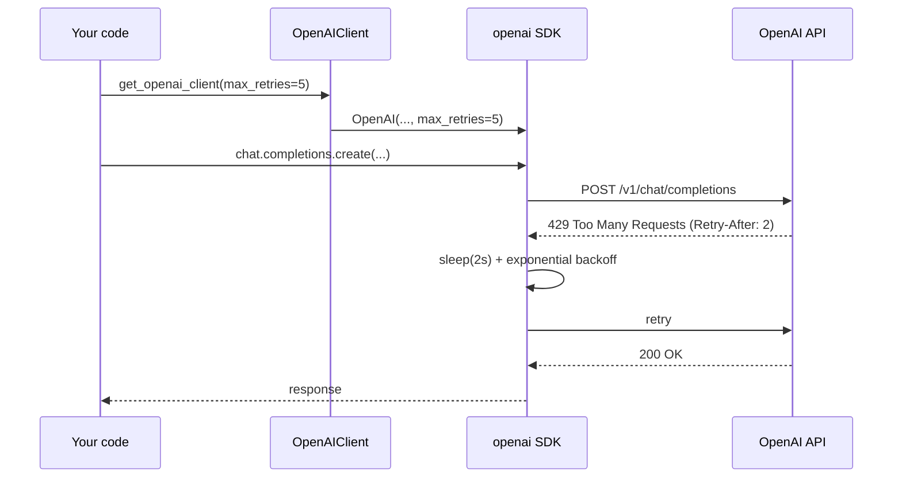
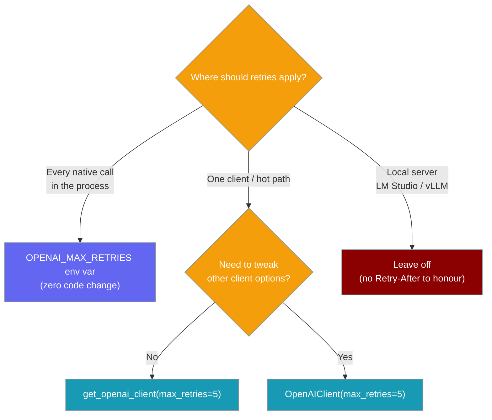

OpenAI client retries turn on the OpenAI SDK's built-in retry engine so transient 429s and network blips on the native client path are retried automatically.



## Quick Start

<Steps>
<Step title="Turn it on with one env var (zero code change)">
```python
# export OPENAI_MAX_RETRIES=5

from praisonaiagents import Agent

agent = Agent(
    name="Assistant",
    instructions="You are a helpful assistant.",
)
agent.start("Summarise today's news.")
# Transient 429s and network blips are now retried automatically.
```

The user runs an agent; transient rate limits and network blips retry automatically on the native OpenAI client path.
</Step>

<Step title="Pass max_retries through the client factory">
```python
from praisonaiagents.llm import get_openai_client

client = get_openai_client(max_retries=5)
```
</Step>

<Step title="Construct the client directly">
```python
from praisonaiagents.llm import OpenAIClient

client = OpenAIClient(max_retries=5)
```
</Step>
</Steps>

---

## How It Works

The value is forwarded into the underlying `openai` SDK, which honours `Retry-After` on 429s and applies exponential backoff for transient errors.



| Behaviour | Detail |
|-----------|--------|
| Applies to | The native `OpenAIClient` / `get_openai_client` path (used internally by `AutoAgents` **and, since PR for [#2963](https://github.com/MervinPraison/PraisonAI/issues/2963), by the OpenAI fallback leg of `praisonai --auto` / `AutoGenerator`**), plus any direct callers. |
| Not affected | The LiteLLM leg of `praisonai --auto` (LiteLLM runs first; `OPENAI_MAX_RETRIES` only kicks in when the OpenAI fallback runs). The LiteLLM-backed `LLM` class and agent-loop resilience engine also live in a separate layer — see [Agent Retry](/docs/features/agent-retry). Since the fix for [#3135](https://github.com/MervinPraison/PraisonAI/issues/3135), that agent-loop layer is on by default; pass `Agent(..., retry=False)` to opt out of it. |
| When unset | Behaviour is byte-identical to before — `max_retries` is only forwarded when it is not `None`. |
| Cache | `get_openai_client()` caches on `max_retries`, so changing it mid-process rebuilds the SDK client. |

<Note>
`praisonai --auto` uses LiteLLM first and only falls back to OpenAI on error. `OPENAI_MAX_RETRIES` therefore only takes effect on that fallback path — see [Auto Mode Providers](/docs/features/auto-generator-providers) for the fallback flow.
</Note>

---

## Configuration Options

| Option | Type | Default | Description |
|--------|------|---------|-------------|
| `max_retries` (arg on `OpenAIClient` / `get_openai_client`) | `Optional[int]` | `None` | Number of automatic retries for transient errors on the native OpenAI client path. |
| `OPENAI_MAX_RETRIES` (env var) | `int` (string) | unset | Fallback used when `max_retries` is not passed. Non-integer values silently fall back to the SDK default. |

Precedence: `explicit arg  >  OPENAI_MAX_RETRIES env var  >  SDK default`.

<Note>
Non-integer `OPENAI_MAX_RETRIES` (e.g. `"abc"`) is silently ignored and the SDK default takes over — no crash.
</Note>

---

## Which Approach to Use

Match the retry surface to how broadly you want the policy to apply.



---

## Common Patterns

**Turn it on globally with one env var** — for production deployments where every call should retry the same way.

```python
# export OPENAI_MAX_RETRIES=5
from praisonaiagents import Agent

agent = Agent(name="Assistant", instructions="You are a helpful assistant.")
agent.start("Draft a weekly status report.")
```

**Scope it to one call site** — pass `max_retries` explicitly when you build the client for a hot path.

```python
from praisonaiagents.llm import get_openai_client

# Only this client retries; the rest of the process is unaffected.
client = get_openai_client(max_retries=5)
```

<Note>
`AutoAgents` also accepts a `max_retries` argument, but that controls its own config-generation retries — it is separate from the SDK-level `max_retries` documented here. Use `OPENAI_MAX_RETRIES` for a process-wide native-client policy.
</Note>

**Local server (LM Studio / vLLM) — leave it off** — local endpoints rarely emit `Retry-After`, so retries are wasted latency.

```python
from praisonaiagents.llm import get_openai_client

# No max_retries: keep local calls fast and fail fast.
client = get_openai_client(base_url="http://localhost:1234/v1")
```

---

## Best Practices

<AccordionGroup>
<Accordion title="Prefer the env var for cluster-wide policy">
One place, no code change, easy to bump per environment. Set `OPENAI_MAX_RETRIES` once and every native call inherits it.
</Accordion>

<Accordion title="Start with 3–5">
This matches the SDK's typical rate-limit budget without inflating tail latency.
</Accordion>

<Accordion title="Don't stack with agent-level retry unless you mean to">
As of the fix for [#3135](https://github.com/MervinPraison/PraisonAI/issues/3135), a default `Agent()` retries transient errors (`RetryBackoffConfig()`, up to 3 retries) even without `retry=True`. If you also set `OPENAI_MAX_RETRIES=5`, both layers fire — 5 × 3 = 15 attempts on a rate limit. Pass `Agent(..., retry=False)` to disable the agent-loop layer if you only want the SDK-level policy.
</Accordion>

<Accordion title="Not a substitute for failover">
Retries help transient blips; for provider outages use `LLMConfig(fallbacks=[...])` — see [Model Fallback](/docs/features/model-fallback).
</Accordion>
</AccordionGroup>

---

## Related

<CardGroup cols={2}>
<Card title="Agent Retry" icon="clock-rotate-left" href="/docs/features/agent-retry">
Retry the LiteLLM-backed agent loop with jittered exponential backoff.
</Card>
<Card title="Model Fallback" icon="shuffle" href="/docs/features/model-fallback">
Fail over to alternate models during provider outages.
</Card>
<Card title="LLM Error Classification" icon="triangle-exclamation" href="/docs/features/llm-error-classification">
Understand which errors are retryable versus fatal.
</Card>
</CardGroup>
