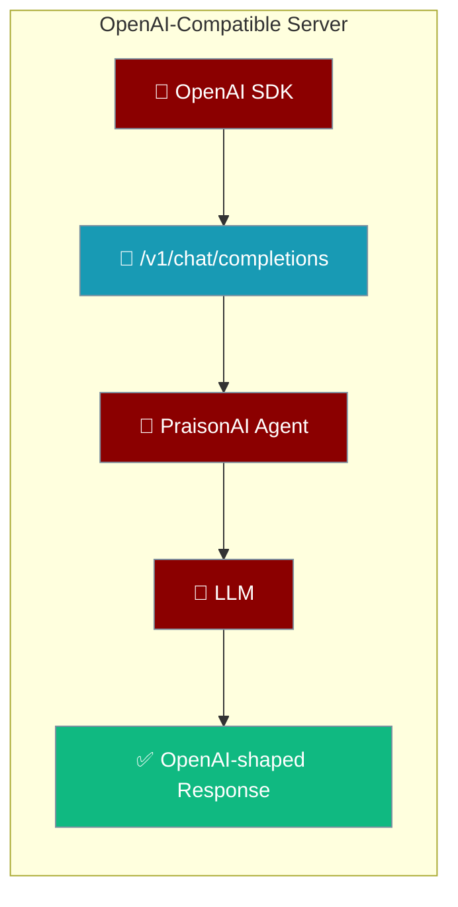
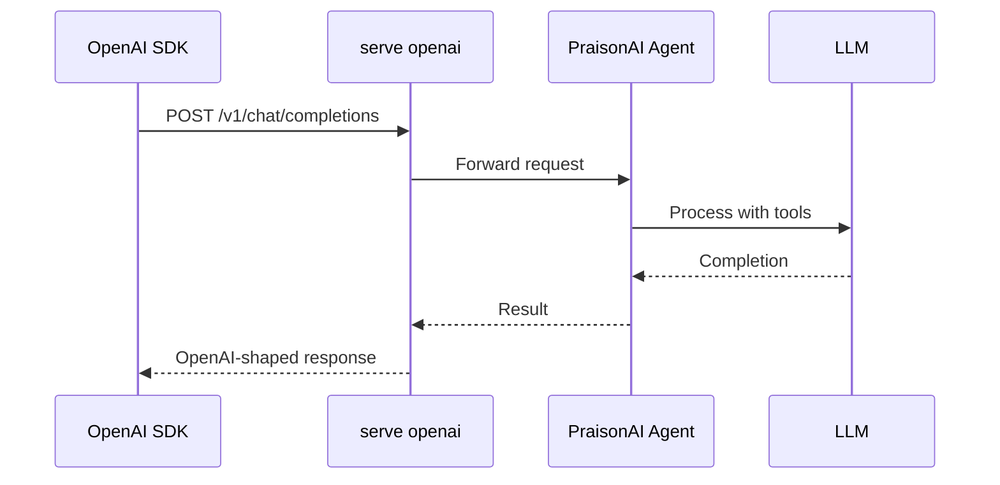
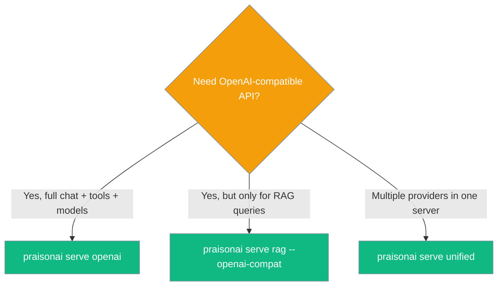

```python
from praisonaiagents import Agent

agent = Agent(
    name="openai-server-agent",
    instructions="Serve requests via the OpenAI-compatible API.",
    llm="openai/gpt-4o-mini",
)
agent.start("Process this chat completion request.")
```


`praisonai serve openai` starts a FastAPI server that exposes OpenAI-compatible HTTP endpoints — point any existing OpenAI SDK code at it and it works as a drop-in replacement.



## Quick Start

<Steps>

<Step title="Simple Usage">
```bash
praisonai serve openai
```

The server starts on `http://localhost:8765` by default.

```python
from openai import OpenAI

client = OpenAI(base_url="http://localhost:8765/v1", api_key="anything")

response = client.chat.completions.create(
    model="gpt-4o-mini",
    messages=[{"role": "user", "content": "Hello!"}]
)
print(response.choices[0].message.content)
```
</Step>

<Step title="With Configuration">
```bash
# Terminal 1 — agents API
praisonai serve agents --file agents.yaml --port 8000

# Terminal 2 — OpenAI compat layer with auth
praisonai serve openai --agents-url http://localhost:8000 --api-key $PRAISONAI_API_KEY
```

```python
import os
from openai import OpenAI

client = OpenAI(
    base_url="http://localhost:8765/v1",
    api_key=os.getenv("PRAISONAI_API_KEY"),
)
```
</Step>

</Steps>

---

## How It Works



---

## Endpoints

All endpoints follow the OpenAI REST specification.

| Method | Path | Description | Streaming |
|--------|------|-------------|-----------|
| `POST` | `/v1/chat/completions` | Chat completions | SSE (`stream: true`) with `[DONE]` sentinel |
| `POST` | `/v1/completions` | Legacy text completions | No |
| `GET` | `/v1/models` | List available models | No |
| `POST` | `/v1/tools/invoke` | PraisonAI extension — invoke an agent tool | No |
| `GET` | `/__praisonai__/discovery` | Provider discovery | No |
| `GET` | `/health` | Health check | No |

---

## Streaming

Set `stream=True` to receive tokens via Server-Sent Events:

```python
from openai import OpenAI

client = OpenAI(base_url="http://localhost:8765/v1", api_key="anything")

stream = client.chat.completions.create(
    model="gpt-4o-mini",
    messages=[{"role": "user", "content": "Write a haiku about agents"}],
    stream=True
)

for chunk in stream:
    if chunk.choices[0].delta.content:
        print(chunk.choices[0].delta.content, end="", flush=True)
```

The stream ends with a `data: [DONE]` sentinel. Errors during streaming are also sent as SSE events:

```
data: {"error": {"message": "...", "type": "stream_error"}}

data: [DONE]
```

---

## Tool Invocation

`/v1/tools/invoke` is a PraisonAI extension that calls an agent tool by name. It requires `--agents-url` to point to a running agents server.

```bash
curl -X POST http://localhost:8765/v1/tools/invoke \
  -H "Content-Type: application/json" \
  -d '{"tool": "search", "arguments": {"query": "PraisonAI features"}}'
```

Start the agents server first:

```bash
# Terminal 1 — agents API
praisonai serve agents --file agents.yaml --port 8000

# Terminal 2 — OpenAI compat layer
praisonai serve openai --agents-url http://localhost:8000
```

---

## Authentication

Pass `--api-key` to require authentication:

```bash
praisonai serve openai --api-key my-secret-key
```

Clients must include the key as the `Authorization` header:

```python
from openai import OpenAI

client = OpenAI(
    base_url="http://localhost:8765/v1",
    api_key="my-secret-key"
)
```

---

## CLI Reference

```bash
praisonai serve openai [OPTIONS]
```

| Option | Type | Default | Description |
|--------|------|---------|-------------|
| `--host`, `-h` | `str` | `"127.0.0.1"` | Host to bind to |
| `--port`, `-p` | `int` | `8765` | Port to bind to |
| `--agents-url` | `str` | `"http://127.0.0.1:8000"` | URL of the running Agents API server |
| `--api-key` | `str` | `None` | Optional API key for authentication |
| `--reload` | `bool` | `False` | Enable auto-reload (dev) |

---

## Choosing Between `serve openai` and `serve rag --openai-compat`



| Surface | Command | Scope |
|---------|---------|-------|
| **OpenAI server** | `praisonai serve openai` | Standalone — chat, completions, models, tool invocation |
| **RAG compat flag** | `praisonai serve rag --openai-compat` | RAG microservice only, chat endpoint only |
| **Unified** | `praisonai serve unified` | All providers in a single server |

<Note>
For OpenAI-compatible RAG queries, use `praisonai serve rag --openai-compat` instead. See [RAG CLI](/docs/cli/rag) for details.
</Note>

---

## Error Shape

All errors follow the OpenAI error format:

```json
{
  "error": {
    "message": "Model not found",
    "type": "api_error"
  }
}
```

---

## Best Practices

<AccordionGroup>

<Accordion title="Set an API key for production">
Always pass `--api-key` when running on a public or shared network. The default configuration accepts unauthenticated requests.

```bash
praisonai serve openai --api-key $PRAISONAI_API_KEY --host 0.0.0.0
```
</Accordion>

<Accordion title="Bind to 0.0.0.0 for external access">
The default `127.0.0.1` only accepts local connections. Use `--host 0.0.0.0` to accept connections from other machines — always pair with `--api-key`.

```bash
praisonai serve openai --host 0.0.0.0 --port 8765 --api-key $SECRET
```
</Accordion>

<Accordion title="Route model names with LiteLLM">
The server passes `model` directly to the underlying LLM. Use LiteLLM-style model names (`ollama/llama3`, `anthropic/claude-3-5-sonnet-20241022`) to route to any provider.
</Accordion>

<Accordion title="When to use the unified server instead">
Use `praisonai serve unified` when you need multiple protocol surfaces (MCP, A2A, agents) alongside the OpenAI-compat layer. Use `serve openai` for a lightweight standalone deployment that only exposes OpenAI endpoints.
</Accordion>

</AccordionGroup>

---

## Related

<CardGroup cols={2}>
  <Card title="Serve Commands" icon="server" href="/docs/cli/serve">
    All praisonai serve subcommands
  </Card>
  <Card title="Gateway" icon="gateway" href="/docs/gateway">
    Unified gateway and control plane
  </Card>
  <Card title="RAG OpenAI Compat" icon="database" href="/docs/cli/rag">
    OpenAI-compatible RAG server
  </Card>
  <Card title="LLM Endpoint Config" icon="plug" href="/docs/features/llm-endpoint-config">
    Configure LLM provider endpoints
  </Card>
</CardGroup>
