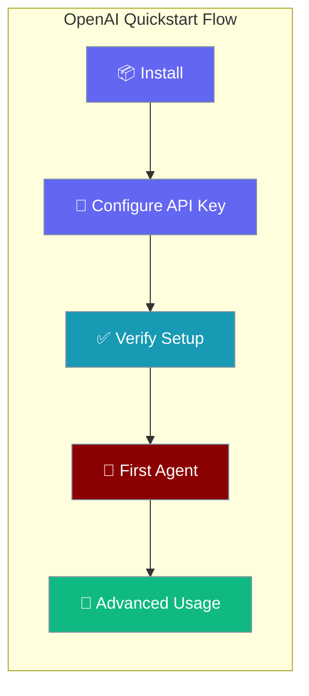
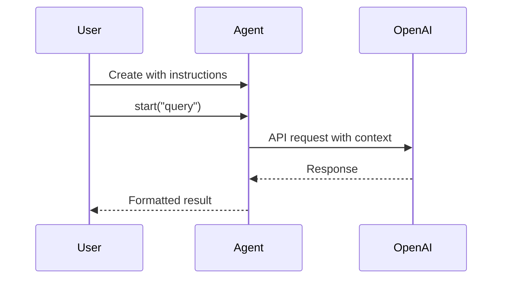

Get started with PraisonAI and OpenAI in under 5 minutes, with instructions that work on Windows, macOS, and Linux.

```python
from praisonaiagents import Agent

agent = Agent(
    name="Assistant",
    instructions="You are a helpful AI assistant.",
)
agent.start("What is the capital of France?")
```

The user installs PraisonAI, sets an API key, and runs their first agent in one session.



## Quick Start

<Steps>
<Step title="Simple Usage">

```bash
pip install praisonaiagents
export OPENAI_API_KEY="<your-openai-api-key>"
```

<Note>
Get your API key from [OpenAI Dashboard](https://platform.openai.com/api-keys) and set it as an environment variable before running.
</Note>

```python
from praisonaiagents import Agent

agent = Agent(
    name="Assistant",
    instructions="You are a helpful AI assistant.",
)
print(agent.start("What is the capital of France?"))
```

<Note>
Use `pip install praisonai` instead if you need CLI tools and YAML workflows.
</Note>
</Step>

<Step title="With Configuration">

```python
from praisonaiagents import Agent

agent = Agent(
    name="Research Assistant",
    instructions="You are an expert researcher.",
    model="gpt-4o",
    temperature=0.7,
    max_tokens=1000,
)
print(agent.start("Summarise renewable energy trends"))
```

Verify your setup with the CLI:

```bash
pip install praisonai
praisonai doctor env --json
```

<Tabs>
<Tab title="macOS/Linux">
```bash
export OPENAI_API_KEY="<your-openai-api-key>"
```
</Tab>
<Tab title="Windows PowerShell">
```powershell
$env:OPENAI_API_KEY="<your-openai-api-key>"
```
</Tab>
<Tab title=".env file">
```env
OPENAI_API_KEY=<your-openai-api-key>
```
</Tab>
</Tabs>

<Warning>
Get your API key from [OpenAI Dashboard](https://platform.openai.com/api-keys). Never commit API keys to version control.
</Warning>
</Step>
</Steps>

---

## How It Works



The agent workflow follows these steps:

| Step | Description |
|------|-------------|
| **Create** | Initialize agent with instructions and configuration |
| **Execute** | Process user input with OpenAI's LLM |
| **Return** | Format and return the response |

---

## Configuration Options

### Environment Variables

| Variable | Description | Example |
|----------|-------------|---------|
| `OPENAI_API_KEY` | Your OpenAI API key | `sk-proj-abc123...` |
| `OPENAI_BASE_URL` | Custom API endpoint (optional) | `https://api.openai.com/v1` |
| `OPENAI_MODEL` | Default model (optional) | `gpt-4o-mini` |

### Agent Configuration

```python
from praisonaiagents import Agent

agent = Agent(
    name="Research Assistant",
    instructions="You are an expert researcher.",
    model="gpt-4o",           # Specify model
    temperature=0.7,          # Creativity (0-1)
    max_tokens=1000,          # Response length
    output=True              # Enable verbose output
)
```

---

## Common Patterns

### Simple Q&A Agent

```python
from praisonaiagents import Agent

agent = Agent(
    name="Helper",
    instructions="Answer questions clearly and concisely."
)

response = agent.start("Explain photosynthesis in simple terms")
print(response)
```

### Agent with Memory

```python
from praisonaiagents import Agent

agent = Agent(
    name="Personal Assistant",
    instructions="Remember our conversation and provide personalized help.",
    memory=True  # Enable conversation memory
)

# First interaction
agent.start("My name is Alex and I like Python")

# Later interaction - agent remembers
response = agent.start("What programming language do I like?")
print(response)
```

### CLI Usage (requires `pip install praisonai`)

```bash
# Simple prompt
praisonai "What are the benefits of renewable energy?"

# Save output to file
praisonai "Write a haiku about coding" > poem.txt

# Use specific model
praisonai --model gpt-4o "Explain quantum computing"
```

---

## Advanced Features

<Tabs>
<Tab title="Multi-Agent Teams">
```python
from praisonaiagents import Agent, Agents

# Create specialized agents
researcher = Agent(
    name="Researcher", 
    instructions="Research topics thoroughly"
)

writer = Agent(
    name="Writer", 
    instructions="Write clear, engaging content"
)

# Create team
team = Agents(agents=[researcher, writer])
result = team.start("Write a blog post about AI safety")
print(result)
```

<Note>
Multi-agent functionality requires the latest version. If you encounter issues, ensure you have the newest release.
</Note>
</Tab>

<Tab title="YAML Workflows">
Create `workflow.yaml`:
```yaml
framework: praisonai
topic: "Analyze market trends"
agents:
  - name: "Data Analyst"
    instructions: "Analyze market data and trends"
  - name: "Report Writer"  
    instructions: "Create executive summaries"
```

Run with:
```bash
praisonai workflow.yaml --framework praisonai
```
</Tab>

<Tab title="Tools Integration">
```python
from praisonaiagents import Agent

agent = Agent(
    name="Web Researcher",
    instructions="Research topics using web search",
    tools=["websearch"]  # Enable web search tool
)

result = agent.start("Find the latest news about renewable energy")
print(result)
```
</Tab>
</Tabs>

---

## Troubleshooting

<AccordionGroup>
<Accordion title="'export' command not found (Windows)">
Windows doesn't recognize the `export` command. Use these alternatives:

**PowerShell:**
```powershell
$env:OPENAI_API_KEY = $env:OPENAI_API_KEY  # set in your shell first
```

**Command Prompt:**
```cmd
set OPENAI_API_KEY=%OPENAI_API_KEY%
```

**Permanent solution:** Use a `.env` file in your project directory.
</Accordion>

<Accordion title="'praisonai' command not found">
This means you installed `praisonaiagents` (Python SDK only) but need the CLI tools.

**Solution:**
```bash
pip install praisonai
```

The packages serve different purposes:
- `praisonaiagents` - Python SDK for scripting
- `praisonai` - CLI tools and YAML workflows
</Accordion>

<Accordion title="API key validation fails">
If `praisonai doctor env` shows API key errors:

1. **Check the key format:** Should start with `sk-`
2. **Verify environment:** Run `echo $OPENAI_API_KEY` (bash) or `echo $env:OPENAI_API_KEY` (PowerShell)
3. **Use .env file:** More reliable than environment variables
4. **Check permissions:** Ensure you have valid OpenAI credits/usage limits
</Accordion>

<Accordion title="Encoding errors on Windows">
If you see garbled text or encoding errors:

1. **Use JSON output:** Add `--json` flag to CLI commands
2. **Check terminal encoding:** Use Windows Terminal instead of Command Prompt
3. **Set encoding:** Add `chcp 65001` before running commands
</Accordion>
</AccordionGroup>

---

## Best Practices

<AccordionGroup>
<Accordion title="Secure your API keys">
- Never hardcode API keys in source code
- Use `.env` files for local development  
- Set proper file permissions: `chmod 600 .env`
- Use environment variables in production
- Rotate keys regularly
</Accordion>

<Accordion title="Choose the right model">
- **gpt-4o-mini** - Fast and cost-effective for simple tasks
- **gpt-4o** - Best performance for complex reasoning
- **gpt-3.5-turbo** - Good balance of speed and capability
- Start with gpt-4o-mini and upgrade as needed
</Accordion>

<Accordion title="Optimize for your use case">
- Use `temperature=0` for consistent, factual responses
- Use `temperature=0.7-1.0` for creative tasks
- Set appropriate `max_tokens` to control response length
- Enable `memory=True` for conversational agents
</Accordion>

<Accordion title="Monitor usage and costs">
- Check your OpenAI dashboard regularly
- Set usage alerts in OpenAI console
- Use shorter prompts when possible
- Cache responses for repeated queries
</Accordion>
</AccordionGroup>

---

## Next Steps

<CardGroup cols={2}>
  <Card title="Advanced Agent Features" icon="brain" href="/docs/features/reasoning">
    Explore planning, reflection, and advanced reasoning capabilities
  </Card>
  <Card title="Multi-Agent Teams" icon="users" href="/docs/features/multi-agent-pipelines">
    Build collaborative agent teams for complex workflows
  </Card>
  <Card title="Tools & Integrations" icon="wrench" href="/docs/tools">
    Add web search, file tools, and custom integrations
  </Card>
  <Card title="Memory & Knowledge" icon="database" href="/docs/features/memory">
    Implement persistent memory and knowledge bases
  </Card>
</CardGroup>

---

## Related

<CardGroup cols={2}>
  <Card title="Installation Guide" icon="download" href="/docs/installation">
    Complete installation instructions for all platforms
  </Card>
  <Card title="CLI Reference" icon="terminal" href="/docs/cli/cli-reference">
    Full command-line interface documentation
  </Card>
</CardGroup>