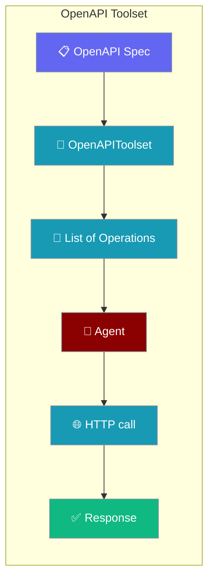
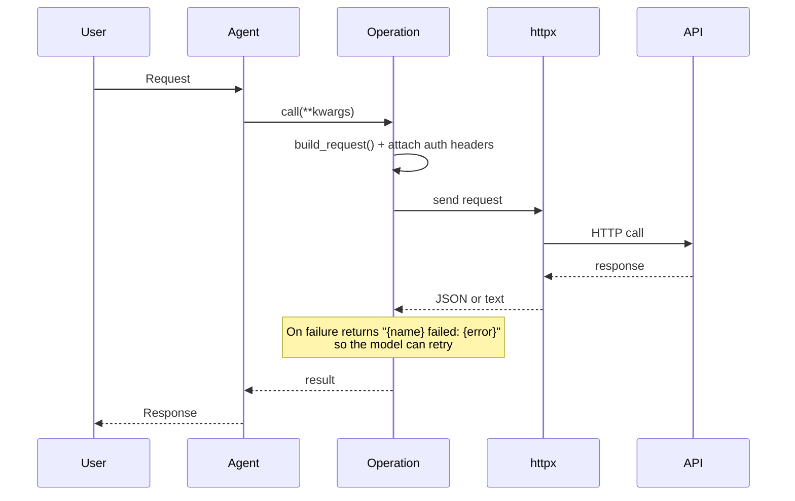
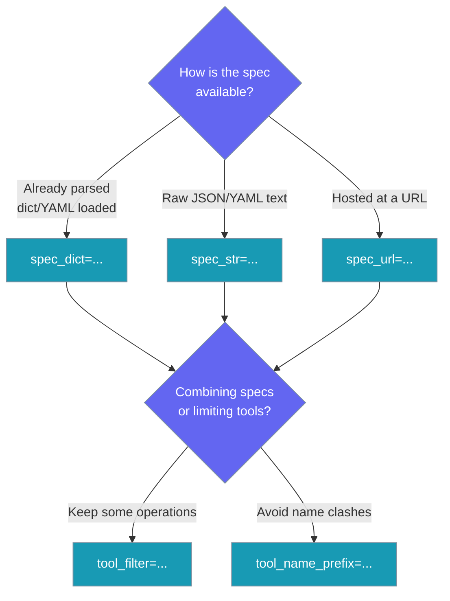

Point an agent at a REST API's spec and every operation becomes a tool it can call — no per-endpoint wrapper functions, no external MCP process.



## Quick Start

<Steps>
<Step title="Load a spec and start the agent">
Every operation in the spec becomes a tool the agent can call directly.

```python
import os
from praisonaiagents import Agent
from praisonaiagents.tools.openapi_toolset import OpenAPIToolset

toolset = OpenAPIToolset(
    spec_url="https://api.example.com/openapi.json",
    auth={"type": "bearer", "token": os.environ["API_TOKEN"]},
)

agent = Agent(name="ops", tools=toolset.get_tools())
agent.start("List the last 5 incidents and open a ticket for the top one")
```
</Step>

<Step title="Install httpx">
`httpx` is needed at call time.

```bash
pip install httpx
```

YAML specs also need `PyYAML` (already a dependency).
</Step>
</Steps>

---

## How It Works

`get_tools()` returns one callable `OpenAPIOperation` per spec operation. When the agent calls one, it builds the request, attaches auth headers, sends it with `httpx`, and returns the parsed JSON.



---

## Loading a Spec

Provide the spec exactly one of three ways — otherwise a `ValueError` is raised.



---

## Configuration Options

All constructor arguments are keyword-only.

| Option | Type | Default | Description |
|--------|------|---------|-------------|
| `spec_dict` | `Optional[Dict[str, Any]]` | `None` | Parsed spec (JSON/YAML already loaded) |
| `spec_str` | `Optional[str]` | `None` | Raw spec text (JSON or YAML) |
| `spec_url` | `Optional[str]` | `None` | URL of a JSON or YAML spec |
| `base_url` | `Optional[str]` | inferred | Overrides `servers[0].url` / `host+basePath`. Required only when the spec has no server info |
| `auth` | `Optional[Dict[str, Any]]` | `None` | See the auth table below |
| `tool_filter` | `Optional[Callable[[str, str, str], bool]]` | `None` | Called with `(name, method, path)`; return `True` to keep the operation |
| `tool_name_prefix` | `Optional[str]` | `None` | Prepended to every generated tool name |
| `header_provider` | `Optional[Callable[[], Dict[str, str]]]` | `None` | Called per request; adds/overrides headers (use for rotating tokens) |
| `timeout` | `int` | `30` | Per-request timeout, in seconds |

Exactly one of `spec_dict`, `spec_str`, `spec_url` is required.

### Methods

| Method | Returns | Description |
|--------|---------|-------------|
| `get_tools()` | `List[OpenAPIOperation]` | One callable per operation, ready for `Agent(tools=...)` |

### OpenAPIOperation

Each tool returned by `get_tools()` is an `OpenAPIOperation`.

| Member | Type | Description |
|--------|------|-------------|
| `operation(**kwargs)` | `dict \| str` | Parsed JSON, else response text; on failure returns `"{name} failed: {error}"` |
| `build_request(**kwargs)` | `Dict[str, Any]` | Pure argument-binding (no HTTP) — preview or test the assembled request |
| `to_openai_tool()` | `Dict[str, Any]` | Function-calling dict, via the same helper MCP tools use |

Attributes: `name`, `description`, `method`, `path`, `base_url`, `parameters`, `body_schema`, `body_param`, `input_schema`, `auth`, `header_provider`, `timeout`.

### Auth Shapes

The `auth` dict is keyed by `type`.

| `auth["type"]` | Required keys | Header emitted |
|----------------|---------------|----------------|
| `"bearer"` | `token` | `Authorization: Bearer <token>` |
| `"api_key"` | `key`, optional `name` (default `X-API-Key`) | `<name>: <key>` |
| `"basic"` | `value` (already base64-encoded `user:pass`) | `Authorization: Basic <value>` |

---

## Safety Behaviour

The toolset refuses unsafe requests and never fetches arbitrary URLs while parsing.

| Behaviour | What happens |
|-----------|--------------|
| **`http://` + auth** | Raises `ValueError` — credentials are never sent in the clear. Pass an `https://` `base_url` or fix the spec |
| **Swagger 2 schemes** | When both `http` and `https` are listed, `https` wins (not `schemes[0]`) |
| **Remote `$ref`** | Ignored — parsing a spec never fetches external URLs. Self-referential schemas are cycle-broken to `{"type": "object"}` |
| **Path parameters** | Every value is `quote(value, safe="")` before substitution, so `../../admin` or `https://other/` cannot alter host, path, query or fragment |
| **Strict body (OpenAPI 3)** | Only properties declared in the `requestBody` schema are sent — framework-injected kwargs (e.g. `idempotency_key`) are dropped, so `additionalProperties: false` schemas stay clean |
| **Swagger 2 `in: body`** | The whole named argument becomes the JSON body verbatim |
| **Relative `servers[0].url`** | A remotely loaded spec with `servers: [{ url: "/v1" }]` resolves against the fetched URL — no hostless URLs |
| **Tool names** | `operationId` is sanitised; when absent, name is `method + "_" + sanitised path` — stable across runs |
| **Errors return, not raise** | A network/HTTP failure comes back as `"{name} failed: {exc}"` so the model can react instead of ending the turn |
| **`header_provider` faults** | If the provider raises, the request continues without its headers (a warning is logged) |

---

## Common Patterns

**Restrict the tool surface to read-only operations:**

```python
from praisonaiagents.tools.openapi_toolset import OpenAPIToolset

toolset = OpenAPIToolset(
    spec_url="https://api.example.com/openapi.json",
    tool_filter=lambda name, method, path: method.lower() == "get",
)
```

**Namespace a spec when combining several on one agent:**

```python
stripe = OpenAPIToolset(
    spec_url="https://api.stripe.com/openapi.json",
    tool_name_prefix="stripe_",
)
```

**Rotate auth per request:**

```python
def fetch_token() -> str:
    return "..."  # your token-refresh logic

toolset = OpenAPIToolset(
    spec_url="https://api.example.com/openapi.json",
    header_provider=lambda: {"Authorization": f"Bearer {fetch_token()}"},
)
```

**Preview a request without calling the API:**

```python
tools = OpenAPIToolset(spec_url="https://api.example.com/openapi.json").get_tools()
request = tools[0].build_request(id="123")
print(request)   # {"method": ..., "url": ..., "headers": ...}
```

---

## OpenAPI Toolset vs MCP

Both expose external tools to an agent; reach for the toolset when the API already has a spec.

| | OpenAPI Toolset | MCP OpenAPI server |
|---|---|---|
| Extra process | None | `npx` subprocess |
| Language runtime | Python only | Node.js required |
| `tool_filter` | Built in | Not available |
| `tool_name_prefix` | Built in | Not available |
| Agent view | Routes through `build_openai_tool_dict` — identical to MCP tools | Identical |

A workaround existed (`MCP("npx -y @ivotoby/openapi-mcp-server ...")`); the toolset removes the extra process and the npx dependency, and adds first-class `tool_filter` and `tool_name_prefix`.

---

## Best Practices

<AccordionGroup>
  <Accordion title="Always use https when sending auth">
    The toolset refuses to attach credentials to an `http://` endpoint. If the
    spec declares a cleartext server, pass an `https://` `base_url` explicitly.
  </Accordion>
  <Accordion title="Filter to the operations the agent actually needs">
    A large spec can generate dozens of tools. Use `tool_filter` to keep only
    read-only or task-relevant operations so the model isn't overwhelmed.
  </Accordion>
  <Accordion title="Prefix tools when combining specs">
    Two specs may both define `get_users`. Set a distinct `tool_name_prefix`
    per toolset so names stay unique on one agent.
  </Accordion>
  <Accordion title="Preview requests in tests with build_request">
    `build_request(**args)` binds arguments to URL, headers and body without
    any HTTP call — assert the assembled request in a unit test.
  </Accordion>
</AccordionGroup>

---

## Related

<CardGroup cols={2}>
  <Card title="MCP" icon="plug" href="/features/mcp">
    Front external tools as an MCP server
  </Card>
  <Card title="Tools" icon="wrench" href="/features/tools">
    Build and register agent tools
  </Card>
  <Card title="Toolsets" icon="toolbox" href="/features/toolsets">
    Group related tools together
  </Card>
  <Card title="Tool Config" icon="gear" href="/features/tool-config">
    Configure how tools run
  </Card>
</CardGroup>
