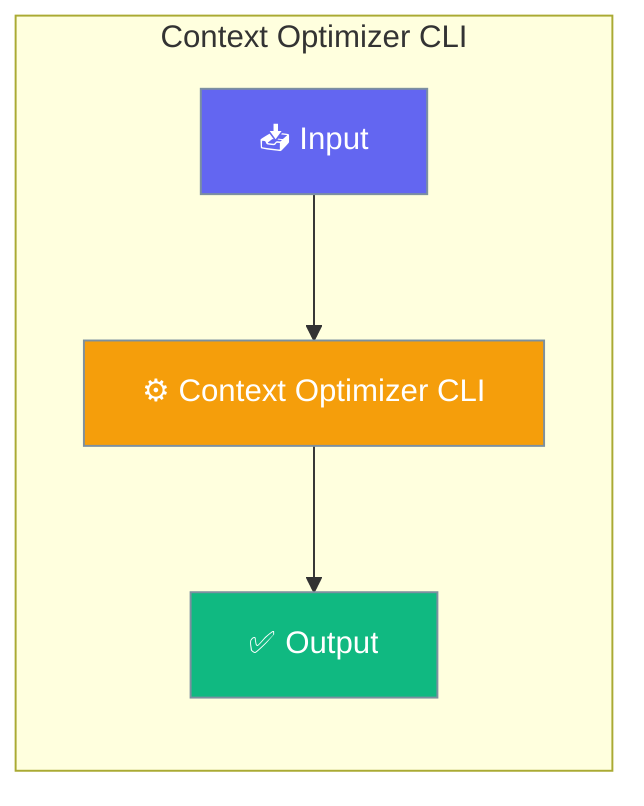

Configure context optimization behavior via CLI flags and interactive commands.




## CLI Flags

### Strategy

```bash
# Smart optimizer (default, recommended)
praisonai chat --context-strategy smart

# Simple truncation
praisonai chat --context-strategy truncate

# Sliding window
praisonai chat --context-strategy sliding_window

# Summarize old messages
praisonai chat --context-strategy summarize

# Prune old tool outputs
praisonai chat --context-strategy prune_tools
```

| Strategy | Description | Best For |
|----------|-------------|----------|
| `smart` | Intelligent combination | General use |
| `truncate` | Remove oldest messages | Fast, simple |
| `sliding_window` | Keep recent N messages | Conversation flow |
| `summarize` | Compress old messages | Context preservation |
| `prune_tools` | Truncate tool outputs | Tool-heavy workflows |

### Auto-Compaction

```bash
# Enable (default)
praisonai chat --context-auto-compact

# Disable
praisonai chat --no-context-auto-compact
```

### Threshold

```bash
# Trigger at 80% usage (default)
praisonai chat --context-threshold 0.8

# More aggressive (70%)
praisonai chat --context-threshold 0.7

# Less aggressive (90%)
praisonai chat --context-threshold 0.9
```

## Interactive Commands

### Manual Compaction

```bash
> /context compact
```

**Output:**
```
Optimizing context...
✓ Optimized: 45,000 → 30,000 tokens
Saved 15,000 tokens (33.3%)
Strategy: smart
```

### View Optimization History

```bash
> /context history
```

**Output:**
```
Optimization History
Time                     Event                Tokens       Saved
----------------------------------------------------------------------
2024-01-07T12:00:00      overflow_detected       45,000          -
2024-01-07T12:00:01      auto_compact           45,000     -15,000
```

### View Current Config

```bash
> /context config
```

Shows auto_compact, threshold, and strategy settings.

## Environment Variables

```bash
export PRAISONAI_CONTEXT_AUTO_COMPACT=true
export PRAISONAI_CONTEXT_THRESHOLD=0.8
export PRAISONAI_CONTEXT_STRATEGY=smart
```

## config.yaml

```yaml
context:
  auto_compact: true
  compact_threshold: 0.8
  strategy: smart
  compression_min_gain_pct: 5.0
  compression_max_attempts: 3
```

## Strategy Details

### Smart (Recommended)

Combines multiple strategies intelligently:
1. First tries non-destructive pruning
2. Falls back to sliding window
3. Uses truncation as last resort

```bash
praisonai chat --context-strategy smart
```

### Truncate

Simply removes oldest messages until under budget.

```bash
praisonai chat --context-strategy truncate
```

### Sliding Window

Keeps the most recent N messages that fit in budget.

```bash
praisonai chat --context-strategy sliding_window
```

### Summarize

Compresses old messages into a summary (requires LLM call).

```bash
praisonai chat --context-strategy summarize
```

### Prune Tools

Truncates old tool outputs while preserving recent ones.

```bash
praisonai chat --context-strategy prune_tools
```

## Troubleshooting

### Context still overflowing

```bash
# Lower threshold
praisonai chat --context-threshold 0.6

# Use more aggressive strategy
praisonai chat --context-strategy truncate
```

### Losing important context

```bash
# Use smart strategy
praisonai chat --context-strategy smart

# Or increase threshold
praisonai chat --context-threshold 0.9
```

### Auto-compact not triggering

```bash
# Check if enabled
> /context config

# Verify threshold
> /context stats
```

## Best Practices

<AccordionGroup>
  <Accordion title="Start simple">
    Enable the feature with a single parameter before adding configuration. Verify it works, then layer in options.
  </Accordion>
  <Accordion title="Use environment variables for secrets">
    Never hardcode API keys or tokens. Use `os.getenv("KEY_NAME")` to read from environment variables.
  </Accordion>
  <Accordion title="Test with minimal examples first">
    Copy the Quick Start example, run it, then extend it. This confirms your environment is set up correctly.
  </Accordion>
  <Accordion title="Check the logs">
    Set `verbose=True` on your agent to see detailed execution logs when debugging unexpected behavior.
  </Accordion>
</AccordionGroup>

## Related

<CardGroup cols={2}>
  <Card title="Features Overview" icon="grid-2" href="/docs/features">
    Browse all PraisonAI features
  </Card>
  <Card title="Quick Start" icon="rocket" href="/docs/introduction">
    Get started with PraisonAI agents
  </Card>
</CardGroup>
