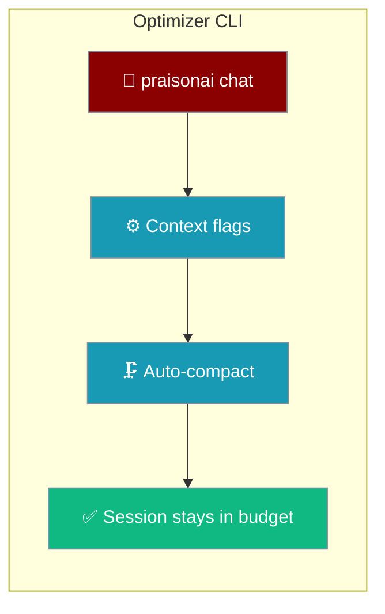

```python
from praisonaiagents import Agent

agent = Agent(name="optimizer", instructions="Optimise agent prompts and configurations.")
agent.start("Optimise this agent's system prompt for better accuracy.")
```


Configure context optimization behaviour via CLI flags and interactive commands.



## Quick Start

<Steps>

<Step title="Simple Usage">

```bash
praisonai chat --context-strategy smart --context-auto-compact
```

Inside the session, compact manually when needed:

```bash
> /context compact
```

</Step>

<Step title="With Configuration">

```bash
praisonai chat \
  --context-strategy smart \
  --context-threshold 0.7 \
  --no-context-auto-compact
```

Or set defaults in `config.yaml`:

```yaml
context:
  auto_compact: true
  compact_threshold: 0.8
  strategy: smart
```

</Step>

</Steps>

## CLI Flags

### Strategy

```bash
# Smart optimizer (default, recommended)
praisonai chat --context-strategy smart

# Simple truncation
praisonai chat --context-strategy truncate

# Sliding window
praisonai chat --context-strategy sliding_window

# Summarize old messages
praisonai chat --context-strategy summarize

# Prune old tool outputs
praisonai chat --context-strategy prune_tools
```

| Strategy | Description | Best For |
|----------|-------------|----------|
| `smart` | Intelligent combination | General use |
| `truncate` | Remove oldest messages | Fast, simple |
| `sliding_window` | Keep recent N messages | Conversation flow |
| `summarize` | Compress old messages | Context preservation |
| `prune_tools` | Truncate tool outputs | Tool-heavy workflows |

### Auto-Compaction

```bash
# Enable (default)
praisonai chat --context-auto-compact

# Disable
praisonai chat --no-context-auto-compact
```

### Threshold

```bash
# Trigger at 80% usage (default)
praisonai chat --context-threshold 0.8

# More aggressive (70%)
praisonai chat --context-threshold 0.7

# Less aggressive (90%)
praisonai chat --context-threshold 0.9
```

## Interactive Commands

### Manual Compaction

```bash
> /context compact
```

**Output:**
```
Optimizing context...
✓ Optimized: 45,000 → 30,000 tokens
Saved 15,000 tokens (33.3%)
Strategy: smart
```

### View Optimization History

```bash
> /context history
```

**Output:**
```
Optimization History
Time                     Event                Tokens       Saved
----------------------------------------------------------------------
2024-01-07T12:00:00      overflow_detected       45,000          -
2024-01-07T12:00:01      auto_compact           45,000     -15,000
```

### View Current Config

```bash
> /context config
```

Shows auto_compact, threshold, and strategy settings.

## Environment Variables

```bash
export PRAISONAI_CONTEXT_AUTO_COMPACT=true
export PRAISONAI_CONTEXT_THRESHOLD=0.8
export PRAISONAI_CONTEXT_STRATEGY=smart
```

## config.yaml

```yaml
context:
  auto_compact: true
  compact_threshold: 0.8
  strategy: smart
  compression_min_gain_pct: 5.0
  compression_max_attempts: 3
```

## Strategy Details

### Smart (Recommended)

Combines multiple strategies intelligently:
1. First tries non-destructive pruning
2. Falls back to sliding window
3. Uses truncation as last resort

```bash
praisonai chat --context-strategy smart
```

### Truncate

Simply removes oldest messages until under budget.

```bash
praisonai chat --context-strategy truncate
```

### Sliding Window

Keeps the most recent N messages that fit in budget.

```bash
praisonai chat --context-strategy sliding_window
```

### Summarize

Compresses old messages into a summary (requires LLM call).

```bash
praisonai chat --context-strategy summarize
```

### Prune Tools

Truncates old tool outputs while preserving recent ones.

```bash
praisonai chat --context-strategy prune_tools
```

## Troubleshooting

### Context still overflowing

```bash
# Lower threshold
praisonai chat --context-threshold 0.6

# Use more aggressive strategy
praisonai chat --context-strategy truncate
```

### Losing important context

```bash
# Use smart strategy
praisonai chat --context-strategy smart

# Or increase threshold
praisonai chat --context-threshold 0.9
```

### Auto-compact not triggering

```bash
# Check if enabled
> /context config

# Verify threshold
> /context stats
```

## Best Practices

<AccordionGroup>

<Accordion title="Start with smart strategy">
`smart` combines pruning, sliding window, and summarisation — use it unless you have a specific reason not to.
</Accordion>

<Accordion title="Set threshold below 1.0">
Trigger compaction at 0.7–0.8 so optimisation runs before the model hard-fails on context overflow.
</Accordion>

<Accordion title="Use /context stats during long sessions">
Check token usage before manually compacting — `/context history` shows what each compaction saved.
</Accordion>

</AccordionGroup>

## Related

<CardGroup cols={2}>
  <Card title="Context Optimizer" icon="database" href="/docs/features/optimizer">
    Python API and strategy reference
  </Card>
  <Card title="Context Monitor" icon="chart-line" href="/docs/features/context-monitor">
    Watch optimisation in action
  </Card>
  <Card title="Context Budgeter" icon="coins" href="/docs/features/context-budgeter">
    Set token budgets per session
  </Card>
  <Card title="Intelligent Conversation Compaction" icon="compress" href="/docs/features/intelligent-conversation-compaction">
    Long-session compaction deep-dive
  </Card>
</CardGroup>
