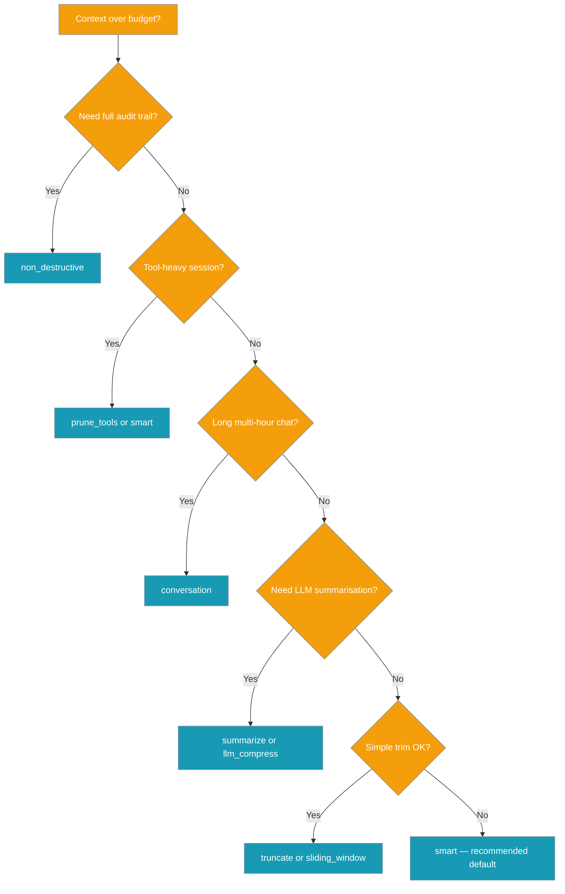
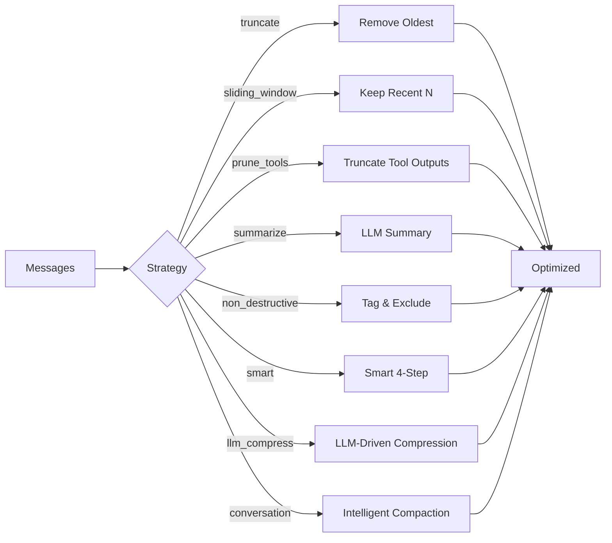
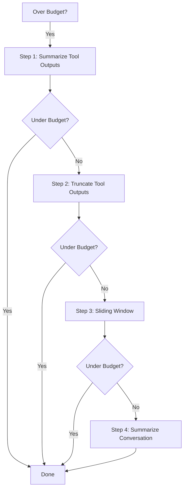
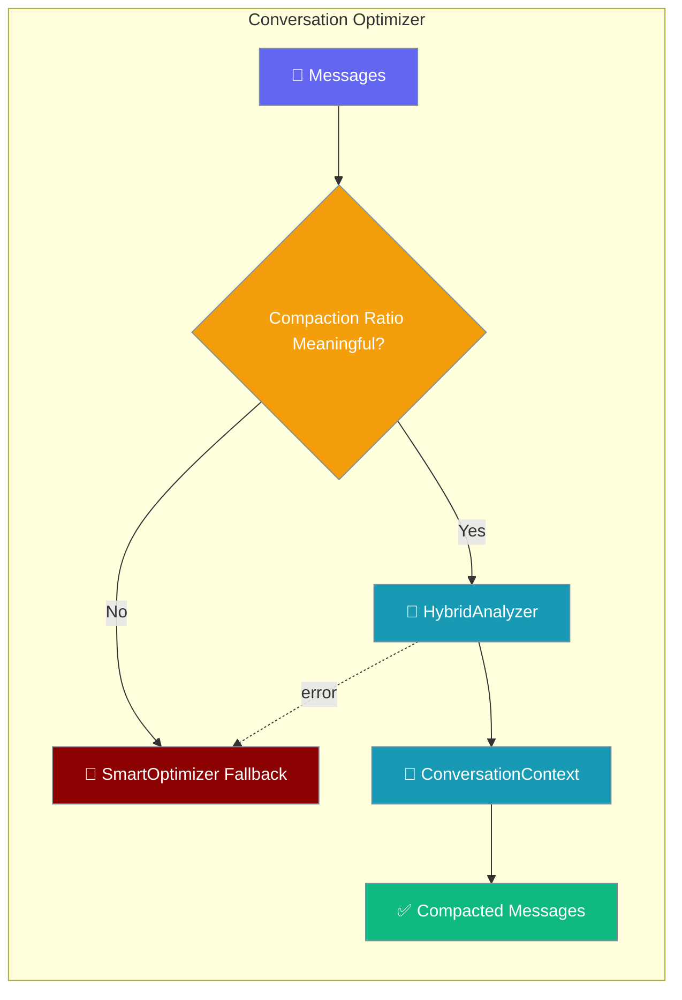

Reduce context size automatically before models hit token limits — preventing overflow errors and cutting costs.

```python
from praisonaiagents import Agent, ManagerConfig

agent = Agent(
    instructions="You are helpful.",
    context=ManagerConfig(
        auto_compact=True,
        compact_threshold=0.8,
        strategy="smart",
    ),
)
response = agent.chat("Hello!")
```

## Which Strategy Should I Pick?



## Quick Start

<Steps>

<Step title="Simple Usage">

```python
from praisonaiagents import Agent, ManagerConfig

agent = Agent(
    instructions="You are helpful.",
    context=ManagerConfig(
        auto_compact=True,
        compact_threshold=0.8,
        strategy="smart",
    ),
)
agent.chat("Hello!")
```

</Step>

<Step title="With Configuration">

```python
from praisonaiagents import Agent, ManagerConfig, get_optimizer, OptimizerStrategy

agent = Agent(
    context=ManagerConfig(strategy="truncate", compact_threshold=0.7),
)

messages = [{"role": "user", "content": "Hello"}]
optimizer = get_optimizer(OptimizerStrategy.SMART)
optimized, stats = optimizer.optimize(messages, target_tokens=50000)
print(f"Saved {stats.tokens_saved} tokens")
```

</Step>

</Steps>

## Optimisation Strategies



### Smart Strategy Flow (Default)



## Low-Level API

```python
from praisonaiagents import get_optimizer, OptimizerStrategy

# Get an optimizer
optimizer = get_optimizer(OptimizerStrategy.SMART)

# Optimize messages to target token count
messages = [...]  # Your conversation history
optimized, stats = optimizer.optimize(messages, target_tokens=50000)

print(f"Reduced from {len(messages)} to {len(optimized)} messages")
print(f"Saved {stats.tokens_saved} tokens")
```

## Strategy Reference

### Truncate

Removes oldest messages first, preserving system prompt and recent context.

```python
from praisonaiagents import TruncateOptimizer

optimizer = TruncateOptimizer()
result, stats = optimizer.optimize(messages, target_tokens=10000)
```

**Best for**: Simple cases where old context is not important.

### Sliding Window

Keeps the N most recent messages within a token window.

```python
from praisonaiagents import SlidingWindowOptimizer

optimizer = SlidingWindowOptimizer()
result, stats = optimizer.optimize(messages, target_tokens=10000)
```

**Best for**: Conversations where recent context matters most.

### Prune Tools

Truncates old tool outputs while preserving recent ones.

```python
from praisonaiagents import PruneToolsOptimizer

optimizer = PruneToolsOptimizer(
    protect_recent=5,  # Keep last 5 tool outputs intact
    max_output_tokens=500,  # Truncate older outputs to 500 tokens
)
result, stats = optimizer.optimize(messages, target_tokens=10000)
```

**Best for**: Tool-heavy conversations with large outputs.

### Summarize

Uses LLM to create a summary of older conversation.

```python
from praisonaiagents import SummarizeOptimizer

optimizer = SummarizeOptimizer(
    keep_recent=4,  # Keep last 4 turns intact
    model="gpt-4o-mini",
)
result, stats = optimizer.optimize(messages, target_tokens=10000)
```

**Best for**: Long conversations where context continuity matters.

### Conversation

Conversation-aware compaction that preserves topic, goals, decisions, and action items across long sessions.

```python
from praisonaiagents import Agent, ManagerConfig

agent = Agent(
    name="Planner",
    instructions="Help plan products over multi-hour sessions.",
    context=ManagerConfig(
        auto_compact=True,
        strategy="conversation",
        conversation_compaction=True,
        conversation_analyzer_strategy="hybrid",
        conversation_min_compaction_ratio=0.3,
    ),
)
```

**Low-level class usage:**

```python
from praisonaiagents import ConversationOptimizer

optimizer = ConversationOptimizer(
    analyzer_strategy="hybrid",
    preserve_recent=5,
    min_compaction_ratio=0.3,
)
result, stats = optimizer.optimize(messages, target_tokens=4000)
```

**Configuration Options:**

| Option | Type | Default | Description |
|--------|------|---------|-------------|
| `llm_analyze_fn` | `Optional[callable]` | `None` | LLM function for conversation analysis. If `None`, falls back to rule-based analysis. |
| `min_compaction_ratio` | `float` | `0.3` | Minimum compression ratio to attempt compaction. Below this, falls back to `SmartOptimizer`. |
| `analyzer_strategy` | `str` | `"hybrid"` | One of `"hybrid"`, `"rule_based"`, `"keyword"`. |
| `preserve_recent` | `int` | `5` | Number of recent messages to keep intact. |
| `llm_summarize_fn` | `Optional[callable]` | `None` | LLM function for summarization. |



<Note>
ConversationOptimizer automatically falls back to `SmartOptimizer` when the compaction ratio is not meaningful (`target_tokens / original_tokens > (1 - min_compaction_ratio)`) or when internal errors occur during compaction. This ensures safe operation while preserving advanced conversation analysis when beneficial.
</Note>

**Best for**: Multi-hour planning, iterative development, long support sessions where topic/goal continuity matters more than literal message history.

See [Intelligent Conversation Compaction](/features/intelligent-conversation-compaction) for the full conceptual deep-dive.

### LLM Context Compressor

Advanced LLM-driven compression with session lineage and head/tail protection.

```python
from praisonaiagents import LLMContextCompressorOptimizer

optimizer = LLMContextCompressorOptimizer(
    llm_client=agent.llm,
    auxiliary_model="gpt-4o-mini",
    protect_last_n_tokens=20_000,
    summary_target_tokens=750,
    enable_session_tracking=True,
)
result, stats = optimizer.optimize(messages, target_tokens=10000)
```

**Best for**: Long conversations requiring intelligent summarization with audit trails.

<Note>
The `LLMContextCompressorOptimizer` is exposed as `LLM_CONTEXT_COMPRESSOR_OPTIMIZER` but is **not** in `OPTIMIZER_REGISTRY` — users must instantiate it directly with an `llm_client`.
</Note>

See [LLM Context Compression](/features/llm-context-compression) for detailed usage.

### Non-Destructive

Tags messages for exclusion without deleting them (enables undo).

```python
from praisonaiagents import NonDestructiveOptimizer

optimizer = NonDestructiveOptimizer()
result, stats = optimizer.optimize(messages, target_tokens=10000)

# Messages are tagged with 'excluded': True
# Use get_effective_history() to filter
```

**Best for**: When you need to preserve full history for audit/undo.

### Smart (Recommended)

Combines all strategies intelligently based on content analysis.

```python
from praisonaiagents import SmartOptimizer

optimizer = SmartOptimizer()
result, stats = optimizer.optimize(messages, target_tokens=10000)
```

**Order of operations** (Smart Strategy):
1. **Summarize tool outputs** - Uses LLM to intelligently summarize large tool outputs (preserves key info)
2. **Truncate tool outputs** - Fallback truncation for remaining large outputs
3. **Sliding window** - Remove oldest messages
4. **Summarize conversation** - LLM summary of older conversation if still over limit

<Note>
Tool output summarization uses LLM to preserve key information instead of blindly truncating. This is enabled by default when `llm_summarize=True`.
</Note>

## Factory Function

```python
from praisonaiagents import get_optimizer, OptimizerStrategy

# Available strategies
strategies = [
    OptimizerStrategy.TRUNCATE,
    OptimizerStrategy.SLIDING_WINDOW,
    OptimizerStrategy.PRUNE_TOOLS,
    OptimizerStrategy.SUMMARIZE,
    OptimizerStrategy.NON_DESTRUCTIVE,
    OptimizerStrategy.SMART,
    OptimizerStrategy.CONVERSATION,
]

for strategy in strategies:
    optimizer = get_optimizer(strategy)
    result, stats = optimizer.optimize(messages, target_tokens=10000)
    print(f"{strategy.value}: {len(result)} messages")
```

## Optimization Result

```python
from praisonaiagents import OptimizationResult

# stats returned from optimize()
stats: OptimizationResult
print(f"Original tokens: {stats.original_tokens}")
print(f"Optimized tokens: {stats.optimized_tokens}")
print(f"Tokens saved: {stats.tokens_saved}")
print(f"Strategy used: {stats.strategy_used}")
print(f"Messages removed: {stats.messages_removed}")
print(f"Tool outputs pruned: {stats.tool_outputs_pruned}")
print(f"Tool outputs summarized: {stats.tool_outputs_summarized}")
print(f"Tokens saved by summarization: {stats.tokens_saved_by_summarization}")
print(f"Tokens saved by truncation: {stats.tokens_saved_by_truncation}")
```

## Tool Call Preservation

The optimizer preserves tool_call/tool_result pairs to maintain API validity:

```python
# These pairs are kept together or removed together
{"role": "assistant", "tool_calls": [{"id": "call_123", ...}]}
{"role": "tool", "tool_call_id": "call_123", "content": "..."}
```

## CLI Usage

```bash
# Set optimization strategy
praisonai chat --context-strategy smart

# Set trigger threshold
praisonai chat --context-threshold 0.8

# Manual optimization in session
/context compact
```

## Configuration

```yaml
# config.yaml
context:
  auto_compact: true
  compact_threshold: 0.8
  strategy: smart
```

## Best Practices

<AccordionGroup>

<Accordion title="Start with smart">
`smart` combines summarisation, tool pruning, sliding window, and conversation summarisation — use it unless you have a specific reason not to.
</Accordion>

<Accordion title="Set compact_threshold below 1.0">
Trigger compaction at 0.7–0.8 so optimisation runs before the model hard-fails on context overflow.
</Accordion>

<Accordion title="Use conversation for long sessions">
Multi-hour planning or support threads benefit from `conversation` strategy — it preserves topics, goals, and decisions.
</Accordion>

<Accordion title="Preserve tool_call pairs">
All strategies keep `tool_calls` and matching `tool` results together so API message history stays valid.
</Accordion>

</AccordionGroup>

## Related

<CardGroup cols={2}>
  <Card title="Context Monitor" icon="chart-line" href="/docs/features/context-monitor">
    Watch optimisation in action
  </Card>
  <Card title="Context Budgeter" icon="coins" href="/docs/features/context-budgeter">
    Set token budgets per session
  </Card>
  <Card title="Optimizer CLI" icon="terminal" href="/docs/features/optimizer-cli">
    CLI flags and interactive commands
  </Card>
  <Card title="LLM Context Compression" icon="compress" href="/docs/features/llm-context-compression">
    Advanced LLM-driven compression
  </Card>
</CardGroup>
