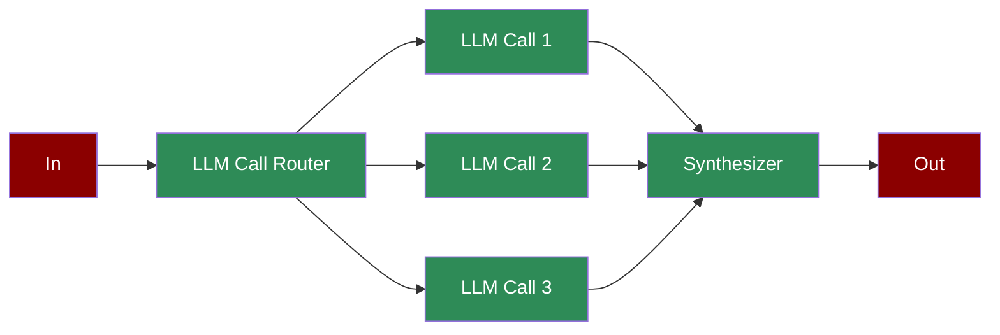

A workflow with a central orchestrator directing multiple worker LLMs to perform subtasks, synthesizing their outputs for complex, coordinated operations.

## Quick Start

<Steps>
    <Step title="Install Package">
        First, install the PraisonAI Agents package:
        ```bash
        pip install praisonaiagents
        ```
    </Step>

    <Step title="Set API Key">
        Set your OpenAI API key as an environment variable in your terminal:
        ```bash
        export OPENAI_API_KEY=your_api_key_here
        ```
    </Step>

    <Step title="Create a file">
        Create a new file `app.py` with the basic setup:
        ```python
        from praisonaiagents import Workflow, WorkflowContext, StepResult
        from praisonaiagents.workflows import route
        import time

        def get_time_check():
            current_time = int(time.time())
            if current_time % 3 == 0:
                return 1
            elif current_time % 3 == 1:
                return 2
            return 3

        # Router step - determines which worker to use
        def router_step(ctx: WorkflowContext) -> StepResult:
            result = get_time_check()
            print(f"Router decision: {result}")
            return StepResult(output=f"route: {result}")

        # Worker steps - specialized handlers
        def worker1(ctx: WorkflowContext) -> StepResult:
            return StepResult(output="Worker 1: Processed type 1 operation")

        def worker2(ctx: WorkflowContext) -> StepResult:
            return StepResult(output="Worker 2: Processed type 2 operation")

        def worker3(ctx: WorkflowContext) -> StepResult:
            return StepResult(output="Worker 3: Processed type 3 operation")

        # Synthesizer - combines results
        def synthesizer(ctx: WorkflowContext) -> StepResult:
            return StepResult(output=f"Synthesized: {ctx.previous_result}")

        # Create orchestrated workflow with routing
        workflow = Workflow(
            steps=[
                router_step,
                route({
                    "1": [worker1],
                    "2": [worker2],
                    "3": [worker3]
                }),
                synthesizer
            ]
        )

        # Run orchestrated workflow
        result = workflow.start("Process task", verbose=True)

        # Print results
        print("\nOrchestrator-Workers Results:")
        print(result["output"])
        ```
    </Step>

    <Step title="Start Agents">
        Type this in your terminal to run your agents:
        ```bash
        python app.py
        ```
    </Step>
</Steps>

<Note>
  **Requirements**
  - Python 3.10 or higher
  - OpenAI API key. Generate OpenAI API key [here](https://platform.openai.com/api-keys). Use Other models using [this guide](/models).   
  - Basic understanding of Python
</Note>

## Understanding Orchestrator-Worker Pattern

<Card title="What is Orchestrator-Worker?" icon="question">
  Orchestrator-Worker pattern enables:
  - Dynamic task distribution and routing
  - Specialized worker execution
  - Result synthesis and aggregation
  - Coordinated workflow management
</Card>

## Features

<CardGroup cols={2}>
  <Card title="Task Routing" icon="route">
    Intelligently distribute tasks to specialized workers.
  </Card>
  <Card title="Worker Specialization" icon="user-gear">
    Dedicated agents for specific task types.
  </Card>
  <Card title="Result Synthesis" icon="object-group">
    Combine and process worker outputs effectively.
  </Card>
  <Card title="Process Control" icon="sliders">
    Monitor and manage the orchestrated workflow.
  </Card>
</CardGroup>

## Configuration Options

```python
# Create an orchestrator agent
router = Agent(
    name="Router",
    role="Task router",
    goal="Distribute tasks based on conditions",
    tools=[get_time_check],  # Tools for routing decisions
    verbose=True  # Enable detailed logging
)

# Create a worker agent
worker = Agent(
    name="Worker",
    role="Specialized worker",
    goal="Handle specific task type",
    instructions="Processing instructions"
)

# Create routing task
router_task = Task(
    name="route_task",
    description="Route tasks to workers",
    agent=router,
    is_start=True,
    task_type="decision",
    condition={
        "1": ["worker1_task"],
        "2": ["worker2_task"]
    }
)

# Create synthesis task
synthesis_task = Task(
    name="synthesize",
    description="Combine worker results",
    agent=synthesizer,
    context=[worker1_task, worker2_task]  # Reference worker tasks
)
```

## Troubleshooting

<CardGroup cols={2}>
  <Card title="Routing Issues" icon="triangle-exclamation">
    If task routing fails:
    - Check routing conditions
    - Verify worker availability
    - Enable verbose mode for debugging
  </Card>

  <Card title="Synthesis Flow" icon="diagram-project">
    If result synthesis is incorrect:
    - Review worker outputs
    - Check context connections
    - Verify synthesis logic
  </Card>
</CardGroup>

## Next Steps

<CardGroup cols={2}>
  <Card title="AutoAgents" icon="robot" href="./autoagents">
    Learn about automatically created and managed AI agents
  </Card>
  <Card title="Mini Agents" icon="microchip" href="./mini">
    Explore lightweight, focused AI agents
  </Card>
</CardGroup>

<Note>
  For optimal results, ensure your routing logic is well-defined and your workers are properly configured for their specialized tasks.
</Note>
