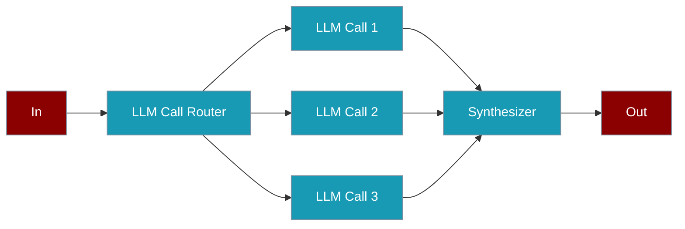

```mermaid
flowchart LR
    In[In] --> Router[LLM Call Router]
    Router --> LLM1[LLM Call 1]
    Router --> LLM2[LLM Call 2]
    Router --> LLM3[LLM Call 3]
    LLM1 --> Synthesizer[Synthesizer]
    LLM2 --> Synthesizer
    LLM3 --> Synthesizer
    Synthesizer --> Out[Out]
    
    classDef agent fill:#8B0000,stroke:#7C90A0,color:#fff
    classDef process fill:#189AB4,stroke:#7C90A0,color:#fff

    class In,Out agent
    class Router,LLM1,LLM2,LLM3,Synthesizer process
```

A workflow with a central orchestrator directing multiple worker LLMs to perform subtasks, synthesizing their outputs for complex, coordinated operations.

## Quick Start

<Steps>
    <Step title="Simple Usage">
        ```bash
        pip install praisonaiagents
        export OPENAI_API_KEY=your_api_key_here
        ```

        Create `app.py`:
        ```python
        from praisonaiagents import Agent, AgentFlow
        from praisonaiagents import route

        # Create orchestrator agent that decides task routing
        orchestrator = Agent(
            name="Orchestrator",
            role="Task Orchestrator",
            goal="Analyze tasks and route to appropriate workers",
            instructions="Analyze the task. Respond with ONLY 'research', 'code', or 'writing' based on task type."
        )

        # Create specialized worker agents
        research_worker = Agent(
            name="ResearchWorker",
            role="Research Specialist",
            goal="Conduct thorough research",
            instructions="You are a research specialist. Provide detailed research findings."
        )

        code_worker = Agent(
            name="CodeWorker",
            role="Software Developer",
            goal="Write and review code",
            instructions="You are a software developer. Write clean, efficient code."
        )

        writing_worker = Agent(
            name="WritingWorker",
            role="Content Writer",
            goal="Create written content",
            instructions="You are a content writer. Write clear, engaging content."
        )

        # Create synthesizer agent
        synthesizer = Agent(
            name="Synthesizer",
            role="Result Synthesizer",
            goal="Synthesize and summarize results",
            instructions="Summarize the work completed and provide a final polished output."
        )

        # Create orchestrated workflow
        workflow = AgentFlow(
            steps=[
                orchestrator,  # First, orchestrator decides routing
                route({
                    "research": [research_worker],
                    "code": [code_worker],
                    "writing": [writing_worker]
                }),
                synthesizer  # Finally, synthesize results
            ]
        )

        # Run orchestrated workflow
        result = workflow.start("Create a Python function to calculate fibonacci numbers")
        print(f"Result: {result['output'][:500]}...")
        ```

        Run it:
        ```bash
        python app.py
        ```
    </Step>

    <Step title="With Configuration">
        Add routing tools and explicit task wiring for finer control:
        ```python
        from praisonaiagents import Agent, Task

        router = Agent(
            name="Router",
            role="Task router",
            goal="Distribute tasks based on conditions",
            tools=[get_time_check],
        )

        worker = Agent(
            name="Worker",
            role="Specialized worker",
            goal="Handle specific task type",
            instructions="Processing instructions",
        )

        router_task = Task(
            name="route_task",
            description="Route tasks to workers",
            agent=router,
            is_start=True,
            task_type="decision",
            condition={"1": ["worker1_task"], "2": ["worker2_task"]},
        )
        ```
    </Step>
</Steps>

<Note>
  **Requirements**
  - Python 3.10 or higher
  - OpenAI API key. Generate OpenAI API key [here](https://platform.openai.com/api-keys). Use Other models using [this guide](/models).   
  - Basic understanding of Python
</Note>

## Understanding Orchestrator-Worker Pattern

<Card title="What is Orchestrator-Worker?" icon="question">
  Orchestrator-Worker pattern enables:
  - Dynamic task distribution and routing
  - Specialized worker execution
  - Result synthesis and aggregation
  - Coordinated workflow management
</Card>

## Features

<CardGroup cols={2}>
  <Card title="Task Routing" icon="route">
    Intelligently distribute tasks to specialized workers.
  </Card>
  <Card title="Worker Specialization" icon="user-gear">
    Dedicated agents for specific task types.
  </Card>
  <Card title="Result Synthesis" icon="object-group">
    Combine and process worker outputs effectively.
  </Card>
  <Card title="Process Control" icon="sliders">
    Monitor and manage the orchestrated workflow.
  </Card>
</CardGroup>

## Configuration Options

```python
# Create an orchestrator agent
router = Agent(
    name="Router",
    role="Task router",
    goal="Distribute tasks based on conditions",
    tools=[get_time_check],  # Tools for routing decisions
      # Enable detailed logging
)

# Create a worker agent
worker = Agent(
    name="Worker",
    role="Specialized worker",
    goal="Handle specific task type",
    instructions="Processing instructions"
)

# Create routing task
router_task = Task(
    name="route_task",
    description="Route tasks to workers",
    agent=router,
    is_start=True,
    task_type="decision",
    condition={
        "1": ["worker1_task"],
        "2": ["worker2_task"]
    }
)

# Create synthesis task
synthesis_task = Task(
    name="synthesize",
    description="Combine worker results",
    agent=synthesizer,
    context=[worker1_task, worker2_task]  # Reference worker tasks
)
```

## Troubleshooting

<CardGroup cols={2}>
  <Card title="Routing Issues" icon="triangle-exclamation">
    If task routing fails:
    - Check routing conditions
    - Verify worker availability
    - Enable verbose mode for debugging
  </Card>

  <Card title="Synthesis Flow" icon="diagram-project">
    If result synthesis is incorrect:
    - Review worker outputs
    - Check context connections
    - Verify synthesis logic
  </Card>
</CardGroup>

## Best Practices

<AccordionGroup>

<Accordion title="Keep orchestrator instructions routing-only">
The orchestrator should return a single routing keyword — avoid asking it to perform worker tasks directly.
</Accordion>

<Accordion title="Specialise each worker">
Give workers narrow roles (research, code, writing) so the orchestrator can route confidently.
</Accordion>

<Accordion title="Always add a synthesizer step">
A final synthesizer agent merges worker outputs into one coherent response for the user.
</Accordion>

</AccordionGroup>

## Related

<CardGroup cols={2}>
  <Card title="AutoAgents" icon="robot" href="./autoagents">
    Automatically created and managed AI agents
  </Card>
  <Card title="Mini Agents" icon="microchip" href="./mini">
    Lightweight, focused AI agents
  </Card>
  <Card title="Multi-Agent Pipelines" icon="diagram-project" href="./multi-agent-pipelines">
    Chain agents into production pipelines
  </Card>
  <Card title="Nested Workflows" icon="sitemap" href="./nested-workflows">
    Compose workflows inside workflows
  </Card>
</CardGroup>
