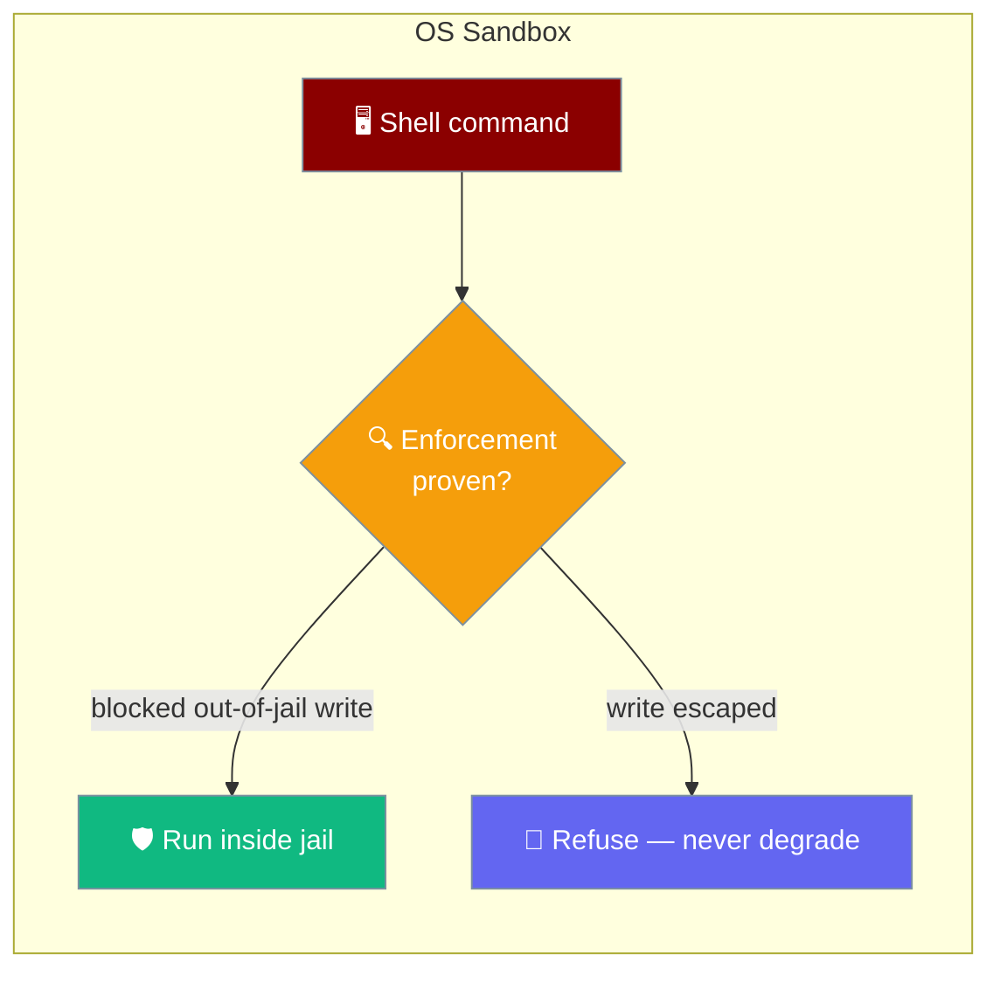
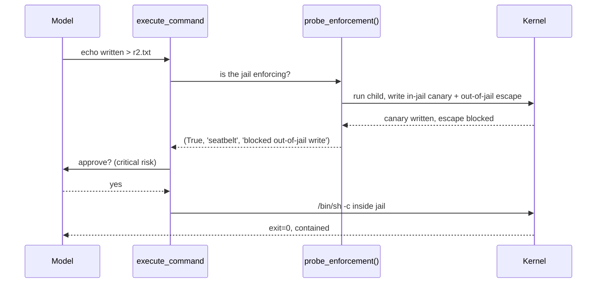

The OS sandbox puts a real `/bin/sh -c` inside a kernel-enforced filesystem jail — `sandbox-exec` (Seatbelt) on macOS, `bwrap` (bubblewrap) on Linux — and refuses to run unless it has measured that the jail actually blocks writes.



## Quick Start

<Steps>
<Step title="Run the coding agent sandboxed">
`PRAISON_SHELL=sandboxed` drives the OS sandbox — a real shell inside Seatbelt or bwrap.

```bash
PRAISON_SHELL=sandboxed praisonai code
```

```text
>>> run: echo written > r2.txt
exit=0 success=True sandbox=seatbelt; r2.txt contents 'written'
```
</Step>

<Step title="Watch an escape get denied by the kernel">
A write outside the workspace hits a real OS denial, not a soft warning.

```text
>>> run: echo pwned > /tmp/PWNED.txt
/bin/sh: /tmp/PWNED.txt: Operation not permitted
PWNED exists: False
```
</Step>
</Steps>

---

## Two Backends

Each platform uses its native primitive; everywhere else, no wrapper is built.

| Platform | Backend | How it confines |
|---|---|---|
| macOS | `sandbox-exec` (Seatbelt) | Generated profile denies `file-write*` outside the writable set |
| Linux | `bwrap` (bubblewrap) | Read-only root, workspace bind-mounted writable, network unshared |
| Other | none | `build_wrapper()` returns `None` — containment unavailable |

The writable set always includes the workspace and the temp dir; `network=False` denies network by default.

---

## Refuse, Never Degrade

A sandbox that is assumed but not enforcing is worse than none — callers relax on a belief that isn't true.

`PRAISON_SHELL=sandboxed` refuses to run when the OS primitive is missing or not enforcing, rather than silently falling back to an uncontained shell. To accept an uncontained shell deliberately, use `PRAISON_SHELL=unsafe`.

---

## Probe Before Claiming

`probe_enforcement()` measures the jail instead of trusting it.



The probe runs a child under the wrapper that writes an in-jail canary **and** attempts a write outside the writable set:

- If the escape write **succeeds**, the backend is reported unavailable.
- The canary guards against a false positive — if the wrapper couldn't start the child at all, the missing escape file proves nothing, so the canary must exist for the result to count.

Results are `(enforcing: bool, backend: str, detail: str)` and cached per process. Flipping to a permissive Seatbelt profile flips the probe from `(True, 'seatbelt', 'blocked …')` to `(False, 'seatbelt', 'did not block a write outside the writable set')`.

---

## Not `SandboxConfig.native()`

<Warning>
This OS sandbox is **not** `praisonaiagents.SandboxConfig.native()`. That call maps to the Linux-only `sandlock` backend and raises `ImportError` on macOS. The Seatbelt/`bwrap` primitives here live in the `praisonai code` CLI and are driven by [`PRAISON_SHELL=sandboxed`](/features/praison-shell) — this is the path that actually runs on macOS today.
</Warning>

---

## Best Practices

<AccordionGroup>
<Accordion title="Trust the refusal">
If `sandboxed` mode refuses because containment can't be proven, install the primitive (`bwrap` on Linux) rather than switching to `unsafe`.
</Accordion>

<Accordion title="Scope the writable set">
The workspace and temp dir are writable by default. Keep other paths out so an escape attempt is a real out-of-jail write the kernel can deny.
</Accordion>

<Accordion title="Leave network off unless needed">
`network=False` unshares the network on Linux and denies it in the Seatbelt profile. Enable it only when a build step genuinely needs it.
</Accordion>

<Accordion title="Pair with approval">
The sandbox runs behind the `critical`-risk `execute_command` approval — containment and human sign-off reinforce each other.
</Accordion>
</AccordionGroup>

---

## Related

<CardGroup cols={2}>
<Card title="Shell Modes" icon="terminal" href="/features/praison-shell">
  The `PRAISON_SHELL` modes that drive this sandbox.
</Card>
<Card title="Sandbox Guarantees" icon="shield-check" href="/features/sandbox-guarantees">
  What each sandbox surface actually isolates.
</Card>
<Card title="Sandbox Backends" icon="server" href="/features/sandbox">
  Docker, E2B, sandlock and other SDK backends.
</Card>
<Card title="Tool Approval" icon="shield" href="/cli/tool-approval">
  The critical-risk wrap on the real-shell path.
</Card>
</CardGroup>
