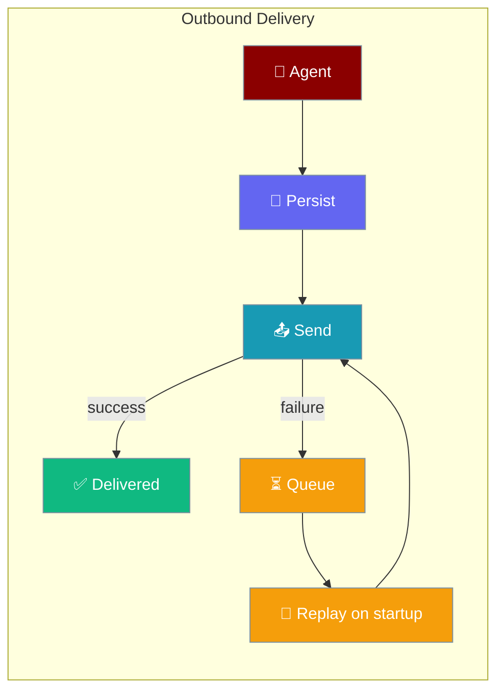
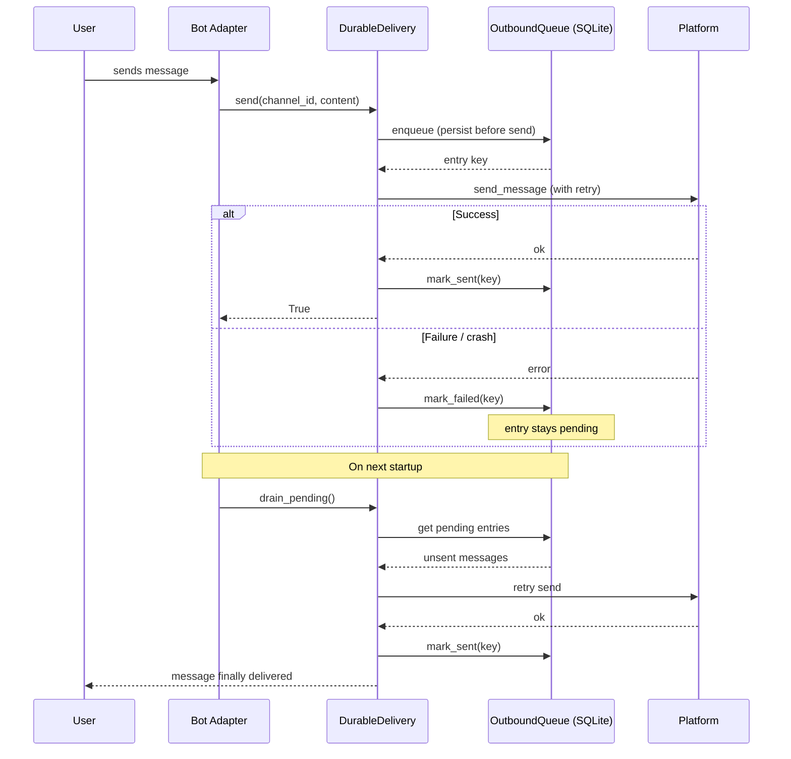
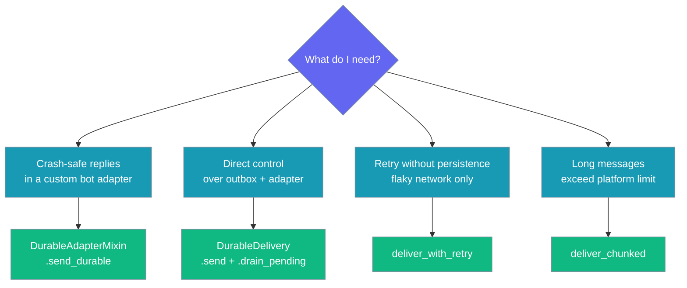

Outbound Delivery persists messages before sending and replays them after a crash, so users always get their bot's reply — even if the bot restarts mid-send.



## Quick Start

<Steps>
<Step title="Add durability to any bot adapter (recommended)">
Mix `DurableAdapterMixin` into your adapter class and call `setup_durable_delivery` in `__init__`:

```python
import asyncio
from praisonai.bots import DurableAdapterMixin

class MyBot(DurableAdapterMixin):
    def __init__(self):
        self.setup_durable_delivery(
            outbox_path="~/.praisonai/state/outbox.sqlite",
            platform="telegram",
        )

    async def send_message(self, channel_id: str, content: str):
        # Your platform-specific send logic here
        pass

async def main():
    bot = MyBot()
    # On startup, replay any unsent messages from last session
    await bot.drain_outbox()
    # Send with crash-safe durability
    await bot.send_durable("123456", "Hello from your agent!")

asyncio.run(main())
```
</Step>

<Step title="Or use DurableDelivery directly for fine-grained control">
```python
import asyncio
from praisonai.bots import DurableDelivery, OutboundQueue

outbox = OutboundQueue(path="~/.praisonai/state/outbox.sqlite")

class MyAdapter:
    async def send_message(self, channel_id: str, content: str):
        pass  # Your send logic

async def main():
    adapter = MyAdapter()
    delivery = DurableDelivery(outbox, adapter, platform="telegram")

    # On startup: drain messages that were queued before last crash
    succeeded, failed = await delivery.drain_pending()
    print(f"Startup drain: {succeeded} sent, {failed} failed")

    # Send with idempotency — safe to retry
    await delivery.send(
        channel_id="123456",
        content="Agent reply here",
        idempotency_key="telegram:msg-789",
    )

asyncio.run(main())
```
</Step>

<Step title="For long messages, use deliver_chunked">
```python
import asyncio
from praisonai.bots import deliver_chunked

class MyAdapter:
    async def send_message(self, channel_id: str, content: str):
        pass

async def main():
    adapter = MyAdapter()
    long_reply = "A" * 10000  # Long agent response

    chunks_sent = await deliver_chunked(
        adapter,
        channel_id="123456",
        content=long_reply,
        max_length=4096,
    )
    print(f"Sent in {chunks_sent} chunks")

asyncio.run(main())
```
</Step>
</Steps>

---

## How It Works



| Stage | Purpose | What happens |
|-------|---------|-------------|
| **enqueue** | Persistence | Message written to SQLite before any send attempt |
| **deliver** | Send with retry | Exponential backoff; permanent errors short-circuit |
| **mark_sent** | Bookkeeping | Cleared after TTL; no double-send on drain |
| **mark_failed** | Track failure | Stays pending; retried on next `drain_pending()` |
| **drain_pending** | Crash recovery | Replays everything not yet marked sent |

---

## Which option do I use?



| Need | Use |
|------|-----|
| Custom bot adapter + durability in one line | `DurableAdapterMixin` + `setup_durable_delivery` |
| Full control over outbox and adapter separately | `DurableDelivery(outbox, adapter, ...)` |
| Retry on transient network errors only (no persistence) | `deliver_with_retry` |
| Split long messages across multiple sends | `deliver_chunked` |

---

## Configuration Options

| Option | Type | Default | Description |
|--------|------|---------|-------------|
| `outbox_path` | `str \| None` | `None` | SQLite outbox path. `None` disables durability (falls back to direct send + retry). `~` is expanded; parent dirs auto-created. |
| `platform` | `str` | `""` | Platform name used for error classification and target prefixing (`telegram:CHANNEL`). |
| `max_attempts` | `int` | `3` | Max delivery attempts per message before marking failed. |
| `max_size` | `int` | `50_000` | Max entries kept in the outbox. Excess evicted (sent first, then oldest pending). |
| `ttl_seconds` | `int` | `604_800` (7 days) | TTL for sent entries before eviction. |
| `idempotency_key` | `str \| None` | auto-uuid | Per-message dedup key. Pass a stable value (e.g. `f"{platform}:{message_id}"`) to prevent double-send on retry. |
| `metadata` | `dict \| None` | `None` | Optional tracking metadata persisted with the entry. |
| `backoff` | `BackoffPolicy \| None` | default policy | Exponential-backoff policy from `praisonai.bots._resilience`. |
| `abort_signal` | `asyncio.Event \| None` | `None` | Cancels in-flight retries (used by `deliver_with_retry`). |

---

## Per-platform examples

<Tabs>
<Tab title="Telegram">
```python
import asyncio
from praisonaiagents import Agent
from praisonai.bots import DurableAdapterMixin

class TelegramBot(DurableAdapterMixin):
    def __init__(self, token: str):
        self.token = token
        self.setup_durable_delivery(
            outbox_path="~/.praisonai/telegram-outbox.sqlite",
            platform="telegram",
        )

    async def send_message(self, channel_id: str, content: str):
        # actual telegram API call here
        pass

async def handle_update(bot: TelegramBot, chat_id: str, text: str):
    agent = Agent(name="TelegramBot", instructions="Help Telegram users")
    reply = agent.start(text)
    await bot.send_durable(
        channel_id=chat_id,
        content=reply,
        idempotency_key=f"telegram:{chat_id}:{hash(text)}",
    )

async def main():
    bot = TelegramBot(token="YOUR_TOKEN")
    await bot.drain_outbox()  # Replay any unsent messages on startup
    await handle_update(bot, "123456", "Hello bot!")

asyncio.run(main())
```
</Tab>

<Tab title="Discord">
```python
import asyncio
from praisonaiagents import Agent
from praisonai.bots import DurableAdapterMixin

class DiscordBot(DurableAdapterMixin):
    def __init__(self):
        self.setup_durable_delivery(
            outbox_path="~/.praisonai/discord-outbox.sqlite",
            platform="discord",
        )

    async def send_message(self, channel_id: str, content: str):
        # actual discord API call here
        pass

async def handle_message(bot: DiscordBot, channel_id: str, message_id: str, content: str):
    agent = Agent(name="DiscordBot", instructions="Help Discord server members")
    reply = agent.start(content)
    await bot.send_durable(
        channel_id=channel_id,
        content=reply,
        idempotency_key=f"discord:{message_id}",
    )

async def main():
    bot = DiscordBot()
    await bot.drain_outbox()
    await handle_message(bot, "987654321", "msg-001", "Help!")

asyncio.run(main())
```
</Tab>

<Tab title="Slack">
```python
import asyncio
from praisonaiagents import Agent
from praisonai.bots import DurableAdapterMixin

class SlackBot(DurableAdapterMixin):
    def __init__(self):
        self.setup_durable_delivery(
            outbox_path="~/.praisonai/slack-outbox.sqlite",
            platform="slack",
        )

    async def send_message(self, channel_id: str, content: str):
        # actual Slack API call here
        pass

async def handle_event(bot: SlackBot, channel: str, event_ts: str, text: str):
    agent = Agent(name="SlackBot", instructions="Assist Slack workspace users")
    reply = agent.start(text)
    await bot.send_durable(
        channel_id=channel,
        content=reply,
        idempotency_key=f"slack:{channel}:{event_ts}",
    )

async def main():
    bot = SlackBot()
    await bot.drain_outbox()
    await handle_event(bot, "C12345678", "1234567890.123456", "Need help!")

asyncio.run(main())
```
</Tab>

<Tab title="WhatsApp">
```python
import asyncio
from praisonaiagents import Agent
from praisonai.bots import DurableAdapterMixin

class WhatsAppBot(DurableAdapterMixin):
    def __init__(self):
        self.setup_durable_delivery(
            outbox_path="~/.praisonai/whatsapp-outbox.sqlite",
            platform="whatsapp",
        )

    async def send_message(self, channel_id: str, content: str):
        # actual WhatsApp API call here
        pass

async def handle_webhook(bot: WhatsAppBot, from_number: str, message_id: str, body: str):
    agent = Agent(name="WhatsAppBot", instructions="Help WhatsApp users")
    reply = agent.start(body)
    await bot.send_durable(
        channel_id=from_number,
        content=reply,
        idempotency_key=f"whatsapp:{message_id}",
    )

async def main():
    bot = WhatsAppBot()
    await bot.drain_outbox()
    await handle_webhook(bot, "+15551234567", "wamid.abc123", "Hello!")

asyncio.run(main())
```
</Tab>
</Tabs>

---

## Common Patterns

### Pattern 1: Pair with InboundJournal for full inbound + outbound durability

```python
import asyncio
from praisonaiagents import Agent
from praisonai.bots import InboundJournal, DurableAdapterMixin, BotSessionManager

class DurableBot(DurableAdapterMixin):
    def __init__(self):
        self.setup_durable_delivery(
            outbox_path="~/.praisonai/state/outbox.sqlite",
            platform="telegram",
        )

    async def send_message(self, channel_id: str, content: str):
        pass

async def main():
    bot = DurableBot()
    journal = InboundJournal(path="~/.praisonai/state/ingress.sqlite")
    session = BotSessionManager(platform="telegram", ingress_journal=journal)

    agent = Agent(name="DurableBot", instructions="Help users reliably")

    # On startup: drain any unsent outbound messages
    await bot.drain_outbox()

    # Inbound: dedup + crash-safe
    # Outbound: persist + retry
asyncio.run(main())
```

### Pattern 2: Stable idempotency keys prevent double-send on retry

```python
async def send_agent_reply(bot, platform: str, message_id: str, channel_id: str, reply: str):
    # Same key every time for the same message → safe to call twice
    await bot.send_durable(
        channel_id=channel_id,
        content=reply,
        idempotency_key=f"{platform}:{message_id}:reply",
    )
```

### Pattern 3: Startup drain in bot's lifecycle hook

```python
class MyBot(DurableAdapterMixin):
    def __init__(self):
        self.setup_durable_delivery(
            outbox_path="/var/lib/mybot/outbox.sqlite",
            platform="slack",
        )

    async def start(self):
        succeeded, failed = await self.drain_outbox()
        if succeeded or failed:
            print(f"Recovered outbox: {succeeded} sent, {failed} still pending")
        # ... rest of startup

    async def send_message(self, channel_id: str, content: str):
        pass
```

### Pattern 4: Chunking long agent replies

```python
from praisonai.bots import deliver_chunked

async def send_long_reply(adapter, channel_id: str, content: str):
    # Automatically splits at 4096 chars, preserving code fences
    chunks = await deliver_chunked(
        adapter,
        channel_id=channel_id,
        content=content,
        max_length=4096,
        preserve_fences=True,
    )
    print(f"Sent {chunks} chunk(s)")
```

---

## Best Practices

<AccordionGroup>
<Accordion title="Use a persistent, absolute path for outbox_path">
The SQLite file must survive restarts for crash recovery to work. Avoid `/tmp` — it's cleared on reboot.

```python
# ✅ Good: survives restarts
self.setup_durable_delivery(outbox_path="/var/lib/mybot/outbox.sqlite")

# ✅ Also good: ~ is expanded
self.setup_durable_delivery(outbox_path="~/.praisonai/state/outbox.sqlite")

# ❌ Bad: lost on reboot
self.setup_durable_delivery(outbox_path="/tmp/outbox.sqlite")
```
</Accordion>

<Accordion title="Always set a stable idempotency_key">
Without one, a retry after a crash generates a new UUID and the message is sent twice. Derive the key from the original inbound message ID.

```python
# ✅ Stable — same result no matter how many times you retry
await bot.send_durable(
    channel_id=chat_id,
    content=reply,
    idempotency_key=f"telegram:{incoming_message_id}:reply",
)

# ❌ New UUID each call — double-send on retry
await bot.send_durable(channel_id=chat_id, content=reply)
```
</Accordion>

<Accordion title="Call drain_outbox() at bot startup">
Messages that were queued before a crash stay pending in SQLite. Drain them before starting the event loop.

```python
async def main():
    bot = MyBot()
    await bot.drain_outbox()   # ← do this first
    await bot.run()            # start listening for new messages
```
</Accordion>

<Accordion title="Tune max_attempts for your platform's rate limits">
Telegram allows ~30 messages/second per bot. Slack is stricter. Set `max_attempts` to match your platform's retry budget.

```python
# For rate-limited platforms, fewer retries with longer backoff
self.setup_durable_delivery(
    outbox_path="~/.praisonai/state/outbox.sqlite",
    platform="slack",
    max_attempts=5,
)
```
</Accordion>
</AccordionGroup>

---

## Related

<CardGroup cols={2}>
<Card title="Inbound Journal" icon="book" href="/docs/features/inbound-journal">
  Inbound side: dedup webhook redeliveries and crash-safe replay of in-flight messages
</Card>
<Card title="Inbound DLQ" icon="inbox" href="/docs/features/inbound-dlq">
  Failure-side durability when agent execution fails
</Card>
<Card title="Cross-Platform Mirror" icon="copy" href="/docs/features/cross-platform-mirror">
  Mirror messages across multiple platforms simultaneously
</Card>
<Card title="Bot Rate Limiting" icon="gauge" href="/docs/features/bot-rate-limiting">
  Platform-aware rate limiting to avoid throttling
</Card>
</CardGroup>
