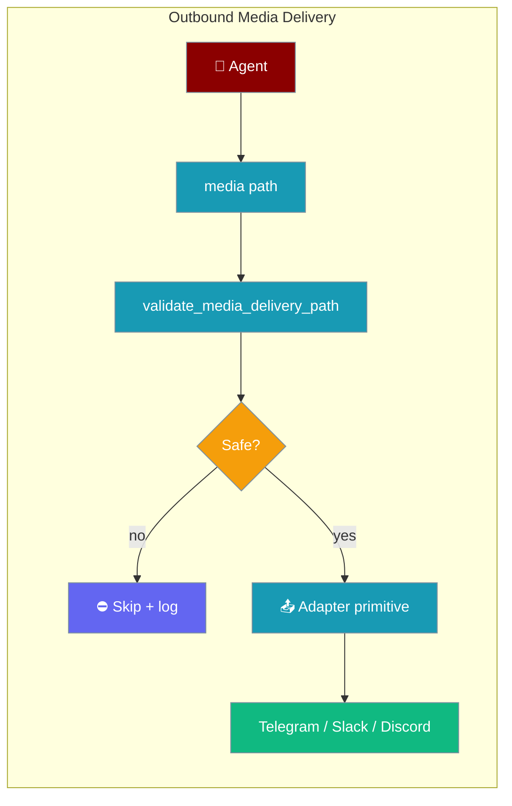
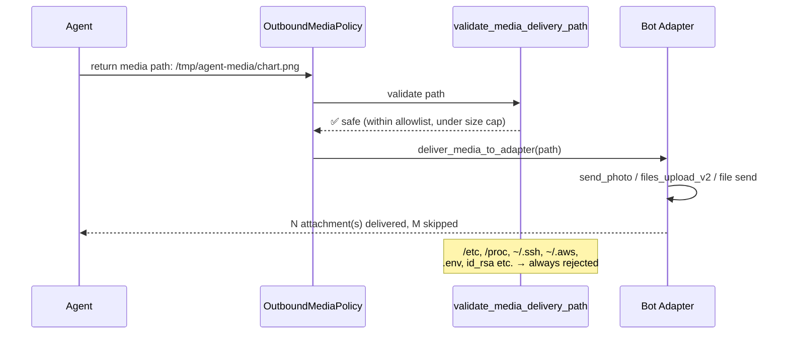
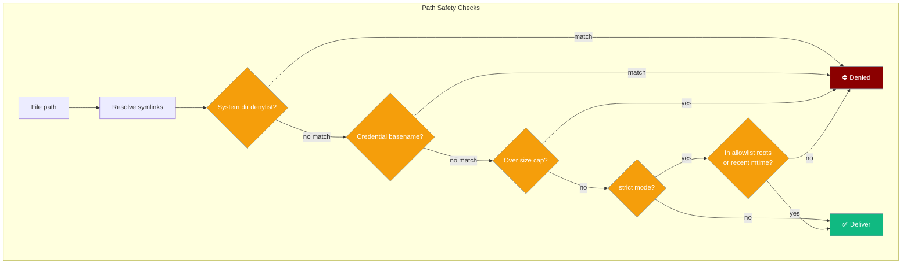

Agents can now return images, charts, and files that are automatically delivered through the bot adapter's native upload primitive — Telegram `send_photo`, Slack `files_upload_v2`, Discord file send, and more.

<Note>
Outbound media delivery uses the same `OutboundResilienceMixin` now applied to all six channels: Slack, Discord, WhatsApp, Email, Linear, AgentMail, and Telegram. See [Durable Delivery](/docs/features/durable-delivery) for retry and crash-safe persistence.
</Note>



## Quick Start

<Steps>

<Step title="Simple Usage">
```python
from praisonaiagents import Agent

chart_agent = Agent(
    name="ChartAgent",
    instructions="""
    Generate the requested chart, save it under /tmp/agent-media/,
    then return a message that includes the file path in the 'media' field.
    """,
)
```
</Step>

<Step title="With Configuration">
```yaml
roles:
  - role: ChartAgent
    backstory: Generates and delivers charts.
    tasks:
      - description: Draw a chart for the user's request.

media_delivery:
  enabled: true
  max_size_mb: 10
  strict: true
  allowlist_roots:
    - /tmp/agent-media
  recent_mtime_seconds: 300
```

Start the bot:

```bash
praisonai bot telegram --config bot.yaml
```

Users receive text plus the chart image attached automatically.
</Step>

</Steps>

---

## How It Works

When an agent returns a media file path, the gateway's outbound binding validates it through the path safety guard and delivers it via the adapter's native primitive:



### Path safety guard

`validate_media_delivery_path()` runs two checks before any file is sent:



**System directory denylist** (always blocked): `/etc`, `/proc`, `/sys`, `~/.ssh`, `~/.aws`, `~/.gnupg`, gateway secret/pairing directories.

**Credential basename denylist** (always blocked): `.env`, `id_rsa`, `id_ecdsa`, `id_ed25519`, `.npmrc`, `.netrc`, and similar credential filenames — matched from any directory.

---

## Configuration (`media_delivery` YAML block)

```yaml
media_delivery:
  enabled: true
  max_size_mb: 25
  strict: false
  allowlist_roots:
    - /var/agent/output
    - /tmp/agent-media
  recent_mtime_seconds: 600
  basename_denylist:
    - secret_config.yml
```

### `OutboundMediaPolicy` fields

| Field | Type | Default | Description |
|-------|------|---------|-------------|
| `enabled` | `bool` | `True` | Master switch. Quoted `"false"` in YAML also disables |
| `max_size_mb` | `int` | `25` | Per-file size cap in megabytes |
| `strict` | `bool` | `False` | If `True`, only deliver files inside `allowlist_roots` or with `mtime` within `recent_mtime_seconds` |
| `allowlist_roots` | `list[str]` | `[]` | Strict-mode: only files under these roots are delivered |
| `recent_mtime_seconds` | `int` | `600` | Strict-mode: only files modified within this window (seconds) are delivered |
| `basename_denylist` | `list[str]` | `[]` | Extra basenames added on top of the built-in denylist |

---

## Platform Support

| Platform | Native primitive | Media types |
|----------|-----------------|-------------|
| Telegram | `send_photo`, `send_document` | Images, documents |
| Slack | `files_upload_v2` | Any file type |
| Discord | File attachment | Any file type |

`PlatformCapabilities.supports_media` is checked per adapter — platforms that don't support file uploads receive text-only replies and the attachment is skipped with a log entry.

---

## Common Patterns

### Chart generation bot

```python
from praisonaiagents import Agent
import matplotlib.pyplot as plt
import os

chart_agent = Agent(
    name="ChartAgent",
    instructions="""
    When asked for a chart:
    1. Generate it using matplotlib
    2. Save to /tmp/agent-media/<filename>.png
    3. Return the file path in your response
    """,
)
```

```yaml
media_delivery:
  enabled: true
  max_size_mb: 10
  strict: true
  allowlist_roots:
    - /tmp/agent-media
  recent_mtime_seconds: 300
```

### Multi-tenant / hosted gateway (strict mode)

For hosted environments where multiple users share the same gateway, enable strict mode with an explicit output directory:

```yaml
media_delivery:
  enabled: true
  max_size_mb: 5
  strict: true
  allowlist_roots:
    - /var/agent/output
  recent_mtime_seconds: 120
  basename_denylist:
    - config.yml
    - secrets.json
```

### Disable media delivery

```yaml
media_delivery:
  enabled: false
```

Or with quoted string (both are equivalent):

```yaml
media_delivery:
  enabled: "false"
```

---

## Summary Messages

When media delivery completes, `BotOutboundMessenger.send` appends a summary:

```
2 attachment(s) delivered, 1 skipped
```

Skipped files (denied by path guard, over size cap, etc.) are logged at debug level and never cause the message send to fail.

---

## Best Practices

<AccordionGroup>

<Accordion title="Write agent output to a dedicated directory">
Configure your agent to save all generated files to a single directory like `/tmp/agent-media/` and set that as the `allowlist_roots` entry. This keeps the path guard simple and predictable.
</Accordion>

<Accordion title="Enable strict mode for production">
In production or multi-tenant gateways, set `strict: true` with explicit `allowlist_roots`. This prevents agents from accidentally delivering files from unexpected locations.
</Accordion>

<Accordion title="Set a reasonable size cap">
Default is 25 MB. Telegram and Slack have their own size limits — set `max_size_mb` below those limits to fail fast at the gateway rather than at the adapter.
</Accordion>

<Accordion title="Never save credentials near the output directory">
The basename denylist blocks common credential filenames, but keep your output directory completely separate from config directories. Symlink attacks are also blocked (symlinks are resolved before path checks).
</Accordion>

</AccordionGroup>

---

## Related

<CardGroup cols={2}>
  <Card title="Messaging Bots" icon="message-bot" href="/docs/features/messaging-bots">
    Full bot setup and configuration guide
  </Card>
  <Card title="Channels Gateway" icon="network-wired" href="/docs/features/channels-gateway">
    Gateway channel routing and configuration
  </Card>
  <Card title="Gateway" icon="gateway" href="/docs/gateway">
    Gateway architecture and YAML reference
  </Card>
  <Card title="Bot Inbound Media" icon="image" href="/docs/features/bot-inbound-media">
    Handle images and files sent by users
  </Card>
</CardGroup>
