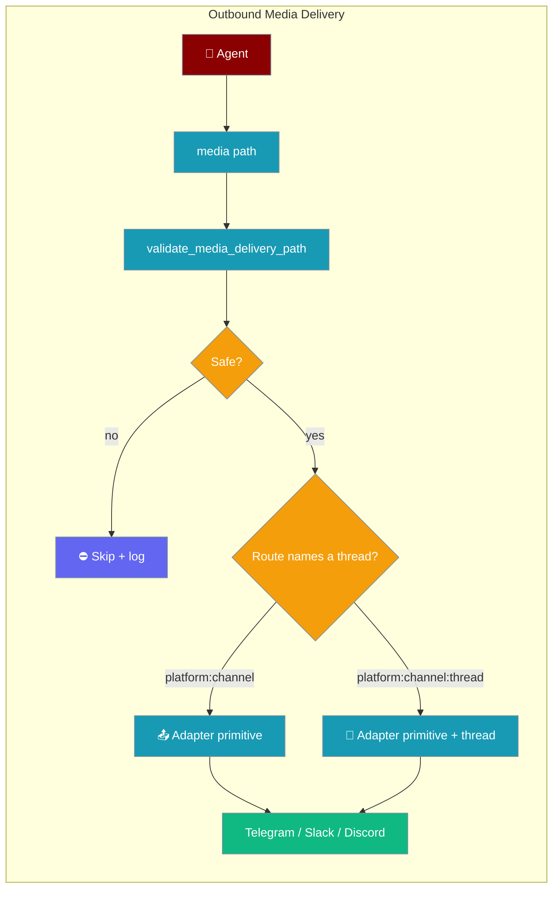
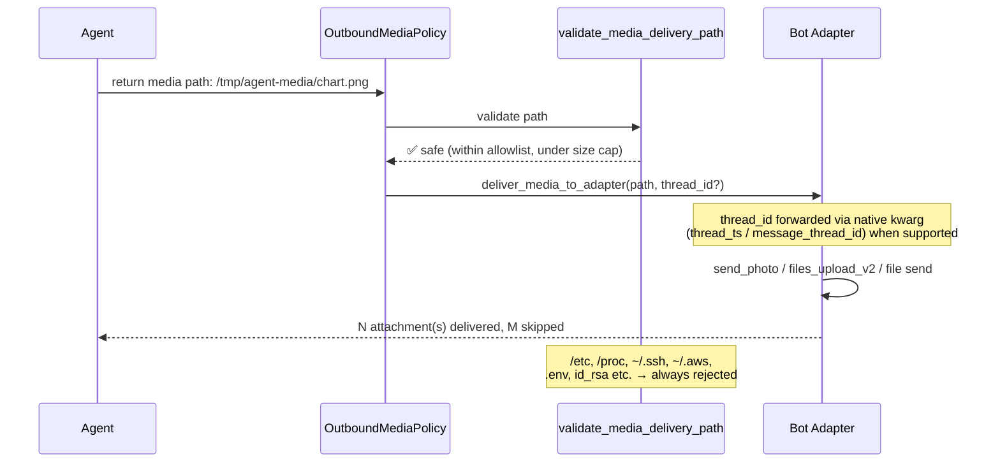
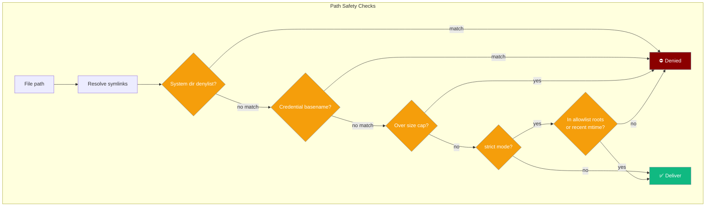
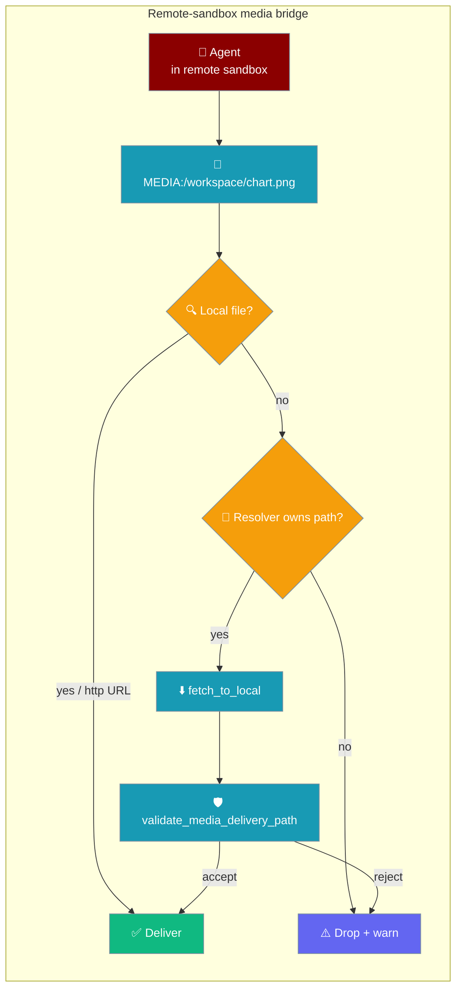
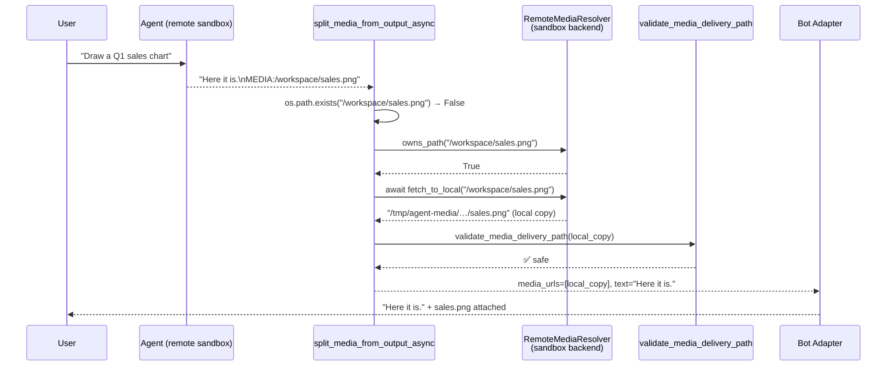
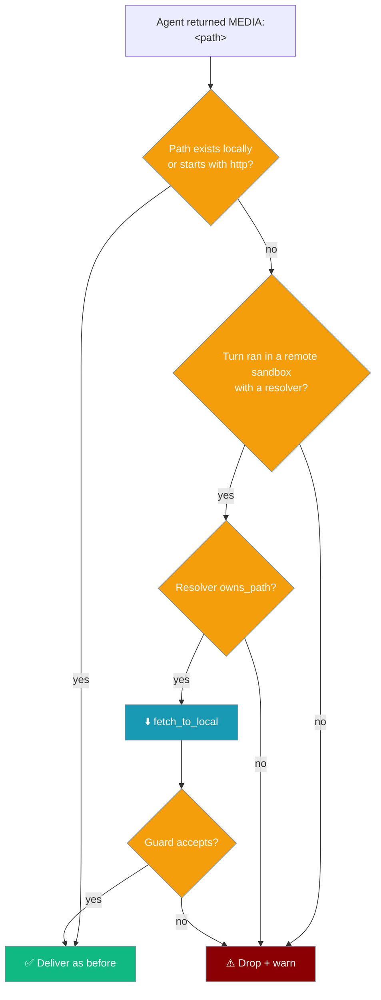
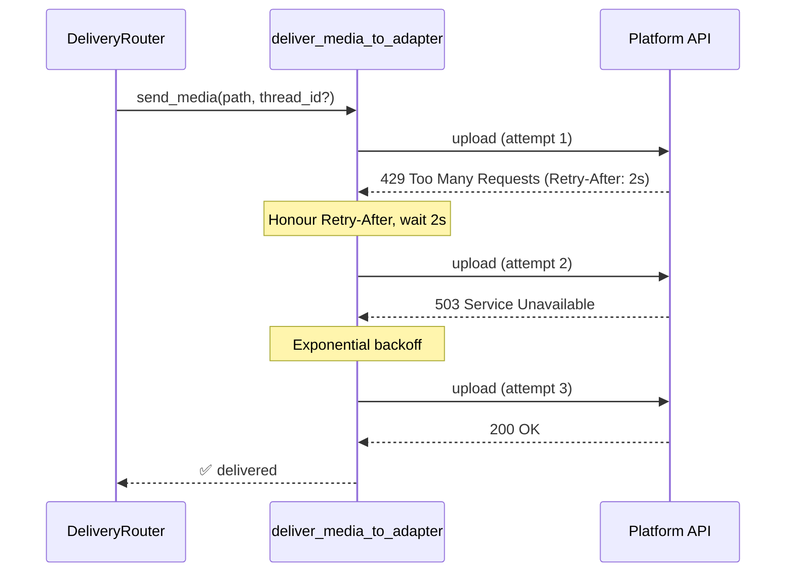

Agents can now return images, charts, and files that are automatically delivered through the bot adapter's native upload primitive — Telegram `send_photo`, Slack `files_upload_v2`, Discord file send, and more.

```python
from praisonaiagents import Agent

chart_agent = Agent(
    name="ChartAgent",
    instructions="Generate charts and return file paths in the media field.",
)
chart_agent.start("Draw a sales chart for Q1 and send it to the user.")
```

The user messages the bot; generated images and files upload through the channel adapter automatically.

<Note>
Outbound media now honours threaded targets: when the delivery route names a thread — Slack `thread_ts`, Telegram forum topic, or Discord thread — the attachment lands in the same thread as the text reply. Adapters that don't support threads are completely unaffected.
</Note>

<Note>
Outbound media uploads share the same retry/backoff path as text replies —
`DeliveryRouter.send_media` wraps the upload in `deliver_with_retry`, reusing
the adapter's configured `BackoffPolicy` (or a sensible default). See
[Retry & backoff on transient failures](#retry--backoff-on-transient-failures)
below and [Outbound Resilience](/features/outbound-resilience) for the
underlying policy config.
</Note>


```mermaid
graph LR
    subgraph "Outbound Media Delivery"
        A[🤖 Agent] --> B[media path]
        B --> C[validate_media_delivery_path]
        C --> D{Safe?}
        D -->|no| E[⛔ Skip + log]
        D -->|yes| R{Route names a thread?}
        R -->|platform:channel| F[📤 Adapter primitive]
        R -->|platform:channel:thread| T[🧵 Adapter primitive + thread]
        F --> G[Telegram / Slack / Discord]
        T --> G
    end

    classDef agent fill:#8B0000,stroke:#7C90A0,color:#fff
    classDef process fill:#189AB4,stroke:#7C90A0,color:#fff
    classDef decision fill:#F59E0B,stroke:#7C90A0,color:#fff
    classDef skip fill:#6366F1,stroke:#7C90A0,color:#fff
    classDef result fill:#10B981,stroke:#7C90A0,color:#fff

    class A agent
    class B,C,F,T process
    class D,R decision
    class E skip
    class G result
```

## Quick Start

<Steps>

<Step title="Simple Usage">
```python
from praisonaiagents import Agent

chart_agent = Agent(
    name="ChartAgent",
    instructions="""
    Generate the requested chart, save it under /tmp/agent-media/,
    then return a message that includes the file path in the 'media' field.
    """,
)
```
</Step>

<Step title="With Configuration">
```yaml
roles:
  - role: ChartAgent
    backstory: Generates and delivers charts.
    tasks:
      - description: Draw a chart for the user's request.

media_delivery:
  enabled: true
  max_size_mb: 10
  strict: true
  allowlist_roots:
    - /tmp/agent-media
  recent_mtime_seconds: 300
```

Start the bot:

```bash
praisonai bot telegram --config bot.yaml
```

Users receive text plus the chart image attached automatically.
</Step>

</Steps>

---

## How It Works

When an agent returns a media file path, the gateway's outbound binding validates it through the path safety guard and delivers it via the adapter's native primitive:


```mermaid
sequenceDiagram
    participant A as Agent
    participant DM as OutboundMediaPolicy
    participant PG as validate_media_delivery_path
    participant ADP as Bot Adapter

    A->>DM: return media path: /tmp/agent-media/chart.png
    DM->>PG: validate path
    PG-->>DM: ✅ safe (within allowlist, under size cap)
    DM->>ADP: deliver_media_to_adapter(path, thread_id?)
    Note over ADP: thread_id forwarded via native kwarg<br/>(thread_ts / message_thread_id) when supported
    ADP->>ADP: send_photo / files_upload_v2 / file send
    ADP-->>A: N attachment(s) delivered, M skipped

    Note over PG: /etc, /proc, ~/.ssh, ~/.aws,<br/>.env, id_rsa etc. → always rejected
```

### Path safety guard

`validate_media_delivery_path()` runs two checks before any file is sent:


```mermaid
graph TB
    subgraph "Path Safety Checks"
        P[File path] --> R[Resolve symlinks]
        R --> SYS{System dir denylist?}
        SYS -->|match| DENY[⛔ Denied]
        SYS -->|no match| BASE{Credential basename?}
        BASE -->|match| DENY
        BASE -->|no match| SIZE{Over size cap?}
        SIZE -->|yes| DENY
        SIZE -->|no| STRICT{strict mode?}
        STRICT -->|no| OK[✅ Deliver]
        STRICT -->|yes| ALLOWLIST{In allowlist roots<br/>or recent mtime?}
        ALLOWLIST -->|yes| OK
        ALLOWLIST -->|no| DENY
    end

    classDef deny fill:#8B0000,stroke:#7C90A0,color:#fff
    classDef ok fill:#10B981,stroke:#7C90A0,color:#fff
    classDef check fill:#F59E0B,stroke:#7C90A0,color:#fff

    class DENY deny
    class OK ok
    class SYS,BASE,SIZE,STRICT,ALLOWLIST check
```

**System directory denylist** (always blocked): `/etc`, `/proc`, `/sys`, `~/.ssh`, `~/.aws`, `~/.gnupg`, gateway secret/pairing directories.

**Credential basename denylist** (always blocked): `.env`, `id_rsa`, `id_ecdsa`, `id_ed25519`, `.npmrc`, `.netrc`, and similar credential filenames — matched from any directory.

---

## Remote-sandbox media (Modal, E2B, Daytona, Fly.io, SSH, …)

When an agent runs off-box in a remote sandbox and generates a file, the gateway fetches the artifact back and delivers it through the same MEDIA path — the user gets the file automatically.

```python
from praisonaiagents import Agent, SandboxConfig

chart_agent = Agent(
    name="ChartAgent",
    instructions=(
        "Generate the requested chart, save it under /workspace/, "
        "then return a MEDIA:/workspace/<filename>.png line."
    ),
    sandbox=SandboxConfig(sandbox_type="modal"),   # or e2b, daytona, flyio, ssh, novita
)
chart_agent.start("Draw a sales chart for Q1 and send it to the user.")
```

The user sends a message. The agent runs remotely, writes the chart on the sandbox filesystem, and returns `MEDIA:/workspace/chart.png`. The gateway detects the remote path, fetches it back, re-screens it, and delivers it — no extra wiring.


```mermaid
graph LR
    subgraph "Remote-sandbox media bridge"
        A[🤖 Agent<br/>in remote sandbox] --> M[📎 MEDIA:/workspace/chart.png]
        M --> D{🔍 Local file?}
        D -->|yes / http URL| G[✅ Deliver]
        D -->|no| R{🧭 Resolver owns path?}
        R -->|no| X[⚠️ Drop + warn]
        R -->|yes| F[⬇️ fetch_to_local]
        F --> V[🛡️ validate_media_delivery_path]
        V -->|reject| X
        V -->|accept| G
    end

    classDef agent fill:#8B0000,stroke:#7C90A0,color:#fff
    classDef process fill:#189AB4,stroke:#7C90A0,color:#fff
    classDef decision fill:#F59E0B,stroke:#7C90A0,color:#fff
    classDef skip fill:#6366F1,stroke:#7C90A0,color:#fff
    classDef result fill:#10B981,stroke:#7C90A0,color:#fff

    class A agent
    class M,F,V process
    class D,R decision
    class X skip
    class G result
```

### End-to-end flow


```mermaid
sequenceDiagram
    participant User
    participant Agent as Agent (remote sandbox)
    participant Parser as split_media_from_output_async
    participant Resolver as RemoteMediaResolver<br/>(sandbox backend)
    participant Guard as validate_media_delivery_path
    participant Adapter as Bot Adapter

    User->>Agent: "Draw a Q1 sales chart"
    Agent-->>Parser: "Here it is.\nMEDIA:/workspace/sales.png"
    Parser->>Parser: os.path.exists("/workspace/sales.png") → False
    Parser->>Resolver: owns_path("/workspace/sales.png")
    Resolver-->>Parser: True
    Parser->>Resolver: await fetch_to_local("/workspace/sales.png")
    Resolver-->>Parser: "/tmp/agent-media/…/sales.png" (local copy)
    Parser->>Guard: validate_media_delivery_path(local_copy)
    Guard-->>Parser: ✅ safe
    Parser-->>Adapter: media_urls=[local_copy], text="Here it is."
    Adapter-->>User: "Here it is." + sales.png attached
```

### Behaviour

| MEDIA path shape | Resolver present? | Behaviour |
|------------------|-------------------|-----------|
| Local file that exists on the gateway host | any | Delivered as before |
| `http://` / `https://` URL | any | Delivered as before |
| Sandbox path (e.g. `/workspace/chart.png`) | ❌ none | **Dropped + warning logged** (historical behaviour) |
| Sandbox path owned by resolver | ✅ | Fetched to local, re-screened, delivered |
| Sandbox path **not** owned by resolver | ✅ | **Dropped + warning logged** |
| Sandbox path, `fetch_to_local` raises | ✅ | **Dropped + warning logged**, never crashes the reply |
| Fetched file rejected by delivery guard | ✅ | **Dropped + warning logged** |

Unlike the old silent drop, the operator now always gets a `logger.warning(...)` when a MEDIA path is undeliverable, so the failure is visible in logs.

### The `RemoteMediaResolver` protocol

Exported from `praisonaiagents.gateway`:

```python
from praisonaiagents.gateway import RemoteMediaResolver

@runtime_checkable
class RemoteMediaResolver(Protocol):
    """Resolves a sandbox-local media path to a gateway-local deliverable path."""

    def owns_path(self, path: str) -> bool:
        """True if `path` refers to a file inside this sandbox."""
        ...

    async def fetch_to_local(self, remote_path: str) -> str:
        """Fetch `remote_path` out of the sandbox to a local path.
        The caller re-screens the returned path through the outbound-path guard."""
        ...
```

| Method | Signature | Purpose |
|--------|-----------|---------|
| `owns_path` | `(path: str) -> bool` | Non-blocking check: is this a path inside my sandbox? |
| `fetch_to_local` | `async (remote_path: str) -> str` | Pull the artifact into a local delivery cache; returns the gateway-local path |

Each remote sandbox backend already has a `download_file` / `read_file` primitive (Modal `read_file`, E2B `read_file`, Daytona `fs.download_file`, Fly.io `compute.download_file`, SSH `read_file`, Docker `download_file`, Novita `read_file`, Subprocess `read_file`). The active sandbox backend for the turn is the resolver — application code does **not** implement this protocol itself.

### Compatibility & safety

- **Byte-for-byte backward compatible.** With no resolver in play, `split_media_from_output_async()` returns the same dict shape and values as the existing `split_media_from_output()` — local paths and URLs are untouched.
- **No new required parameters on `Agent`.** No new dependencies added. No per-turn plumbing surfaced to user code.
- **The exfiltration guard still runs.** Fetched artifacts are re-screened by `validate_media_delivery_path()` before delivery, so the system-directory / credential-basename denylist, size cap, strict-mode allowlist, and `recent_mtime_seconds` window all still apply. See [Path safety guard](#path-safety-guard).
- **Fail-open on error.** A resolver failure (missing/wrong backend, download error, guard rejection) degrades to the historical silent drop **plus** an operator-visible warning — never a crash on the reply path.
- **The sync `split_media_from_output()` is unchanged.** Only the new async variant `split_media_from_output_async()` is remote-aware.

### When does this fire?


```mermaid
graph TB
    A[Agent returned MEDIA:&lt;path&gt;] --> L{Path exists locally<br/>or starts with http?}
    L -->|yes| DEL[✅ Deliver as before]
    L -->|no| S{Turn ran in a remote sandbox<br/>with a resolver?}
    S -->|no| DROP[⚠️ Drop + warn]
    S -->|yes| O{Resolver owns_path?}
    O -->|no| DROP
    O -->|yes| F[⬇️ fetch_to_local]
    F --> V{Guard accepts?}
    V -->|no| DROP
    V -->|yes| DEL

    classDef decision fill:#F59E0B,stroke:#7C90A0,color:#fff
    classDef deliver fill:#10B981,stroke:#7C90A0,color:#fff
    classDef drop fill:#8B0000,stroke:#7C90A0,color:#fff
    classDef step fill:#189AB4,stroke:#7C90A0,color:#fff

    class L,S,O,V decision
    class DEL deliver
    class DROP drop
    class F step
```

---

## Configuration (`media_delivery` YAML block)

```yaml
media_delivery:
  enabled: true
  max_size_mb: 25
  strict: false
  allowlist_roots:
    - /var/agent/output
    - /tmp/agent-media
  recent_mtime_seconds: 600
  basename_denylist:
    - secret_config.yml
```

### `OutboundMediaPolicy` fields

| Field | Type | Default | Description |
|-------|------|---------|-------------|
| `enabled` | `bool` | `True` | Master switch. Quoted `"false"` in YAML also disables |
| `max_size_mb` | `int` | `25` | Per-file size cap in megabytes |
| `strict` | `bool` | `False` | If `True`, only deliver files inside `allowlist_roots` or with `mtime` within `recent_mtime_seconds` |
| `allowlist_roots` | `list[str]` | `[]` | Strict-mode: only files under these roots are delivered |
| `recent_mtime_seconds` | `int` | `600` | Strict-mode: only files modified within this window (seconds) are delivered |
| `basename_denylist` | `list[str]` | `[]` | Extra basenames added on top of the built-in denylist |

---

## Platform Support

| Platform | Native primitive | Media types |
|----------|-----------------|-------------|
| Telegram | `send_photo`, `send_document` | Images, documents |
| Slack | `files_upload_v2` | Any file type |
| Discord | File attachment | Any file type |

`PlatformCapabilities.supports_media` is checked per adapter — platforms that don't support file uploads receive text-only replies and the attachment is skipped with a log entry.

---

## Threaded media delivery

Attachments follow the same `platform:channel_id:thread_id` grammar the text path uses. When a route names a thread, both the text reply and any uploaded file land in that thread.

```python
from praisonai.bots import DeliveryRouter

# Scheduled attachment into a Slack thread
router.send_media("slack:C0123456:1728987654.001234", "/tmp/report.pdf",
                  caption="Weekly report")
# → Slack files_upload_v2(..., thread_ts="1728987654.001234")

# Telegram forum topic
router.send_media("telegram:-1001234567890:42", "/tmp/chart.png",
                  caption="Q1 chart")
# → bot.send_photo(..., message_thread_id=42)
```

| Platform | `thread_id` becomes | Ignored on non-threaded adapters |
|----------|---------------------|----------------------------------|
| Slack    | `thread_ts` on `files_upload_v2` | ✅ |
| Telegram | `message_thread_id` on `send_photo` / `send_document` | ✅ |
| Discord  | Thread channel id used as the send target | ✅ |
| WhatsApp / Email / custom | — (no thread concept) | ✅ silently dropped |

`DeliveryRouter.send_media` resolves the thread from the target and forwards it to `deliver_media_to_adapter`, which passes it through each transport's native keyword only when the primitive accepts it — so non-threaded adapters never raise.

---

## Retry & backoff on transient failures

Media uploads go through the same `deliver_with_retry` wrapper as text
replies. A transient transport failure — HTTP 5xx, rate limit, connection
reset — is retried with bounded exponential backoff (honouring a
server-mandated `Retry-After` hint) instead of silently dropping the
attachment on the first blip.


```mermaid
sequenceDiagram
    participant DR as DeliveryRouter
    participant DMA as deliver_media_to_adapter
    participant P as Platform API

    DR->>DMA: send_media(path, thread_id?)
    DMA->>P: upload (attempt 1)
    P-->>DMA: 429 Too Many Requests (Retry-After: 2s)
    Note over DMA: Honour Retry-After, wait 2s
    DMA->>P: upload (attempt 2)
    P-->>DMA: 503 Service Unavailable
    Note over DMA: Exponential backoff
    DMA->>P: upload (attempt 3)
    P-->>DMA: 200 OK
    DMA-->>DR: ✅ delivered
```

### Which backoff policy is used?

`DeliveryRouter.send_media` reuses the adapter's already-configured
`_outbound_backoff` `BackoffPolicy` if one is set (matching the text
path). If the adapter exposes no policy, a sensible default is used:

| Field | Default |
|-------|---------|
| `initial_ms` | `1000` |
| `max_ms` | `10000` |
| `factor` | `1.5` |
| `max_attempts` | `3` |

To customise, set `outbound_resilience` on the channel in `praisonai.yml`
(the same block that tunes text retries — see
[Outbound Resilience](/features/outbound-resilience)). The media
upload picks up the same values automatically.

### Non-retryable outcomes are preserved

| Outcome | Behaviour |
|---------|-----------|
| Adapter exposes no upload primitive | Returns `False` immediately — no retry. |
| Missing optional `discord` package | Logged as "unavailable", returns `False` — no retry. |
| Permanent transport error (e.g. 4xx that is not 429) | Surfaces as a failed send after policy exhaustion. |

<Note>
Prior to this fix the Discord native upload branch caught **every**
exception locally and returned `False`, which bypassed the retry wrapper
entirely — a transient blip on Discord silently dropped the file. That
branch now only catches the missing optional `discord` dependency; every
other transport error propagates so `deliver_with_retry` can apply the
same backoff Slack and Telegram already got.
</Note>

---

## Common Patterns

### Chart generation bot

```python
from praisonaiagents import Agent
import matplotlib.pyplot as plt
import os

chart_agent = Agent(
    name="ChartAgent",
    instructions="""
    When asked for a chart:
    1. Generate it using matplotlib
    2. Save to /tmp/agent-media/<filename>.png
    3. Return the file path in your response
    """,
)
```

```yaml
media_delivery:
  enabled: true
  max_size_mb: 10
  strict: true
  allowlist_roots:
    - /tmp/agent-media
  recent_mtime_seconds: 300
```

### Multi-tenant / hosted gateway (strict mode)

For hosted environments where multiple users share the same gateway, enable strict mode with an explicit output directory:

```yaml
media_delivery:
  enabled: true
  max_size_mb: 5
  strict: true
  allowlist_roots:
    - /var/agent/output
  recent_mtime_seconds: 120
  basename_denylist:
    - config.yml
    - secrets.json
```

### Disable media delivery

```yaml
media_delivery:
  enabled: false
```

Or with quoted string (both are equivalent):

```yaml
media_delivery:
  enabled: "false"
```

---

## Summary Messages

When media delivery completes, `BotOutboundMessenger.send` appends a summary:

```
2 attachment(s) delivered, 1 skipped
```

Skipped files (denied by path guard, over size cap, etc.) are logged at debug level and never cause the message send to fail.

---

## Best Practices

<AccordionGroup>

<Accordion title="Write agent output to a dedicated directory">
Configure your agent to save all generated files to a single directory like `/tmp/agent-media/` and set that as the `allowlist_roots` entry. This keeps the path guard simple and predictable.
</Accordion>

<Accordion title="Enable strict mode for production">
In production or multi-tenant gateways, set `strict: true` with explicit `allowlist_roots`. This prevents agents from accidentally delivering files from unexpected locations.
</Accordion>

<Accordion title="Set a reasonable size cap">
Default is 25 MB. Telegram and Slack have their own size limits — set `max_size_mb` below those limits to fail fast at the gateway rather than at the adapter.
</Accordion>

<Accordion title="Never save credentials near the output directory">
The basename denylist blocks common credential filenames, but keep your output directory completely separate from config directories. Symlink attacks are also blocked (symlinks are resolved before path checks).
</Accordion>

<Accordion title="Target the thread for reports that belong to a conversation">
Use `platform:channel_id:thread_id` — not just `platform:channel_id` — for reports and charts that belong to an ongoing thread. Text and attachment now land together in the same thread; the `:channel_id` form still posts to the parent chat.
</Accordion>

<Accordion title="Write remote-sandbox files to a well-known workspace path">
When you run agents in a remote sandbox, instruct them to save generated files under a stable directory (e.g. `/workspace/`) and reference that exact path in `MEDIA:` lines. Every shipped remote backend's `owns_path` recognises its sandbox filesystem root, and the fetched copy is validated by the same `validate_media_delivery_path()` guard as local files — so the same `allowlist_roots` / `strict` / `max_size_mb` rules apply after fetch.
</Accordion>

</AccordionGroup>

---

## Related

<CardGroup cols={2}>
  <Card title="Messaging Bots" icon="message-bot" href="/features/messaging-bots">
    Full bot setup and configuration guide
  </Card>
  <Card title="Channels Gateway" icon="network-wired" href="/features/channels-gateway">
    Gateway channel routing and configuration
  </Card>
  <Card title="Gateway" icon="gateway" href="/gateway">
    Gateway architecture and YAML reference
  </Card>
  <Card title="Bot Inbound Media" icon="image" href="/features/bot-inbound-media">
    Handle images and files sent by users
  </Card>
  <Card title="Sandbox Backends" icon="shield" href="/features/sandbox-backends">
    Where the agent's code actually runs
  </Card>
</CardGroup>
