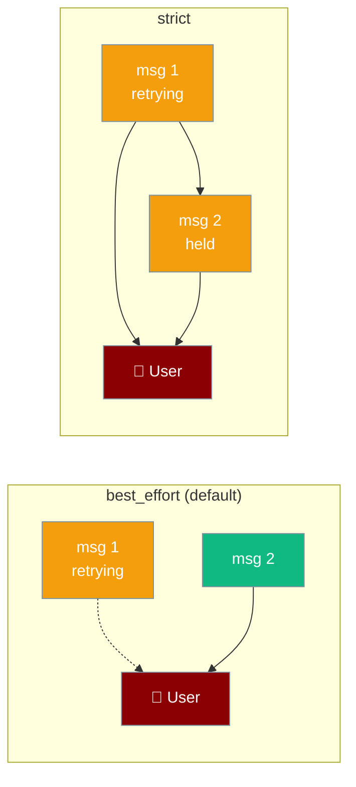
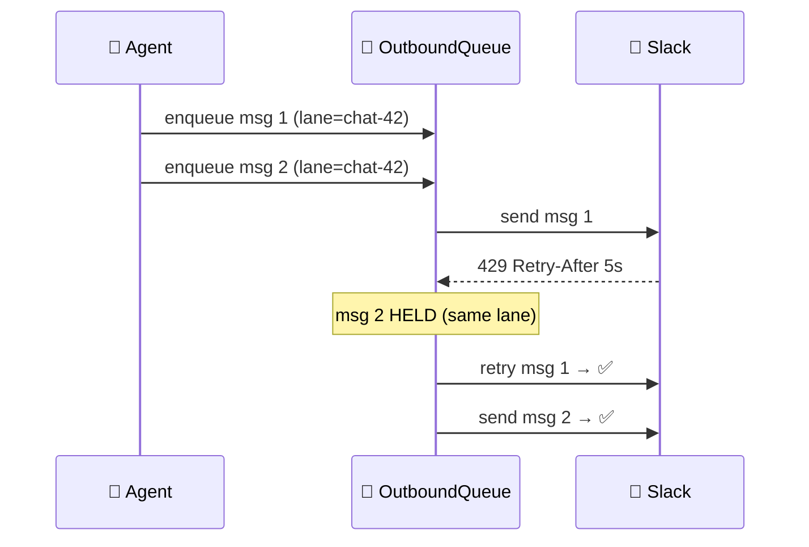
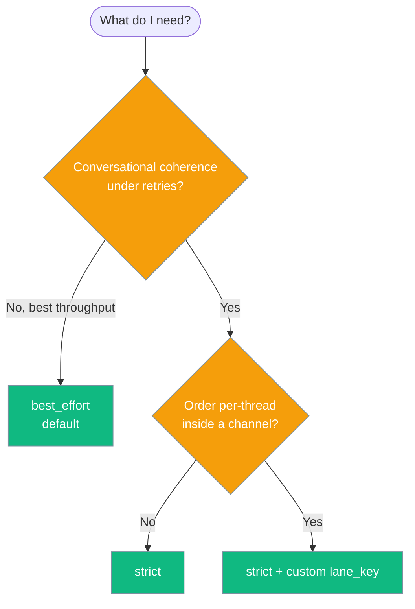

Per-conversation FIFO ordering keeps a bot's messages arriving in the same order the agent produced them — so users never see "part 2" before "part 1".



Under retries, `Retry-After` back-off, rate limiting, or multi-worker drains, `best_effort` can deliver a later message to a chat before an earlier one that is still backing off. `strict` holds later same-lane messages until the head reaches `sent` or `permanent_failure`.

## Quick Start

<Steps>
<Step title="Enable via the production preset">
The `production` reliability preset turns on strict per-conversation FIFO automatically:

```python
from praisonaiagents import Agent
from praisonai.bots import BotOS

agent = Agent(name="assistant", instructions="Help the user.")
bot = BotOS(agent=agent, platforms=["slack"], reliability="production")
bot.start()
```
</Step>

<Step title="Or opt in explicitly">
An explicit `outbound_ordering` always wins over the preset:

```python
from praisonaiagents import Agent
from praisonai.bots import BotOS

agent = Agent(name="assistant", instructions="Help the user.")
bot = BotOS(
    agent=agent,
    platforms=["slack"],
    reliability="production",
    outbound_ordering="strict",
)
bot.start()
```
</Step>

<Step title="Group by a custom lane">
By default, all messages to the same channel/DM share a lane. Group by thread id, user id, or anything you want:

```python
await outbox.enqueue(
    idempotency_key="msg-abc",
    target="slack:C0123456",
    payload={"text": "Hello!"},
    lane_key=f"slack:C0123456:thread:{thread_ts}",
)
```
</Step>
</Steps>

---

## How It Works



In `strict` mode, only the earliest non-terminal entry of each lane is eligible to send. Later same-lane entries wait until the head reaches `sent` or `permanent_failure`. Different lanes still drain in parallel, so throughput is unaffected. In `best_effort` mode, pending entries drain in global wall-clock order with no per-lane gate.

| Mode | Behaviour |
|---|---|
| `best_effort` | Global `ts` order, no per-lane gate. A later message can overtake an earlier one that is retrying. |
| `strict` | Per-lane FIFO gate. Later same-lane messages held until the head is terminal. Lanes drain concurrently. |

---

## Choosing a Mode



| I want… | Setting |
|---|---|
| Backward-compatible behaviour (best throughput, may reorder under retries) | `outbound_ordering="best_effort"` *(default)* |
| Conversational coherence under retries / rate limits / multi-worker drain | `outbound_ordering="strict"` *(production preset)* |
| Per-thread ordering inside a shared channel | `strict` + custom `lane_key` |

---

## Configuration Options

Set on the outbox directly, via `resolve_reliability`, or via the `reliability=` preset.

| Option | Type | Default | Description |
|---|---|---|---|
| `ordering` (on `OutboundQueue`) | `"strict" \| "best_effort"` | `"best_effort"` | Per-lane FIFO gate. `strict` holds later same-lane messages until the head reaches `sent` or `permanent_failure`. |
| `lane_key` (on `enqueue`) | `str \| None` | `None` (= `target`) | Custom conversation grouping. Defaults to `target` so messages to the same chat share a lane. |
| `outbound_ordering` (on `resolve_reliability`) | `"strict" \| "best_effort" \| None` | `None` (preset decides) | Preset override. Explicit value always wins; unknown values raise `ValueError`. |

**Precedence (highest → lowest):**

1. Explicit `outbound_ordering=` — e.g. `"strict"`
2. `reliability=` preset — `production` → `strict`, otherwise `best_effort`
3. SDK default — `best_effort`

<Note>
On first open, older `outbox.sqlite` files are auto-migrated to add a `lane_key` column, backfilled to `target`. No user action required — existing outbox files continue to work.
</Note>

---

## Best Practices

<AccordionGroup>

<Accordion title="Use strict when message order is user-visible">
Multi-part replies, streamed follow-ups, and "greeting then answer" flows all break if a later message overtakes an earlier one under retry. Turn on `strict` (or the `production` preset) for these.
</Accordion>

<Accordion title="Keep best_effort for independent, order-agnostic sends">
Notifications, alerts, and one-off messages that do not depend on each other get the best throughput with `best_effort`. Strict adds a per-lane gate you do not need here.
</Accordion>

<Accordion title="Use a custom lane_key for per-thread ordering">
Inside a shared channel, group by thread id so unrelated threads still drain in parallel while each thread stays ordered:

```python
await outbox.enqueue(
    idempotency_key=f"reply-{msg_id}",
    target="slack:C0123456",
    payload={"text": reply},
    lane_key=f"slack:C0123456:thread:{thread_ts}",
)
```
</Accordion>

<Accordion title="Let explicit outbound_ordering override the preset">
The `production` preset defaults to `strict`. Pass `outbound_ordering="best_effort"` explicitly if you deliberately want throughput over ordering on a production deployment — the explicit value wins.
</Accordion>

</AccordionGroup>

---

## Related

<CardGroup cols={2}>
<Card title="Durable Outbound Delivery" icon="shield-check" href="/docs/features/durable-delivery">
  The outbox this feature lives on
</Card>
<Card title="Gateway Reliability Preset" icon="shield-check" href="/docs/features/gateway-reliability-preset">
  How `reliability="production"` composes drain + admission + ordering
</Card>
</CardGroup>
