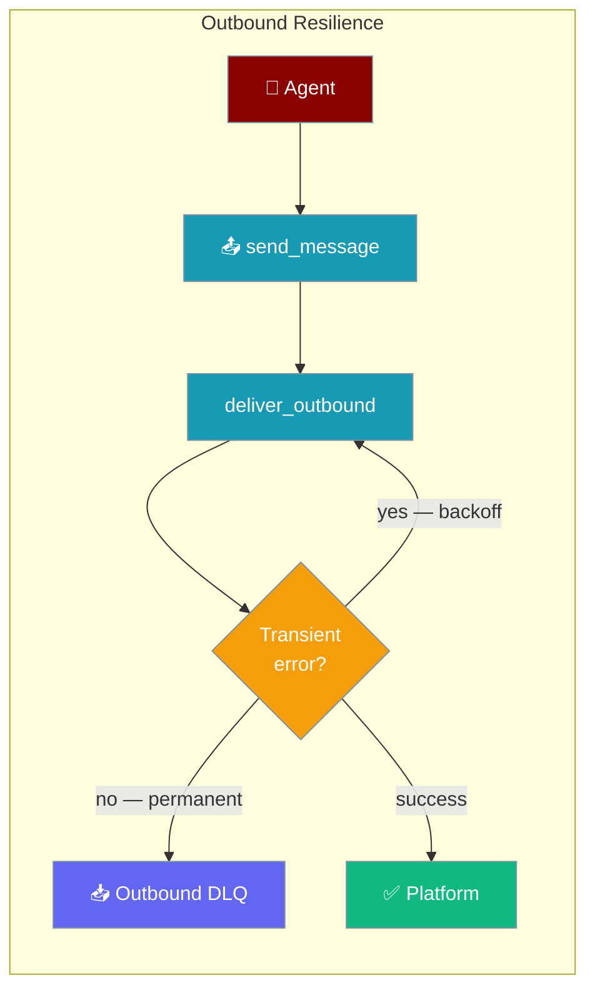
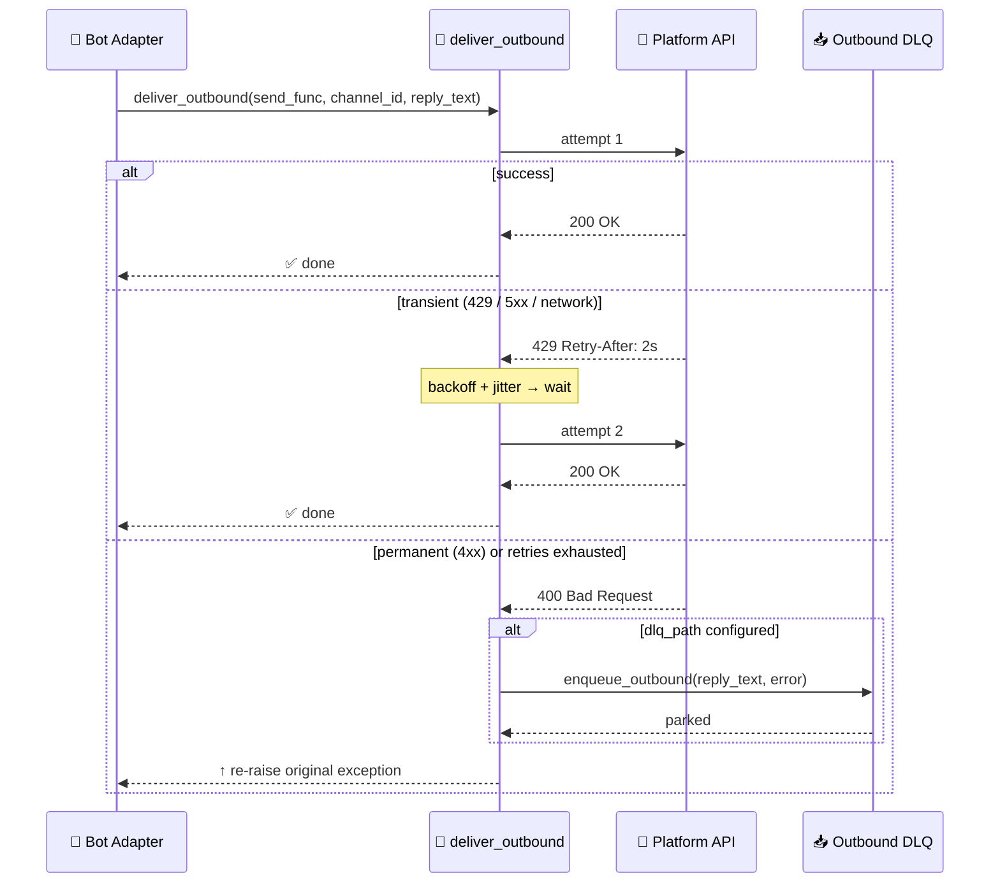
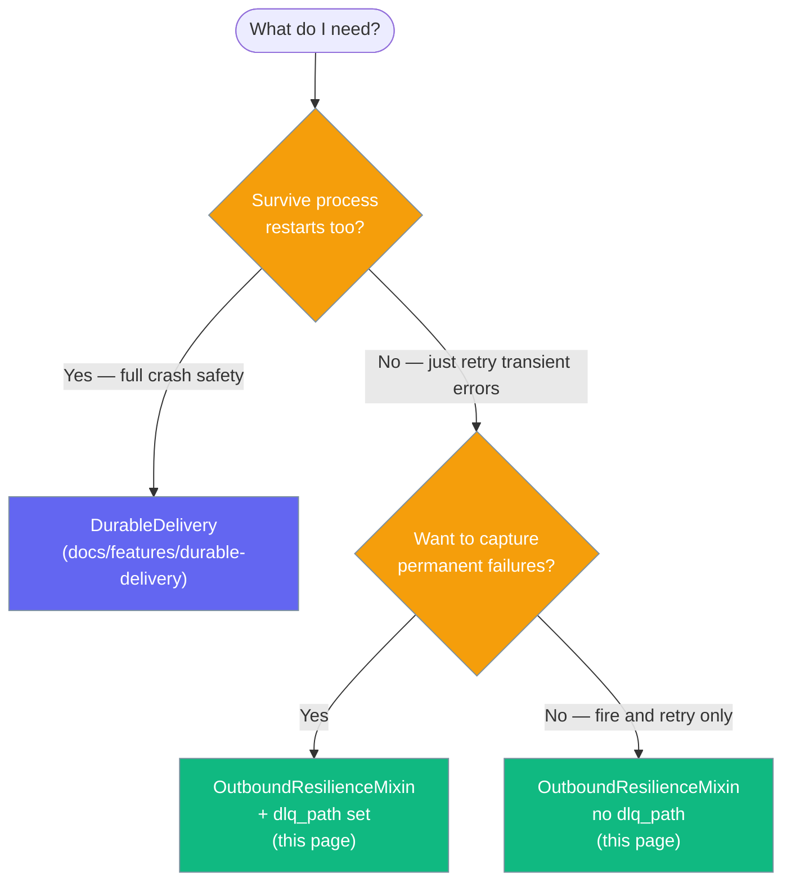

Every bot channel automatically retries transient send failures with bounded exponential backoff, and can park permanent failures in a dead-letter queue for later replay.



## Quick Start

<Steps>
<Step title="Default (nothing to do)">
Retries are already on. Just wire an agent to any supported channel and start:

```python
from praisonaiagents import Agent
from praisonai.bots import SlackBot

agent = Agent(name="support", instructions="Reply helpfully on Slack.")

bot = SlackBot(
    token="...",
    agent=agent,
)
```

```bash
praisonai bot start --config bot.yaml
```

Every reply is automatically retried up to 3 times with exponential backoff if Slack returns a `429` or `5xx`.
</Step>

<Step title="Tune the retry policy">
Add an `outbound_resilience:` block to the channel in `bot.yaml`:

```yaml
# bot.yaml
agent:
  name: support
  instructions: Reply helpfully on Slack.

channels:
  slack:
    token: "${SLACK_BOT_TOKEN}"
    app_token: "${SLACK_APP_TOKEN}"
    outbound_resilience:
      max_attempts: 5
      initial_ms: 500
      max_ms: 15000
      factor: 2.0
      jitter: 0.3
```

Start with `praisonai bot start --config bot.yaml`.
</Step>

<Step title="Park permanent failures in an outbound DLQ">
Add `dlq_path` so replies that can't be delivered are saved for later replay:

```yaml
# bot.yaml
agent:
  name: support
  instructions: Reply helpfully on Slack.

channels:
  slack:
    token: "${SLACK_BOT_TOKEN}"
    app_token: "${SLACK_APP_TOKEN}"
    outbound_resilience:
      max_attempts: 5
      dlq_path: ~/.praisonai/state/slack/outbound_dlq.sqlite
```

Without `dlq_path`, permanent failures are still re-raised (and logged), but not persisted.
</Step>
</Steps>

---

## How It Works



The mixin delegates to `deliver_with_retry`, which:
1. Calls `send_func()` — the raw platform send
2. On a **transient** error (HTTP 429/5xx, network timeout, rate-limit) — waits using exponential backoff and retries
3. On a **permanent** error (HTTP 4xx other than 429) or after exhausting `max_attempts` — parks the message in `OutboundDLQ` if `dlq_path` is set, then re-raises

---

## Supported Channels

All shipped bot adapters have outbound resilience built in:

| Channel | Supported | Notes |
|---------|-----------|-------|
| Telegram | ✅ | Original implementation |
| Slack | ✅ | Via `OutboundResilienceMixin` |
| Discord | ✅ | Via `OutboundResilienceMixin` |
| WhatsApp | ✅ | Via `OutboundResilienceMixin` |
| Email | ✅ | Via `OutboundResilienceMixin` |
| Linear | ✅ | Via `OutboundResilienceMixin` |
| AgentMail | ✅ | Via `OutboundResilienceMixin` |

---

## Configuration Options

All fields live under `outbound_resilience:` inside a channel block in `bot.yaml` or `gateway.yaml`. When the block is omitted entirely, the defaults below apply — retries are still active.

| Field | Type | Default | Notes |
|-------|------|---------|-------|
| `enabled` | `bool` | `true` | Set `false` to opt out — single attempt, no backoff, no DLQ. |
| `initial_ms` | `float` | `1000.0` | First retry delay in ms. Minimum: `100`. |
| `max_ms` | `float` | `10000.0` | Cap for backoff delay in ms. |
| `factor` | `float` | `1.5` | Exponential backoff multiplier per attempt. |
| `max_attempts` | `int` | `3` | Total attempts (including the first). Range: `1`–`10`. |
| `jitter` | `float` | `0.25` | Random jitter fraction added to each delay. Range: `0.0`–`1.0`. |
| `dlq_path` | `str \| null` | `null` | If set, permanent/exhausted failures are parked in an `OutboundDLQ` SQLite file at this path. If unset, the original exception is just re-raised. |

**Example with all fields:**

```yaml
channels:
  slack:
    token: "${SLACK_BOT_TOKEN}"
    outbound_resilience:
      enabled: true
      initial_ms: 1000
      max_ms: 10000
      factor: 1.5
      max_attempts: 3
      jitter: 0.25
      dlq_path: ~/.praisonai/state/slack/outbound_dlq.sqlite
```

---

## Choosing the Right Primitive



| I need… | Use |
|---------|-----|
| Retry transient HTTP errors (default, no config) | `OutboundResilienceMixin` — already on |
| Capture permanent/exhausted failures for inspection | `OutboundResilienceMixin` + `dlq_path` |
| Survive a process crash — message must not be lost on restart | `DurableDelivery` / `DurableAdapterMixin` |

The two are **complementary, not alternatives**: you can enable `dlq_path` for in-flight retry resilience and separately configure `DurableDelivery` for crash-safe persistence.

---

## Best Practices

<AccordionGroup>
<Accordion title="Set dlq_path in production">
Without `dlq_path`, permanent failures are logged and re-raised but not saved anywhere. In production, always set a path so you can inspect and replay failed replies:

```yaml
outbound_resilience:
  dlq_path: ~/.praisonai/state/slack/outbound_dlq.sqlite
```
</Accordion>

<Accordion title="Keep max_attempts ≤ 5 for user-facing bots">
Long retry chains delay the next reply on the same channel. The default of `3` is a good balance. Use `5` only when replies are genuinely critical:

```yaml
outbound_resilience:
  max_attempts: 5   # ≤5 recommended for interactive bots
```
</Accordion>

<Accordion title="Use a per-platform dlq_path">
Mirror the per-platform isolation pattern used by the inbound journal — one DLQ file per channel so replays never cross platforms:

```yaml
channels:
  slack:
    outbound_resilience:
      dlq_path: ~/.praisonai/state/slack/outbound_dlq.sqlite
  discord:
    outbound_resilience:
      dlq_path: ~/.praisonai/state/discord/outbound_dlq.sqlite
```
</Accordion>

<Accordion title="Don't disable unless you want fire-and-forget">
Setting `enabled: false` reverts to a single attempt with no backoff and no DLQ — any transient error silently drops the reply. Only disable if you have a specific reason (e.g., a custom retry wrapper elsewhere):

```yaml
outbound_resilience:
  enabled: false   # single attempt, no retry, no DLQ
```
</Accordion>
</AccordionGroup>

---

## Related

<CardGroup cols={2}>
<Card title="Delivery Config" icon="shield-check" href="/docs/features/delivery-config">
  Configure durable inbound delivery — the sibling delivery: block
</Card>
<Card title="Durable Outbound Delivery" icon="database" href="/docs/features/durable-delivery">
  Full crash-safe SQLite outbox with idempotency keys and drain-on-startup
</Card>
<Card title="Inbound DLQ" icon="inbox" href="/docs/features/inbound-dlq">
  Dead-letter queue for failed inbound message processing
</Card>
<Card title="Messaging Bots" icon="message-circle" href="/docs/features/messaging-bots">
  Top-level guide to building bots with PraisonAI
</Card>
</CardGroup>
