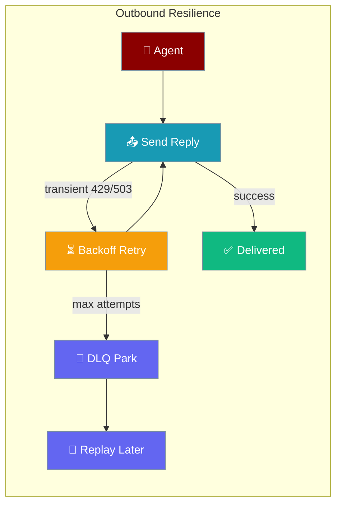
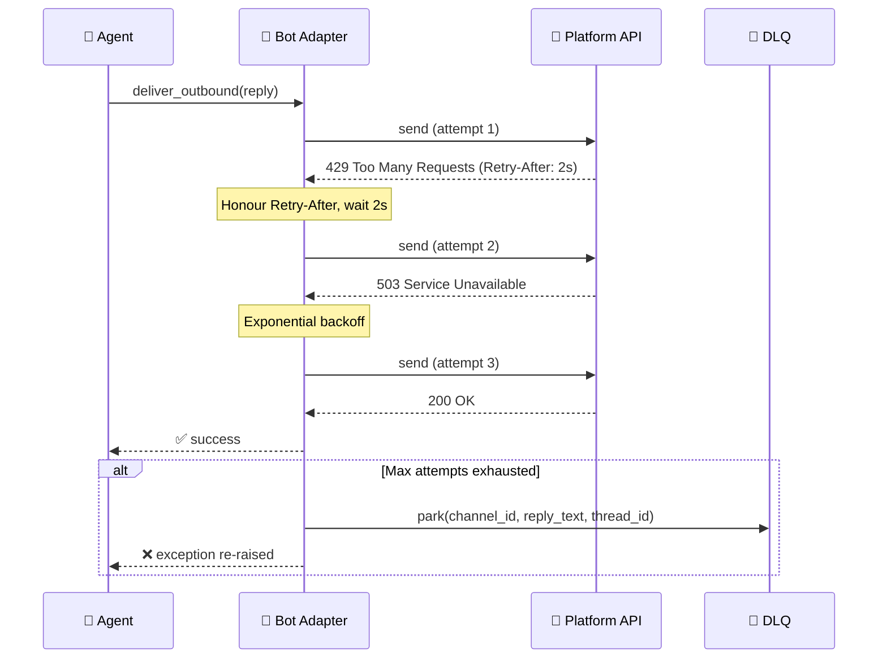

Outbound Resilience makes sure your agent's reply actually reaches the user on every channel, retrying transient send errors and parking permanently-failed replies in a DLQ for later replay.

```python
from praisonaiagents import Agent
from praisonai.bots import SlackBot

agent = Agent(
    name="Support Bot",
    instructions="Answer customer questions politely.",
)
bot = SlackBot(token="xoxb-...", agent=agent)
bot.start()
```

The user sends a message on Slack; transient send failures retry with backoff until the reply is delivered or parked in the DLQ.



## Quick Start

<Steps>
<Step title="Works out of the box">
Resilience is on by default — no config needed. Every bot adapter already retries transient failures automatically.

```python
from praisonaiagents import Agent
from praisonai.bots import SlackBot

agent = Agent(
    name="Support Bot",
    instructions="Answer customer questions politely.",
)
bot = SlackBot(token="xoxb-...", agent=agent)
bot.start()
# Transient Slack 5xx / rate-limit responses are now retried automatically.
```
</Step>

<Step title="Tune retries and park failures in a DLQ">
Set `outbound_resilience` in `praisonai.yml` to customise backoff and persist exhausted failures for replay.

```yaml
bots:
  slack:
    outbound_resilience:
      enabled: true
      initial_ms: 1000
      max_ms: 10000
      factor: 1.5
      max_attempts: 5
      jitter: 0.25
      dlq_path: ~/.praisonai/state/slack-outbound-dlq.sqlite
```
</Step>
</Steps>

---

## How It Works



When a send fails, the adapter classifies the error:

| State | What happened | What happens next |
|---|---|---|
| **Success** | Platform returned 2xx | Done — no further action |
| **Transient retry** | 429 / 503 / network error | Wait (honouring `Retry-After`) and retry |
| **Exhausted → DLQ** | Max attempts reached on transient error | Parked in DLQ if `dlq_path` is set; exception re-raised |
| **Permanent error → DLQ** | 4xx (not 429) | Parked in DLQ immediately; exception re-raised |

---

## Which Channels Does This Apply To?

Resilience is on by default for every adapter. The operator only opts into **DLQ** by setting `dlq_path`.

| Channel | Default | DLQ on exhaust |
|---|---|---|
| Telegram | ✅ on | ✅ |
| Slack | ✅ on | ✅ |
| Discord | ✅ on | ✅ |
| WhatsApp | ✅ on | ✅ |
| Email | ✅ on | ✅ |
| Linear | ✅ on | ✅ |
| AgentMail | ✅ on | ✅ |

<Note>
Before this feature shipped, retry/backoff only existed in the Telegram adapter. It is now the default for every adapter via the shared `OutboundResilienceMixin`, with no API change required.
</Note>

---

## Configuration Options

All settings live under `outbound_resilience` in your channel config (in `praisonai.yml` or via `BotConfig`).

| Option | Type | Default | Description |
|---|---|---|---|
| `enabled` | `bool` | `True` | Set to `False` to opt this channel out — only one attempt, no DLQ park. |
| `initial_ms` | `int` | `1000` | First backoff delay in milliseconds. |
| `max_ms` | `int` | `10000` | Maximum backoff delay (caps exponential growth). |
| `factor` | `float` | `1.5` | Multiplicative growth factor per retry. |
| `max_attempts` | `int` | `3` | Total attempts before parking (1 = no retry). |
| `jitter` | `float` | `0.25` | Random jitter fraction (0.0–1.0) applied to each delay. |
| `dlq_path` | `str \| None` | `None` | Path to the SQLite DLQ file. When set, exhausted/permanent failures are parked here for replay. |

Full YAML example:

```yaml
bots:
  slack:
    outbound_resilience:
      enabled: true
      initial_ms: 1000
      max_ms: 10000
      factor: 1.5
      max_attempts: 5
      jitter: 0.25
      dlq_path: ~/.praisonai/state/slack-outbound-dlq.sqlite
  discord:
    outbound_resilience:
      enabled: true
      max_attempts: 3
      dlq_path: ~/.praisonai/state/discord-outbound-dlq.sqlite
```

---

## Common Patterns

**Opt one channel out:**

```yaml
bots:
  email:
    outbound_resilience:
      enabled: false
```

**Aggressive retry for a flaky upstream:**

```yaml
bots:
  whatsapp:
    outbound_resilience:
      max_attempts: 5
      max_ms: 30000
      factor: 2.0
      dlq_path: ~/.praisonai/state/whatsapp-outbound-dlq.sqlite
```

**DLQ replay** — failed messages parked in the SQLite DLQ can be replayed using the same tooling as the inbound DLQ. See [Inbound DLQ](/docs/features/inbound-dlq) for the analogous replay command pattern.

---

## Best Practices

<AccordionGroup>
<Accordion title="Default values are sane — only tune when you see real DLQ growth">
  The defaults (`initial_ms=1000`, `max_ms=10000`, `max_attempts=3`) handle the vast majority of transient failures. Only adjust them after observing DLQ entries accumulating in your SQLite file — that signals the defaults are too aggressive or too conservative for your traffic.
</Accordion>

<Accordion title="Use a persistent dlq_path (not /tmp or a container tmpfs)">
  Store the DLQ on a persistent, local filesystem path. If you use `/tmp` or an in-container tmpfs, parked failures are lost on restart — defeating the purpose of the DLQ.

  ```yaml
  # ✅ Good: persistent path
  dlq_path: ~/.praisonai/state/slack-outbound-dlq.sqlite

  # ❌ Bad: lost on restart
  dlq_path: /tmp/slack-dlq.sqlite
  ```
</Accordion>

<Accordion title="Don't disable resilience just because retries are slow — increase factor or max_ms instead">
  Slow retries usually mean the platform backoff is long (e.g., `Retry-After: 60`). The mixin already honours `Retry-After` headers automatically. Increase `max_ms` to allow longer waits rather than disabling resilience entirely.
</Accordion>

<Accordion title="Pair with Durable Delivery when you need crash-safety across process restarts">
  Outbound Resilience retries within a single process lifetime. If your process crashes mid-retry, the message is lost (unless `dlq_path` is set and the entry was already parked). For full crash-safe delivery with SQLite outbox and startup drain, use [Durable Delivery](/docs/features/durable-delivery) alongside Outbound Resilience.
</Accordion>
</AccordionGroup>

---

## Related

<CardGroup cols={2}>
<Card title="Durable Outbound Delivery" icon="shield-check" href="/docs/features/durable-delivery">
  SQLite outbox for crash-safe delivery with send_durable() and startup drain
</Card>
<Card title="Inbound DLQ" icon="inbox" href="/docs/features/inbound-dlq">
  Dead-letter queue for failed inbound message processing
</Card>
<Card title="Bot Rate Limiting" icon="gauge" href="/docs/features/bot-rate-limiting">
  Per-user and per-channel rate limiting for bot commands
</Card>
<Card title="Gateway Channel Config" icon="tower-broadcast" href="/docs/features/gateway">
  Full reference for all per-channel configuration options
</Card>
</CardGroup>
