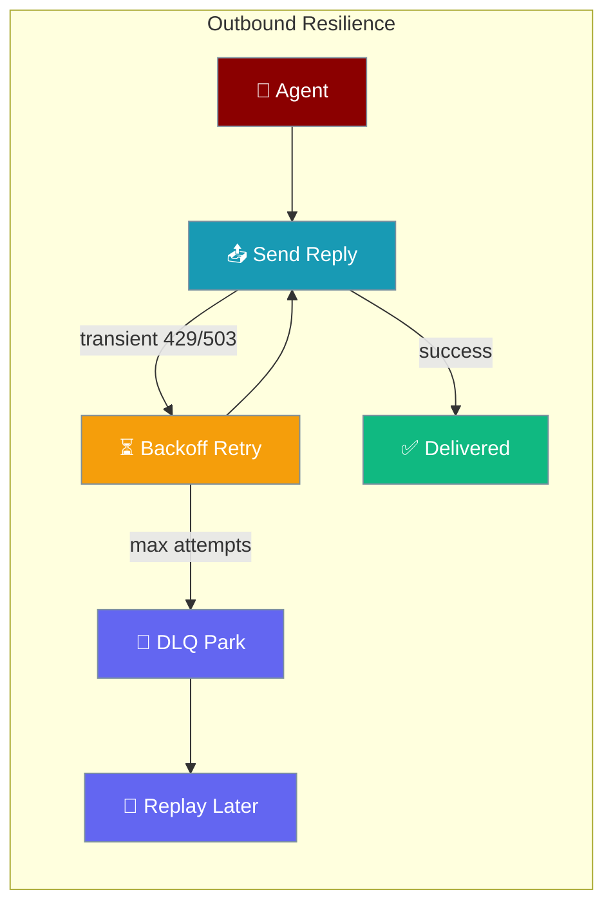
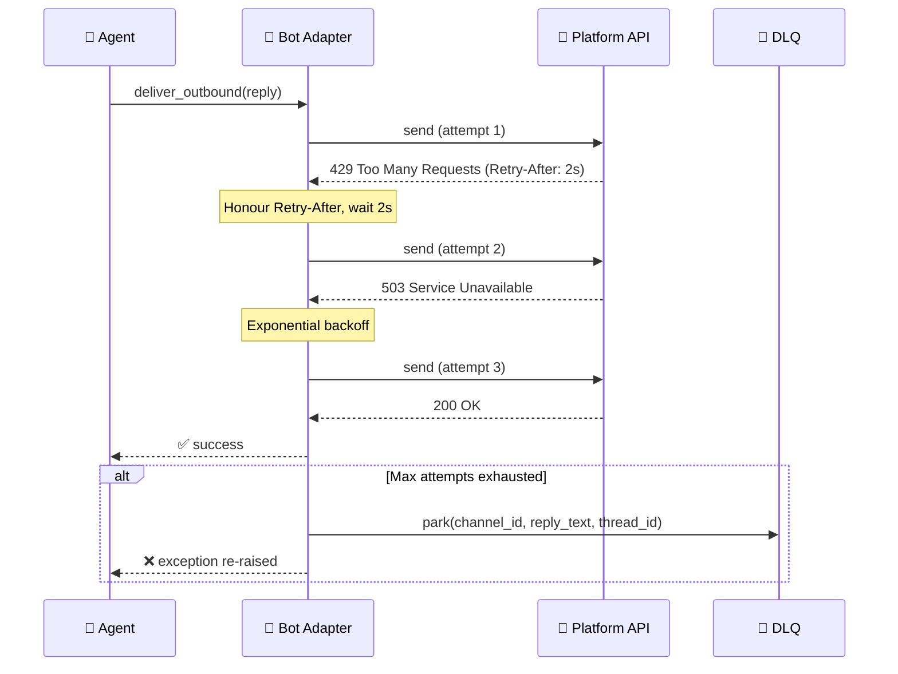

Outbound Resilience makes sure your agent's reply actually reaches the user on every channel, retrying transient send errors and parking permanently-failed replies in a DLQ for later replay.

<Note>
**Safe by default (as of PraisonAI #3447 / PR #3446).** The outbound reply is a durable delivery obligation by default — symmetric with the inbound journal. A permanent or exhausted send failure is **automatically parked** at `~/.praisonai/state/<platform>/outbound_dlq.sqlite` so it can be replayed, without any configuration. To disable durable parking entirely, set `outbound_resilience.enabled = false`.
</Note>

```python
from praisonaiagents import Agent
from praisonai.bots import SlackBot

agent = Agent(
    name="Support Bot",
    instructions="Answer customer questions politely.",
)
bot = SlackBot(token="xoxb-...", agent=agent)
bot.start()
```

The user sends a message on Slack; transient send failures retry with backoff until the reply is delivered or parked in the DLQ.


```mermaid
graph LR
    subgraph "Outbound Resilience"
        Agent[🤖 Agent] --> Send[📤 Send Reply]
        Send -->|transient 429/503| Backoff[⏳ Backoff Retry]
        Backoff --> Send
        Send -->|success| Success[✅ Delivered]
        Backoff -->|max attempts| DLQ[💾 DLQ Park]
        DLQ --> Replay[🔁 Replay Later]
    end

    classDef agent fill:#8B0000,stroke:#7C90A0,color:#fff
    classDef process fill:#189AB4,stroke:#7C90A0,color:#fff
    classDef retry fill:#F59E0B,stroke:#7C90A0,color:#fff
    classDef success fill:#10B981,stroke:#7C90A0,color:#fff
    classDef storage fill:#6366F1,stroke:#7C90A0,color:#fff

    class Agent agent
    class Send process
    class Backoff retry
    class Success success
    class DLQ,Replay storage
```

## Quick Start

<Steps>
<Step title="Works out of the box">
Resilience is on by default — no config needed. Every bot adapter already retries transient failures automatically.

```python
from praisonaiagents import Agent
from praisonai.bots import SlackBot

agent = Agent(
    name="Support Bot",
    instructions="Answer customer questions politely.",
)
bot = SlackBot(token="xoxb-...", agent=agent)
bot.start()
# Transient Slack 5xx / rate-limit responses are now retried automatically.
```
</Step>

<Step title="Tune retries and park failures in a DLQ">
Set `outbound_resilience` in `praisonai.yml` to customise backoff and persist exhausted failures for replay.

```yaml
bots:
  slack:
    outbound_resilience:
      enabled: true
      initial_ms: 1000
      max_ms: 10000
      factor: 1.5
      max_attempts: 5
      jitter: 0.25
      dlq_path: ~/.praisonai/state/slack-outbound-dlq.sqlite
```
</Step>
</Steps>

---

## How It Works


```mermaid
sequenceDiagram
    participant Agent as 🤖 Agent
    participant Adapter as 📡 Bot Adapter
    participant Platform as 📱 Platform API
    participant DLQ as 💾 DLQ

    Agent->>Adapter: deliver_outbound(reply)
    Adapter->>Platform: send (attempt 1)
    Platform-->>Adapter: 429 Too Many Requests (Retry-After: 2s)
    Note over Adapter: Honour Retry-After, wait 2s
    Adapter->>Platform: send (attempt 2)
    Platform-->>Adapter: 503 Service Unavailable
    Note over Adapter: Exponential backoff
    Adapter->>Platform: send (attempt 3)
    Platform-->>Adapter: 200 OK
    Adapter-->>Agent: ✅ success

    alt Max attempts exhausted
        Adapter->>DLQ: park(channel_id, reply_text, thread_id)
        Adapter-->>Agent: ❌ exception re-raised
    end
```

When a send fails, the adapter classifies the error:

| State | What happened | What happens next |
|---|---|---|
| **Success** | Platform returned 2xx | Done — no further action |
| **Transient retry** | 429 / 503 / network error | Wait (honouring `Retry-After`) and retry |
| **Exhausted → DLQ** | Max attempts reached on transient error | Parked in the DLQ (default path unless overridden); exception re-raised |
| **Permanent error → DLQ** | 4xx (not 429) | Parked in the DLQ immediately; exception re-raised |

### Transient storage recovery

If the DLQ file can't be created on the first send (disk full, temporary permission error, container FS not yet mounted), the mixin logs the failure once and degrades **that send** to retry-only, but **does not** latch the resilience state as ready. The next `deliver_outbound()` re-attempts DLQ init, so the moment storage recovers the durable park is restored automatically — the operator does not have to restart the bot.

```
[slack] Failed to initialize outbound DLQ (will retry on next send): ...
```

This means: a permanently-failed reply *during* the outage is lost (best-effort documented behaviour); every reply after storage recovers is parked as normal.

---

## Which Channels Does This Apply To?

Resilience is on by default for every adapter. Every channel now parks permanent / exhausted failures in a per-platform DLQ **by default** — no `dlq_path` required.

| Channel | Default | DLQ on exhaust |
|---|---|---|
| Telegram | ✅ on | ✅ default |
| Slack | ✅ on | ✅ default |
| Discord | ✅ on | ✅ default |
| WhatsApp | ✅ on | ✅ default |
| Email | ✅ on | ✅ default |
| Linear | ✅ on | ✅ default |
| AgentMail | ✅ on | ✅ default |

<Note>
Both the retry/backoff **and** the DLQ park are the "safe by default" posture — no operator-visible opt-in required. Before this feature shipped, retry/backoff only existed in the Telegram adapter; it is now the default for every adapter via the shared `OutboundResilienceMixin`, with no API change required.
</Note>

Both **text and media** now inherit the same policy:

| Send path | Retry/backoff | Honours `Retry-After` |
|---|---|---|
| Text reply (`send_message`) | ✅ via `OutboundResilienceMixin` | ✅ |
| Media upload (`DeliveryRouter.send_media`) | ✅ via `deliver_with_retry` | ✅ |

---

## Media uploads share this policy

The same retry wrapper covers outbound **media** uploads
(`DeliveryRouter.send_media` → Telegram `send_photo`, Slack
`files_upload_v2`, Discord file send). A transient transport failure on
an image or file attachment is retried with the same bounded backoff and
`Retry-After` honouring as the text path.

- The adapter's configured `_outbound_backoff` `BackoffPolicy` is reused;
  if the adapter has no policy, a default of `initial_ms=1000`,
  `max_ms=10000`, `factor=1.5`, `max_attempts=3` applies.
- Adapters with no upload primitive still return `False` immediately —
  no wasted retries.
- Permanent errors surface as before after the attempt budget is spent.

See [Outbound Media Delivery → Retry & backoff on transient failures](/docs/features/outbound-media-delivery#retry--backoff-on-transient-failures)
for the media-specific sequence diagram and behaviour matrix.

---

## Configuration Options

All settings live under `outbound_resilience` in your channel config (in `praisonai.yml` or via `BotConfig`).

| Option | Type | Default | Description |
|---|---|---|---|
| `enabled` | `bool` | `True` | Set to `False` to opt this channel out — only one attempt, no DLQ park. |
| `initial_ms` | `int` | `1000` | First backoff delay in milliseconds. |
| `max_ms` | `int` | `10000` | Maximum backoff delay (caps exponential growth). |
| `factor` | `float` | `1.5` | Multiplicative growth factor per retry. |
| `max_attempts` | `int` | `3` | Total attempts before parking (1 = no retry). |
| `jitter` | `float` | `0.25` | Random jitter fraction (0.0–1.0) applied to each delay. |
| `dlq_path` | `str \| None` | _(canonical per-platform path — see below)_ | Override the DLQ file location. When omitted, the DLQ defaults to `~/.praisonai/state/<platform>/outbound_dlq.sqlite` so permanent failures are always parked. Set this only if you need the DLQ on a different filesystem. |

The canonical default path is resolved via `resolve_durable_store_dir(<platform>)` and mirrors the inbound journal. Set the `PRAISONAI_HOME` environment variable to relocate the whole `~/.praisonai/` root (useful in tests or containers).

<Note>
Before PraisonAI #3447 you had to set `dlq_path` to opt into a DLQ park. On #3447+ that step is unnecessary — the default path is already applied. Existing configs that set `dlq_path` continue to work unchanged (an explicit path always wins over the default).
</Note>

Full YAML example:

```yaml
bots:
  slack:
    outbound_resilience:
      enabled: true
      initial_ms: 1000
      max_ms: 10000
      factor: 1.5
      max_attempts: 5
      jitter: 0.25
      dlq_path: ~/.praisonai/state/slack-outbound-dlq.sqlite
  discord:
    outbound_resilience:
      enabled: true
      max_attempts: 3
      dlq_path: ~/.praisonai/state/discord-outbound-dlq.sqlite
```

---

## Common Patterns

**Opt one channel out:**

```yaml
bots:
  email:
    outbound_resilience:
      enabled: false
```

**Aggressive retry for a flaky upstream:**

```yaml
bots:
  whatsapp:
    outbound_resilience:
      max_attempts: 5
      max_ms: 30000
      factor: 2.0
      dlq_path: ~/.praisonai/state/whatsapp-outbound-dlq.sqlite
```

**DLQ replay** — failed messages parked in the SQLite DLQ can be replayed using the same tooling as the inbound DLQ. See [Inbound DLQ](/docs/features/inbound-dlq) for the analogous replay command pattern.

---

## Best Practices

<AccordionGroup>
<Accordion title="Default values are sane — only tune when you see real DLQ growth">
  The defaults (`initial_ms=1000`, `max_ms=10000`, `max_attempts=3`) handle the vast majority of transient failures. Only adjust them after observing DLQ entries accumulating in your SQLite file — that signals the defaults are too aggressive or too conservative for your traffic.
</Accordion>

<Accordion title="Use a persistent dlq_path (not /tmp or a container tmpfs)">
  Store the DLQ on a persistent, local filesystem path. If you use `/tmp` or an in-container tmpfs, parked failures are lost on restart — defeating the purpose of the DLQ.

  ```yaml
  # ✅ Good: persistent path
  dlq_path: ~/.praisonai/state/slack-outbound-dlq.sqlite

  # ❌ Bad: lost on restart
  dlq_path: /tmp/slack-dlq.sqlite
  ```
</Accordion>

<Accordion title="Don't disable resilience just because retries are slow — increase factor or max_ms instead">
  Slow retries usually mean the platform backoff is long (e.g., `Retry-After: 60`). The mixin already honours `Retry-After` headers automatically. Increase `max_ms` to allow longer waits rather than disabling resilience entirely.
</Accordion>

<Accordion title="Durable park is the default — no separate mode to opt into">
  Outbound Resilience now parks permanent and exhausted failures automatically. You don't need to set `dlq_path` or opt in to a separate "durable delivery" mode — the mixin uses the same canonical `~/.praisonai/state/<platform>/outbound_dlq.sqlite` store as the inbound journal. Set `outbound_resilience.enabled = false` only if you genuinely want the pre-#3447 retry-without-park behaviour (fire-and-forget channels, ephemeral test bots).
</Accordion>
</AccordionGroup>

---

## Related

<CardGroup cols={2}>
<Card title="Durable Outbound Delivery" icon="shield-check" href="/docs/features/durable-delivery">
  SQLite outbox for crash-safe delivery with send_durable() and startup drain
</Card>
<Card title="Inbound DLQ" icon="inbox" href="/docs/features/inbound-dlq">
  Dead-letter queue for failed inbound message processing
</Card>
<Card title="Bot Rate Limiting" icon="gauge" href="/docs/features/bot-rate-limiting">
  Per-user and per-channel rate limiting for bot commands
</Card>
<Card title="Gateway Channel Config" icon="tower-broadcast" href="/docs/features/gateway">
  Full reference for all per-channel configuration options
</Card>
</CardGroup>
