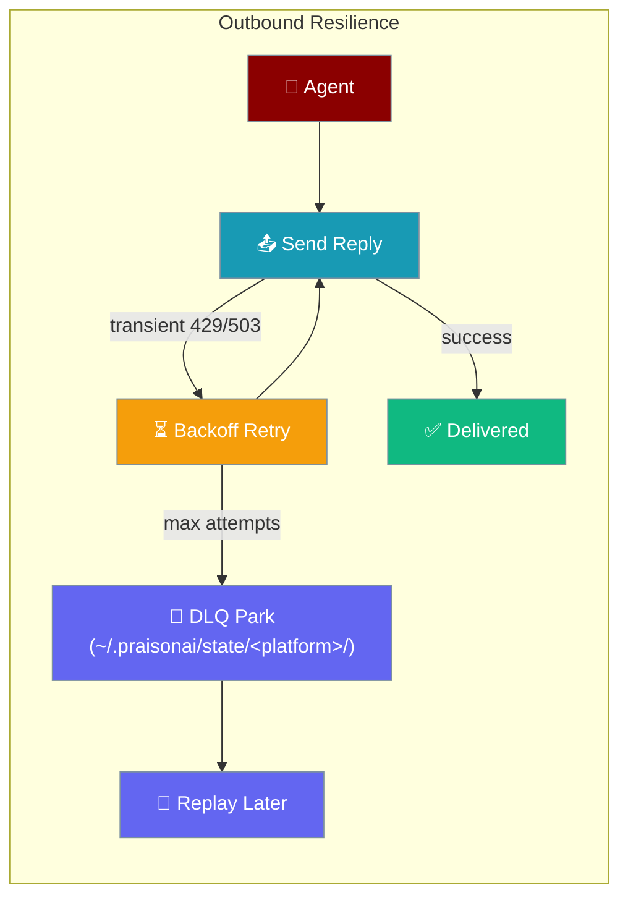
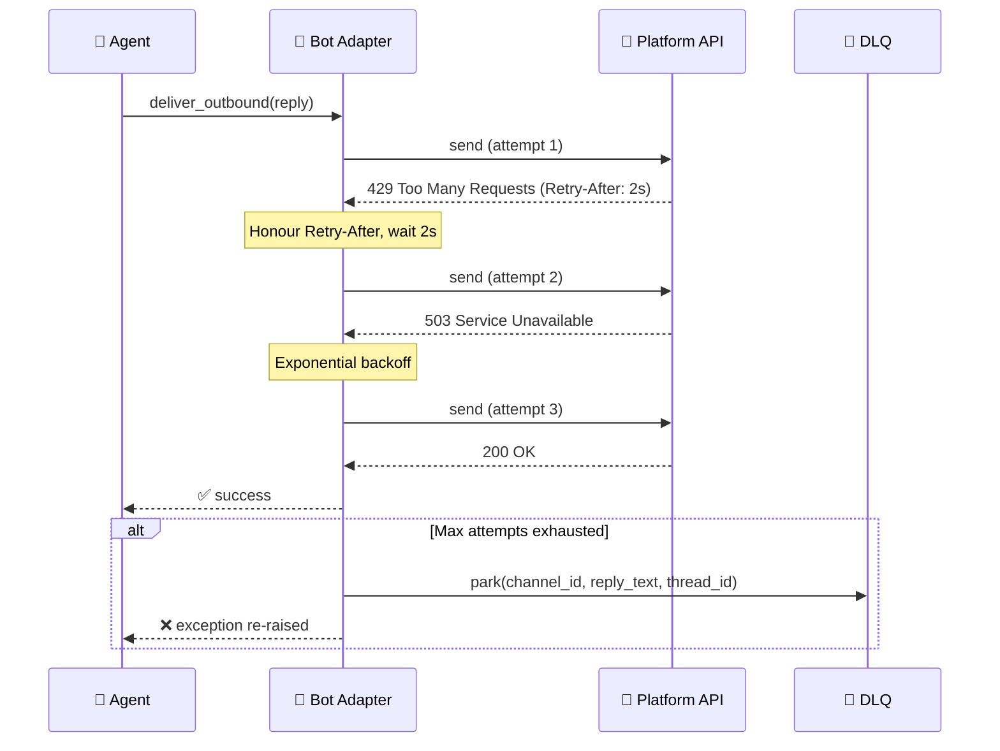
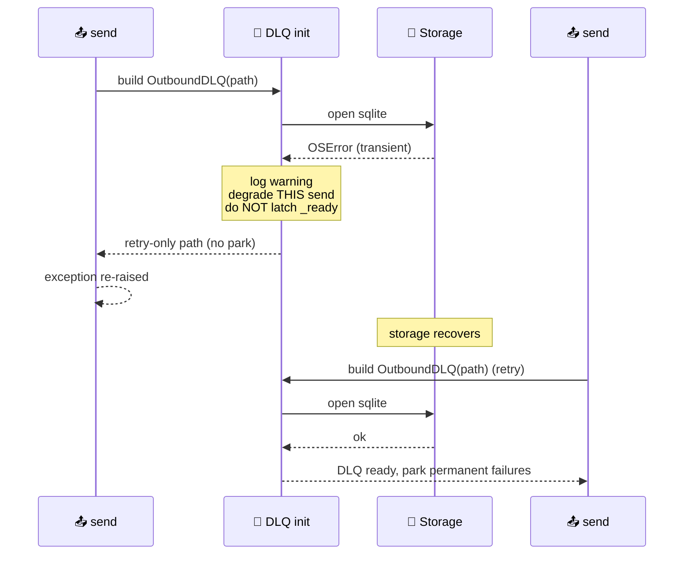

Outbound Resilience makes sure your agent's reply actually reaches the user on every channel — retrying transient send errors with bounded backoff, and **parking permanently-failed replies in a durable per-platform DLQ by default** so they can be replayed instead of silently lost. No configuration is required.

<Note>
**Safe by default (as of PraisonAI #3447 / PR #3446).** The outbound reply is a durable delivery obligation by default — symmetric with the inbound journal. A permanent or exhausted send failure is **automatically parked** at `~/.praisonai/state/<platform>/outbound_dlq.sqlite` so it can be replayed, without any configuration. To disable durable parking entirely, set `outbound_resilience.enabled = false`.
</Note>

```python
from praisonaiagents import Agent
from praisonai.bots import SlackBot

agent = Agent(
    name="Support Bot",
    instructions="Answer customer questions politely.",
)
bot = SlackBot(token="xoxb-...", agent=agent)
bot.start()
```

The user sends a message on Slack; transient send failures retry with backoff until the reply is delivered or parked in the DLQ.


```mermaid
graph LR
    subgraph "Outbound Resilience"
        Agent[🤖 Agent] --> Send[📤 Send Reply]
        Send -->|transient 429/503| Backoff[⏳ Backoff Retry]
        Backoff --> Send
        Send -->|success| Success[✅ Delivered]
        Backoff -->|max attempts| DLQ["💾 DLQ Park\n(~/.praisonai/state/&lt;platform&gt;/)"]
        DLQ --> Replay[🔁 Replay Later]
    end

    classDef agent fill:#8B0000,stroke:#7C90A0,color:#fff
    classDef process fill:#189AB4,stroke:#7C90A0,color:#fff
    classDef retry fill:#F59E0B,stroke:#7C90A0,color:#fff
    classDef success fill:#10B981,stroke:#7C90A0,color:#fff
    classDef storage fill:#6366F1,stroke:#7C90A0,color:#fff

    class Agent agent
    class Send process
    class Backoff retry
    class Success success
    class DLQ,Replay storage
```

## Quick Start

<Steps>
<Step title="Retry and durable parking are both on by default">
Every bot adapter retries transient failures with backoff **and** parks a permanent / exhausted failure at a canonical per-platform DLQ so nothing is silently lost — with no config on your side.

```python
from praisonaiagents import Agent
from praisonai.bots import SlackBot

agent = Agent(
    name="Support Bot",
    instructions="Answer customer questions politely.",
)
bot = SlackBot(token="xoxb-...", agent=agent)
bot.start()
# Transient Slack 5xx / rate-limit responses are retried.
# A permanently-failed reply (bad channel, revoked bot, etc.) is parked at
#   ~/.praisonai/state/slack/outbound_dlq.sqlite
# for later replay — with no config on your side.
```
</Step>

<Step title="Override the defaults only when you need to">
Set `outbound_resilience` in `praisonai.yml` only to override defaults — e.g. more attempts, a longer cap, or a custom DLQ path.

```yaml
bots:
  slack:
    outbound_resilience:
      initial_ms: 1000
      max_ms: 30000
      factor: 2.0
      max_attempts: 5
      jitter: 0.25
      # dlq_path: /var/lib/praisonai/slack-dlq.sqlite  # optional override
```

The default DLQ path is `~/.praisonai/state/<platform>/outbound_dlq.sqlite` — only set `dlq_path` if you need it elsewhere (e.g. a shared volume in Docker).
</Step>

<Step title="Opt out with a single flag">
`enabled: false` disables **both** retry and durable parking on that channel — a permanently-failed reply on that channel is lost, matching the pre-safe-by-default behaviour.

```yaml
bots:
  email:
    outbound_resilience:
      enabled: false
```
</Step>
</Steps>

---

## How It Works


```mermaid
sequenceDiagram
    participant Agent as 🤖 Agent
    participant Adapter as 📡 Bot Adapter
    participant Platform as 📱 Platform API
    participant DLQ as 💾 DLQ

    Agent->>Adapter: deliver_outbound(reply)
    Adapter->>Platform: send (attempt 1)
    Platform-->>Adapter: 429 Too Many Requests (Retry-After: 2s)
    Note over Adapter: Honour Retry-After, wait 2s
    Adapter->>Platform: send (attempt 2)
    Platform-->>Adapter: 503 Service Unavailable
    Note over Adapter: Exponential backoff
    Adapter->>Platform: send (attempt 3)
    Platform-->>Adapter: 200 OK
    Adapter-->>Agent: ✅ success

    alt Max attempts exhausted
        Adapter->>DLQ: park(channel_id, reply_text, thread_id)
        Adapter-->>Agent: ❌ exception re-raised
    end
```

When a send fails, the adapter classifies the error:

| State | What happened | What happens next |
|---|---|---|
| **Success** | Platform returned 2xx | Done — no further action |
| **Transient retry** | 429 / 503 / network error | Wait (honouring `Retry-After`) and retry |
| **Exhausted → DLQ** | Max attempts reached on transient error | Parked in the default DLQ (`~/.praisonai/state/<platform>/outbound_dlq.sqlite`), or the custom `dlq_path`; exception re-raised |
| **Permanent error → DLQ** | 4xx (not 429) | Parked immediately; exception re-raised |
| **Storage transiently unavailable** | DLQ init failed on this send | Degrades to retry-only for **this** send; state does not latch — the next send re-attempts DLQ init and parks the reply once storage recovers |
| **`enabled: false`** | Operator opted out | One attempt, no retry, no parking; original exception re-raised |

---

## Which Channels Does This Apply To?

Both retry/backoff **and** durable DLQ parking are on by default for every adapter — no `dlq_path` opt-in required.

| Channel | Retry/backoff | DLQ on exhaust |
|---|---|---|
| Telegram | ✅ default-on | ✅ default-on¹ |
| Slack | ✅ default-on | ✅ default-on¹ |
| Discord | ✅ default-on | ✅ default-on¹ |
| WhatsApp | ✅ default-on | ✅ default-on¹ |
| Email | ✅ default-on | ✅ default-on¹ |
| Linear | ✅ default-on | ✅ default-on¹ |
| AgentMail | ✅ default-on | ✅ default-on¹ |

¹ Default DLQ location: `~/.praisonai/state/<platform>/outbound_dlq.sqlite`. Override with `outbound_resilience.dlq_path`; disable with `outbound_resilience.enabled = false`.

<Note>
**Safe by default ([PR #3447](https://github.com/MervinPraison/PraisonAI/pull/3447)).** The outbound DLQ is now enabled on every adapter without any configuration — mirroring the inbound journal, which has been durable-by-default since PraisonAI #1915. A permanent send failure is parked at `~/.praisonai/state/<platform>/outbound_dlq.sqlite` for replay instead of silently dropped. The operator escape hatch is `outbound_resilience.enabled = false`.
</Note>

Both **text and media** now inherit the same policy:

| Send path | Retry/backoff | Honours `Retry-After` |
|---|---|---|
| Text reply (`send_message`) | ✅ via `OutboundResilienceMixin` | ✅ |
| Media upload (`DeliveryRouter.send_media`) | ✅ via `deliver_with_retry` | ✅ |

---

## Media uploads share this policy

The same retry wrapper covers outbound **media** uploads
(`DeliveryRouter.send_media` → Telegram `send_photo`, Slack
`files_upload_v2`, Discord file send). A transient transport failure on
an image or file attachment is retried with the same bounded backoff and
`Retry-After` honouring as the text path.

- The adapter's configured `_outbound_backoff` `BackoffPolicy` is reused;
  if the adapter has no policy, a default of `initial_ms=1000`,
  `max_ms=10000`, `factor=1.5`, `max_attempts=3` applies.
- Adapters with no upload primitive still return `False` immediately —
  no wasted retries.
- Permanent errors surface as before after the attempt budget is spent.

See [Outbound Media Delivery → Retry & backoff on transient failures](/docs/features/outbound-media-delivery#retry--backoff-on-transient-failures)
for the media-specific sequence diagram and behaviour matrix.

---

## Configuration Options

All settings live under `outbound_resilience` in your channel config (in `praisonai.yml` or via `BotConfig`).

| Option | Type | Default | Description |
|---|---|---|---|
| `enabled` | `bool` | `True` | Set to `False` to opt this channel out entirely — one attempt, no retry, no DLQ. |
| `initial_ms` | `int` | `1000` | First backoff delay in milliseconds. |
| `max_ms` | `int` | `10000` | Maximum backoff delay (caps exponential growth). |
| `factor` | `float` | `1.5` | Multiplicative growth factor per retry. |
| `max_attempts` | `int` | `3` | Total attempts before parking (1 = no retry). |
| `jitter` | `float` | `0.25` | Random jitter fraction (0.0–1.0) applied to each delay. |
| `dlq_path` | `str \| None` | `~/.praisonai/state/<platform>/outbound_dlq.sqlite` | Where permanent / exhausted failures are parked. Defaults to the canonical per-platform store (mirrors the inbound journal). Set to override for a shared volume, a custom filesystem, or a distinct file per instance. |

The canonical default path is resolved via `resolve_durable_store_dir(<platform>)`. Set the `PRAISONAI_HOME` environment variable to relocate the whole `~/.praisonai/` root (useful in tests or containers).

<Note>
Before PraisonAI #3447 you had to set `dlq_path` to opt into a DLQ park. On #3447+ that step is unnecessary — the default path is already applied. Existing configs that set `dlq_path` continue to work unchanged (an explicit path always wins over the default).
</Note>

Full YAML example:

```yaml
bots:
  slack:
    outbound_resilience:
      # dlq_path is optional — defaults to ~/.praisonai/state/slack/outbound_dlq.sqlite
      max_attempts: 5
      max_ms: 30000
      factor: 2.0
  discord:
    outbound_resilience:
      # Custom DLQ path for a shared volume
      dlq_path: /var/lib/praisonai/state/discord/outbound_dlq.sqlite
      max_attempts: 3
```

---

## Transient DLQ Init Recovery

If the default DLQ path is briefly unwritable when the adapter tries to initialise it (SQLite lock, disk permission race, transient FS error), Outbound Resilience does **not** latch itself into a permanently-degraded state. The failed send this turn is retried at the transport level and the DLQ init is re-attempted on the **next** send — so a first-turn storage blip does not silently disable durable parking for the life of the process.


```mermaid
sequenceDiagram
    participant Send as 📤 send #1
    participant Init as 🔧 DLQ init
    participant Storage as 💾 Storage
    participant Send2 as 📤 send #2

    Send->>Init: build OutboundDLQ(path)
    Init->>Storage: open sqlite
    Storage-->>Init: OSError (transient)
    Note over Init: log warning<br/>degrade THIS send<br/>do NOT latch _ready
    Init-->>Send: retry-only path (no park)
    Send-->>Send: exception re-raised

    Note over Storage: storage recovers

    Send2->>Init: build OutboundDLQ(path) (retry)
    Init->>Storage: open sqlite
    Storage-->>Init: ok
    Init-->>Send2: DLQ ready, park permanent failures
```

You will see a `Failed to initialize outbound DLQ (will retry on next send): <error>` warning in the log the first time this happens; a subsequent send will silently succeed if storage has recovered.

---

## Common Patterns

**Opt one channel out entirely:**

```yaml
bots:
  email:
    outbound_resilience:
      enabled: false   # one attempt, no retry, no DLQ park
```

**Use a shared DLQ path (e.g. a Docker volume):**

```yaml
bots:
  slack:
    outbound_resilience:
      dlq_path: /var/lib/praisonai/state/slack/outbound_dlq.sqlite
```

**Aggressive retry for a flaky upstream (defaults handle 99% of cases):**

```yaml
bots:
  whatsapp:
    outbound_resilience:
      max_attempts: 5
      max_ms: 30000
      factor: 2.0
```

**DLQ replay** — failed replies parked in the SQLite DLQ can be replayed with the same tooling as the inbound DLQ. See [Inbound DLQ](/features/inbound-dlq) for the analogous replay command.

---

## Best Practices

<AccordionGroup>
<Accordion title="Keep the default ~/.praisonai/state/ writable">
  The default DLQ path is `~/.praisonai/state/<platform>/outbound_dlq.sqlite`. If your process runs as a user with no home directory, or `~/.praisonai/` is on a container tmpfs, parked failures are still logged but lost on restart — set `PRAISONAI_HOME` to a persistent path or override `dlq_path` explicitly.
</Accordion>

<Accordion title="Default values are sane — only tune when you see real DLQ growth">
  The defaults (`initial_ms=1000`, `max_ms=10000`, `max_attempts=3`) handle the vast majority of transient failures. Only adjust them after observing DLQ entries accumulating in your SQLite file — that signals the defaults are too aggressive or too conservative for your traffic.
</Accordion>

<Accordion title="Override dlq_path only for shared or per-instance filesystems">
  The default `~/.praisonai/state/<platform>/outbound_dlq.sqlite` is already persistent on any conventional deployment. Set `dlq_path` when you need a shared filesystem (multi-replica) or a distinct file per instance.

  ```yaml
  # ✅ Default — durable, per-platform, isolated
  # (omit dlq_path)

  # ✅ Shared volume — multi-replica setup
  dlq_path: /var/lib/praisonai/state/slack/outbound_dlq.sqlite

  # ❌ Bad — lost on container restart
  dlq_path: /tmp/slack-dlq.sqlite
  ```
</Accordion>

<Accordion title="Don't disable resilience just because retries are slow — increase factor or max_ms instead">
  Slow retries usually mean the platform backoff is long (e.g., `Retry-After: 60`). The mixin already honours `Retry-After` headers automatically. Increase `max_ms` to allow longer waits rather than disabling resilience entirely — `enabled: false` also throws away durable parking, which is almost never what you want.
</Accordion>

<Accordion title="Durable park is the default — no separate mode to opt into">
  Outbound Resilience now parks permanent and exhausted failures automatically. You don't need to set `dlq_path` or opt in to a separate "durable delivery" mode — the mixin uses the same canonical `~/.praisonai/state/<platform>/outbound_dlq.sqlite` store as the inbound journal. Set `outbound_resilience.enabled = false` only if you genuinely want the pre-#3447 retry-without-park behaviour (fire-and-forget channels, ephemeral test bots).
</Accordion>

<Accordion title="Pair with Durable Delivery when you need crash-safety across process restarts">
  Outbound Resilience retries within a single process lifetime and parks a permanent failure in the DLQ. If your process crashes mid-retry — before parking — the message is lost. For full crash-safe delivery with a SQLite outbox and startup drain, use [Durable Delivery](/features/durable-delivery) alongside Outbound Resilience.
</Accordion>
</AccordionGroup>

---

## Related

<CardGroup cols={2}>
<Card title="Durable Outbound Delivery" icon="shield-check" href="/features/durable-delivery">
  SQLite outbox for crash-safe delivery with send_durable() and startup drain
</Card>
<Card title="Inbound DLQ" icon="inbox" href="/features/inbound-dlq">
  Dead-letter queue for failed inbound message processing
</Card>
<Card title="Bot Rate Limiting" icon="gauge" href="/features/bot-rate-limiting">
  Per-user and per-channel rate limiting for bot commands
</Card>
<Card title="Gateway Channel Config" icon="tower-broadcast" href="/features/gateway">
  Full reference for all per-channel configuration options
</Card>
</CardGroup>
