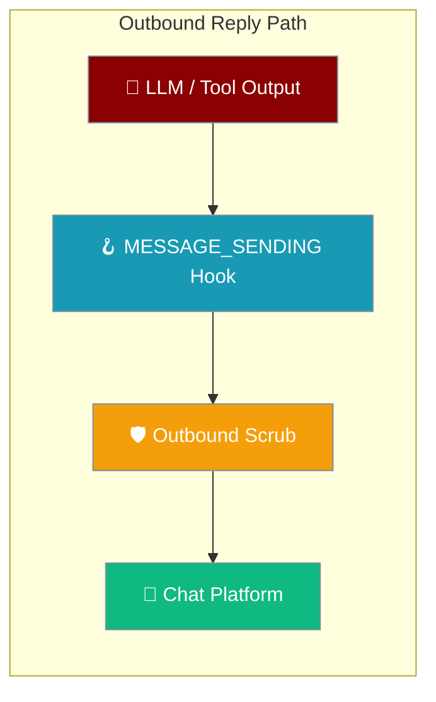
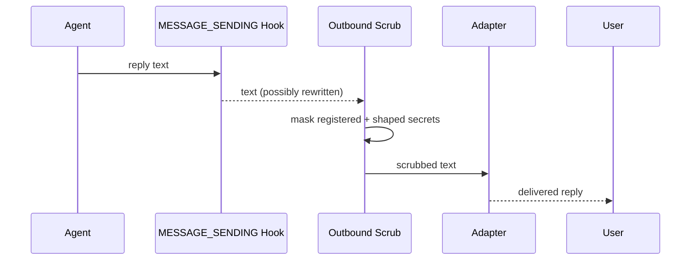

Every reply, streamed draft, and proactive send is passed through a scrubber before it leaves the process — on by default, no config.

```python
from praisonaiagents import Agent
from praisonai.bots import TelegramBot

# No configuration — every outbound reply is scrubbed by default.
agent = Agent(name="Ops", instructions="Answer questions.")
bot = TelegramBot(token="...", agent=agent)

import asyncio
asyncio.run(bot.start())
# A tool result containing sk-abc… or AKIA… is masked as [REDACTED]
# before the reply is sent to Telegram.
```



## Quick Start

<Steps>

<Step title="Zero config — scrubbing is on by default">
```python
from praisonaiagents import Agent
from praisonai.bots import TelegramBot

agent = Agent(name="Ops", instructions="Answer questions.")
bot = TelegramBot(token="...", agent=agent)

import asyncio
asyncio.run(bot.start())
```
Registered gateway credentials and credential-shaped tokens are masked in every reply without any setup.
</Step>

<Step title="Opt out per bot">
```python
bot._redact_secrets_outbound = False
```
Disable the scrub for a single bot. Only do this when another layer upstream already guarantees no secret leaves.
</Step>

<Step title="Bring your own redactor (e.g. add PII)">
```python
from praisonaiagents.secrets import redact_outbound

class PIIRedactor:
    def redact(self, text: str) -> str:
        text = redact_outbound(text)          # keep the built-in secret scrub
        return text.replace("@example.com", "[EMAIL]")  # add your own policy

bot._outbound_redactor = PIIRedactor()
```
Inject a custom scrubber that wraps the core primitive and adds extra rules.
</Step>

</Steps>

---

## What Gets Masked

Two things are masked before a reply leaves the process: every value registered via `register_secret_for_redaction` (all resolved gateway credentials, masked by exact value) **plus** any token matching a narrow credential-shape pattern.

| Shape | Example match |
|---|---|
| OpenAI / Anthropic keys | `sk-…`, `sk-proj-…`, `sk-ant-…` |
| AWS access key id | `AKIA` + 16 upper/digit |
| GitHub tokens | `ghp_…`, `gho_…`, `ghu_…`, `ghs_…`, `ghr_…` |
| GitHub fine-grained PAT | `github_pat_…` |
| Google API key | `AIza` + 35 chars |
| Slack tokens | `xoxb-…`, `xoxa-…`, `xoxp-…`, `xoxr-…`, `xoxs-…` |
| Authorization bearer | `Bearer <16+ chars>` |
| PEM private key | `-----BEGIN … PRIVATE KEY----- … -----END … PRIVATE KEY-----` |

<Note>
Personal data (PII) is deliberately out of scope for the built-in scrub — the shape patterns stay narrow so ordinary text is never over-redacted. Layer PII on with a custom redactor (see below).
</Note>

---

## How It Works

The scrub runs **after** every `MESSAGE_SENDING` hook, so a hook cannot re-introduce a secret after your own logic runs.



---

## Which Paths Are Covered

Every path that dispatches text to a chat user is scrubbed.

| Path | Method | When it fires |
|---|---|---|
| Reply | `fire_message_sending` | Every direct reply an adapter dispatches |
| Streaming | `DraftStreamer._render_content` + `.finalize` | Every intermediate draft edit and the final answer |
| Proactive / scheduled | `DeliveryRouter.deliver` | `agent.send_message(...)`, continuables, scheduled sends |
| Relay | `RelayAdapter.send_message` | Relay-backed adapter replies |

<Note>
The reply seam runs the scrub **last** — after any `MESSAGE_SENDING` hook. Streaming edits bypass the reply seam, so both the rolling draft and the final answer are scrubbed in the streamer, before text-limit truncation, so a `[REDACTED]` mask is never cut across the length boundary.
</Note>

---

## Custom Redactor

Inject an `OutboundRedactor` to add a policy the core scrub does not cover — PII, a company-internal token pattern, and so on.

```python
from praisonaiagents.secrets import redact_outbound, OutboundRedactor

class MyRedactor:
    def redact(self, text: str) -> str:
        text = redact_outbound(text)                 # keep built-in secret scrub
        return text.replace("INTERNAL-", "[REDACTED]")  # your extra rule

bot._outbound_redactor = MyRedactor()
```

`OutboundRedactor` is a `@runtime_checkable` protocol with one method, `redact(self, text: str) -> str`. The injected redactor wins over the core primitive. It must return a `str` — any non-`str` return is ignored and the core `redact_outbound` runs instead.

---

## Opt-Out

Turn the scrub off for a single bot by setting one attribute.

```python
bot._redact_secrets_outbound = False
```

<Warning>
Only disable the outbound scrub if another guarantee upstream already owns secret redaction (for example, a PII policy that also masks credentials). Otherwise resolved secrets and credential-shaped tokens will be delivered verbatim.
</Warning>

---

## Ordinary Text Is Unchanged

The scrub is additive — absent a leak, ordinary text passes through untouched.

| Original | Delivered |
|---|---|
| "Standup is at 9:30am." | "Standup is at 9:30am." |
| "Call me on 555-0134." | "Call me on 555-0134." |
| "Meet in room B-204." | "Meet in room B-204." |
| "Your key is sk-abc123def456ghi789." | "Your key is [REDACTED]." |

---

## Idempotency & Failure Modes

Scrubbing is idempotent — running it on already-scrubbed text is a no-op, so overlapping seams (finalize + reply hook) never double-mask. It is also best-effort: a scrubber exception is caught at every seam and the original text is delivered rather than dropped, so a bug in a custom redactor can never block delivery.

---

## Relationship to the Inbound Gate

Inbound and outbound are symmetric. The [Inbound Message Gate](/features/inbound-message-gate) filters what reaches the agent through `MESSAGE_RECEIVED`; the outbound scrub filters what leaves the agent on the reply path. Together they bracket the agent on both sides.

<CardGroup cols={1}>
  <Card title="Inbound Message Gate" icon="shield-check" href="/features/inbound-message-gate">
    Drop or redact incoming messages before the agent sees them.
  </Card>
</CardGroup>

---

## Best Practices

<AccordionGroup>

<Accordion title="Leave it on">
The scrub is safe-by-default and additive — ordinary text is unchanged. Keep it on and opt out only when another layer already owns secret redaction.
</Accordion>

<Accordion title="Register any custom credential shape">
The shape regex is deliberately narrow. For an unusual token format, register the value with `register_secret_for_redaction(value)` so it is masked by exact value even when the shape patterns miss it.
</Accordion>

<Accordion title="Layer PII on top with a custom OutboundRedactor">
Don't disable the core scrub to add PII masking — wrap it. Call `redact_outbound(text)` first inside your `redact` method, then apply your own rules.
</Accordion>

<Accordion title="Prefer scrubbing at the source for high-volume tool output">
For a tool that emits large or frequent output, scrub at the tool boundary with a guardrail — cheaper than scrubbing every reply. See [Redact Tool Output](/features/redact-tool-output).
</Accordion>

</AccordionGroup>

---

## Related

<CardGroup cols={2}>
  <Card title="Inbound Message Gate" icon="shield-check" href="/features/inbound-message-gate">
    The symmetric inbound filter on `MESSAGE_RECEIVED`.
  </Card>
  <Card title="Gateway Secret References" icon="key" href="/features/gateway-secret-references">
    Load credentials from files, env vars, or secret managers.
  </Card>
  <Card title="Hook Events" icon="webhook" href="/features/hook-events">
    `MESSAGE_SENDING` and the full hook event reference.
  </Card>
  <Card title="Redact Tool Output" icon="wrench" href="/features/redact-tool-output">
    Scrub secrets at the tool boundary before they reach a reply.
  </Card>
</CardGroup>
