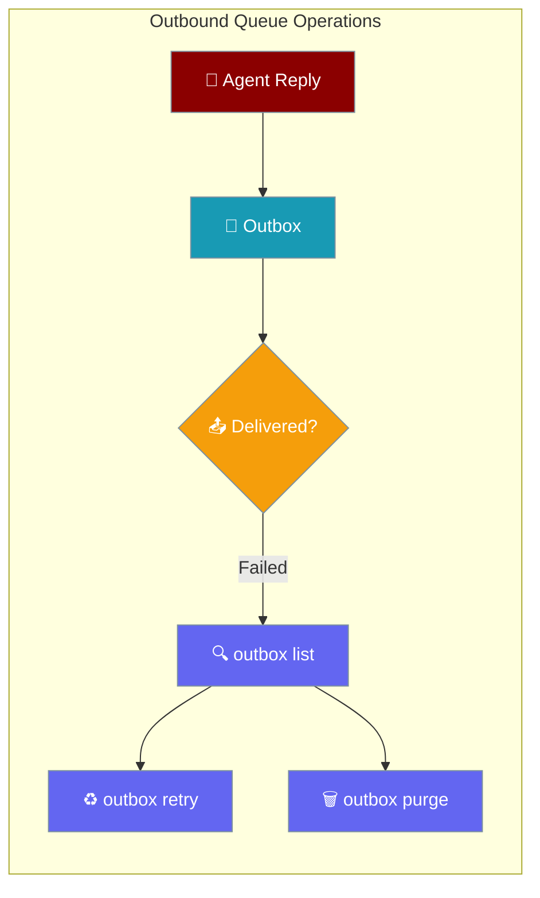
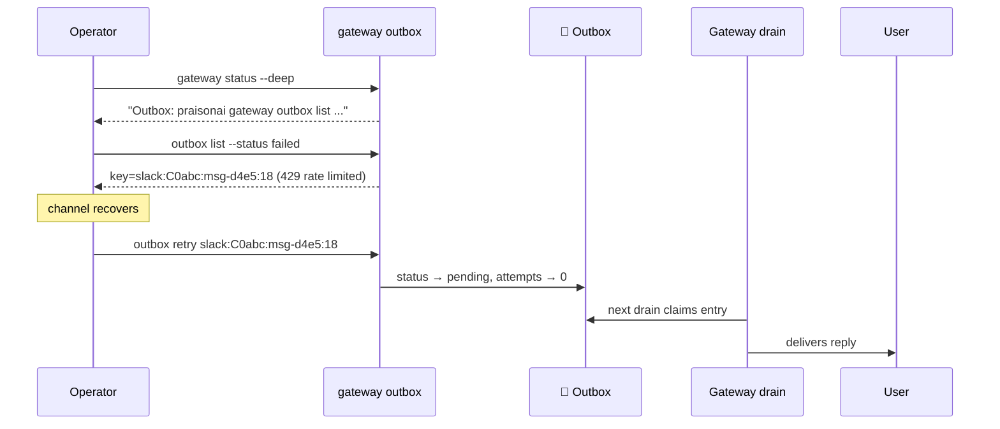
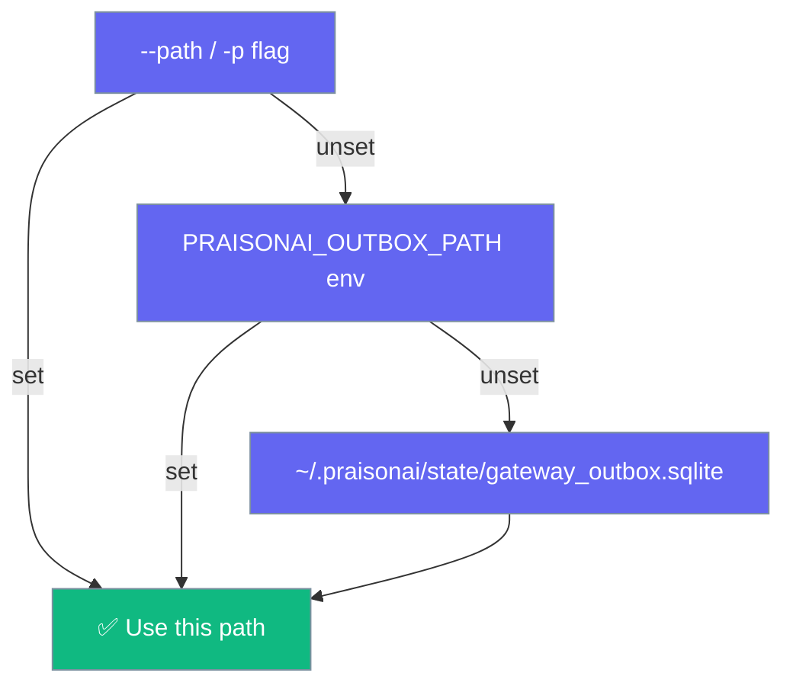

Inspect why an agent reply is stuck, retry it after a channel recovers, or drop a genuinely-dead one — one entry at a time.



## Quick Start

<Steps>
<Step title="Run an agent bot (writes to the outbox automatically)">
A running gateway bot persists every outbound reply to `~/.praisonai/state/gateway_outbox.sqlite` — no code change needed.

```bash
praisonai gateway start --config gateway.yaml
```
</Step>

<Step title="Find stuck replies">
```bash
praisonai gateway outbox list --status failed
```
</Step>

<Step title="Retry one after the channel recovers">
```bash
praisonai gateway outbox retry slack:C0abc:msg-d4e5:18
```
</Step>

<Step title="Or drop a genuinely-dead one">
```bash
praisonai gateway outbox purge telegram:12345:msg-a1b2:17
```
</Step>
</Steps>

---

## User interaction flow

An operator moves a stuck reply from failed to delivered without restarting the gateway.



---

## Commands

Four subcommands mounted under `praisonai gateway outbox`.

| Command | Purpose | Key Flags |
|---------|---------|-----------|
| `outbox list` | Enumerate entries (newest first) | `--path/-p`, `--status/-s`, `--target/-t`, `--limit/-n` (default `20`) |
| `outbox stats` | Per-status count map | `--path/-p` |
| `outbox retry <key>` | Requeue one `failed`/`permanent_failure` entry | `--path/-p` |
| `outbox purge [<key>]` | Delete one entry, or all with `--all` | `--path/-p`, `--all`, `--yes/-y` |

```bash
$ praisonai gateway outbox list --status failed
Outbox /Users/…/state/gateway_outbox.sqlite — 2 entries (showing 2):
  key=telegram:12345:msg-a1b2:17
      target=telegram:12345 status=permanent_failure attempts=5 age=3200s error=chat not found
  key=slack:C0abc:msg-d4e5:18
      target=slack:C0abc status=failed attempts=2 age=45s error=429 rate limited

$ praisonai gateway outbox retry slack:C0abc:msg-d4e5:18
requeued 1 entry
```

`outbox stats` gives an at-a-glance breakdown instead of a single counter:

```bash
$ praisonai gateway outbox stats
Outbox /Users/…/state/gateway_outbox.sqlite:
  failed             1
  pending            3
  permanent_failure  2
```

Clear everything in one shot (asks for confirmation unless `--yes`):

```bash
praisonai gateway outbox purge --all --yes
```

---

## Where the outbox lives

`outbox` resolves the SQLite path in a fixed precedence order.



| Precedence | Source | Value |
|------------|--------|-------|
| 1 | `--path` / `-p` | Explicit path you pass |
| 2 | `PRAISONAI_OUTBOX_PATH` | Environment variable |
| 3 | Default | `~/.praisonai/state/gateway_outbox.sqlite` — the canonical outbox `GatewayServer.scheduled_outbox` writes |

---

## Entry keys

`outbox list` prints a full tracking key per entry in the form `target:idempotency_key:id`, e.g. `slack:C0abc:msg-d4e5:18`. `outbox retry` and `outbox purge` consume that key verbatim.

Keys are always printed **un-truncated** so operators can copy them directly. The key is matched in full against the stored row, so a stale key from another outbox — or a mistyped one — can never mutate the wrong message.

---

## Read-only inspection (safe on a live gateway)

`outbox list` and `outbox stats` open the store with `read_only=True`.

<Warning>
Operator inspection must never run crash recovery on a live database. Flipping in-flight `sending` rows to `recovered` while the owning gateway is mid-send would let a later drain re-claim and duplicate a message. `read_only=True` opens the store for reads without the `sending → recovered` migration; targeted ops (`retry`/`purge_entry`) still work but leave in-flight rows untouched.
</Warning>

---

## Python API

The CLI mirrors four `OutboundQueue` methods. Wire them from Python directly.

```python
from praisonai_bot.bots import OutboundQueue

# Safe inspection alongside a live gateway — no crash recovery runs
outbox = OutboundQueue(
    path="~/.praisonai/state/gateway_outbox.sqlite",
    read_only=True,
)

entries = outbox.list(status="failed", target="slack:C0abc", limit=50)
counts = outbox.stats()  # e.g. {"pending": 3, "permanent_failure": 2}

# Targeted ops require a writable open (drop read_only)
writable = OutboundQueue(path="~/.praisonai/state/gateway_outbox.sqlite")
await writable.retry("slack:C0abc:msg-d4e5:18")
writable.purge_entry("slack:C0abc:msg-d4e5:18")
```

### `list(*, status=None, target=None, limit=100)`

| Parameter | Type | Default | Description |
|-----------|------|---------|-------------|
| `status` | `str` | `None` | Filter by status (see values below) |
| `target` | `str` | `None` | Exact target match, e.g. `telegram:12345` |
| `limit` | `int` | `100` | Max entries returned |

**Returns** — a list of `OutboundEntry` (newest first). Never mutates state.

Status filter values: `pending`, `sending`, `recovered`, `sent`, `failed`, `permanent_failure`.

### `stats() -> dict[str, int]`

**Returns** — a per-status count map; only statuses with at least one entry are present.

### `retry(key) -> bool` (async)

Resets a `failed`/`permanent_failure` entry back to `pending` and clears its `attempts` so the next `drain()` re-dispatches it. **Returns** `True` if requeued, `False` if the key is unknown, already `sent`, in-flight (`sending`), or crash-`recovered`.

### `purge_entry(key) -> bool`

Deletes a single entry by its full tracking key. **Returns** `True` if removed, `False` on unknown/mismatched key or an in-flight `sending` entry.

---

## Best Practices

<AccordionGroup>
<Accordion title="Copy full keys verbatim">
`outbox list` prints keys un-truncated on their own line. `retry` and `purge` match the full `target:idempotency_key:id` — a partial or edited key is rejected, never guessed.
</Accordion>

<Accordion title="retry refuses a recovered entry — on purpose">
A crash-`recovered` entry was in-flight when the process last crashed, so its delivery outcome is unknown. The next `drain()` already reconciles or re-sends with a "possible duplicate" annotator. Flipping it to `pending` manually strips that safeguard and risks an unlabelled duplicate.
</Accordion>

<Accordion title="Never purge a sending entry">
`purge_entry` refuses an in-flight `sending` row. The gateway may have already handed the payload to the channel API and be awaiting `mark_sent`/`mark_failed`. Deleting the row makes `mark_sent` a no-op and the caller report a spurious failure despite delivery. Wait until it transitions.
</Accordion>

<Accordion title="Start from gateway status --deep">
`praisonai gateway status --deep` now prints an outbox hint pointing at `outbox list`, so the diagnostic surface leads straight to the operator commands.
</Accordion>
</AccordionGroup>

---

## Related

<CardGroup cols={2}>
<Card title="Inbound DLQ" icon="inbox" href="/features/inbound-dlq">
  Inbound counterpart — same shape, `praisonai bot dlq list|replay|purge`
</Card>
<Card title="Durable Outbound Delivery" icon="shield-check" href="/features/durable-delivery">
  How the outbox is populated, drained, and reconciled
</Card>
<Card title="Outbound Resilience" icon="rotate" href="/features/outbound-resilience">
  Retry-with-backoff and dead-lettering that feed the outbox
</Card>
<Card title="Gateway" icon="server" href="/gateway">
  Where the durable outbox is wired into the gateway server
</Card>
</CardGroup>
