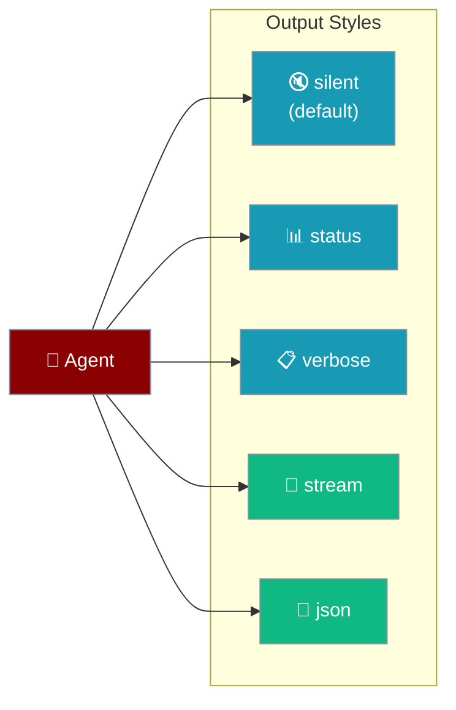
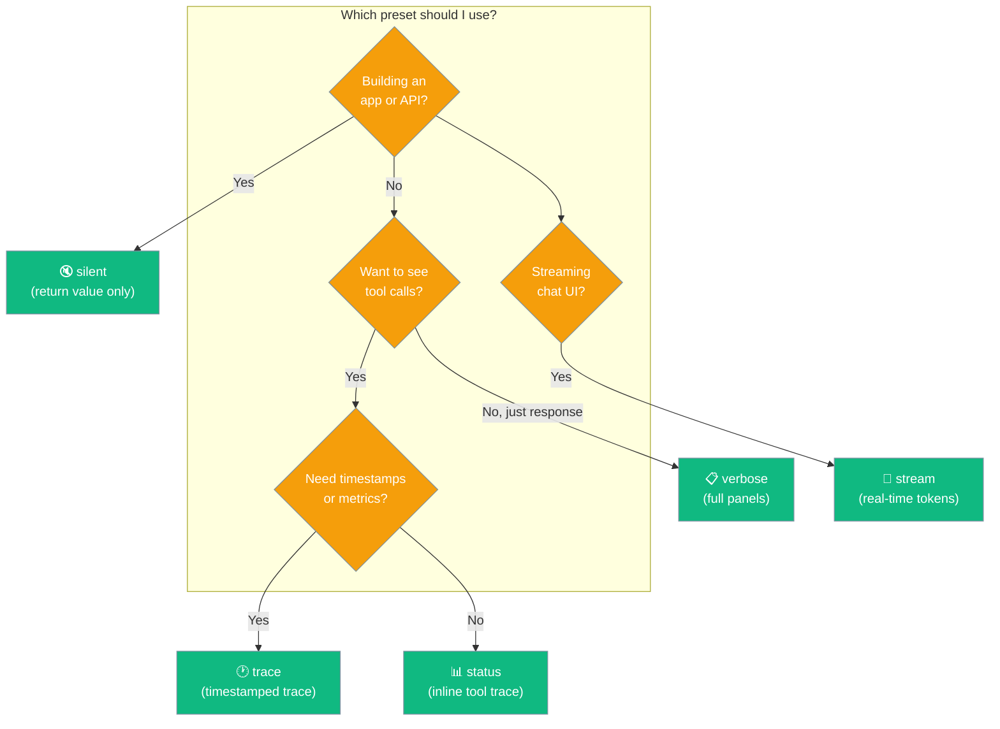

Control what your agent prints during a run — silent for APIs, status for CLI, stream for chat UIs.

```python
from praisonaiagents import Agent

agent = Agent(
    name="Assistant",
    instructions="You are helpful.",
    output="status",
)
result = agent.start("What is the capital of France?")
```

The user runs the agent; output presets control whether responses stay silent, stream, or show status lines.



## Quick Start

<Steps>
<Step title="Simple Usage">
Pass `output` as a string preset:

```python
from praisonaiagents import Agent

agent = Agent(
    name="Assistant",
    instructions="You are a helpful assistant.",
    output="status"
)

result = agent.start("What is the weather in Tokyo?")
```
</Step>

<Step title="With Configuration">
Use `OutputConfig` for fine-grained control:

```python
from praisonaiagents import Agent, OutputConfig

agent = Agent(
    name="Assistant",
    instructions="You are a helpful assistant.",
    output=OutputConfig(
        verbose=True,
        markdown=True,
        stream=True,
        metrics=True,
    )
)

result = agent.start("Explain machine learning in simple terms")
```
</Step>
</Steps>

---

## How It Works



| Preset | Description | Best For |
|--------|-------------|----------|
| `silent` | No output, returns value only (default) | SDK / programmatic use |
| `editor` | `Step 1: 📄 Creating file → ✓ Done` | CLI default, beginners |
| `status` | `▸ AI → thinking` + inline tool calls | Simple CLI output |
| `trace` | Status with `[HH:MM:SS]` timestamps | Progress monitoring |
| `debug` | Trace + metrics, no boxes | Developer debugging |
| `verbose` | Task + Tools + Response panels | Interactive sessions |
| `stream` | Real-time token streaming | Chat interfaces |
| `json` | JSONL events on stdout | Scripting / piping |

---

## Configuration Options

<Card title="OutputConfig SDK Reference" icon="code" href="/docs/sdk/reference/python/classes/OutputConfig">
  Full parameter reference for OutputConfig
</Card>

**Precedence ladder** — choose the level you need:

```python
# Level 1: String preset
agent = Agent(output="verbose")   # "silent" | "minimal" | "normal" | "verbose" | "debug"

# Level 2: OutputConfig (full control)
agent = Agent(output=OutputConfig(verbose=True, stream=True, output_file="results.md"))
```

```python
from praisonaiagents import Agent, OutputConfig

agent = Agent(
    instructions="...",
    output=OutputConfig(
        verbose=False,
        markdown=False,
        stream=False,
        metrics=False,
        reasoning_steps=False,
        actions_trace=False,
        json_output=False,
        simple_output=False,
        status_trace=False,
        editor_output=False,
        show_parameters=False,
        output_file=None,
        template=None,
        tool_output_limit=16000,
    )
)
```

| Option | Type | Default | Description |
|--------|------|---------|-------------|
| `verbose` | `bool` | `False` | Show Rich panels for tasks and responses |
| `markdown` | `bool` | `False` | Render markdown formatting |
| `stream` | `bool` | `False` | Stream tokens in real time |
| `metrics` | `bool` | `False` | Display token usage and cost after each response |
| `reasoning_steps` | `bool` | `False` | Show internal reasoning steps |
| `actions_trace` | `bool` | `False` | Show tool calls and lifecycle events on stderr |
| `json_output` | `bool` | `False` | Emit JSONL events for piping |
| `simple_output` | `bool` | `False` | Print response without Rich panels |
| `status_trace` | `bool` | `False` | Clean inline status updates |
| `editor_output` | `bool` | `False` | Numbered steps with emoji icons (CLI default) |
| `show_parameters` | `bool` | `False` | Show LLM parameters (debug preset) |
| `style` | `Any` | `None` | Custom output styling object |
| `output_file` | `str` | `None` | File path to automatically save the agent response |
| `template` | `str` | `None` | Format template for the response |
| `tool_output_limit` | `int` | `16000` | Maximum characters for tool output |

### String Preset Aliases

| Alias | Maps To |
|-------|---------|
| `plain`, `minimal` | `silent` |
| `normal` | `verbose` |
| `text`, `actions` | `status` |

---

## Common Patterns

### Silent (SDK Default)

```python
from praisonaiagents import Agent

agent = Agent(
    instructions="You are a helpful assistant.",
)

result = agent.start("Summarize this article: ...")
print(result)
```

### Status (CLI / Interactive)

```python
from praisonaiagents import Agent

agent = Agent(
    instructions="You are a helpful assistant.",
    output="status"
)

result = agent.start("What is the capital of France?")
```

### Save Response to File

```python
from praisonaiagents import Agent, OutputConfig

agent = Agent(
    instructions="Write a detailed report",
    output=OutputConfig(
        output_file="report.md",
        markdown=True,
    )
)

agent.start("Write a report on renewable energy trends")
```

---

## Best Practices

<AccordionGroup>
  <Accordion title="Use silent mode for production APIs">
    Silent mode (the default) has zero output overhead. Use it when the agent's return value is consumed by code rather than displayed to users.
  </Accordion>
  <Accordion title="Use editor mode for beginner-facing CLIs">
    `output="editor"` shows human-friendly numbered steps with emoji icons. It is the default when running `praisonai "prompt"` from the command line.
  </Accordion>
  <Accordion title="Use stream mode for chat interfaces">
    Set `output="stream"` when building conversational UIs — tokens appear in real time for a responsive feel.
  </Accordion>
  <Accordion title="Use output_file to persist long-form responses">
    Set `output=OutputConfig(output_file="result.md")` to automatically save the agent's response. Useful for reports, summaries, and generated documents.
  </Accordion>
</AccordionGroup>

---

## Related

<CardGroup cols={2}>
  <Card title="Async Agents" icon="clock" href="/docs/features/async">
    Run agents asynchronously for better performance
  </Card>
  <Card title="Callbacks" icon="webhook" href="/docs/features/callbacks">
    Hook into agent lifecycle events
  </Card>
</CardGroup>
