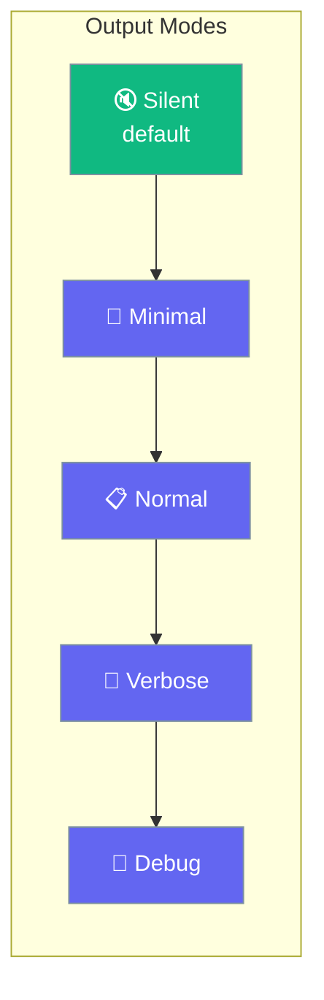
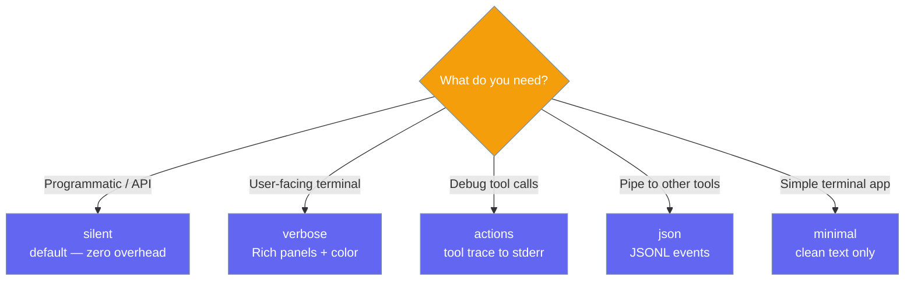
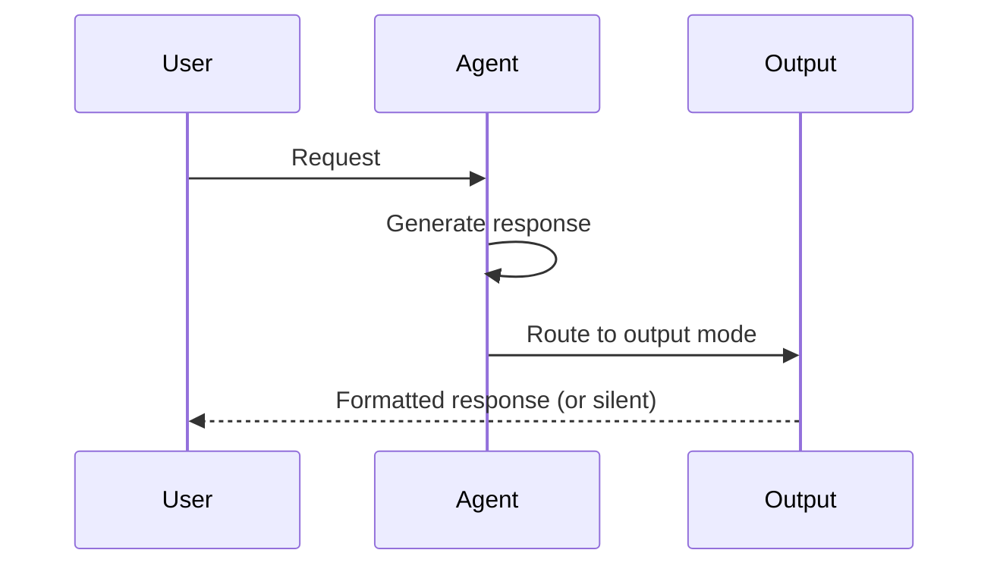

Output controls what agents print, how much detail they show, and whether they stream responses in real time.

```python
from praisonaiagents import Agent

agent = Agent(
    name="Assistant",
    instructions="You are a helpful assistant.",
    output="verbose",
)

agent.start("Explain how neural networks learn.")
```



## Quick Start

<Steps>
<Step title="Simple Usage — Preset">
```python
from praisonaiagents import Agent

agent = Agent(instructions="You are a helpful assistant.", output="verbose")
agent.start("What is the fastest sorting algorithm?")
```
</Step>

<Step title="With Configuration">
```python
from praisonaiagents import Agent, OutputConfig

agent = Agent(
    instructions="You are a helpful assistant.",
    output=OutputConfig(
        verbose=True,
        markdown=True,
        stream=True,
    ),
)
agent.start("Write a comparison of React vs Vue.js.")
```
</Step>
</Steps>

---

## Output Presets



<Note>
The default is `output="silent"` — agents return responses without printing anything. This is the fastest mode for programmatic use.
</Note>

---

## How It Works



| Phase | What happens |
|---|---|
| 1. Generate | Agent processes the request normally |
| 2. Route | Response is passed to the configured output mode |
| 3. Display | Output mode formats and renders (or stays silent) |

---

## Configuration Options

<Card icon="code" href="/docs/sdk/reference/python/OutputConfig">
  Full list of options, types, and defaults — `OutputConfig`
</Card>

| Option | Type | Default | Description |
|---|---|---|---|
| `verbose` | `bool` | `False` | Show Rich panels and detailed output |
| `markdown` | `bool` | `False` | Render markdown formatting |
| `stream` | `bool` | `False` | Stream tokens as they generate |
| `metrics` | `bool` | `False` | Show token usage and timing |
| `reasoning_steps` | `bool` | `False` | Display reasoning steps |
| `actions_trace` | `bool` | `False` | Show tool calls and agent lifecycle |
| `json_output` | `bool` | `False` | Emit JSONL events for piping |
| `simple_output` | `bool` | `False` | Plain text without panels |
| `show_parameters` | `bool` | `False` | Show LLM parameters (debug) |
| `status_trace` | `bool` | `False` | Inline status updates |
| `editor_output` | `bool` | `False` | Numbered steps (beginner-friendly) |
| `output_file` | `str \| None` | `None` | Auto-save response to file path |
| `template` | `str \| None` | `None` | Output format template |
| `tool_output_limit` | `int` | `16000` | Max chars for tool output |

---

## Common Patterns

### Pattern 1 — Streaming for real-time UX
```python
from praisonaiagents import Agent, OutputConfig

agent = Agent(
    instructions="You are a writing assistant.",
    output=OutputConfig(stream=True, markdown=True),
)
response = agent.start("Write a short story about a robot learning to paint.")
print(response)
```

### Pattern 2 — Save output to file
```python
from praisonaiagents import Agent, OutputConfig

agent = Agent(
    instructions="You are a report writer.",
    output=OutputConfig(output_file="report.md", markdown=True),
)
agent.start("Generate a quarterly sales analysis report.")
```

### Pattern 3 — JSON output for pipelines
```python
from praisonaiagents import Agent, OutputConfig

agent = Agent(
    instructions="You are a data extraction agent.",
    output=OutputConfig(json_output=True),
)
agent.start("Extract all company names from this text: Apple launched in 1976, Google in 1998.")
```

---

## Best Practices

<AccordionGroup>
<Accordion title="Default silent mode for production">
`output="silent"` (the default) adds zero overhead and returns the response as a Python string. Use it for APIs, background jobs, and any code that processes the response programmatically.
</Accordion>

<Accordion title="Use verbose for development">
Set `output="verbose"` during development to see tool calls, agent reasoning, and formatted output. Switch back to silent before deploying.
</Accordion>

<Accordion title="Streaming for user-facing apps">
Enable `OutputConfig(stream=True)` for chat interfaces and terminal apps where users expect to see the response appear word by word, not all at once.
</Accordion>

<Accordion title="Save outputs automatically">
Use `output_file="path/to/file.md"` to automatically save every response — useful for report generation, batch processing, and audit trails.
</Accordion>
</AccordionGroup>

---

## Related

<CardGroup cols={2}>
<Card icon="database" href="/docs/features/caching">
  Caching — avoid redundant LLM calls
</Card>
<Card icon="play" href="/docs/features/execution">
  Execution — control iteration limits and rate limiting
</Card>
</CardGroup>
