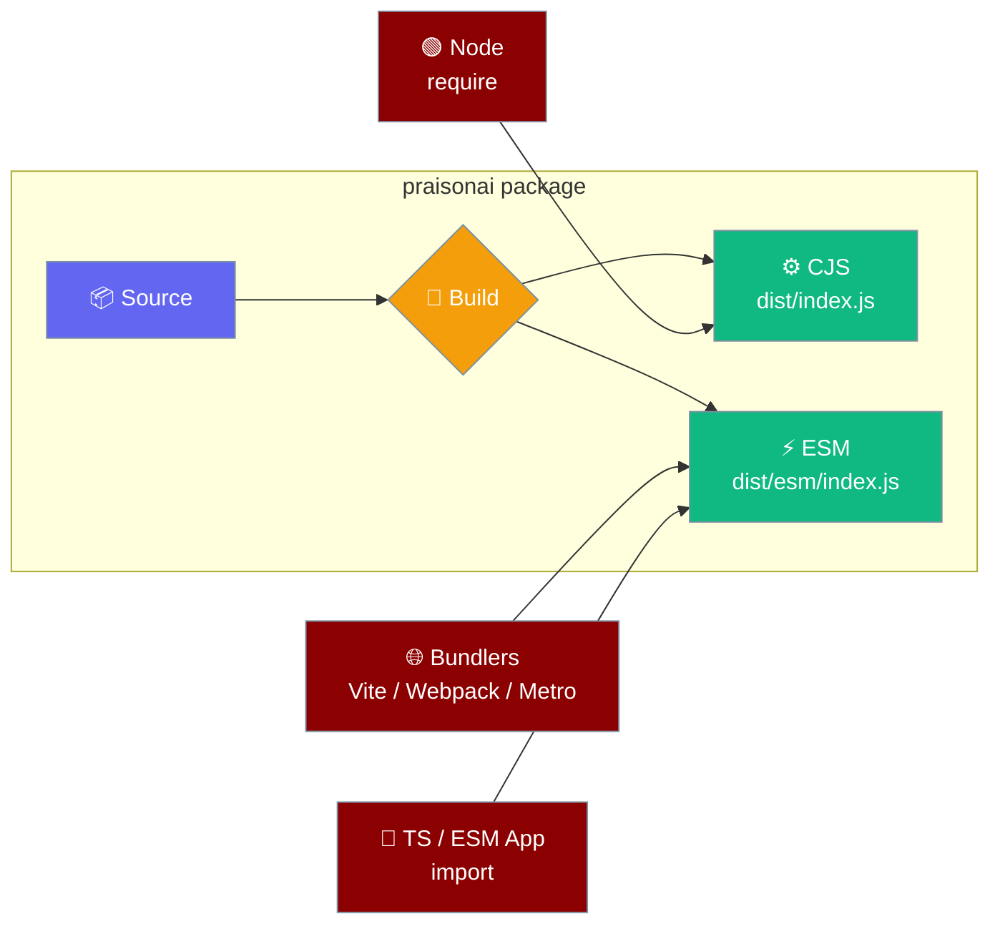
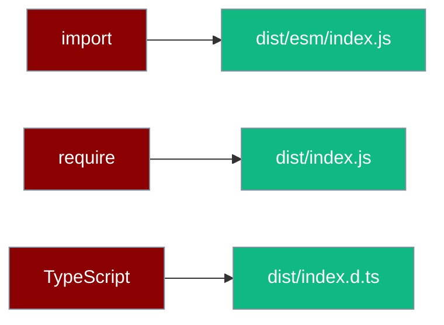
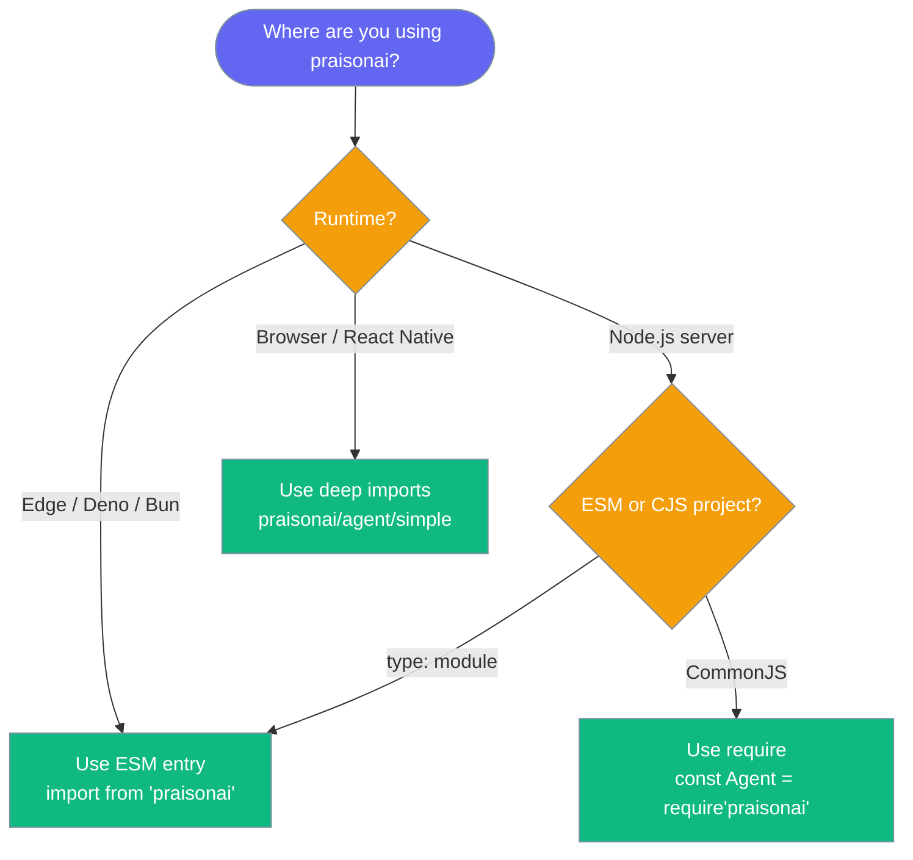

praisonai ships both ESM and CommonJS builds, so it works out-of-the-box with modern bundlers and legacy Node projects alike.



## Quick Start

<Steps>
<Step title="Install">
<CodeGroup>
```bash npm
npm install praisonai
```
```bash yarn
yarn add praisonai
```
</CodeGroup>
</Step>

<Step title="Create an agent (ESM or CommonJS)">
<Tabs>
<Tab title="ESM">
```typescript
import { Agent } from 'praisonai';

const agent = new Agent({ instructions: 'You are a helpful AI assistant' });
agent.start('Write a movie script about a robot in Mars');
```
</Tab>
<Tab title="CommonJS">
```javascript
const { Agent } = require('praisonai');

const agent = new Agent({ instructions: 'You are a helpful AI assistant' });
agent.start('Write a movie script about a robot in Mars');
```
</Tab>
</Tabs>
</Step>
</Steps>

<Note>
Requires **Node.js 18 or later** (`engines.node >= 18`).
</Note>

---

## How It Works

The `package.json` entry points tell each runtime and bundler which build to load.



`import` resolves to the ESM build, `require` resolves to the CJS build, and TypeScript reads the shared type declarations — no configuration needed on your side.

| Field | Value | What it does |
|-------|-------|--------------|
| `main` | `dist/index.js` | CommonJS entry for `require` |
| `module` | `dist/esm/index.js` | Hints bundlers at the ESM build |
| `types` | `dist/index.d.ts` | TypeScript declarations |
| `exports["."].import` | `./dist/esm/index.js` | ESM entry for `import` |
| `exports["."].require` | `./dist/index.js` | CJS entry for `require` |

The ESM build is produced by a small shim that rewrites relative specifiers, adds a `createRequire` banner for interop, and drops a `dist/esm/package.json` marked `{ "type": "module" }`.

---

## Using in Different Environments

Pick the entry point that matches where you run praisonai.



<Tabs>
<Tab title="Node.js (CommonJS)">
```javascript
const { Agent } = require('praisonai');

const agent = new Agent({ instructions: 'You are a helpful AI assistant' });
agent.start('Write a haiku about the ocean');
```
</Tab>
<Tab title="Node.js (ESM)">
```typescript
import { Agent } from 'praisonai';

const agent = new Agent({ instructions: 'You are a helpful AI assistant' });
agent.start('Write a haiku about the ocean');
```
</Tab>
<Tab title="TypeScript">
```json tsconfig.json
{
  "compilerOptions": {
    "module": "esnext",
    "moduleResolution": "bundler",
    "target": "es2022"
  }
}
```
```typescript app.ts
import { Agent } from 'praisonai';

const agent = new Agent({ instructions: 'You are a helpful AI assistant' });
agent.start('Explain quantum computing simply');
```
</Tab>
<Tab title="Vite / Rollup / esbuild">
```typescript
import { Agent } from 'praisonai';

const agent = new Agent({ instructions: 'You are a helpful AI assistant' });
await agent.start('Summarise the latest AI news');
```
</Tab>
<Tab title="Next.js">
```typescript app/api/agent/route.ts
import { Agent } from 'praisonai';

export async function POST(req: Request) {
  const { prompt } = await req.json();
  const agent = new Agent({ instructions: 'You are a helpful AI assistant' });
  const result = await agent.start(prompt);
  return Response.json({ result });
}
```
</Tab>
<Tab title="React Native (Metro)">
```typescript
import { Agent } from 'praisonai/agent/simple';

const agent = new Agent({ instructions: 'You are a helpful AI assistant' });
agent.start('Suggest a name for my app');
```
</Tab>
<Tab title="Deno / Bun">
```typescript
import { Agent } from 'praisonai';

const agent = new Agent({ instructions: 'You are a helpful AI assistant' });
agent.start('Write a limerick about coffee');
```
</Tab>
</Tabs>

<Info>
Deno and Bun resolve the ESM entry automatically from the `import` condition.
</Info>

---

## Subpath Imports

Import from a subpath to load only the module you need.

<CodeGroup>
```typescript Root barrel
import { Agent, Agents } from 'praisonai';
```
```typescript AI primitives
import { generateText, streamText } from 'praisonai/ai';
```
```typescript Tools
import { createTool, tool } from 'praisonai/tools';
```
```typescript Deep import
import { Agent } from 'praisonai/agent/simple';
```
</CodeGroup>

| Subpath | Import | Contents |
|---------|--------|----------|
| `.` | `praisonai` | Full public API (`Agent`, `Agents`, `Workflow`, tools, providers) |
| `./ai` | `praisonai/ai` | AI SDK wrappers (`generateText`, `streamText`, `generateObject`) |
| `./tools` | `praisonai/tools` | Tool base classes and registry (`createTool`, `tool`) |
| `./*` | `praisonai/agent/simple` | Wildcard deep imports to any built module |

---

## Best Practices

<AccordionGroup>
<Accordion title="Prefer ESM imports in new projects" icon="arrow-up-right">
Use `import { Agent } from 'praisonai'` for new code. ESM is the default for bundlers and edge runtimes, and it preserves `await import()` as a lazy chunk instead of forcing a synchronous `require()`.
</Accordion>

<Accordion title="Bundle for the browser today — what works and what doesn't" icon="globe">
The root barrel (`praisonai`) still pulls in the CLI and other Node-only code, so a raw `import 'praisonai'` in a browser or React Native bundle drags in Node built-ins. Use **deep imports** — for example `praisonai/agent/simple` — to keep browser and React Native bundles Node-safe.
</Accordion>

<Accordion title="Verify your install with verify:dist" icon="circle-check">
Contributors can run `npm run verify:dist` to confirm both the CJS and ESM entry points load in a real Node process before publishing.
</Accordion>

<Accordion title="Node version — 18 or later" icon="node-js">
The package sets `engines.node >= 18`. The bundled `openai` dependency needs Node 18, so older runtimes are not supported.
</Accordion>
</AccordionGroup>

<Warning>
The package is not marked `sideEffects: false`, so aggressive tree-shaking is limited today. Deep imports remain the best way to keep bundles small.
</Warning>

---

## Related

<CardGroup cols={2}>
<Card title="Node.js Agents" icon="node-js" href="/js/nodejs">
    Build agents in Node.js with ESM or CommonJS
</Card>
<Card title="TypeScript SDK" icon="code" href="/sdk/typescript/index">
    Full TypeScript agent framework reference
</Card>
</CardGroup>
