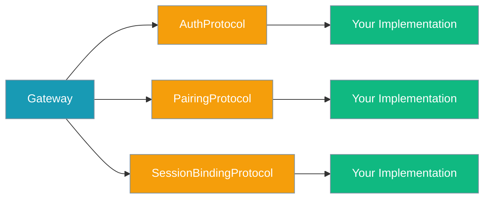

Protocols define extension points for custom authentication, pairing stores, and session binding implementations.



## Quick Start

<Steps>
<Step title="Import Protocols">

```python
from praisonaiagents.gateway.protocols import AuthProtocol, PairingProtocol, SessionBindingProtocol
```

</Step>

<Step title="Implement Custom Store">

```python
import redis

class RedisPairingStore:
    def __init__(self, redis_client):
        self.redis = redis_client
    
    def generate_code(self, channel_type: str = "unknown", channel_id: str = None) -> str:
        code = generate_secure_code()
        self.redis.setex(f"pairing:{code}", 300, f"{channel_type}:{channel_id}")
        return code
    
    def approve(self, channel_type: str, code: str, user_id: str = "", user_name: str = "") -> bool:
        stored = self.redis.get(f"pairing:{code}")
        if not stored:
            return False
        
        self.redis.delete(f"pairing:{code}")
        self.redis.set(f"paired:{channel_type}:{user_id}", user_name)
        return True
    
    def is_paired(self, channel_id: str, channel_type: str) -> bool:
        return bool(self.redis.exists(f"paired:{channel_type}:{channel_id}"))
    
    # ... implement other required methods

# Use as protocol-compatible instance
store = RedisPairingStore(redis.Redis())
```

</Step>
</Steps>

---

## Protocol Specifications

### AuthProtocol

Authentication implementations for gateway requests.

| Method | Signature | Returns |
|--------|-----------|---------|
| `check` | `check(request: Any) -> Dict[str, Any]` | `{ success: bool, user_id: Optional[str], role: Optional[str], metadata: Dict[str, Any] }` |

### PairingProtocol

Channel pairing and authorization management.

| Method | Signature | Returns |
|--------|-----------|---------|
| `generate_code` | `generate_code(channel_type: str = "unknown", channel_id: Optional[str] = None) -> str` | The generated pairing code |
| `approve` | `approve(channel_type: str, code: str, user_id: str = "", user_name: str = "") -> bool` | `True` if approval succeeded |
| `is_paired` | `is_paired(channel_id: str, channel_type: str) -> bool` | Whether the channel is authorised |
| `list_paired` | `list_paired() -> List[PairedChannel]` | All paired channels |
| `revoke` | `revoke(channel_id: str, channel_type: str) -> bool` | `True` if revocation succeeded |
| `list_pending` | `list_pending(channel_type: Optional[str] = None) -> List[Dict[str, Any]]` | Pending requests with channel, code, user info, age |

### SessionBindingProtocol

Session to principal mapping for state tracking.

| Method | Signature | Returns |
|--------|-----------|---------|
| `bind` | `bind(session_id: str, principal: Dict[str, Any]) -> None` | — |
| `lookup` | `lookup(session_id: str) -> Optional[Dict[str, Any]]` | Principal info if found |

<Info>
These are `@runtime_checkable` `typing.Protocol` classes — any object whose method shapes match (duck typing) satisfies them. No inheritance required.
</Info>

<Warning>
Importing the Protocol classes is via `from praisonaiagents.gateway.protocols import AuthProtocol, PairingProtocol, SessionBindingProtocol`. Verify this import path against the SDK before publishing.
</Warning>

---

## Custom Implementation Example

```python
from praisonaiagents.gateway.protocols import PairingProtocol
import sqlite3
import secrets
import time
from typing import List, Dict, Any, Optional

class SQLitePairingStore:
    def __init__(self, db_path: str):
        self.db_path = db_path
        self._init_db()
    
    def _init_db(self):
        conn = sqlite3.connect(self.db_path)
        conn.execute('''
            CREATE TABLE IF NOT EXISTS pending_codes (
                code TEXT PRIMARY KEY,
                channel_type TEXT,
                channel_id TEXT,
                created_at INTEGER
            )
        ''')
        conn.execute('''
            CREATE TABLE IF NOT EXISTS paired_channels (
                channel_id TEXT,
                channel_type TEXT,
                user_name TEXT,
                paired_at INTEGER,
                PRIMARY KEY (channel_id, channel_type)
            )
        ''')
        conn.commit()
        conn.close()
    
    def generate_code(self, channel_type: str = "unknown", channel_id: Optional[str] = None) -> str:
        code = secrets.token_hex(4).upper()  # 8-character hex
        conn = sqlite3.connect(self.db_path)
        conn.execute(
            'INSERT OR REPLACE INTO pending_codes VALUES (?, ?, ?, ?)',
            (code, channel_type, channel_id or "", int(time.time()))
        )
        conn.commit()
        conn.close()
        return code
    
    def approve(self, channel_type: str, code: str, user_id: str = "", user_name: str = "") -> bool:
        conn = sqlite3.connect(self.db_path)
        cursor = conn.execute(
            'SELECT channel_id FROM pending_codes WHERE code = ? AND channel_type = ?',
            (code, channel_type)
        )
        result = cursor.fetchone()
        
        if not result:
            conn.close()
            return False
        
        channel_id = result[0] or user_id
        
        # Remove pending code
        conn.execute('DELETE FROM pending_codes WHERE code = ?', (code,))
        
        # Add to paired channels
        conn.execute(
            'INSERT OR REPLACE INTO paired_channels VALUES (?, ?, ?, ?)',
            (channel_id, channel_type, user_name, int(time.time()))
        )
        
        conn.commit()
        conn.close()
        return True
    
    def is_paired(self, channel_id: str, channel_type: str) -> bool:
        conn = sqlite3.connect(self.db_path)
        cursor = conn.execute(
            'SELECT 1 FROM paired_channels WHERE channel_id = ? AND channel_type = ?',
            (channel_id, channel_type)
        )
        result = cursor.fetchone() is not None
        conn.close()
        return result
    
    # Implement remaining methods...

# Use the custom store
custom_store = SQLitePairingStore("/path/to/pairing.db")
```

---

## Related

<CardGroup cols={2}>
<Card title="Bot Pairing" icon="handshake" href="/docs/features/bot-pairing">
Complete pairing system documentation
</Card>
<Card title="Unknown User Pairing" icon="user-check" href="/docs/features/bot-unknown-user-pairing">
Owner-DM inline-button approval flow
</Card>
</CardGroup>