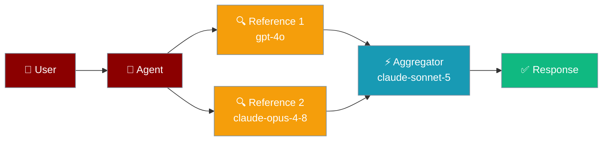
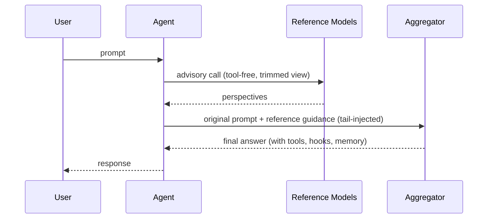
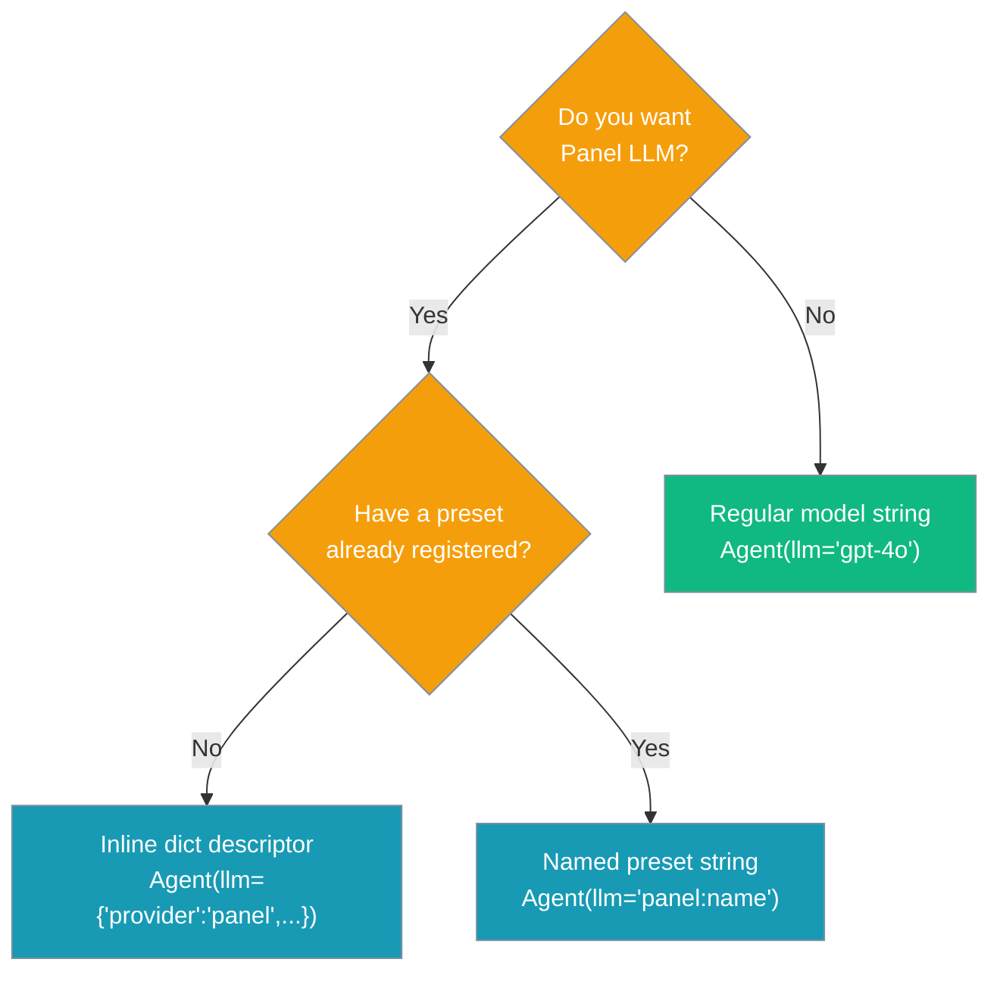

Multiple reference models consult first — their perspectives fold into context — then a single aggregator model acts with full tool access and produces the final answer.

```python
from praisonaiagents import Agent

agent = Agent(
    name="Research Assistant",
    instructions="Answer with high accuracy.",
    llm={
        "provider": "panel",
        "references": ["gpt-4o", "claude-opus-4-8"],
        "aggregator": "claude-sonnet-5",
    },
)
agent.start("Which SSD is faster, X or Y, and why?")
```


The user asks a tough question; reference models consult first, then the aggregator answers with tools.



## Quick Start

<Steps>
<Step title="Inline descriptor">
Pass a dict with `provider: "panel"` to `Agent(llm=...)`:

```python
from praisonaiagents import Agent

agent = Agent(
    name="Research Assistant",
    instructions="Answer with high accuracy.",
    llm={
        "provider": "panel",
        "references": ["gpt-4o", "claude-opus-4-8"],
        "aggregator": "claude-sonnet-5",
    },
)

agent.start("Compare the performance of NVMe vs SATA SSDs.")
```
</Step>

<Step title="Named preset">
Register once, reuse by name anywhere:

```python
from praisonaiagents import Agent
from praisonaiagents.llm.panel import register_panel_preset

register_panel_preset("deep", {
    "references": ["gpt-4o", "claude-opus-4-8"],
    "aggregator": "claude-sonnet-5",
})

agent = Agent(
    name="Research Assistant",
    instructions="Answer with high accuracy.",
    llm="panel:deep",
)

agent.start("Compare the performance of NVMe vs SATA SSDs.")
```
</Step>
</Steps>

---

## How It Works



| Phase | What happens |
|-------|-------------|
| **Reference** | Each reference model receives the conversation (tool-free, stripped of system prompt and tool messages) and replies with its perspective |
| **Inject** | Reference guidance is appended to the **tail** of the latest user turn — not the system prompt — so Anthropic prompt caching on the stable prefix is preserved |
| **Aggregate** | The aggregator model acts as the real agent: it has full tool access, hooks, session, and memory |

---

## Selecting a Model



---

## Configuration Options

| Option | Type | Default | Description |
|--------|------|---------|-------------|
| `provider` | `str` | — | Must be `"panel"` |
| `references` | `list[str]` | — | Advisory model names (run first, tool-free) |
| `aggregator` | `str` | — | The acting model (gets full agent loop) |
| `enabled` | `bool` | `True` | Set to `False` to disable the panel without changing the descriptor |
| `reference_temperature` | `float` | `0.0` | Temperature for reference calls (stable advice) |
| `base_url` | `str` | `None` | Custom endpoint forwarded to both aggregator and references |
| `api_key` | `str` | `None` | API key forwarded to both aggregator and references |
| `api_version` | `str` | `None` | API version forwarded to both aggregator and references |

Extra options inside the dict descriptor (`base_url`, `api_key`, `temperature`, `api_version`, `auth`) survive both the inline and named-preset paths and reach the aggregator. Explicit `Agent(base_url=..., api_key=...)` arguments take precedence.

---

## Common Patterns

### High-accuracy Q&A

```python
from praisonaiagents import Agent

agent = Agent(
    name="Fact Checker",
    instructions="Be precise and cite sources.",
    llm={
        "provider": "panel",
        "references": ["gpt-4o", "gemini-1.5-pro"],
        "aggregator": "claude-sonnet-5",
    },
)
agent.start("What is the capital of Australia?")
```

### Creative writing with multiple voices

```python
from praisonaiagents import Agent

agent = Agent(
    name="Creative Writer",
    instructions="Blend multiple stylistic voices into one coherent piece.",
    llm={
        "provider": "panel",
        "references": ["gpt-4o", "claude-haiku-3-5"],
        "aggregator": "claude-opus-4-8",
    },
)
agent.start("Write a short story about a robot that discovers music.")
```

### Local + cloud hybrid

```python
from praisonaiagents import Agent

agent = Agent(
    name="Hybrid Assistant",
    instructions="Answer using local context and cloud intelligence.",
    llm={
        "provider": "panel",
        "references": ["ollama/mistral"],
        "aggregator": "gpt-4o",
        "base_url": "http://localhost:11434",
    },
)
agent.start("Summarize the attached document.")
```

### Disable panel temporarily

```python
agent = Agent(
    name="Assistant",
    instructions="Answer helpfully.",
    llm={
        "provider": "panel",
        "references": ["gpt-4o"],
        "aggregator": "claude-sonnet-5",
        "enabled": False,
    },
)
```

---

## Best Practices

<AccordionGroup>
  <Accordion title="References are advisory — not for tool calls">
    Reference models run tool-free by design. Only the aggregator has tool access. This is intentional: references provide perspective, not actions. Don't expect tool results from reference calls.
  </Accordion>
  <Accordion title="Keep reference temperature at 0.0">
    The default `reference_temperature=0.0` gives you stable, deterministic advisory perspectives. Raise it only when you want diverse creative suggestions from references.
  </Accordion>
  <Accordion title="No nested panels">
    References and the aggregator cannot themselves be panel descriptors — the SDK raises `ValueError` on detection. This prevents infinite recursion and makes the call graph explicit.
  </Accordion>
  <Accordion title="Prompt-cache discipline">
    Reference guidance is injected at the tail of the latest user turn, never in the system prompt. This keeps the stable cached prefix intact so Anthropic prompt caching stays effective.
  </Accordion>
  <Accordion title="Partial failures are tolerated">
    If a reference model call fails, the SDK logs a warning and replaces the result with `"(unavailable: reference call failed)"`. The aggregator still runs with the available perspectives.
  </Accordion>
</AccordionGroup>

---

## Related

<CardGroup cols={2}>
  <Card title="LLM Configuration" icon="microchip" href="/docs/features/llm-endpoint-config">
    Configure LLM providers and endpoints
  </Card>
  <Card title="Failover" icon="shield" href="/docs/features/failover">
    Automatic fallback when a model fails
  </Card>
  <Card title="Model Router" icon="route" href="/docs/features/model-router">
    Route requests to different models by criteria
  </Card>
  <Card title="Tools" icon="wrench" href="/docs/tools/custom">
    Give agents executable capabilities
  </Card>
</CardGroup>
