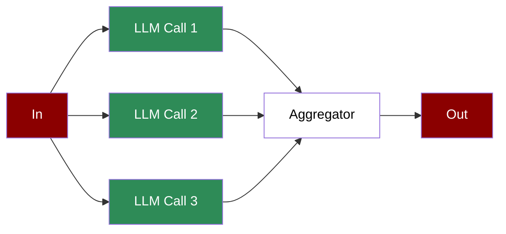

A workflow that distributes tasks across multiple LLM calls simultaneously, aggregating results to handle complex or large-scale operations efficiently.

## Quick Start

<Steps>
    <Step title="Install Package">
        First, install the PraisonAI Agents package:
        ```bash
        pip install praisonaiagents
        ```
    </Step>

    <Step title="Set API Key">
        Set your OpenAI API key as an environment variable in your terminal:
        ```bash
        export OPENAI_API_KEY=your_api_key_here
        ```
    </Step>

    <Step title="Create a file">
        Create a new file `app.py` with the basic setup:
        ```python
        from praisonaiagents import Agent, Workflow
        from praisonaiagents import parallel

        # Create parallel research agents
        market_researcher = Agent(
            name="MarketResearcher",
            role="Market Research Analyst",
            goal="Research market trends and opportunities",
            instructions="Analyze market trends. Provide concise market insights."
        )

        competitor_researcher = Agent(
            name="CompetitorResearcher", 
            role="Competitive Intelligence Analyst",
            goal="Research competitor strategies",
            instructions="Analyze competitors. Provide key competitive insights."
        )

        customer_researcher = Agent(
            name="CustomerResearcher",
            role="Customer Research Analyst", 
            goal="Research customer needs and behaviors",
            instructions="Analyze customer segments. Provide customer insights."
        )

        # Create aggregator agent
        aggregator = Agent(
            name="Aggregator",
            role="Research Synthesizer",
            goal="Synthesize research findings",
            instructions="Combine all research findings into a comprehensive summary."
        )

        # Create workflow with parallel execution
        workflow = Workflow(
            steps=[
                parallel([market_researcher, competitor_researcher, customer_researcher]),
                aggregator
            ]
        )

        # Run workflow - all researchers work in parallel, then aggregator summarizes
        result = workflow.start("Research the AI industry")
        print(result["output"])
        ```
    </Step>

    <Step title="Start Workflow">
        Type this in your terminal to run your workflow:
        ```bash
        python app.py
        ```
    </Step>
</Steps>

<Note>
  **Requirements**
  - Python 3.10 or higher
  - OpenAI API key. Generate OpenAI API key [here](https://platform.openai.com/api-keys). Use Other models using [this guide](/models).   
  - Basic understanding of Python and async programming
</Note>

## Understanding Parallelisation

<Card title="What is Parallelisation?" icon="question">
  Parallelisation enables:
  - Concurrent execution of multiple tasks
  - Improved performance through parallel processing
  - Efficient handling of independent operations
  - Aggregation of parallel task results
</Card>

## Features

<CardGroup cols={2}>
  <Card title="Parallel Execution" icon="arrows-split-up-and-left">
    Run multiple tasks simultaneously for improved performance.
  </Card>
  <Card title="Async Support" icon="bolt">
    Built-in support for asynchronous execution.
  </Card>
  <Card title="Result Aggregation" icon="layer-group">
    Combine results from parallel tasks efficiently.
  </Card>
  <Card title="Process Control" icon="sliders">
    Monitor and manage parallel task execution.
  </Card>
</CardGroup>

## Configuration Options

```python
from praisonaiagents import Workflow, WorkflowContext, StepResult
from praisonaiagents import parallel

# Define parallel workers
def worker1(ctx: WorkflowContext) -> StepResult:
    return StepResult(output="Result from worker 1")

def worker2(ctx: WorkflowContext) -> StepResult:
    return StepResult(output="Result from worker 2")

def worker3(ctx: WorkflowContext) -> StepResult:
    return StepResult(output="Result from worker 3")

# Aggregator combines parallel results
def aggregate(ctx: WorkflowContext) -> StepResult:
    outputs = ctx.variables.get("parallel_outputs", [])
    return StepResult(output=f"Combined: {len(outputs)} results")

# Create workflow with parallel execution
workflow = Workflow(
    steps=[
        parallel([worker1, worker2, worker3]),
        aggregate
    ]
)

# Async workflow execution
import asyncio

async def run_workflow():
    result = await workflow.astart("Start parallel work")
    return result

result = asyncio.run(run_workflow())
```

## Troubleshooting

<CardGroup cols={2}>
  <Card title="Execution Issues" icon="triangle-exclamation">
    If parallel execution fails:
    - Check async configuration
    - Verify task independence
    - Monitor resource usage
  </Card>

  <Card title="Result Aggregation" icon="diagram-project">
    If aggregation is incorrect:
    - Review task outputs
    - Check context connections
    - Verify aggregator logic
  </Card>
</CardGroup>

## Next Steps

<CardGroup cols={2}>
  <Card title="AutoAgents" icon="robot" href="./autoagents">
    Learn about automatically created and managed AI agents
  </Card>
  <Card title="Mini Agents" icon="microchip" href="./mini">
    Explore lightweight, focused AI agents
  </Card>
</CardGroup>

<Note>
  For optimal results, ensure your parallel tasks are truly independent and your system has sufficient resources to handle concurrent execution.
</Note>
