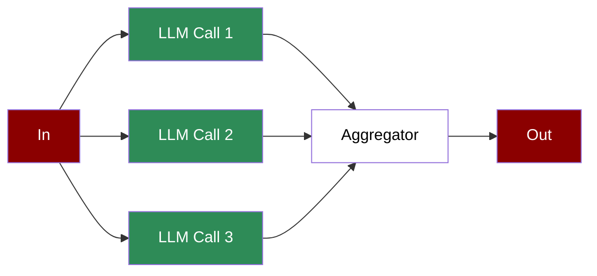

A workflow that distributes tasks across multiple LLM calls simultaneously, aggregating results to handle complex or large-scale operations efficiently.

## Quick Start

<Steps>
    <Step title="Install Package">
        First, install the PraisonAI Agents package:
        ```bash
        pip install praisonaiagents
        ```
    </Step>

    <Step title="Set API Key">
        Set your OpenAI API key as an environment variable in your terminal:
        ```bash
        export OPENAI_API_KEY=your_api_key_here
        ```
    </Step>

    <Step title="Create a file">
        Create a new file `app.py` with the basic setup:
        ```python
        from praisonaiagents import Workflow, WorkflowContext, StepResult
        from praisonaiagents.workflows import parallel
        from datetime import datetime
        import time

        # Parallel workers - each does independent work
        def research_market(ctx: WorkflowContext) -> StepResult:
            time.sleep(0.1)  # Simulate work
            return StepResult(output="📊 Market: Growth expected 15% YoY")

        def research_competitors(ctx: WorkflowContext) -> StepResult:
            time.sleep(0.1)  # Simulate work
            return StepResult(output="🏢 Competitors: 3 major players identified")

        def research_customers(ctx: WorkflowContext) -> StepResult:
            time.sleep(0.1)  # Simulate work
            return StepResult(output="👥 Customers: 5 key segments found")

        # Aggregator - combines all parallel results
        def summarize_research(ctx: WorkflowContext) -> StepResult:
            outputs = ctx.variables.get("parallel_outputs", [])
            summary = f"📋 RESEARCH SUMMARY:\n" + "\n".join(f"  • {o}" for o in outputs)
            return StepResult(output=summary)

        # Create workflow with parallel execution
        workflow = Workflow(
            steps=[
                parallel([research_market, research_competitors, research_customers]),
                summarize_research
            ]
        )

        # Run workflow
        print("\nStarting Parallel Workflow...")
        print("=" * 50)

        result = workflow.start("Research the AI market")
        print(result["output"])
        ```
    </Step>

    <Step title="Start Workflow">
        Type this in your terminal to run your workflow:
        ```bash
        python app.py
        ```
    </Step>
</Steps>

<Note>
  **Requirements**
  - Python 3.10 or higher
  - OpenAI API key. Generate OpenAI API key [here](https://platform.openai.com/api-keys). Use Other models using [this guide](/models).   
  - Basic understanding of Python and async programming
</Note>

## Understanding Parallelisation

<Card title="What is Parallelisation?" icon="question">
  Parallelisation enables:
  - Concurrent execution of multiple tasks
  - Improved performance through parallel processing
  - Efficient handling of independent operations
  - Aggregation of parallel task results
</Card>

## Features

<CardGroup cols={2}>
  <Card title="Parallel Execution" icon="arrows-split-up-and-left">
    Run multiple tasks simultaneously for improved performance.
  </Card>
  <Card title="Async Support" icon="bolt">
    Built-in support for asynchronous execution.
  </Card>
  <Card title="Result Aggregation" icon="layer-group">
    Combine results from parallel tasks efficiently.
  </Card>
  <Card title="Process Control" icon="sliders">
    Monitor and manage parallel task execution.
  </Card>
</CardGroup>

## Configuration Options

```python
# Create a parallel task
task = Task(
    name="parallel_task",
    description="Task to run in parallel",
    expected_output="Task result",
    agent=agent,
    is_start=True,
    async_execution=True  # Enable parallel execution
)

# Create an aggregator task
aggregator_task = Task(
    name="aggregate",
    description="Aggregate results from parallel tasks",
    expected_output="Combined results",
    agent=aggregator,
    context=[task1, task2, task3]  # Reference parallel tasks
)

# Async workflow execution
async def run_workflow():
    workflow = PraisonAIAgents(
        agents=[agent1, agent2, aggregator],
        tasks=[task1, task2, aggregator_task],
        process="workflow",
        verbose=True
    )
    results = await workflow.astart()
```

## Troubleshooting

<CardGroup cols={2}>
  <Card title="Execution Issues" icon="triangle-exclamation">
    If parallel execution fails:
    - Check async configuration
    - Verify task independence
    - Monitor resource usage
  </Card>

  <Card title="Result Aggregation" icon="diagram-project">
    If aggregation is incorrect:
    - Review task outputs
    - Check context connections
    - Verify aggregator logic
  </Card>
</CardGroup>

## Next Steps

<CardGroup cols={2}>
  <Card title="AutoAgents" icon="robot" href="./autoagents">
    Learn about automatically created and managed AI agents
  </Card>
  <Card title="Mini Agents" icon="microchip" href="./mini">
    Explore lightweight, focused AI agents
  </Card>
</CardGroup>

<Note>
  For optimal results, ensure your parallel tasks are truly independent and your system has sufficient resources to handle concurrent execution.
</Note>
