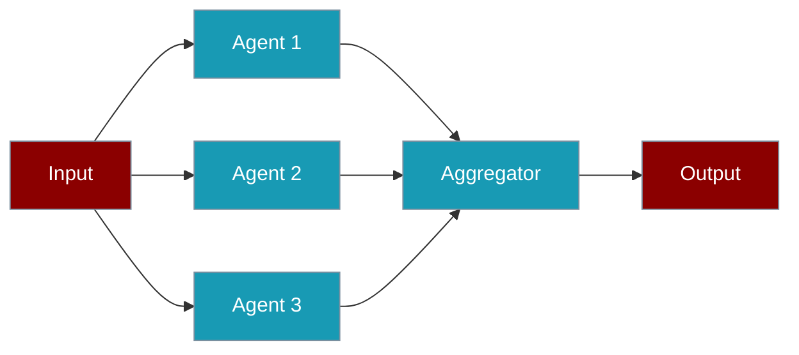
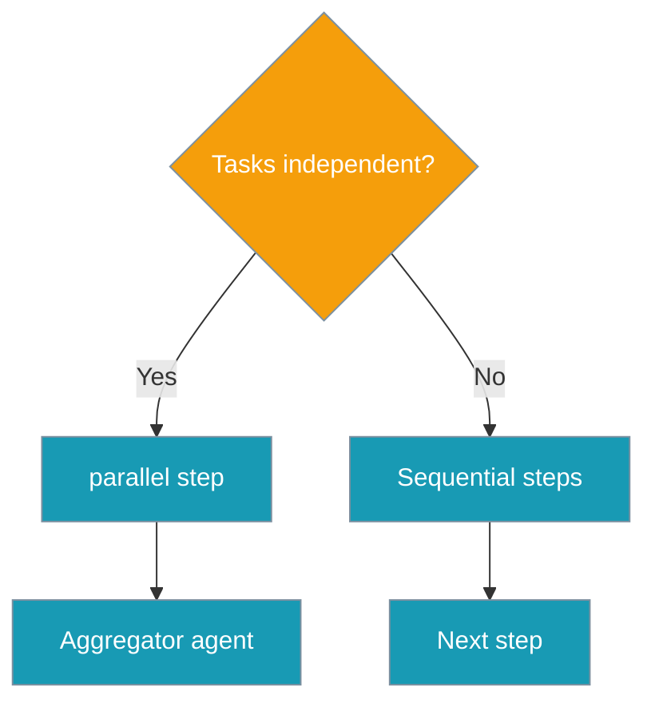

Run independent agent tasks at the same time, then combine their outputs in one workflow.

```python
from praisonaiagents import Agent, AgentFlow, parallel

researcher = Agent(name="Researcher", instructions="Research the topic.")
writer = Agent(name="Writer", instructions="Write a summary.")
aggregator = Agent(name="Aggregator", instructions="Combine findings.")

workflow = AgentFlow(steps=[
    parallel([researcher, writer]),
    aggregator,
])
result = workflow.start("Research AI trends")
```


The user sends one request; parallel agents run at the same time before an aggregator merges results.


```mermaid
graph LR
    In["Input"] --> A1["Agent 1"]
    In --> A2["Agent 2"]
    In --> A3["Agent 3"]
    A1 --> Agg["Aggregator"]
    A2 --> Agg
    A3 --> Agg
    Agg --> Out["Output"]

    classDef agent fill:#8B0000,stroke:#7C90A0,color:#fff
    classDef process fill:#189AB4,stroke:#7C90A0,color:#fff
    classDef output fill:#10B981,stroke:#7C90A0,color:#fff

    class In,Out agent
    class A1,A2,A3,Agg process
```

## Quick Start

<Steps>
<Step title="Simple Usage">

```python
from praisonaiagents import Agent, AgentFlow, parallel

market = Agent(name="Market", instructions="Analyse market trends.")
competitor = Agent(name="Competitor", instructions="Analyse competitors.")
aggregator = Agent(name="Aggregator", instructions="Synthesise all findings.")

workflow = AgentFlow(steps=[
    parallel([market, competitor]),
    aggregator,
])

result = workflow.start("Research the AI industry")
print(result["output"])
```

</Step>

<Step title="With Configuration">

```python
import asyncio
from praisonaiagents import AgentFlow, WorkflowContext, StepResult, parallel

def worker_a(ctx: WorkflowContext) -> StepResult:
    return StepResult(output="Result A")

def worker_b(ctx: WorkflowContext) -> StepResult:
    return StepResult(output="Result B")

def combine(ctx: WorkflowContext) -> StepResult:
    outputs = ctx.variables.get("parallel_outputs", [])
    return StepResult(output=f"Combined {len(outputs)} results")

workflow = AgentFlow(steps=[parallel([worker_a, worker_b]), combine])

async def run():
    return await workflow.astart("Start parallel work")

result = asyncio.run(run())
```

</Step>
</Steps>

---

## How It Works


```mermaid
graph TB
    Q{Tasks independent?}
    Q -->|Yes| P[parallel step]
    Q -->|No| S[Sequential steps]
    P --> Agg[Aggregator agent]
    S --> Next[Next step]

    classDef question fill:#F59E0B,stroke:#7C90A0,color:#fff
    classDef process fill:#189AB4,stroke:#7C90A0,color:#fff

    class Q question
    class P,S,Agg,Next process
```

| Pattern | When to use |
|---------|-------------|
| `parallel([a, b, c])` | Tasks do not depend on each other's output |
| Sequential steps | Each step needs the previous result |
| Aggregator agent | Combine parallel outputs into one answer |

---

## Configuration Options

`parallel()` accepts a list of agents or step callables. Each worker receives the same workflow context; results are collected in `ctx.variables["parallel_outputs"]` for the next step.

```python
from praisonaiagents import AgentFlow, parallel

workflow = AgentFlow(steps=[
    parallel([agent_a, agent_b, agent_c]),
    final_agent,
])
```

| Option | Type | Default | Description |
|--------|------|---------|-------------|
| Workers | `List[Agent \| Callable]` | — | Agents or functions run concurrently |
| Context key | `str` | `"parallel_outputs"` | Where aggregated results are stored |
| Async | `astart()` | — | Use `workflow.astart()` for async execution |

---

## Best Practices

<AccordionGroup>
<Accordion title="Keep parallel tasks independent">
Only parallelise work that does not need another worker's output mid-flight. Route dependent steps after the aggregator.
</Accordion>
<Accordion title="Use an aggregator for synthesis">
A dedicated agent (or function step) after `parallel()` turns multiple raw outputs into one coherent response.
</Accordion>
<Accordion title="Prefer astart for I/O-heavy workers">
When workers call external APIs, use `await workflow.astart()` so concurrent I/O does not block the event loop.
</Accordion>
<Accordion title="Watch rate limits">
Parallel LLM calls multiply token usage and API requests. Cap worker count or add a rate limiter if needed.
</Accordion>
</AccordionGroup>

---

## Related

<CardGroup cols={2}>
<Card title="Orchestrator Worker" icon="sitemap" href="/docs/features/orchestrator-worker">
  Route tasks to specialised workers from a central orchestrator
</Card>
<Card title="AgentFlow" icon="diagram-project" href="/docs/features/agentflow">
  Build multi-step agent pipelines
</Card>
</CardGroup>
