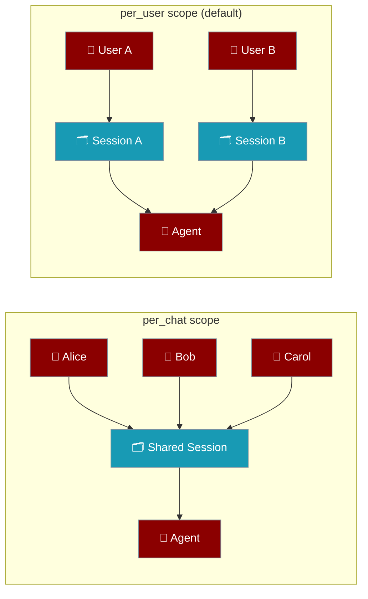
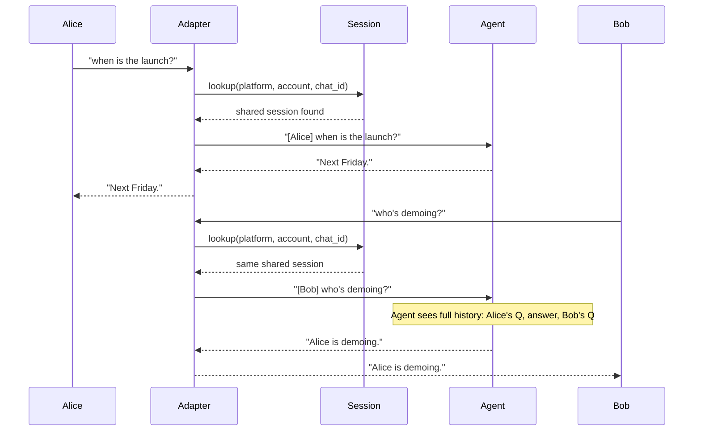

```python
from praisonaiagents import Agent

agent = Agent(
    name="session-agent",
    instructions="Maintain separate context per chat session.",
)
agent.start("This is a new session — remember nothing from before.")
```


In group chats, share one transcript across all participants — each message prefixed with the sender's name.

```yaml
# gateway.yaml
channels:
  telegram:
    platform: telegram
    token: "${TELEGRAM_BOT_TOKEN}"
    session:
      session_scope: per_chat

agent:
  name: assistant
  instructions: "Help the group. Refer to participants by name."
  model: gpt-4o-mini
```



## Quick Start

<Steps>
<Step title="Enable per_chat scope in your gateway config">

```yaml
# gateway.yaml
channels:
  telegram:
    platform: telegram
    token: "${TELEGRAM_BOT_TOKEN}"
    session:
      session_scope: per_chat

agent:
  name: assistant
  instructions: "Help the group. Refer to participants by name."
  model: gpt-4o-mini
```

Run with:
```bash
praisonai gateway start gateway.yaml
```

In a Telegram group, the agent now sees one shared transcript:

```
[Alice] when is the launch?
[Bob] next friday
[Alice] cool, who's demoing?
```
</Step>

<Step title="Customise the attribution template">

```yaml
channels:
  telegram:
    platform: telegram
    token: "${TELEGRAM_BOT_TOKEN}"
    session:
      session_scope: per_chat
      attribution: "[{sender} at {time}] "
```

The attribution template supports two placeholders:
- `{sender}` — the sender's display name
- `{time}` — current time in `HH:MM` format

Result: `[Alice at 14:32] when is the launch?`
</Step>
</Steps>

---

## How It Works



The session key in `per_chat` mode is:

```
{platform}:acct:{account}:chat:{chat_id}:{thread_id}
```

This keeps different group chats and threads isolated from each other, even on the same platform.

---

## per_user vs per_chat

```mermaid
graph TB
    Start[New message arrives] --> IsDM{Is it a DM?}
    IsDM -->|Yes| PerUser[per_user key\nplatform:acct:X:user:user_id]
    IsDM -->|No — group/channel| Scope{session_scope setting}
    Scope -->|per_user (default)| PerUser
    Scope -->|per_chat| PerChat[per_chat key\nplatform:acct:X:chat:chat_id:thread_id]

    classDef decision fill:#F59E0B,stroke:#7C90A0,color:#fff
    classDef peruser fill:#8B0000,stroke:#7C90A0,color:#fff
    classDef perchat fill:#189AB4,stroke:#7C90A0,color:#fff

    class IsDM,Scope decision
    class PerUser peruser
    class PerChat perchat
```

<Note>
Direct messages **always** use `per_user` scope, even when `session_scope: per_chat` is configured. Private conversations are never merged into a shared group transcript.
</Note>

---

## Configuration

Set these options under `session:` in your channel config:

| Option | Type | Default | Description |
|--------|------|---------|-------------|
| `session_scope` | `str` | `"per_user"` | `"per_user"` for isolated sessions (default) or `"per_chat"` for shared group sessions |
| `attribution` | `str` | `"[{sender}] "` | Template prefixed to each turn in `per_chat` scope. Supports `{sender}` and `{time}` |
| `max_history` | `int` | `100` | Maximum number of turns to keep in session history |

Valid values for `session_scope`: `per_user`, `per_chat`. Any other value raises a validation error.

---

## /new in Groups

The `/new` command clears the shared session for the whole group — not just the sender.

All seven supported adapters (telegram, slack, discord, whatsapp, email, linear, agentmail) thread `chat_id` through their reset handlers. A `/new` from inside a DM clears only that user's private session, not any group session.

```
Alice: /new
Bot: ✅ Session cleared for this group.
Bob: what were we talking about?
Bot: I don't have any previous context — what would you like help with?
```

---

## Best Practices

<AccordionGroup>
<Accordion title="When to enable per_chat">
Use `per_chat` when your group needs one coherent conversation thread — for example, a team planning bot, a group Q&A assistant, or a shared research helper. Keep `per_user` (the default) when each user needs their own private context, like a personal productivity or support bot added to a group.
</Accordion>

<Accordion title="Choose an attribution template">
The default `"[{sender}] "` is clear and compact. Add `{time}` when timing context helps the agent reason about sequences of events:

```yaml
attribution: "[{sender} at {time}] "
```

Set `attribution: ""` to disable attribution entirely — the agent sees messages without sender prefixes.
</Accordion>

<Accordion title="Avoid key collisions across accounts">
The key includes `account` to namespace different bot accounts on the same platform. If you run two gateway bots on the same Telegram group with different tokens, each bot maintains its own independent shared session. No additional config is needed — this is automatic.
</Accordion>

<Accordion title="Watch the history budget in busy groups">
A `per_chat` session accumulates turns from all participants. In active groups this fills `max_history` faster than a one-on-one conversation. Lower `max_history` or enable `compaction` to summarise older turns:

```yaml
session:
  session_scope: per_chat
  max_history: 50
  compaction:
    enabled: true
    strategy: summarize
```
</Accordion>
</AccordionGroup>

---

## Related

<CardGroup cols={2}>
<Card title="Bot Gateway" icon="plug" href="/docs/features/gateway">
  Set up the gateway to connect agents to messaging platforms
</Card>
<Card title="Multi-Channel Bots" icon="users" href="/docs/features/multi-channel-bots">
  Run one agent across telegram, slack, discord, and more
</Card>
</CardGroup>
