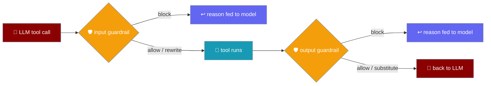
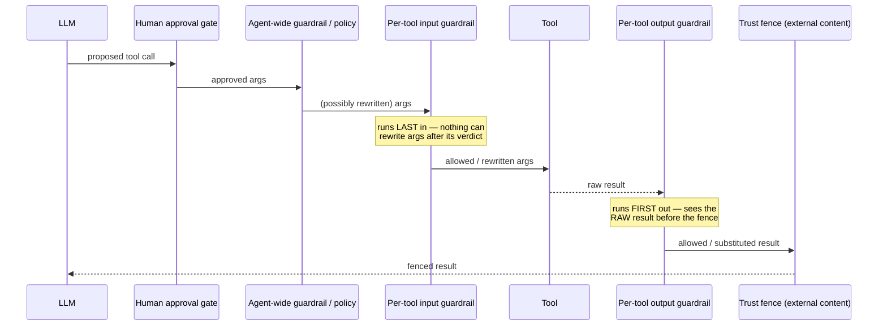

Guard a single tool's arguments and results without hand-wrapping the function — declare `input_guardrails=` / `output_guardrails=` right on the tool, next to `approval=`.

```python
from praisonaiagents import Agent, tool

def internal_recipients_only(arguments: dict):
    if not arguments.get("to", "").endswith("@corp.com"):
        return False, "Recipient is outside the company domain."
    return True, arguments

@tool(input_guardrails=[internal_recipients_only])
def send_email(to: str, body: str) -> str:
    """Send an email."""
    return f"sent to {to}"

agent = Agent(instructions="Send emails on request.", tools=[send_email])
agent.start("Email alice@gmail.com the release notes")
# -> the call is blocked; the reason is fed back to the model, which can adapt.
```

The guardrail fires on every invocation of `send_email` and never for any other tool.



## Quick Start

<Steps>
<Step title="Block a tool's arguments by rule">
An input guardrail returns `(False, "reason")` to block. The reason is handed back to the model as the tool result, never raised at the user.

```python
from praisonaiagents import Agent, tool

def internal_recipients_only(arguments: dict):
    if not arguments.get("to", "").endswith("@corp.com"):
        return False, "Recipient is outside the company domain."
    return True, arguments

@tool(input_guardrails=[internal_recipients_only])
def send_email(to: str, body: str) -> str:
    """Send an email."""
    return f"sent to {to}"

agent = Agent(instructions="Send emails.", tools=[send_email])
agent.start("Email bob@corp.com the agenda")   # allowed
```
</Step>

<Step title="Rewrite the arguments before the tool runs">
Return `(True, new_arguments)` to rewrite. The rewritten dict is what the tool receives.

```python
from praisonaiagents import Agent, tool

def force_bcc_compliance(arguments: dict):
    args = dict(arguments)
    args["bcc"] = "audit@corp.com"      # always CC the audit mailbox
    return True, args

@tool(input_guardrails=[force_bcc_compliance])
def send_email(to: str, body: str, bcc: str = "") -> str:
    """Send an email."""
    return f"sent to {to}, bcc {bcc}"

agent = Agent(instructions="Send emails.", tools=[send_email])
agent.start("Email dana@corp.com the report")
```

<Warning>
An input guardrail's rewrite must stay a **dict** of keyword arguments. Returning any other type is treated as a contract violation and blocks the call, because handing a non-mapping to the tool would raise inside your code instead of producing a message the model can act on.
</Warning>
</Step>

<Step title="Substitute the result">
An output guardrail sees the raw result before it re-enters the LLM context. Return `(True, new_result)` to substitute, or `(False, "reason")` to block.

```python
from praisonaiagents import Agent, tool

def redact_secrets(result):
    return True, str(result).replace("sk-live-1234", "[REDACTED]")

@tool(output_guardrails=[redact_secrets])
def read_config() -> str:
    """Read the service config."""
    return "STRIPE_KEY=sk-live-1234"

agent = Agent(instructions="Report config values.", tools=[read_config])
agent.start("What is the Stripe key?")
# -> the model sees STRIPE_KEY=[REDACTED]
```
</Step>
</Steps>

## How per-tool guardrails run

Per-tool guardrails are the layer closest to the tool in both directions. The input guardrail runs **last** on the way in (immediately before dispatch); the output guardrail runs **first** on the way out (before any agent-wide guardrail and before the trust fence).



<Note>
The ordering is deliberate. Human approval stays **upstream** of every automated rewrite, so a reviewer audits exactly what the model proposed. The input guardrail runs immediately before dispatch, so "the tool never runs with arguments its own guardrail did not see" holds. The output guardrail sees the raw result, so it does not have to parse the external-content fence, and a substituted result is fenced exactly like an original one.
</Note>

## Per-tool vs agent-wide guardrails

Per-tool guardrails share the same machinery as agent-wide ones — a guardrail written for one scope drops into the other.

| | Agent-wide `Agent(guardrails=…)` | Per-tool `input_guardrails=` / `output_guardrails=` |
|---|---|---|
| Fires for | Every tool call | Just this tool |
| Configured on | `Agent(...)` | The tool itself, next to `approval=` and `trust` |
| Blocks by | Returning `(False, ...)` | Same |
| On block | Reason fed back to the model | Same |
| Rewrite / substitute | `(True, value)` | Same |
| Built on | `GuardrailResult`, `GuardrailChain` | Same (shared machinery) |

A guardrail entry may be a plain callable `(value) -> (ok, value)`, a bare `True` / `False`, a `GuardrailResult`, or any object exposing `validate_tool_call` / `validate_tool_result` — so an existing `GuardrailChain` reuses unchanged. A guardrail that raises, or returns an unreadable verdict, **fails closed** and blocks the call.

## Best Practices

<AccordionGroup>
<Accordion title="Scope the guardrail to where the rule lives">
When a rule belongs to one tool — "`send_email` recipients must be on-domain" — declare it on that tool, not agent-wide. An agent-wide guardrail fires for every tool and has to branch on `tool_name`.
</Accordion>

<Accordion title="Prefer rewriting arguments over blocking">
Returning `(True, sanitised_args)` is safer than `(False, reason)` and hoping the model retries correctly. Fix the call rather than bouncing it back.
</Accordion>

<Accordion title="Redact in the output guardrail rather than reject">
When a result carries a secret, return `(True, redacted)` so the model still gets a usable answer, instead of `(False, ...)` which throws the whole result away.
</Accordion>

<Accordion title="Keep guardrail logic pure">
A guardrail should inspect and transform its input with no side effects — no network calls, no writes. A guardrail that raises fails closed and blocks the tool.
</Accordion>
</AccordionGroup>

## Related

<CardGroup cols={3}>
<Card title="Guardrails" icon="shield-halved" href="./guardrails">
  Agent-wide output and tool guardrails.
</Card>
<Card title="Approval" icon="circle-check" href="./approval">
  Human-in-the-loop sign-off before a tool runs.
</Card>
<Card title="Tool Approval" icon="shield-check" href="./tool-requires-approval">
  Declare a tool needs approval in one line.
</Card>
</CardGroup>
