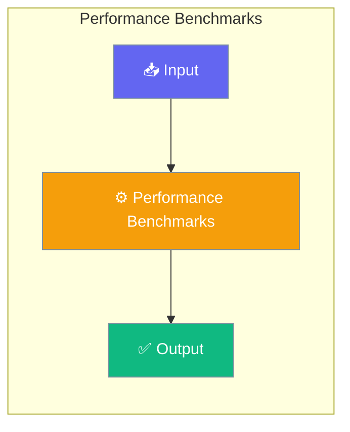

# Performance Benchmarks

PraisonAI Agents includes built-in benchmarks to measure import time, memory usage, and verify lazy imports are working correctly.




## Performance Targets

| Metric | Target | Hard Fail | Description |
|--------|--------|-----------|-------------|
| Import Time | less than 200ms | greater than 300ms | Time to import praisonaiagents |
| Memory Usage | less than 30MB | greater than 45MB | Memory after import |
| Lazy Imports | All lazy | Any eager | Heavy deps not loaded |

## Running Benchmarks

### Import Time Benchmark

```python
import subprocess
import sys

# Measure import time
code = '''
import time
start = time.perf_counter()
import praisonaiagents
end = time.perf_counter()
print(f"{(end - start) * 1000:.1f}")
'''

result = subprocess.run([sys.executable, "-c", code], capture_output=True, text=True)
print(f"Import time: {result.stdout.strip()}ms")
```

### Memory Benchmark

```python
import tracemalloc

tracemalloc.start()
import praisonaiagents
current, peak = tracemalloc.get_traced_memory()
tracemalloc.stop()

print(f"Current memory: {current / 1024 / 1024:.1f}MB")
print(f"Peak memory: {peak / 1024 / 1024:.1f}MB")
```

### Lazy Import Check

```python
import sys

# Clear any cached imports
for key in list(sys.modules.keys()):
    if key.startswith('litellm'):
        del sys.modules[key]

import praisonaiagents

# Verify heavy deps not loaded
heavy_deps = ['litellm', 'chromadb', 'mem0', 'requests']
for dep in heavy_deps:
    if dep in sys.modules:
        print(f"WARNING: {dep} loaded eagerly")
    else:
        print(f"OK: {dep} is lazy")
```

## Using the Benchmark Scripts

The package includes benchmark scripts in the `benchmarks/` directory:

```python
# Run import time benchmark
exec(open('benchmarks/import_time.py').read())

# Run memory benchmark
exec(open('benchmarks/memory_usage.py').read())
```

## CI/CD Integration

Add performance checks to your CI pipeline:

```yaml
# .github/workflows/perf.yml
name: Performance Check

on: [push, pull_request]

jobs:
  perf:
    runs-on: ubuntu-latest
    steps:
      - uses: actions/checkout@v4
      - uses: actions/setup-python@v5
        with:
          python-version: '3.11'
      - run: pip install praisonaiagents
      - run: |
          python -c "
          import time
          start = time.perf_counter()
          import praisonaiagents
          elapsed = (time.perf_counter() - start) * 1000
          print(f'Import time: {elapsed:.1f}ms')
          assert elapsed < 300, f'Import too slow: {elapsed}ms'
          "
```

## Optimization Tips

### Reduce Import Time

1. Use specific imports instead of star imports
2. Import only what you need
3. Defer imports in your own code

```python
# Good - fast import
from praisonaiagents import Agent

# Slower - imports more
from praisonaiagents import *
```

### Reduce Memory Usage

1. Use the lite package for minimal footprint
2. Avoid loading unnecessary features
3. Clear chat history when not needed

```python
# Minimal memory usage
from praisonaiagents.lite import LiteAgent

agent = LiteAgent(name="Agent", llm_fn=my_llm)
agent.chat("Hello")
agent.clear_history()  # Free memory
```

## Benchmark Results

Typical results on a modern system:

| Metric | Target | Typical | Status |
|--------|--------|---------|--------|
| Import Time | < 200ms | ~140ms | ✅ |
| Instantiation | < 50μs | ~8μs | ✅ |
| Memory/Agent | < 10KB | ~4KB | ✅ |
| Heavy Deps | Lazy | Lazy | ✅ |

### Performance Improvements Over Time

| Metric | v0.4.x | v0.5.0+ | Improvement |
|--------|--------|---------|-------------|
| Import Time | 820ms | 140ms | 83% faster |
| Memory | 93MB | 33MB | 64% less |
| litellm loaded | Eager | Lazy | Zero overhead |
| rich loaded | Eager | Lazy | Zero overhead |

### Key Performance Features

- **Lazy Loading**: Heavy dependencies (litellm, rich, chromadb) are only loaded when needed
- **Silent Mode Default**: `output="silent"` is the default for `agent.run()`, avoiding rich imports
- **Centralized Caching**: Thread-safe lazy import caching via `_lazy.py`
- **Fast Instantiation**: Agent creation takes ~8μs with minimal function calls


## Best Practices

<AccordionGroup>
  <Accordion title="Start simple">
    Enable the feature with a single parameter before adding configuration. Verify it works, then layer in options.
  </Accordion>
  <Accordion title="Use environment variables for secrets">
    Never hardcode API keys or tokens. Use `os.getenv("KEY_NAME")` to read from environment variables.
  </Accordion>
  <Accordion title="Test with minimal examples first">
    Copy the Quick Start example, run it, then extend it. This confirms your environment is set up correctly.
  </Accordion>
  <Accordion title="Check the logs">
    Set `verbose=True` on your agent to see detailed execution logs when debugging unexpected behavior.
  </Accordion>
</AccordionGroup>

## Related

- [Lazy Imports](/docs/features/lazy-imports)
- [Lite Package](/docs/features/lite-package)
- [Performance CLI](/docs/cli/performance)

## Related

<CardGroup cols={2}>
  <Card title="Features Overview" icon="grid-2" href="/docs/features">
    Browse all PraisonAI features
  </Card>
  <Card title="Quick Start" icon="rocket" href="/docs/introduction">
    Get started with PraisonAI agents
  </Card>
</CardGroup>
