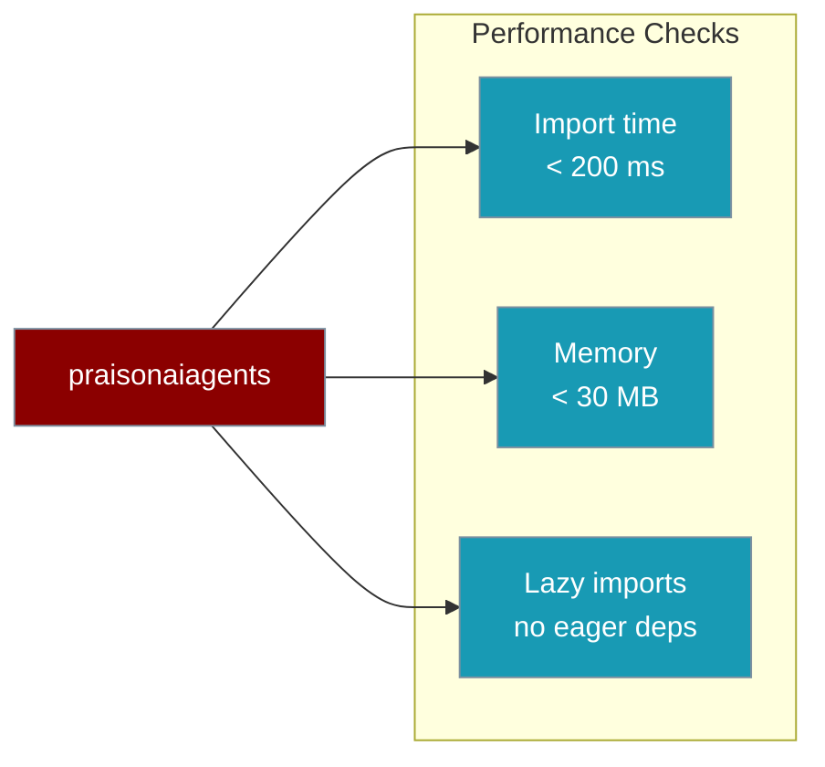
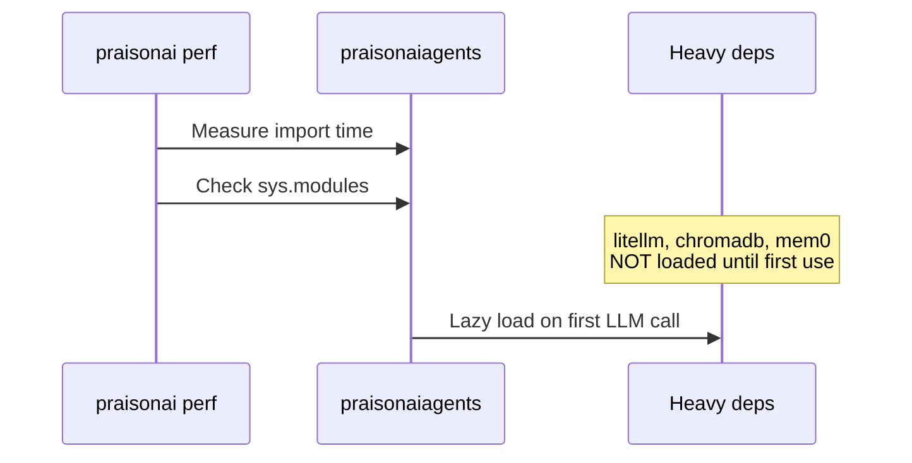

Verify your agent stack meets performance targets — import under 200 ms, heavy deps loaded only when needed.

```python
from praisonaiagents import Agent

# Silent output (default) keeps import overhead minimal
agent = Agent(name="Bench", instructions="You are helpful.")
result = agent.start("Say hello in one word")
```


The user runs a lightweight agent; benchmarks verify import time and lazy-loading stay within targets.



## Quick Start

<Steps>
<Step title="Simple Usage">

Run the built-in benchmark from the CLI:

```bash
pip install praisonai
praisonai perf benchmark
```

</Step>

<Step title="With Configuration">

Add a CI gate that fails on regressions:

```yaml
# .github/workflows/perf.yml
name: Performance Check
on: [push, pull_request]
jobs:
  perf:
    runs-on: ubuntu-latest
    steps:
      - uses: actions/checkout@v4
      - uses: actions/setup-python@v5
        with:
          python-version: "3.11"
      - run: pip install praisonaiagents
      - run: |
          python -c "
          import time
          start = time.perf_counter()
          import praisonaiagents
          elapsed = (time.perf_counter() - start) * 1000
          print(f'Import time: {elapsed:.1f}ms')
          assert elapsed < 300, f'Import too slow: {elapsed}ms'
          "
```

</Step>
</Steps>

---

## Performance Targets

| Metric | Target | Hard fail | Description |
|--------|--------|-----------|-------------|
| Import time | < 200 ms | > 300 ms | Time to `import praisonaiagents` |
| Memory usage | < 30 MB | > 45 MB | Memory after import |
| Lazy imports | All lazy | Any eager | Heavy deps not loaded at import |

---

## How It Works



### CLI commands

```bash
praisonai perf benchmark    # Full suite
praisonai perf import-time  # Import time only
praisonai perf memory       # Memory usage only
praisonai perf lazy-check   # Verify lazy imports
```

### Python benchmark scripts

From the SDK repo:

```bash
python benchmarks/import_time.py
python benchmarks/memory_usage.py
```

---

## Configuration Options

| Option | Type | Default | Description |
|--------|------|---------|-------------|
| `output` | `str` | `"silent"` | Silent mode avoids loading Rich at import |
| Import gate | CI threshold | 300 ms | Hard fail limit for CI pipelines |
| Lazy modules | `sys.modules` check | — | `litellm`, `chromadb`, `mem0`, `requests` |

Typical results on a modern system:

| Metric | Target | Typical |
|--------|--------|---------|
| Import time | < 200 ms | ~140 ms |
| Agent instantiation | < 50 μs | ~8 μs |
| Memory per agent | < 10 KB | ~4 KB |
| Heavy deps | Lazy | Lazy |

---

## Best Practices

<AccordionGroup>
<Accordion title="Use silent output in production">
`output="silent"` is the default — zero Rich overhead on the hot path. Keep it for APIs and batch jobs.
</Accordion>
<Accordion title="Import only what you need">
Prefer `from praisonaiagents import Agent` over star imports to minimise load time.
</Accordion>
<Accordion title="Gate CI on import time">
Add the 300 ms assert to your pipeline so lazy-loading regressions fail early.
</Accordion>
<Accordion title="Use LiteAgent for minimal footprint">
For embedded or high-volume use, `from praisonaiagents.lite import LiteAgent` reduces memory further.
</Accordion>
</AccordionGroup>

---

## Related

<CardGroup cols={2}>
<Card title="Lazy Imports" icon="bolt" href="/docs/features/lazy-imports">
  How lazy loading keeps startup fast
</Card>
<Card title="Performance CLI" icon="terminal" href="/docs/cli/performance">
  CLI commands for benchmarking and regression checks
</Card>
</CardGroup>
