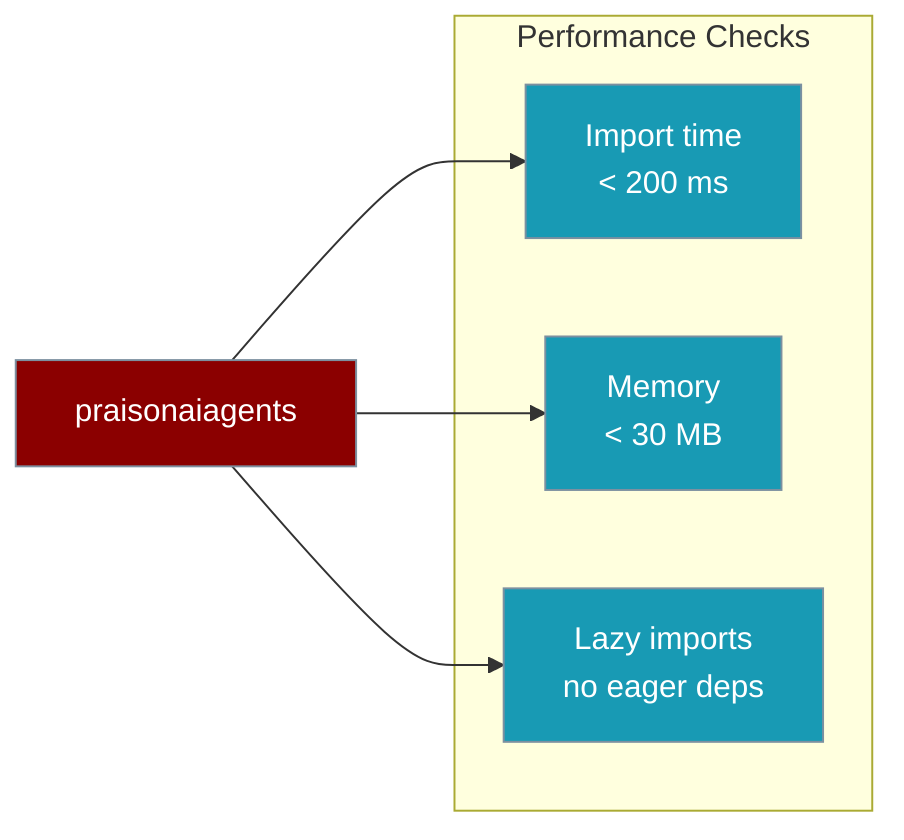
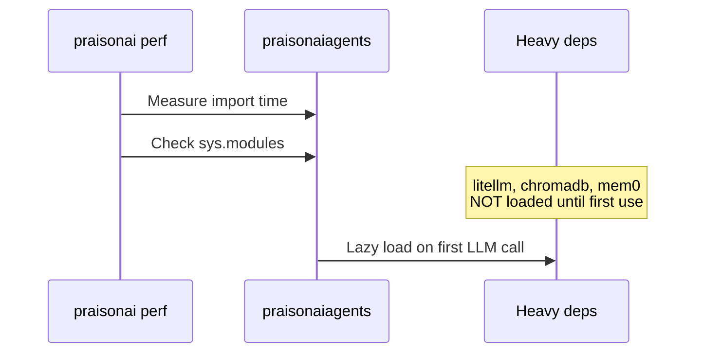

Verify your agent stack meets performance targets — import under 200 ms, heavy deps loaded only when needed.

```python
from praisonaiagents import Agent

# Silent output (default) keeps import overhead minimal
agent = Agent(name="Bench", instructions="You are helpful.")
result = agent.start("Say hello in one word")
```


The user runs a lightweight agent; benchmarks verify import time and lazy-loading stay within targets.


```mermaid
graph LR
    subgraph "Performance Checks"
        Import["Import time\n< 200 ms"]
        Memory["Memory\n< 30 MB"]
        Lazy["Lazy imports\nno eager deps"]
    end

    SDK["praisonaiagents"] --> Import
    SDK --> Memory
    SDK --> Lazy

    classDef agent fill:#8B0000,stroke:#7C90A0,color:#fff
    classDef metric fill:#189AB4,stroke:#7C90A0,color:#fff
    classDef pass fill:#10B981,stroke:#7C90A0,color:#fff

    class SDK agent
    class Import,Memory,Lazy metric
```

## Quick Start

<Steps>
<Step title="Simple Usage">

Run the built-in benchmark from the CLI:

```bash
pip install praisonai
praisonai perf benchmark
```

</Step>

<Step title="With Configuration">

Add a CI gate that fails on agent-instantiation regressions using the built-in benchmark:

```yaml
# .github/workflows/agent-performance.yml
name: agent-performance
on:
  pull_request:
    paths:
      - 'src/praisonai-agents/praisonaiagents/**'
      - 'src/praisonai-agents/benchmarks/**'
jobs:
  benchmark:
    runs-on: ubuntu-latest
    timeout-minutes: 5
    steps:
      - uses: actions/checkout@v4
      - uses: actions/setup-python@v5
        with:
          python-version: '3.11'
      - run: pip install -e src/praisonai-agents
      - name: Run benchmark with threshold gate
        working-directory: src/praisonai-agents
        run: python benchmarks/simple_benchmark.py --skip-crewai --json --fail-over-threshold | tee agent-perf-baseline.json
      - uses: actions/upload-artifact@v4
        with:
          name: agent-perf-baseline
          path: src/praisonai-agents/agent-perf-baseline.json
```

Budgets live in `src/praisonai-agents/benchmarks/thresholds.json`:

```json
{
  "praisonai_instantiation_us_max": 450,
  "iterations": 100,
  "warmup": 10
}
```

</Step>
</Steps>

---

## Performance Targets

| Metric | Target | Hard fail | Description |
|--------|--------|-----------|-------------|
| Import time | < 200 ms | > 300 ms | Time to `import praisonaiagents` |
| Memory usage | < 30 MB | > 45 MB | Memory after import |
| Lazy imports | All lazy | Any eager | Heavy deps not loaded at import |
| Agent instantiation | < 400 µs | > 450 µs | Gated by `simple_benchmark.py --fail-over-threshold` using `thresholds.json`. |

---

## How It Works


```mermaid
sequenceDiagram
    participant CLI as praisonai perf
    participant SDK as praisonaiagents
    participant Deps as Heavy deps

    CLI->>SDK: Measure import time
    CLI->>SDK: Check sys.modules
    Note over Deps: litellm, chromadb, mem0<br/>NOT loaded until first use
    SDK->>Deps: Lazy load on first LLM call
```

### CLI commands

```bash
praisonai perf benchmark    # Full suite
praisonai perf import-time  # Import time only
praisonai perf memory       # Memory usage only
praisonai perf lazy-check   # Verify lazy imports
```

### Python benchmark scripts

From the SDK repo:

```bash
python benchmarks/import_time.py
python benchmarks/memory_usage.py
```

---

## Configuration Options

| Option | Type | Default | Description |
|--------|------|---------|-------------|
| `output` | `str` | `"silent"` | Silent mode avoids loading Rich at import |
| Import gate | CI threshold | 300 ms | Hard fail limit for CI pipelines |
| Lazy modules | `sys.modules` check | — | `litellm`, `chromadb`, `mem0`, `requests` |

Typical results on a modern system:

| Metric | Target | Typical |
|--------|--------|---------|
| Import time | < 200 ms | ~140 ms |
| Agent instantiation | < 50 μs | ~8 μs |
| Memory per agent | < 10 KB | ~4 KB |
| Heavy deps | Lazy | Lazy |

<Note>
As of PR [#5630](https://github.com/MervinPraison/PraisonAI/pull/5630), `Agent.__init__` skips the plugin-manager scan entirely when no plugins are registered (the common case), trimming ~18% off init latency and ~21% off function-call count on warmed inits.
</Note>

---

## Best Practices

<AccordionGroup>
<Accordion title="Use silent output in production">
`output="silent"` is the default — zero Rich overhead on the hot path. Keep it for APIs and batch jobs.
</Accordion>
<Accordion title="Import only what you need">
Prefer `from praisonaiagents import Agent` over star imports to minimise load time.
</Accordion>
<Accordion title="Gate CI on import time">
Add the 300 ms assert to your pipeline so lazy-loading regressions fail early.
</Accordion>
<Accordion title="Use LiteAgent for minimal footprint">
For embedded or high-volume use, `from praisonaiagents.lite import LiteAgent` reduces memory further.
</Accordion>
</AccordionGroup>

---

## Related

<CardGroup cols={2}>
<Card title="Lazy Imports" icon="bolt" href="/features/lazy-imports">
  How lazy loading keeps startup fast
</Card>
<Card title="Performance CLI" icon="terminal" href="/cli/performance">
  CLI commands for benchmarking and regression checks
</Card>
<Card title="Benchmarks Reference" icon="gauge-high" href="/developers/benchmarks">
  Full `simple_benchmark.py` flag reference and `thresholds.json` schema
</Card>
</CardGroup>
