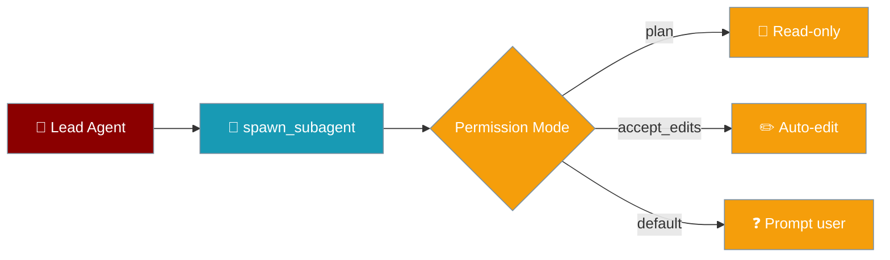
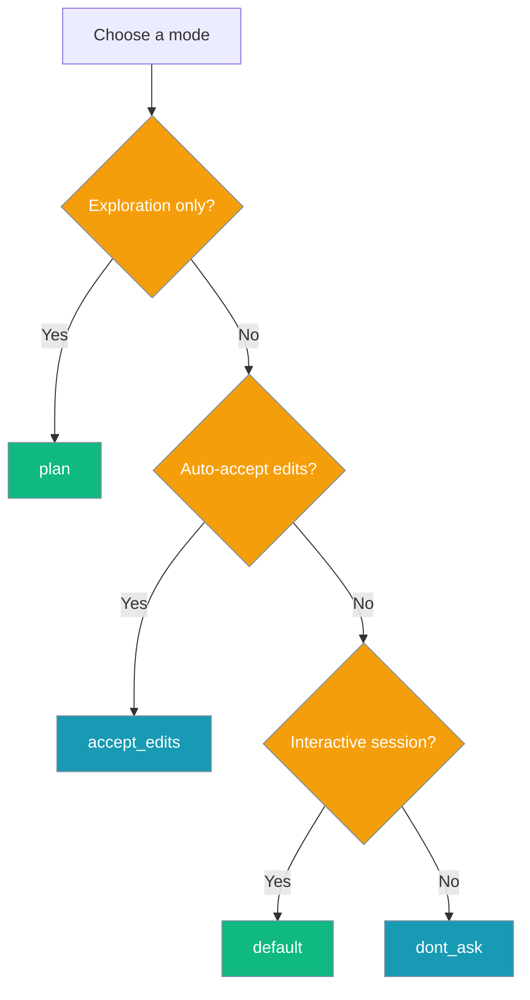

Permission modes set how subagents handle tool approval — read-only exploration, auto-accept edits, or full bypass.

<Info>
This page covers the runtime **`PermissionMode` enum** (`DEFAULT`, `PLAN`, `ACCEPT_EDITS`, `DONT_ASK`, `BYPASS`). For the declarative `mode:` field in agent definition files (`build` / `read-only` / `plan` / `review`), see [Agent Presets & Modes](/docs/features/agent-presets-and-modes).
</Info>

```python
from praisonaiagents import Agent
from praisonaiagents.tools.subagent_tool import create_subagent_tool

spawn = create_subagent_tool(default_permission_mode="plan")

agent = Agent(
    name="Lead",
    instructions="Delegate read-only exploration to subagents",
    tools=[spawn],
)
agent.start("Explore the auth module without making changes")
```


```mermaid
graph LR
    Agent[🤖 Lead Agent] --> Spawn[🔧 spawn_subagent]
    Spawn --> Mode{Permission Mode}
    Mode -->|plan| Read[📖 Read-only]
    Mode -->|accept_edits| Edit[✏️ Auto-edit]
    Mode -->|default| Ask[❓ Prompt user]

    classDef agent fill:#8B0000,stroke:#7C90A0,color:#fff
    classDef tool fill:#189AB4,stroke:#7C90A0,color:#fff
    classDef mode fill:#F59E0B,stroke:#7C90A0,color:#fff

    class Agent agent
    class Spawn tool
    class Mode,Read,Edit,Ask mode
    classDef agent fill:#8B0000,color:#fff
    classDef tool fill:#189AB4,color:#fff
```

## Quick Start

<Steps>
<Step title="Simple Usage">

```python
from praisonaiagents import Agent
from praisonaiagents.tools.subagent_tool import create_subagent_tool

spawn = create_subagent_tool(default_permission_mode="plan")

agent = Agent(name="Lead", tools=[spawn])
agent.start("Map the project structure read-only")
```

</Step>

<Step title="With Configuration">

Override the mode per subagent call:

```python
func = spawn["function"]

func(task="Explore auth", permission_mode="plan")
func(task="Fix lint in utils", permission_mode="accept_edits")
```

From the CLI:

```bash
praisonai --approval plan run "Explore the repo"
praisonai --approval accept-edits run "Fix lint errors"
```

</Step>
</Steps>

---

## Available Modes

| Mode | Value | Safety | Description |
|------|-------|--------|-------------|
| `DEFAULT` | `default` | Safe | Standard checking — prompt for each operation |
| `PLAN` | `plan` | Safe | Read-only — no write or shell operations |
| `ACCEPT_EDITS` | `accept_edits` | Moderate | Auto-accept file edits; still prompts for other ops |
| `DONT_ASK` | `dont_ask` | Moderate | Auto-deny all permission prompts |
| `BYPASS` | `bypass_permissions` | Dangerous | Skip all checks — requires explicit opt-in |


```mermaid
graph TB
    Start[Choose a mode] --> Explore{Exploration only?}
    Explore -->|Yes| Plan[plan]
    Explore -->|No| Refactor{Auto-accept edits?}
    Refactor -->|Yes| Accept[accept_edits]
    Refactor -->|No| Interactive{Interactive session?}
    Interactive -->|Yes| Default[default]
    Interactive -->|No| Dont[dont_ask]

    classDef decision fill:#F59E0B,stroke:#7C90A0,color:#fff
    classDef safe fill:#10B981,stroke:#7C90A0,color:#fff
    classDef moderate fill:#189AB4,stroke:#7C90A0,color:#fff

    class Explore,Refactor,Interactive decision
    class Plan,Default safe
    class Accept,Dont moderate
```

<Warning>
`BYPASS` skips all permission checks. For Claude Code backend, set both `ClaudeCodeBackend(unsafe=True)` and `PRAISONAI_CLAUDE_BYPASS_PERMISSIONS=1`.
</Warning>

---

## Configuration Options

| Option | Type | Default | Description |
|--------|------|---------|-------------|
| `default_permission_mode` | `str` | `None` | Default mode for all subagents from `create_subagent_tool` |
| `permission_mode` | `str` | `None` | Per-call override on `spawn_subagent` |
| `--approval` | CLI flag | TTY-dependent | Maps to modes: `console`, `plan`, `accept-edits`, `bypass` |

CLI mapping:

| `PermissionMode` | Enum value | CLI flag |
|------------------|------------|----------|
| `DEFAULT` | `default` | `--approval console` |
| `PLAN` | `plan` | `--approval plan` |
| `ACCEPT_EDITS` | `accept_edits` | `--approval accept-edits` |
| `BYPASS` | `bypass_permissions` | `--approval bypass` |
| `DONT_ASK` | `dont_ask` | Non-interactive only (`--yes` / `PRAISONAI_NON_INTERACTIVE=1`) |

---

## Best Practices

<AccordionGroup>
<Accordion title="Use plan for exploration subagents">
Set `default_permission_mode="plan"` when subagents only read and analyse code — prevents accidental file changes.
</Accordion>
<Accordion title="Match mode to task scope">
Exploration → `plan`. Refactoring → `accept_edits`. Interactive work → `default`.
</Accordion>
<Accordion title="Never use bypass in production">
Reserve `bypass_permissions` for fully trusted local development environments only.
</Accordion>
<Accordion title="Log the active mode">
Record which permission mode is active for audit trails when running non-default modes.
</Accordion>
</AccordionGroup>

---

## Related

<CardGroup cols={2}>
<Card title="Permissions Module" icon="shield-halved" href="/docs/features/permissions">
  Pattern-based allow, deny, and ask rules
</Card>
<Card title="Interactive Approval" icon="shield-check" href="/docs/features/interactive-approval">
  Terminal approval experience for tool calls
</Card>
</CardGroup>
