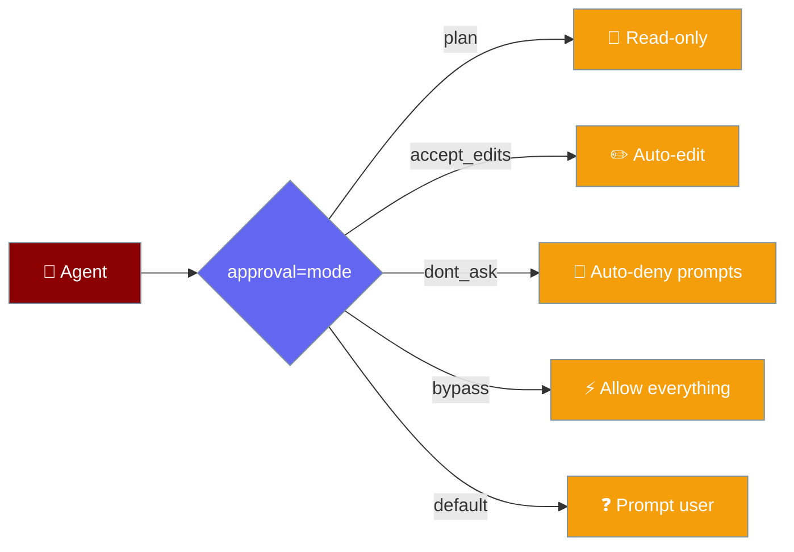
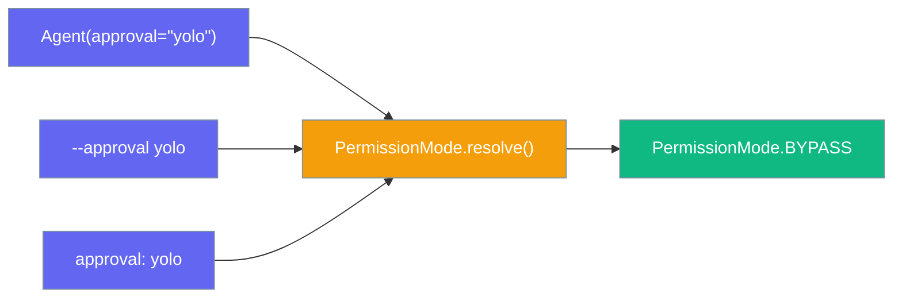
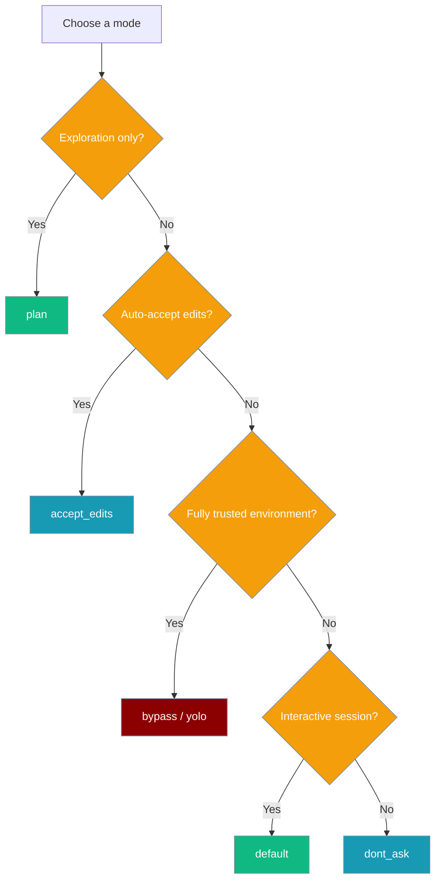

Permission modes set how much an agent may do — read-only exploration, auto-accept edits, or full bypass — from a single `approval=` string on the Agent.

<Info>
This page covers the runtime **`PermissionMode` enum** (`DEFAULT`, `PLAN`, `ACCEPT_EDITS`, `DONT_ASK`, `BYPASS`). For the declarative `mode:` field in agent definition files (`build` / `read-only` / `plan` / `review`), see [Agent Presets & Modes](/features/agent-presets-and-modes).
</Info>

```python
from praisonaiagents import Agent

agent = Agent(
    name="Explorer",
    instructions="Map the auth module without making changes",
    tools=["read_file", "write_file", "execute_command"],
    approval="plan",   # read-only — write/exec tools are pruned
)
agent.start("Explore the auth module")
```

The user asks the agent to explore; `approval="plan"` keeps it read-only, so write and shell tools never run.


```mermaid
graph LR
    Agent[🤖 Agent] --> Mode{approval=mode}
    Mode -->|plan| Read[📖 Read-only]
    Mode -->|accept_edits| Edit[✏️ Auto-edit]
    Mode -->|dont_ask| Deny[🚫 Auto-deny prompts]
    Mode -->|bypass| All[⚡ Allow everything]
    Mode -->|default| Ask[❓ Prompt user]

    classDef agent fill:#8B0000,stroke:#7C90A0,color:#fff
    classDef config fill:#6366F1,stroke:#7C90A0,color:#fff
    classDef mode fill:#F59E0B,stroke:#7C90A0,color:#fff

    class Agent agent
    class Mode config
    class Read,Edit,Deny,All,Ask mode
```

## Quick Start

<Steps>
<Step title="Simple Usage">

Pass a mode string straight to the Agent:

```python
from praisonaiagents import Agent

agent = Agent(
    name="Explorer",
    instructions="Map the project structure read-only",
    tools=["read_file", "write_file"],
    approval="plan",
)
agent.start("Map the project structure")
```

</Step>

<Step title="Delegate to a subagent">

The same mode strings work when spawning subagents:

```python
from praisonaiagents import Agent
from praisonaiagents.tools.subagent_tool import create_subagent_tool

spawn = create_subagent_tool(default_permission_mode="plan")

agent = Agent(name="Lead", tools=[spawn])
agent.start("Explore the auth module without making changes")
```

Override the mode per subagent call:

```python
func = spawn["function"]

func(task="Explore auth", permission_mode="plan")
func(task="Fix lint in utils", permission_mode="accept_edits")
```

</Step>

<Step title="From the CLI">

```bash
praisonai --approval plan run "Explore the repo"
praisonai --approval accept-edits run "Fix lint errors"
praisonai --approval yolo run "Rebuild everything"
```

</Step>
</Steps>

---

## Every alias resolves to the same mode

One string vocabulary spans every surface — `PermissionMode.resolve()` maps all of these onto five canonical modes. Matching is **case-insensitive**, and `-` and `_` are interchangeable.

| Canonical mode | All spellings that resolve to it |
|---|---|
| `PermissionMode.DEFAULT` | `default`, `ask`, `suggest`, `prompt` |
| `PermissionMode.PLAN` | `plan` |
| `PermissionMode.ACCEPT_EDITS` | `accept_edits`, `auto_edit` |
| `PermissionMode.DONT_ASK` | `dont_ask`, `no_ask`, `reject` |
| `PermissionMode.BYPASS` | `bypass`, `bypass_permissions`, `yolo`, `full_auto` |

```python
from praisonaiagents import Agent

Agent(approval="plan")           # PermissionMode.PLAN — read-only
Agent(approval="bypass")         # PermissionMode.BYPASS — approve everything
Agent(approval="accept_edits")   # ACCEPT_EDITS — auto-approve edits, ask for the rest
Agent(approval="dont_ask")       # DONT_ASK — deny anything that would prompt
Agent(approval="Accept-Edits")   # same as accept_edits (case + dash normalized)
Agent(approval="yolo")           # BYPASS alias
Agent(approval="auto_edit")      # ACCEPT_EDITS alias
Agent(approval="full_auto")      # BYPASS alias
Agent(approval="suggest")        # DEFAULT alias
Agent(approval="reject")         # DONT_ASK alias
```

<Info>
Library authors can call the resolver directly:

```python
from praisonaiagents.permissions.rules import PermissionMode

PermissionMode.resolve("yolo")          # PermissionMode.BYPASS
PermissionMode.resolve("Accept-Edits")  # PermissionMode.ACCEPT_EDITS
PermissionMode.resolve("safe")          # None  (deny-set preset, not a mode)
PermissionMode.resolve("nonsense")      # None
PermissionMode.resolve(None)            # None
PermissionMode.resolve(PermissionMode.PLAN)  # PermissionMode.PLAN (pass-through)
```
</Info>

On `praisonai run` and `praisonai code`, the standalone `--plan` boolean flag is a discoverable shortcut for `--approval plan`; both resolve to `PermissionMode.PLAN`.

---

## One vocabulary across every surface

Python, CLI, and YAML all route a preset name through the same resolver, so `yolo` means the same thing everywhere.


```mermaid
graph LR
    Py["Agent(approval=&quot;yolo&quot;)"] --> R
    CLI["--approval yolo"] --> R
    YAML["approval: yolo"] --> R
    R["PermissionMode.resolve()"] --> B["PermissionMode.BYPASS"]

    classDef surface fill:#6366F1,stroke:#7C90A0,color:#fff
    classDef resolver fill:#F59E0B,stroke:#7C90A0,color:#fff
    classDef mode fill:#10B981,stroke:#7C90A0,color:#fff

    class Py,CLI,YAML surface
    class R resolver
    class B mode
```

---

## Mode presets vs deny-set presets

`Agent(approval=…)` accepts two families of strings — they look alike but do different things.

| Family | Values | What it does | Where it's defined |
|---|---|---|---|
| **Mode presets** | `plan`, `accept_edits`, `dont_ask`, `bypass`, `default` (+ aliases) | Applies a `PermissionMode` — governs tool calls at approval-decision time | `praisonaiagents/permissions/rules.py` |
| **Deny-set presets** | `safe`, `read_only`, `full`, `off` | Applies a pattern-based deny set — tools are pruned from the LLM's schema | `praisonaiagents/approval/registry.py` |

Both are valid on `Agent(approval=…)`. Deny-set presets are matched **first**, so `safe`/`read_only`/`full`/`off` behave exactly as before; mode presets are checked only after, so no existing behaviour changes.

<Note>
`safe`, `read_only`, `full`, and `off` are **not** modes — `PermissionMode.resolve()` returns `None` for them, and the deny-set machinery handles them separately.
</Note>

---

## Available Modes

| Mode | Value | Safety | Description |
|------|-------|--------|-------------|
| `DEFAULT` | `default` | Safe | Standard checking — prompt for each operation |
| `PLAN` | `plan` | Safe | Read-only — no write or shell operations |
| `ACCEPT_EDITS` | `accept_edits` | Moderate | Auto-approves file edit/write tools (`write*`, `edit*`, `append*`, `create*`, `mkdir*`, `save*`, `insert*`, `patch*`, `apply_patch*`); every other tool defers to the normal approval flow |
| `DONT_ASK` | `dont_ask` | Moderate | Auto-deny anything that would otherwise prompt |
| `BYPASS` | `bypass_permissions` | Dangerous | Skip all checks — requires explicit opt-in |

Under `accept_edits`, `write_file`, `edit_file`, `create_file`, and `apply_patch` run silently — while `execute_command`, `delete_file`, and `read_file` still gate through the normal flow.

<Note>
`default` and `plan` modes use the pattern engine end-to-end: pattern-based `deny` rules both hide tools at schema-build time and enforce at call time. MCP tools are covered by the same gate. See [Approval › How tools are pruned from the LLM](/docs/features/approval#how-tools-are-pruned-from-the-llm).
</Note>


```mermaid
graph TB
    Start[Choose a mode] --> Explore{Exploration only?}
    Explore -->|Yes| Plan[plan]
    Explore -->|No| Refactor{Auto-accept edits?}
    Refactor -->|Yes| Accept[accept_edits]
    Refactor -->|No| Trust{Fully trusted environment?}
    Trust -->|Yes| Bypass[bypass / yolo]
    Trust -->|No| Interactive{Interactive session?}
    Interactive -->|Yes| Default[default]
    Interactive -->|No| Dont[dont_ask]

    classDef decision fill:#F59E0B,stroke:#7C90A0,color:#fff
    classDef safe fill:#10B981,stroke:#7C90A0,color:#fff
    classDef moderate fill:#189AB4,stroke:#7C90A0,color:#fff
    classDef danger fill:#8B0000,stroke:#7C90A0,color:#fff

    class Explore,Refactor,Interactive,Trust decision
    class Plan,Default safe
    class Accept,Dont moderate
    class Bypass danger
```

<Warning>
`BYPASS` skips all permission checks. For Claude Code backend, set both `ClaudeCodeBackend(unsafe=True)` and `PRAISONAI_CLAUDE_BYPASS_PERMISSIONS=1`.
</Warning>

---

## Configuration Options

| Option | Type | Default | Description |
|--------|------|---------|-------------|
| `approval` | `str` | `None` | Agent-level mode or deny-set preset (e.g. `"plan"`, `"yolo"`, `"safe"`) |
| `default_permission_mode` | `str` | `None` | Default mode for all subagents from `create_subagent_tool` |
| `permission_mode` | `str` | `None` | Per-call override on `spawn_subagent` |
| `--approval` | CLI flag | TTY-dependent | Maps to modes and deny-set presets |

CLI mapping:

| `PermissionMode` | Enum value | CLI flags (dashes ≡ underscores) |
|------------------|------------|----------------------------------|
| `DEFAULT` | `default` | `--approval console`, `--approval default`, `--approval ask`, `--approval suggest`, `--approval prompt` |
| `PLAN` | `plan` | `--approval plan`, **`--plan` (shortcut on run / code)** |
| `ACCEPT_EDITS` | `accept_edits` | `--approval accept-edits`, `--approval auto-edit` |
| `DONT_ASK` | `dont_ask` | `--approval dont-ask`, `--approval no-ask`, `--approval reject` |
| `BYPASS` | `bypass_permissions` | `--approval bypass`, `--approval bypass-permissions`, `--approval yolo`, `--approval full-auto` |

<Note>
CLI dashes and Python underscores are equivalent — `--approval accept-edits` and `Agent(approval="accept_edits")` resolve to the same mode.
</Note>

---

## Best Practices

<AccordionGroup>
<Accordion title="Use plan for exploration agents">
Set `approval="plan"` when an agent only reads and analyses code — write and shell tools are pruned, preventing accidental changes.
</Accordion>
<Accordion title="Match mode to task scope">
Exploration → `plan`. Refactoring → `accept_edits`. Interactive work → `default`. Trusted automation → `bypass`.
</Accordion>
<Accordion title="Never use bypass in production">
Reserve `bypass` (and its `yolo` / `full_auto` aliases) for fully trusted local development environments only.
</Accordion>
<Accordion title="Prefer accept_edits over bypass for refactors">
`accept_edits` auto-approves file writes but still gates shell exec and deletes — safer than `bypass` when you only need edits to flow.
</Accordion>
</AccordionGroup>

---

## Related

<CardGroup cols={2}>
<Card title="Approval" icon="shield-check" href="/features/approval">
  Require human approval before agents run dangerous tools
</Card>
<Card title="Permissions Module" icon="shield-halved" href="/features/permissions">
  Pattern-based allow, deny, and ask rules
</Card>
<Card title="Interactive Approval" icon="shield-check" href="/features/interactive-approval">
  Terminal approval experience for tool calls
</Card>
<Card title="Agent Presets & Modes" icon="robot" href="/features/agent-presets-and-modes">
  Declarative `mode:` field in agent definition files
</Card>
</CardGroup>
