Permission modes provide predefined permission behaviors for agents, controlling how they handle permission requests during execution.

```mermaid
graph LR
    subgraph "Permission Mode Flow"
        A[🤖 Agent Action] --> B{Permission Check}
        B --> C[🔒 Mode Applied]
        C --> D{Decision}
        D -->|Allow| E[✅ Execute]
        D -->|Deny| F[❌ Block]
        D -->|Ask| G[❓ Prompt User]
    end
    
    classDef agent fill:#8B0000,stroke:#7C90A0,color:#fff
    classDef check fill:#F59E0B,stroke:#7C90A0,color:#fff
    classDef result fill:#10B981,stroke:#7C90A0,color:#fff
    classDef block fill:#EF4444,stroke:#7C90A0,color:#fff
    classDef ask fill:#189AB4,stroke:#7C90A0,color:#fff
    
    class A agent
    class B,C,D check
    class E result
    class F block
    class G ask
```



## Quick Start

<Steps>

<Step title="Import Permission Mode">
```python
from praisonaiagents.permissions import PermissionMode
```
</Step>

<Step title="Use with Subagents">
```python
from praisonaiagents.tools.subagent_tool import create_subagent_tool

# Create subagent tool with permission mode
tool = create_subagent_tool(
    default_permission_mode="plan"  # Read-only mode
)

# Spawn subagent
func = tool["function"]
result = func(task="Explore the codebase")
```
</Step>

</Steps>

---

## Available Modes

```mermaid
graph TB
    subgraph "Permission Modes"
        DEFAULT[🔒 DEFAULT<br/>Standard checking]
        ACCEPT[✏️ ACCEPT_EDITS<br/>Auto-accept edits]
        DONT[🚫 DONT_ASK<br/>Auto-deny prompts]
        BYPASS[⚡ BYPASS<br/>Skip all checks]
        PLAN[📋 PLAN<br/>Read-only mode]
    end
    
    classDef safe fill:#10B981,stroke:#7C90A0,color:#fff
    classDef moderate fill:#F59E0B,stroke:#7C90A0,color:#fff
    classDef dangerous fill:#EF4444,stroke:#7C90A0,color:#fff
    
    class DEFAULT,PLAN safe
    class ACCEPT,DONT moderate
    class BYPASS dangerous
```



| Mode | Value | Safety | Description |
|------|-------|--------|-------------|
| `DEFAULT` | `default` | ✅ Safe | Standard permission checking - prompts for each operation |
| `ACCEPT_EDITS` | `accept_edits` | ⚠️ Moderate | Auto-accepts file edit operations without prompting |
| `DONT_ASK` | `dont_ask` | ⚠️ Moderate | Auto-denies all permission prompts |
| `BYPASS` | `bypass_permissions` | 🔴 Dangerous | Skips all permission checks entirely |
| `PLAN` | `plan` | ✅ Safe | Read-only exploration mode - no modifications allowed |

---

## Mode Details

<AccordionGroup>

<Accordion title="DEFAULT - Standard Permission Checking">

The default mode prompts for permission on each operation that requires approval.

```python
from praisonaiagents.permissions import PermissionMode

mode = PermissionMode.DEFAULT
print(mode.value)  # "default"
```

**Behavior:**
- Prompts user for each permission request
- Follows configured permission rules
- Safest mode for production use
</Accordion>

<Accordion title="ACCEPT_EDITS - Auto-Accept File Edits">

Automatically accepts file edit operations without user confirmation.

```python
from praisonaiagents.permissions import PermissionMode

mode = PermissionMode.ACCEPT_EDITS
print(mode.value)  # "accept_edits"
```

**Behavior:**
- Auto-approves file write operations
- Still prompts for other operations
- Useful for automated refactoring tasks

<Warning>
Use with caution - agents can modify files without confirmation.
</Warning>

</Accordion>

<Accordion title="DONT_ASK - Auto-Deny Prompts">

Automatically denies all permission prompts without user interaction.

```python
from praisonaiagents.permissions import PermissionMode

mode = PermissionMode.DONT_ASK
print(mode.value)  # "dont_ask"
```

**Behavior:**
- Auto-denies all permission requests
- Agent continues with read-only operations
- Useful for safe exploration tasks
</Accordion>

<Accordion title="BYPASS - Skip All Checks">

Bypasses all permission checks entirely.

```python
from praisonaiagents.permissions import PermissionMode

mode = PermissionMode.BYPASS
print(mode.value)  # "bypass_permissions"
```

**Behavior:**
- No permission checks performed
- All operations allowed
- Maximum agent autonomy

<Danger>
**Security Risk**: Only use in fully trusted environments. Agent can perform any operation without restriction.
</Danger>

</Accordion>

<Accordion title="PLAN - Read-Only Exploration">

Restricts agent to read-only operations for safe exploration.

```python
from praisonaiagents.permissions import PermissionMode

mode = PermissionMode.PLAN
print(mode.value)  # "plan"
```

**Behavior:**
- Only read operations allowed
- Write/modify operations blocked
- Perfect for codebase exploration

<Tip>
Recommended for subagents that only need to analyze code without making changes.
</Tip>

</Accordion>

</AccordionGroup>

---

## Usage with Subagents

### Default Mode for All Subagents

```python
from praisonaiagents.tools.subagent_tool import create_subagent_tool

# All subagents use plan mode by default
tool = create_subagent_tool(
    default_permission_mode="plan"
)
```

### Per-Call Override

```python
func = tool["function"]

# This call uses plan mode (read-only)
result1 = func(
    task="Explore the auth module",
    permission_mode="plan"
)

# This call uses accept_edits mode
result2 = func(
    task="Refactor the utils module",
    permission_mode="accept_edits"
)
```

### Combined with Model Selection

```python
tool = create_subagent_tool(
    default_llm="gpt-4o-mini",
    default_permission_mode="plan"
)

func = tool["function"]
result = func(
    task="Analyze code patterns",
    llm="gpt-4o",  # Override model
    permission_mode="default"  # Override permission mode
)
```

---

## Best Practices

<AccordionGroup>

<Accordion title="Use PLAN mode for exploration">
When subagents only need to read and analyze code, use `plan` mode to prevent accidental modifications.
</Accordion>

<Accordion title="Avoid BYPASS in production">
The `bypass_permissions` mode should only be used in controlled development environments, never in production.
</Accordion>

<Accordion title="Match mode to task">
Choose the permission mode that matches the task requirements:
- **Exploration tasks** → `plan`
- **Refactoring tasks** → `accept_edits`
- **Interactive tasks** → `default`
</Accordion>

<Accordion title="Log permission decisions">
When using non-default modes, log the permission mode being used for audit purposes.
</Accordion>

</AccordionGroup>

---

## Related

<CardGroup cols={2}>
  <Card title="Permissions Module" icon="shield-halved" href="/docs/features/permissions">
    Pattern-based permission rules
  </Card>
  <Card title="Subagent Delegation" icon="users" href="/docs/features/subagent-delegation">
    Spawn and manage subagents
  </Card>
</CardGroup>
