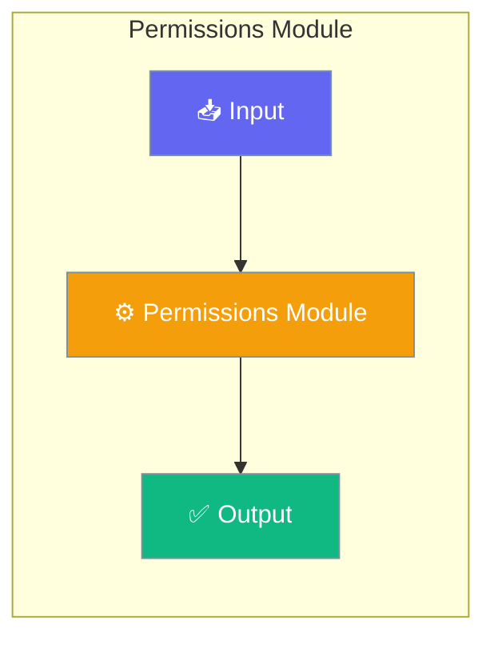

# Permissions Module

<Info>
Looking for the CLI? See [`praisonai permissions`](/docs/cli/permissions) and the [Interactive Tool Approval](/docs/features/interactive-approval) guide.
</Info>

The Permissions module provides pattern-based permission rules, persistent approval storage, and doom loop detection for safe agent execution.


```mermaid
graph LR
    subgraph "Permissions Module"
        A[📥 Input] --> B[⚙️ Permissions Module]
        B --> C[✅ Output]
    end

    classDef input fill:#6366F1,stroke:#7C90A0,color:#fff
    classDef process fill:#F59E0B,stroke:#7C90A0,color:#fff
    classDef output fill:#10B981,stroke:#7C90A0,color:#fff

    class A input
    class B process
    class C output
```


## Features

- **Pattern-Based Rules** - Allow, deny, or ask based on glob/regex patterns
- **Persistent Approvals** - Remember user decisions across sessions
- **Doom Loop Detection** - Prevent agents from getting stuck in loops
- **Per-Agent Rules** - Different rules for different agents

## Quick Start


<Steps>
<Step title="Quick Start">
```python
from praisonaiagents.permissions import (
    PermissionManager,
    PermissionRule,
    PermissionAction,
    PersistentApproval,
    DoomLoopDetector,
)

# Create permission manager
manager = PermissionManager()

# Add rules
manager.add_rule(PermissionRule(
    pattern="bash:rm *",
    action=PermissionAction.DENY,
    description="Block rm commands"
))

manager.add_rule(PermissionRule(
    pattern="read:*",
    action=PermissionAction.ALLOW,
    description="Allow all read operations"
))

# Check permission
result = manager.check("bash:rm -rf /tmp")
print(f"Action: {result.action}")  # deny
```
</Step>
</Steps>


## Best Practices

<AccordionGroup>
  <Accordion title="Start simple">
    Enable the feature with a single parameter before adding configuration. Verify it works, then layer in options.
  </Accordion>
  <Accordion title="Use environment variables for secrets">
    Never hardcode API keys or tokens. Use `os.getenv("KEY_NAME")` to read from environment variables.
  </Accordion>
  <Accordion title="Test with minimal examples first">
    Copy the Quick Start example, run it, then extend it. This confirms your environment is set up correctly.
  </Accordion>
  <Accordion title="Check the logs">
    Set `verbose=True` on your agent to see detailed execution logs when debugging unexpected behavior.
  </Accordion>
</AccordionGroup>

## Related

<CardGroup cols={2}>
  <Card title="Features Overview" icon="grid-2" href="/docs/features">
    Browse all PraisonAI features
  </Card>
  <Card title="Quick Start" icon="rocket" href="/docs/introduction">
    Get started with PraisonAI agents
  </Card>
</CardGroup>
