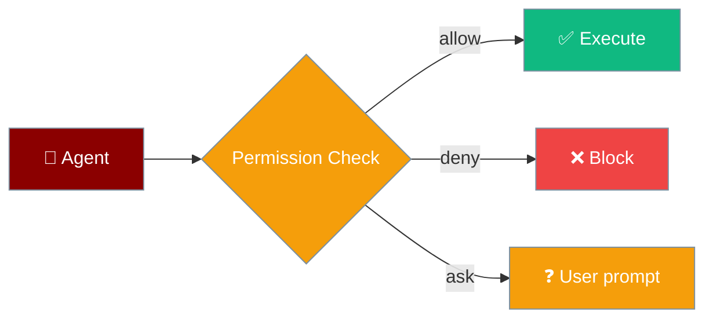

Pattern-based rules let you allow, deny, or ask about tool calls — with persistent approvals and doom loop detection.

<Info>
For the CLI, see [`praisonai permissions`](/docs/cli/permissions) and [Interactive Tool Approval](/docs/features/interactive-approval).
</Info>

<Note>
To also block reads, writes, and shell commands **outside** a project root, see [Workspace Boundary](/docs/features/workspace-boundary).
</Note>

```python
from praisonaiagents import Agent

agent = Agent(
    name="Safe Coder",
    instructions="Run shell commands safely",
    approval={
        "permissions": {
            "read:*": "allow",
            "bash:rm *": "deny",
            "*": "ask",
        },
    },
)
agent.start("List files in the project root")
```


The user prompts the agent; permission rules allow, deny, or ask before each tool executes.


```mermaid
graph LR
    Agent[🤖 Agent] --> Check{Permission Check}
    Check -->|allow| Run[✅ Execute]
    Check -->|deny| Block[❌ Block]
    Check -->|ask| Prompt[❓ User prompt]

    classDef agent fill:#8B0000,stroke:#7C90A0,color:#fff
    classDef check fill:#F59E0B,stroke:#7C90A0,color:#fff
    classDef ok fill:#10B981,stroke:#7C90A0,color:#fff
    classDef block fill:#EF4444,stroke:#7C90A0,color:#fff

    class Agent agent
    class Check check
    class Run ok
    class Block block
    class Prompt check
```

## Quick Start

<Steps>
<Step title="Simple Usage">

```python
from praisonaiagents import Agent

agent = Agent(
    name="CI Worker",
    instructions="Run safely without prompts",
    approval={
        "permissions": {
            "read:*": "allow",
            "bash:rm *": "deny",
        },
    },
)
agent.start("Check the deployment status")
```

</Step>

<Step title="With Configuration">

Use `PermissionManager` directly for programmatic rule management:

```python
from praisonaiagents.permissions import (
    PermissionManager,
    PermissionRule,
    PermissionAction,
)

manager = PermissionManager()
manager.add_rule(PermissionRule(
    pattern="bash:rm *",
    action=PermissionAction.DENY,
    description="Block destructive commands",
))
manager.add_rule(PermissionRule(
    pattern="read:*",
    action=PermissionAction.ALLOW,
))

result = manager.check("bash:rm -rf /tmp")
print(result.is_denied)  # True
```

For YAML and CLI surfaces, see [Declarative Permissions](/docs/features/declarative-permissions).

</Step>
</Steps>

---

## Permission Actions

| Action | Description |
|--------|-------------|
| `ALLOW` | Automatically allow the operation |
| `DENY` | Automatically deny the operation |
| `ASK` | Require user approval |

<Info>
Since `praisonai-agents` v1.6.91, tools matched as `deny` are also **removed from the LLM-advertised set** (function schema and system prompt) — not just blocked at execution. See [Approval › How tools are pruned from the LLM](/docs/features/approval#how-tools-are-pruned-from-the-llm).
</Info>

---

## Permission Modes

Global modes for subagent delegation — see [Permission Modes](/docs/features/permission-modes) for full details.

| Mode | Value | Description |
|------|-------|-------------|
| `DEFAULT` | `default` | Standard permission checking |
| `PLAN` | `plan` | Read-only exploration |
| `ACCEPT_EDITS` | `accept_edits` | Auto-accept file edits |
| `DONT_ASK` | `dont_ask` | Auto-deny all prompts |
| `BYPASS` | `bypass_permissions` | Skip all checks |

---

## Configuration Options

### PermissionRule

| Option | Type | Default | Description |
|--------|------|---------|-------------|
| `pattern` | `str` | — | Glob or regex pattern to match |
| `action` | `PermissionAction` | `ASK` | `allow`, `deny`, or `ask` |
| `description` | `str` | `""` | Human-readable description |
| `is_regex` | `bool` | `False` | Use regex instead of glob |
| `priority` | `int` | `0` | Higher priority rules checked first |
| `agent_name` | `str` | `None` | Apply to a specific agent only |
| `enabled` | `bool` | `True` | Whether the rule is active |

### PermissionManager

| Option | Type | Default | Description |
|--------|------|---------|-------------|
| `storage_dir` | `str` | `~/.praisonai/permissions` | Directory for persistent approvals |
| `agent_name` | `str` | `None` | Filter rules to one agent |
| `approval_callback` | `Callable` | `None` | Custom callback for user approval |
| `workspace_root` | `str` | `None` | Optional project/workspace root. When set, shell and file targets that resolve outside this root emit a distinct `external_dir:<parent>/*` sub-target defaulting to `ask`. When `None`, no boundary check runs (backward compatible). See [Workspace Boundary](/docs/features/workspace-boundary). |

### PersistentApproval

| Option | Type | Default | Description |
|--------|------|---------|-------------|
| `pattern` | `str` | — | Glob pattern this approval covers (fnmatch semantics) |
| `approved` | `bool` | — | Whether the action was approved |
| `scope` | `str` | `"once"` | `once`, `session`, or `always` |
| `derived` | `bool` | `False` | `True` when `pattern` was auto-generated by [reusable-scope derivation](#reusable-command-prefix-approvals). Gates a small bare-prefix match extension so `bash:git status *` also matches the bare `bash:git status`. User-authored globs stay pure fnmatch. |

---

### PermissionManager.approve()

Record an approval decision. Returns a `PersistentApproval`.

| Arg | Type | Default | Description |
|-----|------|---------|-------------|
| `target` | `str` | — | The exact action being approved, e.g. `"bash:git status -s"` |
| `approved` | `bool` | — | `True` to allow, `False` to deny |
| `scope` | `str` | `"once"` | `once` (this call only), `session` (this process), `always` (persisted) |
| `agent_name` | `str` \| `None` | `None` | Restrict this approval to one agent |
| `reusable_scope` | `bool` | `False` | Opt in to store a generalised prefix glob instead of the literal `target` (see [Reusable command-prefix approvals](#reusable-command-prefix-approvals)). Ignored when `scope="once"`. |
| `pattern` | `str` \| `None` | `None` | Explicit pattern to store. Overrides both `target` and `reusable_scope` — useful when CLI/UI displays a suggested scope for the user to edit before saving. |

---

## Reusable command-prefix approvals

Approving `git status` once should not force a new prompt for `git status -s`. Opt in with `reusable_scope=True` on a `session`/`always` approval and PraisonAI derives a generalised glob from a small command-arity table:

| Command approved | Stored pattern | Also allows |
|---|---|---|
| `bash:git status -s` | `bash:git status *` | `bash:git status`, `bash:git status .` |
| `bash:npm run build` | `bash:npm run *` | `bash:npm run test`, `bash:npm run lint` |
| `bash:docker compose up -d` | `bash:docker compose *` | `bash:docker compose down`, `bash:docker compose logs` |
| `bash:ls -la` | `bash:ls *` | `bash:ls`, `bash:ls src/` |

```python
from praisonaiagents.permissions import PermissionManager

manager = PermissionManager()

# Preview what would be stored (safe to call — never records anything)
suggested = manager.suggest_scope_pattern("bash:git status -s")
# → "bash:git status *"

# Record the approval with the reusable prefix
manager.approve(
    "bash:git status -s",
    approved=True,
    scope="always",
    reusable_scope=True,
)

manager.check("bash:git status").is_allowed   # True
manager.check("bash:git status .").is_allowed  # True
manager.check("bash:git commit").needs_approval  # True — different subcommand still asks
```

### What is NOT generalised (conservative by design)

| Input | Result | Why |
|---|---|---|
| `bash:git` (bare, no subcommand) | `bash:git` (literal) | A globbed prefix would auto-approve every git subcommand |
| `bash:cd /tmp && rm x` | literal | A `&&`/`\|`/`;`/`$()`/`>` operator would swallow the second command into the reusable scope |
| `bash:rm *` (already a glob) | `bash:rm *` (unchanged) | The user has already declared the pattern they want |
| `read:/etc/hosts` | `read:/etc/hosts` (unchanged) | Only `bash:`/`shell:` targets are generalised |
| Unknown command (`cowsay hello`) | `bash:cowsay *` | Matches only trailing args, never the whole command space |

### The `derived` flag

A reusable-scope approval is stored with `derived=True` (persisted in `approvals.json`). That flag gates a small extra rule in `PersistentApproval.matches`: for a derived pattern that ends in `" *"` and starts with `bash:`/`shell:`, the bare prefix also matches. So `bash:git status *` (derived) matches both `bash:git status -s` **and** the plain `bash:git status`.

Your own hand-authored `bash:rm *` keeps exact fnmatch semantics: `bash:rm` does **not** match it, matching the behaviour you had before this feature.

### Custom arity table

The default table covers common tools (`git`, `gh`, `npm`, `pnpm`, `pip`, `cargo`, `go`, `docker`, `docker compose`, `kubectl`, `helm`, `python`, `pytest`, `ruff`, `apt`, `brew`, `systemctl`, and more). Longest multi-word key wins (so `docker compose` beats `docker`). To override for one call, use the low-level helpers:

```python
from praisonaiagents.permissions import derive_pattern, command_prefix

command_prefix(["mytool", "run", "job"], {"mytool": 2})
# → "mytool run"

derive_pattern("bash:mytool run job", {"mytool": 2})
# → "bash:mytool run *"
```

---

## How It Works

Compound shell commands (`&&`, `||`, `|`, subshells) are decomposed and evaluated independently — deny beats ask beats allow. See [Command-Aware Permissions](/docs/features/command-aware-permissions).

When `workspace_root` is set, any path that escapes the root emits an `external_dir:<parent>/*` sub-target — a first-class permission target alongside `bash:`, `write:`, and `read:`. Set it once to stop broad approvals from granting whole-machine access. See [Workspace Boundary](/docs/features/workspace-boundary).

```python
manager = PermissionManager()
manager.add_rule(PermissionRule(pattern="bash:rm *", action=PermissionAction.DENY))

manager.check("bash:cd /tmp && rm -rf x").is_denied  # True — rm in compound command
```

---

## Best Practices

<AccordionGroup>
<Accordion title="Deny destructive commands first">
Add high-priority deny rules for `bash:rm *`, `bash:sudo *`, and similar patterns before broader allow rules.
</Accordion>
<Accordion title="Use session scope for repeated tools">
Approve with `scope="session"` so a tool call doesn't re-prompt every time in one run. For shell commands whose flags/args change (`git status -s` vs `git status .`), add `reusable_scope=True` so the approval covers the whole subcommand instead of just the literal string. See [Reusable Approval Scopes](/docs/features/reusable-approval-scopes).
</Accordion>
<Accordion title="Set per-agent rules for teams">
Use `agent_name` on rules when a coder agent may write but a reviewer agent must stay read-only.
</Accordion>
<Accordion title="Watch for doom loops">
`DoomLoopDetector` flags repeated identical tool calls — reset or change strategy when `is_loop` is true.
</Accordion>
</AccordionGroup>

---

## CLI Reference

The `praisonai permissions` subcommands let you manage permission rules from the terminal.

<Note>
These subcommands were unreachable in earlier versions due to a lazy-loader bug. They are fully functional in the current release.
</Note>

```bash
# List all active permission rules
praisonai permissions list

# Allow a pattern (e.g. allow all read operations)
praisonai permissions allow "read:*"

# Deny a pattern (e.g. deny all rm commands)
praisonai permissions deny "bash:rm *"

# Prompt user for approval matching a pattern
praisonai permissions ask "bash:*"

# Remove a rule
praisonai permissions remove "bash:rm *"

# Reset all rules to defaults
praisonai permissions reset

# Export rules to a file
praisonai permissions export rules.json

# Import rules from a file
praisonai permissions import-rules rules.json
```

| Subcommand | Description |
|-----------|-------------|
| `list` | List all current permission rules |
| `allow <pattern>` | Add an allow rule for a tool call pattern |
| `deny <pattern>` | Add a deny rule for a tool call pattern |
| `ask <pattern>` | Add a rule to prompt the user for approval |
| `remove <pattern>` | Remove a rule matching the pattern |
| `reset` | Reset all rules to factory defaults |
| `export <file>` | Export all rules to a JSON file |
| `import-rules <file>` | Import rules from a JSON file |

---

## Related

<CardGroup cols={2}>
<Card title="Declarative Permissions" icon="file-code" href="/docs/features/declarative-permissions">
  YAML, CLI, and Python permission policies
</Card>
<Card title="Command-Aware Permissions" icon="shield-halved" href="/docs/features/command-aware-permissions">
  How compound shell commands are evaluated
</Card>
<Card title="Workspace Boundary" icon="shield-halved" href="/docs/features/workspace-boundary">
  Gate shell and file access outside your project root
</Card>
</CardGroup>
