# Permissions Module

The Permissions module provides pattern-based permission rules, persistent approval storage, and doom loop detection for safe agent execution.

## Features

- **Pattern-Based Rules** - Allow, deny, or ask based on glob/regex patterns
- **Persistent Approvals** - Remember user decisions across sessions
- **Doom Loop Detection** - Prevent agents from getting stuck in loops
- **Per-Agent Rules** - Different rules for different agents

## Quick Start

```python
from praisonaiagents.permissions import (
    PermissionManager,
    PermissionRule,
    PermissionAction,
    DoomLoopDetector
)

# Create permission manager
manager = PermissionManager()

# Add rules
manager.add_rule(PermissionRule(
    pattern="bash:rm *",
    action=PermissionAction.DENY,
    description="Block rm commands"
))

manager.add_rule(PermissionRule(
    pattern="read:*",
    action=PermissionAction.ALLOW,
    description="Allow all read operations"
))

# Check permission
result = manager.check("bash:rm -rf /tmp")
print(f"Action: {result.action}")  # deny
```

## Permission Actions

| Action | Description |
|--------|-------------|
| `ALLOW` | Automatically allow the operation |
| `DENY` | Automatically deny the operation |
| `ASK` | Require user approval |

## Permission Modes

Permission modes control how agents handle permission requests globally.

```mermaid
graph TB
    subgraph "Permission Modes"
        A[🔒 DEFAULT] --> B[Standard checking]
        C[✏️ ACCEPT_EDITS] --> D[Auto-accept file edits]
        E[🚫 DONT_ASK] --> F[Auto-deny prompts]
        G[⚡ BYPASS] --> H[Skip all checks]
        I[📋 PLAN] --> J[Read-only exploration]
    end
    
    classDef mode fill:#8B0000,stroke:#7C90A0,color:#fff
    classDef action fill:#189AB4,stroke:#7C90A0,color:#fff
    
    class A,C,E,G,I mode
    class B,D,F,H,J action
```



| Mode | Value | Description |
|------|-------|-------------|
| `DEFAULT` | `default` | Standard permission checking - ask for each operation |
| `ACCEPT_EDITS` | `accept_edits` | Auto-accept file edit operations |
| `DONT_ASK` | `dont_ask` | Auto-deny all permission prompts |
| `BYPASS` | `bypass_permissions` | Skip all permission checks (use with caution) |
| `PLAN` | `plan` | Read-only exploration mode |

### Using Permission Modes

```python
from praisonaiagents.permissions import PermissionMode

# Check the mode value
print(PermissionMode.DEFAULT.value)        # "default"
print(PermissionMode.ACCEPT_EDITS.value)   # "accept_edits"
print(PermissionMode.PLAN.value)           # "plan"

# Use with subagents
from praisonaiagents.tools.subagent_tool import create_subagent_tool

tool = create_subagent_tool(
    default_permission_mode="plan"  # Read-only mode for subagents
)
```

<Warning>
**Security Notice**: The `BYPASS` mode skips all permission checks. Only use this in trusted environments where you have full control over agent behavior.
</Warning>

## API Reference

### PermissionManager

```python
class PermissionManager:
    def add_rule(self, rule: PermissionRule) -> str:
        """Add a permission rule. Returns rule ID."""
    
    def remove_rule(self, rule_id: str) -> bool:
        """Remove a rule by ID."""
    
    def check(
        self,
        target: str,
        agent_name: Optional[str] = None
    ) -> PermissionResult:
        """Check permission for a target."""
    
    def approve(
        self,
        target: str,
        approved: bool,
        scope: str = "once"  # once, session, always
    ) -> PersistentApproval:
        """Record an approval decision."""
    
    def check_doom_loop(
        self,
        tool_name: str,
        arguments: Dict[str, Any]
    ) -> DoomLoopResult:
        """Check for doom loop patterns."""
```

### PermissionRule

```python
@dataclass
class PermissionRule:
    pattern: str                    # Glob or regex pattern
    action: PermissionAction        # allow, deny, ask
    description: str = ""           # Human-readable description
    is_regex: bool = False          # Use regex instead of glob
    priority: int = 0               # Higher = checked first
    agent_name: Optional[str] = None  # Apply to specific agent
```

### DoomLoopDetector

```python
class DoomLoopDetector:
    def record(self, tool_name: str, arguments: Dict) -> None:
        """Record a tool call."""
    
    def check(self, tool_name: str, arguments: Dict) -> DoomLoopResult:
        """Check if calling this tool indicates a loop."""
    
    def reset(self) -> None:
        """Reset all records."""
```

## Examples

### Regex Patterns

```python
manager = PermissionManager()

# Use regex for complex patterns
manager.add_rule(PermissionRule(
    pattern=r"bash:(sudo|su)\s+.*",
    action=PermissionAction.DENY,
    is_regex=True,
    description="Block privilege escalation"
))
```

### Persistent Approvals

```python
manager = PermissionManager(storage_dir="./permissions")

# User approves once
result = manager.check("bash:npm install")
if result.needs_approval:
    # User says yes, remember for session
    manager.approve("bash:npm *", approved=True, scope="session")

# Future npm commands auto-approved this session
result = manager.check("bash:npm test")
print(result.is_allowed)  # True
```

### Doom Loop Detection

```python
detector = DoomLoopDetector(loop_threshold=3)

# Agent keeps calling same tool
for i in range(5):
    result = detector.record_and_check("bash", {"cmd": "ls"})
    if result.is_loop:
        print(f"Loop detected after {result.loop_count} calls!")
        print(f"Recommendation: {result.recommendation}")
        break
```

### Agent-Specific Rules

```python
manager = PermissionManager()

# Coder agent can write files
manager.add_rule(PermissionRule(
    pattern="write:*",
    action=PermissionAction.ALLOW,
    agent_name="coder"
))

# Reviewer agent can only read
manager.add_rule(PermissionRule(
    pattern="write:*",
    action=PermissionAction.DENY,
    agent_name="reviewer"
))

# Check with agent context
result = manager.check("write:main.py", agent_name="reviewer")
print(result.is_denied)  # True
```
