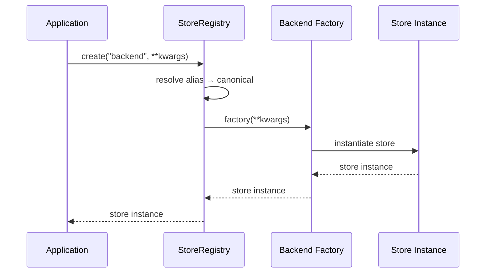

Persistence backend plugins extend PraisonAI with custom storage solutions for conversations, knowledge, and state management through a centralized registry system.

```mermaid
graph LR
    subgraph "Plugin System"
        A[📦 Third-party Package] --> B[🔌 Entry Point]
        B --> C[📝 StoreRegistry]
        C --> D{Kind?}
        D -->|conversation| E[💬 Conversation]
        D -->|knowledge|    F[📚 Knowledge]
        D -->|state|        G[🔄 State]
    end
    
    classDef package fill:#8B0000,stroke:#7C90A0,color:#fff
    classDef entrypoint fill:#F59E0B,stroke:#7C90A0,color:#fff
    classDef registry fill:#6366F1,stroke:#7C90A0,color:#fff
    classDef stores fill:#10B981,stroke:#7C90A0,color:#fff
    
    class A package
    class B entrypoint
    class C registry
    class D,E,F,G stores
```

## Quick Start

<Steps>
<Step title="Register a Custom Backend">
```python
from praisonai.persistence.registry import CONVERSATION_STORES

def my_store_factory(url=None, **kwargs):
    from my_pkg import MyConversationStore
    return MyConversationStore(url=url, **kwargs)

CONVERSATION_STORES.register("mybackend", my_store_factory, aliases=("mb",))

store = CONVERSATION_STORES.create("mb", url="proto://host")
```
</Step>

<Step title="Create an Entry-Point Plugin">
```toml
[project.entry-points."praisonai.conversation_stores"]
mybackend = "my_pkg.factory:create_store"

[project.entry-points."praisonai.knowledge_stores"]
mybackend = "my_pkg.factory:create_kstore"

[project.entry-points."praisonai.state_stores"]
mybackend = "my_pkg.factory:create_sstore"
```
</Step>
</Steps>

---

## How It Works



The plugin system provides three global registries for different storage types:

| Registry | Kind | Entry-point Group | Purpose |
|----------|------|-------------------|---------|
| `CONVERSATION_STORES` | `"conversation"` | `praisonai.conversation_stores` | Chat history and sessions |
| `KNOWLEDGE_STORES` | `"knowledge"` | `praisonai.knowledge_stores` | Vector databases and RAG |
| `STATE_STORES` | `"state"` | `praisonai.state_stores` | Application state and cache |

---

## Registry API Reference

Each `StoreRegistry` provides a thread-safe API for backend management:

| Method | Signature | Description |
|--------|-----------|-------------|
| `register` | `register(name: str, factory: Callable, *, aliases=()) -> None` | Register a backend factory with optional aliases |
| `create` | `create(name: str, **kwargs) -> Any` | Create a store instance by name or alias |
| `list_registered` | `() -> list[str]` | Get all registered backend names (sorted) |
| `list_aliases` | `() -> dict[str, str]` | Get alias → canonical name mappings |
| `default` | `@classmethod default(cls) -> "PluginRegistry[T]"` | **New in PR #1829**: Process-default registry instance (thread-safe, per-subclass) |

---

## Built-in Backends

### Conversation Stores

**Primary backends:** `postgres`, `async_postgres`, `mysql`, `async_mysql`, `MySQLConversationStore`, `sqlite`, `sync_sqlite`, `async_sqlite`, `json`, `singlestore`, `supabase`, `surrealdb`, `turso`

<Note>
**New in PR #1829**: `MySQLConversationStore` is available from `praisonai.persistence.conversation.mysql_new` but not re-exported from the main package. It inherits the unified schema from `_SQLConversationStoreBase`.
</Note>

**Aliases available:**
- `neon`, `cockroachdb`, `crdb`, `cockroach`, `xata` → `postgres`
- `asyncpg`, `postgres_async` → `async_postgres` 
- `aiomysql`, `mysql_async` → `async_mysql`
- `sqlite_sync` → `sync_sqlite`
- `aiosqlite`, `sqlite_async` → `async_sqlite`
- `libsql` → `turso`

### Knowledge Stores

**Primary backends:** `chroma`, `qdrant`, `pinecone`, `weaviate`, `lancedb`, `milvus`, `pgvector`, `redis`, `cassandra`, `clickhouse`, `mongodb_vector`, `couchbase`, `singlestore_vector`, `surrealdb_vector`, `upstash_vector`, `lightrag`, `langchain`, `llamaindex`, `cosmosdb`

**Aliases available:**
- `chromadb` → `chroma`
- `mongodb_atlas`, `mongo_vector` → `mongodb_vector`
- `singlestore_v` → `singlestore_vector`
- `surrealdb_v` → `surrealdb_vector`
- `upstash_v` → `upstash_vector`
- `langchain_adapter` → `langchain`
- `llama_index`, `llamaindex_adapter` → `llamaindex`
- `cosmos`, `azure_cosmos`, `cosmosdb_vector` → `cosmosdb`

### State Stores

**Primary backends:** `redis`, `dynamodb`, `firestore`, `mongodb`, `async_mongodb`, `upstash`, `memory`, `gcs`

**Aliases available:**
- `motor`, `mongodb_async` → `async_mongodb`

---

## Extending SQL Backends

For building new SQL conversation stores, inherit from `_SQLConversationStoreBase` to get unified schema and retry logic:

```python
from praisonai.persistence.conversation._sql_base import _SQLConversationStoreBase

class MyDBConversationStore(_SQLConversationStoreBase):
    # Constants for this dialect
    SCHEMA_VERSION = "1.0.0"  # Inherited from base
    _id_type = "UUID"
    _json_type = "JSONB"
    _float_type = "DOUBLE PRECISION"
    _serverless_hosts = (".mydb.cloud",)
    
    # Required dialect hooks
    def _param(self, n: int) -> str:
        return f"${n}"  # PostgreSQL-style parameters
    
    async def _connect(self, **kwargs):
        # Return connection for this dialect
        pass
    
    def _get_conn(self):
        # Get connection from pool
        pass
    
    def _put_conn(self, conn):
        # Return connection to pool  
        pass
    
    async def _execute(self, conn, query: str, *args):
        # Execute query with this dialect
        pass
    
    # ... implement other dialect hooks
```

The base class provides:
- Unified table schema with `SCHEMA_VERSION = "1.0.0"`
- Retry logic with configurable `max_retries` and `retry_delay`  
- Serverless detection and exponential backoff
- Standard CRUD operations for sessions and messages

---

## Process-Default Registry

Use `PluginRegistry.default()` for thread-safe per-subclass singleton registries:

```python
from praisonai._registry import PluginRegistry

class MyRegistry(PluginRegistry["MyThing"]):
    pass

# Thread-safe, per-subclass lazy initialization
reg = MyRegistry.default()

# Alternative registries are independent
class OtherRegistry(PluginRegistry["OtherThing"]):
    pass

other_reg = OtherRegistry.default()  # Different instance
```

This replaces the manual singleton pattern used in previous versions. Both `LLMProviderRegistry.default()` and `FrameworkAdapterRegistry.default()` now use this unified approach.

The legacy module-level functions (`get_default_registry()`, `get_default_llm_registry()`) remain for backward compatibility and delegate to the respective `cls.default()` methods.

---

## Common Patterns

<AccordionGroup>
<Accordion title="Custom Database Adapter">
```python
from praisonai.persistence.registry import CONVERSATION_STORES

class CustomDBConversationStore:
    def __init__(self, url=None, **kwargs):
        self.url = url
        # Initialize your database connection
        
    def save_session(self, session):
        # Save implementation
        pass
        
    def load_session(self, session_id):
        # Load implementation  
        pass

def create_custom_db(url=None, **kwargs):
    return CustomDBConversationStore(url=url, **kwargs)

# Register at runtime
CONVERSATION_STORES.register("customdb", create_custom_db)

# Use it
store = CONVERSATION_STORES.create("customdb", url="custom://localhost:5432/db")
```
</Accordion>

<Accordion title="Multi-Backend Package">
```python
# my_storage_package/__init__.py
def register_all_backends():
    from praisonai.persistence.registry import (
        CONVERSATION_STORES, KNOWLEDGE_STORES, STATE_STORES
    )
    
    CONVERSATION_STORES.register("myconv", create_conversation_store)
    KNOWLEDGE_STORES.register("myknow", create_knowledge_store) 
    STATE_STORES.register("mystate", create_state_store)

# Auto-register on import
register_all_backends()
```
</Accordion>

<Accordion title="Listing Available Backends">
```python
from praisonai.persistence.registry import (
    CONVERSATION_STORES, KNOWLEDGE_STORES, STATE_STORES,
)

print("Conversation backends:", CONVERSATION_STORES.list_registered())
print("Knowledge backends:", KNOWLEDGE_STORES.list_registered())
print("State backends:", STATE_STORES.list_registered())

# Check aliases
print("Aliases:", CONVERSATION_STORES.list_aliases())
```
</Accordion>
</AccordionGroup>

---

## Best Practices

<AccordionGroup>
<Accordion title="Thread Safety">
All registries are thread-safe with `threading.Lock` protection. Registrations and creations can be called concurrently without external synchronization. Factory functions should also be thread-safe if used in multi-threaded environments.
</Accordion>

<Accordion title="Error Handling">
Registry creation raises `ValueError` for unknown backends with a list of available options. Factory functions should handle their own connection errors and invalid parameters appropriately.
</Accordion>

<Accordion title="Lazy Loading">
Built-in backends use lazy imports to avoid loading unused dependencies. Follow this pattern in custom backends to minimize startup time and reduce import-time failures.
</Accordion>

<Accordion title="Naming Conventions">
- Use lowercase names without special characters
- Provide meaningful aliases for user convenience  
- Follow existing patterns: `async_*` for async variants, `*_vector` for vector stores
- Avoid conflicts with built-in backend names
</Accordion>
</AccordionGroup>

---

## Related

<CardGroup cols={2}>
<Card title="Framework Adapter Plugins" icon="plug" href="/docs/features/framework-adapter-plugins">
  Plugin system for multi-agent frameworks
</Card>
<Card title="Persistence Overview" icon="database" href="/docs/persistence/overview">
  Storage backends and configuration
</Card>
</CardGroup>