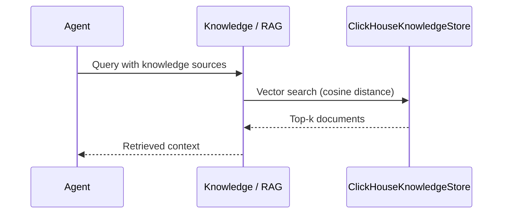

ClickHouse stores knowledge embeddings for fast vector search at scale — ideal for large document collections and analytics workloads.

```python
import os
from praisonaiagents import Agent

os.environ["PRAISONAI_KNOWLEDGE_STORE"] = "clickhouse"
os.environ["CLICKHOUSE_HOST"] = "localhost"

agent = Agent(
    name="Analyst",
    instructions="Answer from our knowledge base",
    knowledge=["docs/"],
)
agent.start("Summarise our refund policy")
```


## Quick Start

<Steps>
<Step title="Simple Usage">

```bash
pip install clickhouse-connect praisonai
export PRAISONAI_KNOWLEDGE_STORE=clickhouse
export CLICKHOUSE_HOST=localhost
export CLICKHOUSE_PORT=8123
```

```python
from praisonaiagents import Agent

agent = Agent(
    name="Analyst",
    instructions="Answer from docs",
    knowledge=["docs/"],
)
agent.start("What are our key metrics?")
```

</Step>

<Step title="With Configuration">

Create the store directly for full control:

```python
from praisonai.persistence import create_knowledge_store

store = create_knowledge_store(
    "clickhouse",
    host="localhost",
    port=8123,
    username="default",
    password="",
    database="praisonai",
    secure=False,
)
store.create_collection("docs", dimension=1536)
```

</Step>
</Steps>

---

## How It Works



ClickHouse is a **knowledge store** (vector search), not a primary conversation backend. Pair it with SQLite or PostgreSQL for chat history via `db()`.

---

## Configuration Options

| Option | Type | Default | Description |
|--------|------|---------|-------------|
| `host` | `str` | `"localhost"` | ClickHouse server hostname |
| `port` | `int` | `8123` | HTTP port |
| `username` | `str` | `"default"` | Database username |
| `password` | `str` | `""` | Database password |
| `database` | `str` | `"praisonai"` | Database name (created if missing) |
| `secure` | `bool` | `False` | Use HTTPS connection |

Environment variables: `CLICKHOUSE_HOST`, `CLICKHOUSE_PORT`, `CLICKHOUSE_USER`, `CLICKHOUSE_PASSWORD`.

---

## Docker Setup

```bash
docker run -d \
  --name praisonai-clickhouse \
  --ulimit nofile=262144:262144 \
  -p 8123:8123 \
  -p 9000:9000 \
  clickhouse/clickhouse-server:latest

curl "http://localhost:8123/?query=SELECT%20version()"
```

---

## Best Practices

<AccordionGroup>
<Accordion title="Use ClickHouse for knowledge, not conversations">
Store embeddings and retrieval in ClickHouse; keep conversation history in PostgreSQL, MySQL, or SQLite.
</Accordion>
<Accordion title="Batch inserts for throughput">
Insert documents in batches of 1000+ rows for better write performance on large corpora.
</Accordion>
<Accordion title="Partition large tables by time">
Use `PARTITION BY toYYYYMM(timestamp)` when logging retrieval events for analytics.
</Accordion>
<Accordion title="Set secure=True in production">
Enable TLS and authentication when connecting to remote ClickHouse clusters.
</Accordion>
</AccordionGroup>

---

## Related

<CardGroup cols={2}>
<Card title="Database Persistence" icon="database" href="/docs/features/persistence">
  Compare all persistence backends
</Card>
<Card title="Persistence Backend Plugins" icon="puzzle-piece" href="/docs/features/persistence-backend-plugins">
  Register custom storage backends
</Card>
</CardGroup>
