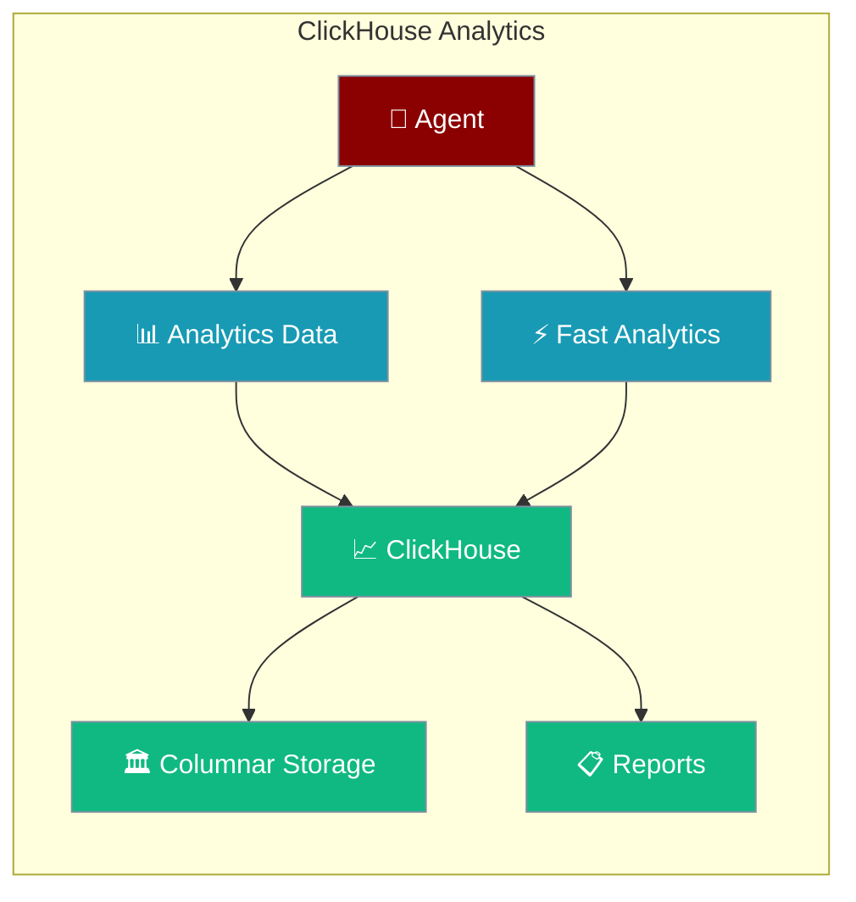
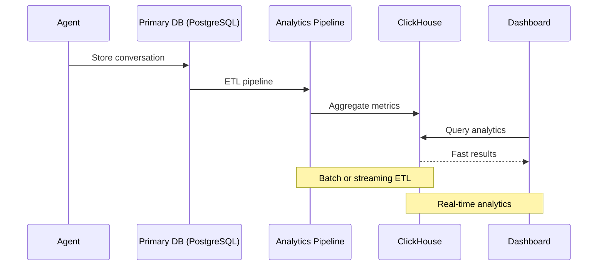

ClickHouse provides columnar analytics database storage, designed for high-performance analytics on large volumes of conversation data and real-time reporting.



## Quick Start

<Steps>
<Step title="Basic Analytics Setup">
```python
import clickhouse_connect
from praisonaiagents import Agent

# ClickHouse is typically used for analytics, not primary storage
client = clickhouse_connect.get_client(
    host="localhost",
    port=8123,
    username="default",
    password=""
)

# Create agent with primary storage elsewhere
agent = Agent(
    name="AnalyticsBot",
    instructions="You are a helpful assistant.",
    # Use SQLite/PostgreSQL for conversations
    db=db(database_url="sqlite:///conversations.db"),
    session_id="analytics-session"
)

# Agent conversations stored in primary DB
response = agent.chat("Generate analytics on our conversation patterns")
print(response)
```
</Step>

<Step title="Analytics Table Setup">
```python
import clickhouse_connect
from datetime import datetime

client = clickhouse_connect.get_client(host="localhost", port=8123)

# Create analytics table for conversation metrics
client.command("""
    CREATE TABLE IF NOT EXISTS conversation_analytics (
        session_id String,
        agent_name String,
        message_count UInt32,
        total_tokens UInt32,
        response_time Float64,
        user_satisfaction UInt8,
        timestamp DateTime,
        metadata String
    ) ENGINE = MergeTree()
    ORDER BY (timestamp, session_id)
""")

print("Analytics table created successfully")
```
</Step>
</Steps>

---

## How It Works



ClickHouse optimizes for analytical queries on large datasets:

| Table Type | Use Case | Performance |
|------------|----------|-------------|
| **conversation_metrics** | Message counts, response times | Aggregations in milliseconds |
| **user_behavior** | Usage patterns, preferences | Complex analytics at scale |
| **system_performance** | Agent performance, errors | Real-time monitoring |
| **business_intelligence** | KPIs, trends, forecasting | Historical analysis |

---

## Configuration Options

### Connection Setup
```python
import clickhouse_connect

# Basic connection
client = clickhouse_connect.get_client(
    host="localhost",
    port=8123,
    username="default",
    password="password"
)

# Secure connection
client = clickhouse_connect.get_client(
    host="clickhouse.example.com",
    port=8443,
    username="analytics_user", 
    password="secure_password",
    secure=True,
    verify=True
)

# Connection with settings
client = clickhouse_connect.get_client(
    host="localhost",
    port=8123,
    settings={
        'max_execution_time': 60,
        'max_memory_usage': 10000000000,
        'use_numpy': True
    }
)
```

### Advanced Configuration
```python
import clickhouse_connect
from praisonaiagents import Agent, db

class ClickHouseAnalytics:
    def __init__(self, host="localhost", port=8123, database="praisonai_analytics"):
        self.client = clickhouse_connect.get_client(
            host=host,
            port=port, 
            database=database,
            settings={
                'max_execution_time': 300,
                'max_memory_usage': 20000000000,
                'allow_experimental_object_type': 1
            }
        )
        self.setup_tables()
    
    def setup_tables(self):
        """Create analytics tables with optimal schemas"""
        
        # Conversation events table
        self.client.command("""
            CREATE TABLE IF NOT EXISTS conversation_events (
                event_id String,
                session_id String,
                agent_name String,
                event_type Enum('message', 'response', 'error', 'tool_call'),
                content String,
                tokens UInt32,
                response_time_ms Float64,
                timestamp DateTime64(3),
                user_id String,
                metadata String
            ) ENGINE = ReplacingMergeTree()
            ORDER BY (timestamp, session_id, event_id)
            PARTITION BY toYYYYMM(timestamp)
        """)
        
        # Aggregated metrics table
        self.client.command("""
            CREATE MATERIALIZED VIEW IF NOT EXISTS daily_metrics
            ENGINE = SummingMergeTree()
            ORDER BY (date, agent_name)
            AS SELECT
                toDate(timestamp) as date,
                agent_name,
                count() as total_events,
                sum(tokens) as total_tokens,
                avg(response_time_ms) as avg_response_time
            FROM conversation_events
            GROUP BY date, agent_name
        """)

# Initialize analytics
analytics = ClickHouseAnalytics()
```

---

## Docker Setup

Quick ClickHouse setup with Docker:

```bash
# Start ClickHouse container
docker run -d \
    --name praisonai-clickhouse \
    --ulimit nofile=262144:262144 \
    -p 8123:8123 \
    -p 9000:9000 \
    clickhouse/clickhouse-server:latest

# Connect and verify
curl "http://localhost:8123/?query=SELECT%20version()"
```

With persistence:
```bash
# ClickHouse with persistent storage
docker run -d \
    --name praisonai-clickhouse-persistent \
    --ulimit nofile=262144:262144 \
    -p 8123:8123 \
    -p 9000:9000 \
    -v $(pwd)/clickhouse_data:/var/lib/clickhouse \
    -v $(pwd)/clickhouse_logs:/var/log/clickhouse-server \
    clickhouse/clickhouse-server:latest
```

Then use in your analytics:
```python
import clickhouse_connect

client = clickhouse_connect.get_client(
    host="localhost", 
    port=8123,
    username="default"
)
```

---

## Analytics Patterns

### Real-Time Conversation Metrics
```python
import clickhouse_connect
from datetime import datetime
import json

client = clickhouse_connect.get_client(host="localhost", port=8123)

def log_conversation_event(session_id, agent_name, event_type, data):
    """Log conversation events for analytics"""
    
    event = {
        'event_id': f"{session_id}_{datetime.now().timestamp()}",
        'session_id': session_id,
        'agent_name': agent_name,
        'event_type': event_type,
        'content': data.get('content', ''),
        'tokens': data.get('tokens', 0),
        'response_time_ms': data.get('response_time_ms', 0.0),
        'timestamp': datetime.now(),
        'user_id': data.get('user_id', 'anonymous'),
        'metadata': json.dumps(data.get('metadata', {}))
    }
    
    client.insert('conversation_events', [event])

# Example usage with agent
from praisonaiagents import Agent, db

agent = Agent(
    name="MetricsBot",
    instructions="You are a helpful assistant.",
    db=db(database_url="sqlite:///conversations.db"),
    session_id="metrics-session"
)

# Log conversation start
log_conversation_event(
    session_id="metrics-session",
    agent_name="MetricsBot",
    event_type="message",
    data={
        'content': "User message",
        'tokens': 10,
        'user_id': 'user123',
        'metadata': {'source': 'web_app'}
    }
)

response = agent.chat("What are our usage patterns?")

# Log response
log_conversation_event(
    session_id="metrics-session",
    agent_name="MetricsBot", 
    event_type="response",
    data={
        'content': response,
        'tokens': 50,
        'response_time_ms': 1200.5,
        'user_id': 'user123'
    }
)
```

### Advanced Analytics Queries
```python
import clickhouse_connect
import pandas as pd

client = clickhouse_connect.get_client(host="localhost", port=8123)

def get_conversation_analytics(days=30):
    """Get comprehensive conversation analytics"""
    
    # Daily conversation trends
    daily_trends = client.query_df(f"""
        SELECT 
            toDate(timestamp) as date,
            agent_name,
            count() as conversations,
            sum(tokens) as total_tokens,
            avg(response_time_ms) as avg_response_time,
            countDistinct(user_id) as unique_users
        FROM conversation_events 
        WHERE timestamp >= now() - INTERVAL {days} DAY
        GROUP BY date, agent_name
        ORDER BY date DESC
    """)
    
    # Peak hours analysis
    hourly_patterns = client.query_df(f"""
        SELECT 
            toHour(timestamp) as hour,
            count() as message_count,
            avg(response_time_ms) as avg_response_time
        FROM conversation_events
        WHERE timestamp >= now() - INTERVAL {days} DAY
        GROUP BY hour
        ORDER BY hour
    """)
    
    # User behavior analysis
    user_behavior = client.query_df(f"""
        SELECT
            user_id,
            count() as total_interactions,
            countDistinct(session_id) as unique_sessions,
            sum(tokens) as total_tokens,
            first_value(timestamp) OVER (PARTITION BY user_id ORDER BY timestamp) as first_seen,
            max(timestamp) as last_seen
        FROM conversation_events
        WHERE timestamp >= now() - INTERVAL {days} DAY
        GROUP BY user_id
        HAVING total_interactions > 5
        ORDER BY total_interactions DESC
    """)
    
    return {
        'daily_trends': daily_trends,
        'hourly_patterns': hourly_patterns,
        'user_behavior': user_behavior
    }

# Get analytics
analytics = get_conversation_analytics()

print("Top conversation days:")
print(analytics['daily_trends'].head())

print("\nPeak hours:")
print(analytics['hourly_patterns'])

print(f"\nActive users: {len(analytics['user_behavior'])}")
```

### Time-Series Analysis
```python
import clickhouse_connect
from datetime import datetime, timedelta

client = clickhouse_connect.get_client(host="localhost", port=8123)

def create_time_series_tables():
    """Create optimized time-series tables"""
    
    # Performance metrics table
    client.command("""
        CREATE TABLE IF NOT EXISTS performance_metrics (
            timestamp DateTime64(3),
            metric_name String,
            metric_value Float64,
            agent_name String,
            session_id String,
            labels Map(String, String)
        ) ENGINE = MergeTree()
        ORDER BY (timestamp, metric_name, agent_name)
        PARTITION BY toYYYYMM(timestamp)
        TTL timestamp + INTERVAL 90 DAY
    """)
    
    # Continuous aggregation for real-time dashboards
    client.command("""
        CREATE MATERIALIZED VIEW IF NOT EXISTS performance_metrics_1min
        ENGINE = AggregatingMergeTree()
        ORDER BY (timestamp, metric_name, agent_name)
        AS SELECT
            toStartOfMinute(timestamp) as timestamp,
            metric_name,
            agent_name,
            avgState(metric_value) as avg_value,
            maxState(metric_value) as max_value,
            minState(metric_value) as min_value,
            countState() as count_value
        FROM performance_metrics
        GROUP BY timestamp, metric_name, agent_name
    """)

def record_performance_metric(agent_name, session_id, metric_name, value, labels=None):
    """Record performance metrics"""
    
    metric = {
        'timestamp': datetime.now(),
        'metric_name': metric_name,
        'metric_value': float(value),
        'agent_name': agent_name,
        'session_id': session_id,
        'labels': labels or {}
    }
    
    client.insert('performance_metrics', [metric])

# Example usage
create_time_series_tables()

# Record metrics during agent operation
record_performance_metric(
    agent_name="PerformanceBot",
    session_id="perf-session",
    metric_name="response_time", 
    value=1.25,
    labels={'model': 'gpt-4', 'region': 'us-east-1'}
)

record_performance_metric(
    agent_name="PerformanceBot",
    session_id="perf-session",
    metric_name="token_usage",
    value=150,
    labels={'type': 'completion'}
)

# Query real-time metrics
recent_performance = client.query_df("""
    SELECT 
        timestamp,
        metric_name,
        agent_name,
        avgMerge(avg_value) as avg_value,
        maxMerge(max_value) as max_value
    FROM performance_metrics_1min
    WHERE timestamp >= now() - INTERVAL 1 HOUR
    GROUP BY timestamp, metric_name, agent_name
    ORDER BY timestamp DESC
""")

print("Recent performance metrics:")
print(recent_performance.head())
```

---

## Production Deployment

### Cluster Setup
```python
import clickhouse_connect

# Connect to ClickHouse cluster
cluster_client = clickhouse_connect.get_client(
    host="clickhouse-lb.example.com",
    port=8123,
    username="analytics_user",
    password="secure_password",
    settings={
        'distributed_product_mode': 'global',
        'max_execution_time': 600
    }
)

# Create distributed table
cluster_client.command("""
    CREATE TABLE IF NOT EXISTS conversation_events_distributed AS conversation_events
    ENGINE = Distributed(analytics_cluster, default, conversation_events, rand())
""")

# Query across cluster
cluster_analytics = cluster_client.query_df("""
    SELECT 
        agent_name,
        count() as total_events,
        uniq(user_id) as unique_users,
        avg(response_time_ms) as avg_response_time
    FROM conversation_events_distributed
    WHERE timestamp >= today() - 30
    GROUP BY agent_name
    ORDER BY total_events DESC
""")

print("Cluster-wide analytics:")
print(cluster_analytics)
```

---

## Best Practices

<AccordionGroup>
<Accordion title="Schema Design">
- Use appropriate data types (UInt32 for counts, Float64 for metrics)
- Partition tables by time (toYYYYMM for monthly partitions)
- Order by time first, then by commonly filtered dimensions
- Use TTL for automatic data cleanup
</Accordion>

<Accordion title="Query Optimization">
- Leverage materialized views for pre-aggregated data
- Use SAMPLE for approximate analytics on large datasets
- Avoid SELECT * queries, specify only needed columns
- Use appropriate compression (LZ4 for speed, ZSTD for space)
</Accordion>

<Accordion title="Data Pipeline">
- Batch inserts for better performance (1000+ rows per insert)
- Use ReplacingMergeTree for deduplication
- Implement proper error handling and retry logic
- Monitor insert rates and query performance
</Accordion>

<Accordion title="Monitoring and Maintenance">
- Monitor system metrics (CPU, memory, disk I/O)
- Set up alerts for failed queries and slow performance
- Regular OPTIMIZE TABLE operations for better compression
- Plan for data archival and backup strategies
</Accordion>
</AccordionGroup>

---

## Related

<CardGroup cols={2}>
<Card title="PostgreSQL Analytics" icon="elephant" href="/docs/features/persistence-postgres">
  Use PostgreSQL for smaller-scale analytics and reporting
</Card>
<Card title="Database Persistence Overview" icon="database" href="/docs/features/persistence">
  Compare all available persistence backends
</Card>
</CardGroup>