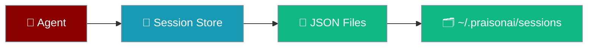
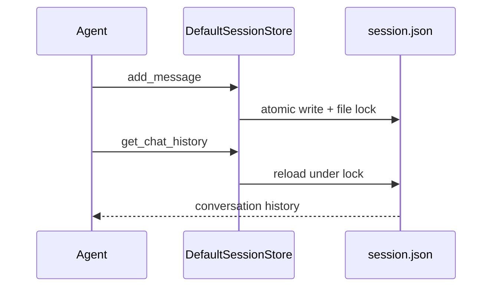

JSON file persistence saves agent sessions as human-readable files — no database required.

```python
from praisonaiagents import Agent

agent = Agent(
    name="FileBot",
    instructions="You are a helpful assistant.",
    session_id="my-session",
)
agent.start("Hello — this conversation is saved to JSON files")
```



## Quick Start

<Steps>
<Step title="Simple Usage">

Set `session_id` — PraisonAI persists to JSON automatically:

```python
from praisonaiagents import Agent

agent = Agent(
    name="FileBot",
    session_id="dev-session",
)
agent.start("Remember I prefer British English")
```

</Step>

<Step title="With Configuration">

Custom session directory or the conversation JSON store:

```python
from praisonaiagents.session import DefaultSessionStore
from praisonai.persistence import create_conversation_store

# Agent sessions — custom directory
store = DefaultSessionStore(session_dir="./my_sessions")

# Full conversation API — praisonai package
conv_store = create_conversation_store("json", path="./data/conversations")
```

</Step>
</Steps>

---

## How It Works



| Store | Location | Use case |
|-------|----------|----------|
| `DefaultSessionStore` | `~/.praisonai/sessions/` | Agent `session_id` (zero config) |
| `JSONConversationStore` | Configurable path | Full conversation API via `db()` |

---

## Configuration Options

### DefaultSessionStore

| Option | Type | Default | Description |
|--------|------|---------|-------------|
| `session_dir` | `str` | `~/.praisonai/sessions/` | Directory for session JSON files |
| `max_messages` | `int` | `100` | Maximum messages kept per session |
| `lock_timeout` | `float` | `5.0` | File lock timeout in seconds |

### JSONConversationStore

| Option | Type | Default | Description |
|--------|------|---------|-------------|
| `path` | `str` | `"./praisonai_conversations"` | Directory for JSON files |
| `pretty` | `bool` | `True` | Pretty-print JSON output |

<Note>
On macOS, Linux, and Windows, `DefaultSessionStore` uses file locking for multi-process safety. On platforms without `fcntl`, a one-time warning is logged and single-process usage remains safe.
</Note>

---

## Best Practices

<AccordionGroup>
<Accordion title="Use session_id for quick dev">
No `db=` needed — set `session_id` and conversations persist to `~/.praisonai/sessions/` automatically.
</Accordion>
<Accordion title="Set a custom session_dir for projects">
Point `DefaultSessionStore(session_dir=...)` at a project folder to keep sessions alongside your code.
</Accordion>
<Accordion title="Upgrade when data grows">
JSON suits development and small deployments. Move to SQLite or PostgreSQL when you need querying or multi-instance scaling.
</Accordion>
<Accordion title="Back up the sessions directory">
Copy the session folder regularly — each session is a single readable `.json` file.
</Accordion>
</AccordionGroup>

---

## Related

<CardGroup cols={2}>
<Card title="SQLite Persistence" icon="database" href="/docs/features/persistence-sqlite">
  Upgrade to SQLite for SQL queries and better concurrency
</Card>
<Card title="Database Persistence" icon="database" href="/docs/features/persistence">
  Compare all persistence backends
</Card>
</CardGroup>
