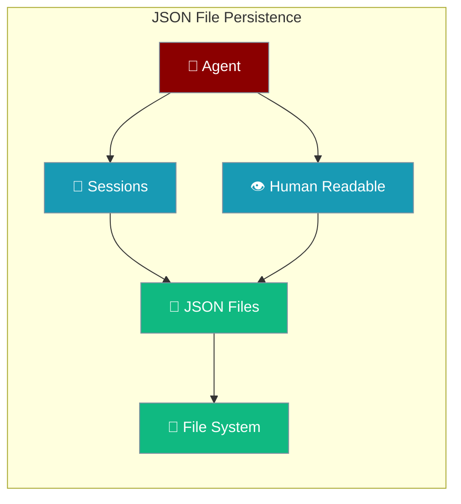
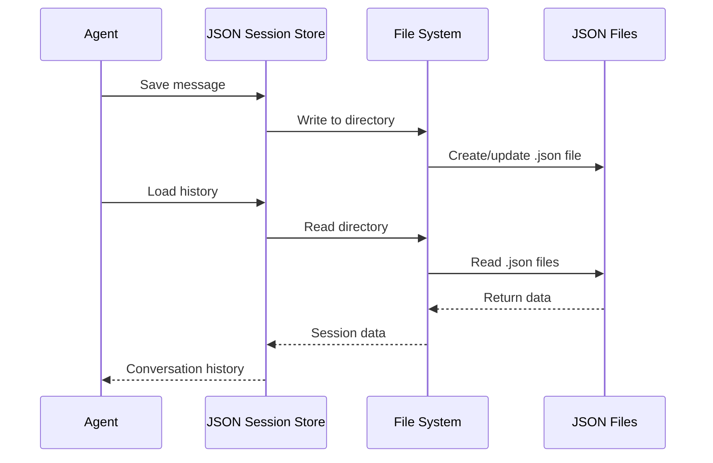

JSON file persistence provides the simplest storage option, saving conversations and session data as human-readable JSON files on disk, perfect for development and lightweight applications.



## Quick Start

<Steps>
<Step title="Default File Storage">
```python
from praisonaiagents import Agent

# Uses DefaultSessionStore with JSON files automatically
agent = Agent(
    name="FileBot",
    instructions="You are a helpful assistant.",
    session_id="file-session"
)

response = agent.chat("Hello! This conversation is saved to JSON files.")
print(response)  # Conversation automatically persisted to ./sessions/ directory
```
</Step>

<Step title="Custom Directory">
```python
from praisonaiagents.session.store import DefaultSessionStore
from praisonaiagents import Agent

# Custom session directory
session_store = DefaultSessionStore(session_dir="./my_conversations")

# Note: DefaultSessionStore integration with Agent may vary
# For direct file control, manually manage sessions
session_id = "custom-file-session"
session_store.add_message(session_id, "user", "Hello from file storage!")
session_store.add_message(session_id, "assistant", "Hello! Stored in custom directory.")

# Retrieve conversation history
history = session_store.get_chat_history(session_id)
print(f"Messages stored: {len(history)}")
```
</Step>
</Steps>

---

## How It Works



JSON files organize data in a simple directory structure:

| File/Directory | Contents | Purpose |
|----------------|----------|---------|
| `./sessions/` | Session directories | Default storage location |
| `session_id.json` | Session metadata | Session info and settings |
| `messages.json` | Conversation messages | Complete message history |
| `metadata.json` | Additional metadata | User preferences, agent config |

---

## Configuration Options

### Directory Structure
```python
from praisonaiagents.session.store import DefaultSessionStore
import os

# Custom directory structure
custom_store = DefaultSessionStore(
    session_dir="./data/conversations",
    # Creates: ./data/conversations/{session_id}/
)

# Nested organization
project_store = DefaultSessionStore(
    session_dir=f"./projects/{os.getenv('PROJECT_NAME', 'default')}/sessions"
)

# User-specific directories  
user_id = "user123"
user_store = DefaultSessionStore(
    session_dir=f"./users/{user_id}/sessions"
)
```

### Advanced File Management
```python
import json
import os
from datetime import datetime
from praisonaiagents.session.store import DefaultSessionStore

class CustomJSONStore(DefaultSessionStore):
    """Enhanced JSON store with additional features"""
    
    def __init__(self, session_dir="./sessions", backup_dir="./backups"):
        super().__init__(session_dir=session_dir)
        self.backup_dir = backup_dir
        os.makedirs(backup_dir, exist_ok=True)
    
    def save_session_with_backup(self, session_id):
        """Save session with automatic backup"""
        session = self.get_session(session_id)
        
        # Create backup
        backup_file = os.path.join(
            self.backup_dir,
            f"{session_id}_{datetime.now().strftime('%Y%m%d_%H%M%S')}.json"
        )
        
        backup_data = {
            'session': session.__dict__ if hasattr(session, '__dict__') else session,
            'messages': self.get_chat_history(session_id),
            'backup_timestamp': datetime.now().isoformat()
        }
        
        with open(backup_file, 'w') as f:
            json.dump(backup_data, f, indent=2, default=str)
        
        print(f"Session backed up to: {backup_file}")
    
    def list_sessions(self):
        """List all available sessions"""
        if not os.path.exists(self.session_dir):
            return []
        
        sessions = []
        for item in os.listdir(self.session_dir):
            session_path = os.path.join(self.session_dir, item)
            if os.path.isdir(session_path):
                sessions.append({
                    'session_id': item,
                    'path': session_path,
                    'modified': datetime.fromtimestamp(os.path.getmtime(session_path))
                })
        
        return sorted(sessions, key=lambda x: x['modified'], reverse=True)

# Usage
store = CustomJSONStore(
    session_dir="./enhanced_sessions",
    backup_dir="./session_backups"
)
```

---

## File Format and Structure

### Session Metadata File
```json
{
  "session_id": "example-session",
  "agent_id": "FileBot",
  "created_at": "2024-01-15T10:30:00.000Z",
  "updated_at": "2024-01-15T10:35:00.000Z",
  "metadata": {
    "user_id": "user123",
    "conversation_topic": "General assistance",
    "agent_version": "1.0.0"
  },
  "settings": {
    "auto_save": true,
    "include_timestamps": true
  }
}
```

### Messages File
```json
{
  "messages": [
    {
      "role": "user",
      "content": "Hello! How are you?",
      "timestamp": "2024-01-15T10:30:15.000Z",
      "metadata": {
        "source": "web_interface",
        "ip_address": "192.168.1.1"
      }
    },
    {
      "role": "assistant", 
      "content": "Hello! I'm doing well, thank you for asking. How can I help you today?",
      "timestamp": "2024-01-15T10:30:18.000Z",
      "metadata": {
        "model": "gpt-4",
        "response_time_ms": 1200,
        "token_count": 23
      }
    }
  ],
  "total_messages": 2,
  "last_updated": "2024-01-15T10:30:18.000Z"
}
```

---

## Advanced Usage Patterns

### Conversation Export and Import
```python
import json
import os
from datetime import datetime
from praisonaiagents.session.store import DefaultSessionStore

def export_conversations_to_archive(store, archive_path):
    """Export all conversations to a single archive file"""
    
    sessions = store.list_sessions() if hasattr(store, 'list_sessions') else []
    archive_data = {
        'export_timestamp': datetime.now().isoformat(),
        'total_sessions': len(sessions),
        'conversations': {}
    }
    
    for session_info in sessions:
        session_id = session_info['session_id']
        try:
            session = store.get_session(session_id)
            messages = store.get_chat_history(session_id)
            
            archive_data['conversations'][session_id] = {
                'session_metadata': session.__dict__ if hasattr(session, '__dict__') else session,
                'messages': messages,
                'message_count': len(messages)
            }
        except Exception as e:
            print(f"Error exporting session {session_id}: {e}")
    
    with open(archive_path, 'w') as f:
        json.dump(archive_data, f, indent=2, default=str)
    
    print(f"Exported {len(archive_data['conversations'])} conversations to {archive_path}")

def import_conversations_from_archive(store, archive_path):
    """Import conversations from archive file"""
    
    with open(archive_path, 'r') as f:
        archive_data = json.load(f)
    
    imported_count = 0
    for session_id, conversation_data in archive_data['conversations'].items():
        try:
            # Recreate session
            messages = conversation_data['messages']
            for message in messages:
                store.add_message(session_id, message['role'], message['content'])
            
            imported_count += 1
        except Exception as e:
            print(f"Error importing session {session_id}: {e}")
    
    print(f"Imported {imported_count} conversations from {archive_path}")

# Usage
store = DefaultSessionStore(session_dir="./conversations")

# Export conversations
export_conversations_to_archive(store, "./conversation_archive.json")

# Import to new location
new_store = DefaultSessionStore(session_dir="./imported_conversations")
import_conversations_from_archive(new_store, "./conversation_archive.json")
```

### Conversation Analytics
```python
import json
import os
from datetime import datetime, timedelta
from collections import defaultdict, Counter

def analyze_json_conversations(session_dir="./sessions"):
    """Analyze conversation patterns from JSON files"""
    
    analytics = {
        'total_sessions': 0,
        'total_messages': 0,
        'messages_by_role': Counter(),
        'sessions_by_day': defaultdict(int),
        'average_session_length': 0,
        'top_words': Counter(),
        'session_durations': []
    }
    
    if not os.path.exists(session_dir):
        return analytics
    
    for session_id in os.listdir(session_dir):
        session_path = os.path.join(session_dir, session_id)
        if not os.path.isdir(session_path):
            continue
        
        messages_file = os.path.join(session_path, "messages.json")
        if not os.path.exists(messages_file):
            continue
        
        try:
            with open(messages_file, 'r') as f:
                data = json.load(f)
            
            messages = data.get('messages', [])
            analytics['total_sessions'] += 1
            analytics['total_messages'] += len(messages)
            
            if messages:
                # Analyze by day
                first_message = messages[0]
                if 'timestamp' in first_message:
                    day = first_message['timestamp'][:10]  # YYYY-MM-DD
                    analytics['sessions_by_day'][day] += 1
                
                # Session duration
                if len(messages) > 1:
                    try:
                        start_time = datetime.fromisoformat(first_message['timestamp'].replace('Z', '+00:00'))
                        end_time = datetime.fromisoformat(messages[-1]['timestamp'].replace('Z', '+00:00'))
                        duration = (end_time - start_time).total_seconds()
                        analytics['session_durations'].append(duration)
                    except:
                        pass
            
            # Analyze messages
            for message in messages:
                role = message.get('role', 'unknown')
                analytics['messages_by_role'][role] += 1
                
                # Word frequency (simple)
                content = message.get('content', '').lower()
                words = content.split()
                analytics['top_words'].update(words)
        
        except Exception as e:
            print(f"Error analyzing session {session_id}: {e}")
    
    # Calculate averages
    if analytics['total_sessions'] > 0:
        analytics['average_session_length'] = analytics['total_messages'] / analytics['total_sessions']
    
    if analytics['session_durations']:
        analytics['average_duration_minutes'] = sum(analytics['session_durations']) / len(analytics['session_durations']) / 60
    
    return analytics

# Run analytics
analytics = analyze_json_conversations("./sessions")

print("Conversation Analytics:")
print(f"Total sessions: {analytics['total_sessions']}")
print(f"Total messages: {analytics['total_messages']}")
print(f"Average messages per session: {analytics['average_session_length']:.2f}")
print(f"Messages by role: {dict(analytics['messages_by_role'])}")

if analytics.get('average_duration_minutes'):
    print(f"Average session duration: {analytics['average_duration_minutes']:.2f} minutes")

print(f"Top 10 words: {analytics['top_words'].most_common(10)}")
```

### File-Based Search
```python
import json
import os
import re
from datetime import datetime

def search_conversations(session_dir, query, role_filter=None, date_filter=None):
    """Search through JSON conversation files"""
    
    results = []
    query_pattern = re.compile(query, re.IGNORECASE)
    
    for session_id in os.listdir(session_dir):
        session_path = os.path.join(session_dir, session_id)
        messages_file = os.path.join(session_path, "messages.json")
        
        if not os.path.exists(messages_file):
            continue
        
        try:
            with open(messages_file, 'r') as f:
                data = json.load(f)
            
            messages = data.get('messages', [])
            
            for i, message in enumerate(messages):
                # Apply filters
                if role_filter and message.get('role') != role_filter:
                    continue
                
                if date_filter:
                    msg_date = message.get('timestamp', '')[:10]
                    if msg_date != date_filter:
                        continue
                
                # Search content
                content = message.get('content', '')
                if query_pattern.search(content):
                    results.append({
                        'session_id': session_id,
                        'message_index': i,
                        'role': message.get('role'),
                        'content': content,
                        'timestamp': message.get('timestamp'),
                        'match_preview': get_match_preview(content, query_pattern)
                    })
        
        except Exception as e:
            print(f"Error searching session {session_id}: {e}")
    
    return results

def get_match_preview(text, pattern, context_length=50):
    """Get preview text around the match"""
    match = pattern.search(text)
    if not match:
        return text[:100] + "..." if len(text) > 100 else text
    
    start = max(0, match.start() - context_length)
    end = min(len(text), match.end() + context_length)
    preview = text[start:end]
    
    if start > 0:
        preview = "..." + preview
    if end < len(text):
        preview = preview + "..."
    
    return preview

# Example searches
print("Search results for 'machine learning':")
ml_results = search_conversations("./sessions", "machine learning")
for result in ml_results[:5]:  # Top 5 results
    print(f"Session: {result['session_id']}")
    print(f"Role: {result['role']}")
    print(f"Preview: {result['match_preview']}")
    print("---")

print("\nUser questions containing 'how to':")
how_to_results = search_conversations("./sessions", "how to", role_filter="user")
for result in how_to_results[:3]:
    print(f"Question: {result['content']}")
    print(f"Timestamp: {result['timestamp']}")
    print("---")
```

---

## Best Practices

<AccordionGroup>
<Accordion title="File Organization">
- Use meaningful session IDs that include timestamps or user IDs
- Create nested directory structures for large numbers of sessions
- Implement automatic cleanup of old or empty sessions
- Use consistent JSON formatting for better readability
</Accordion>

<Accordion title="Performance Considerations">
- JSON files work best for small to medium conversation histories
- For large datasets, consider migrating to SQLite or PostgreSQL
- Implement lazy loading for large conversation files
- Use file compression for long-term storage
</Accordion>

<Accordion title="Backup and Recovery">
- Regularly backup the entire sessions directory
- Implement versioning for important conversations
- Test restore procedures periodically
- Consider cloud storage sync for important data
</Accordion>

<Accordion title="Security and Privacy">
- Set appropriate file system permissions (600 or 640)
- Encrypt sensitive conversations before writing to disk
- Implement data retention policies for privacy compliance
- Avoid storing sensitive data in plain text JSON
</Accordion>
</AccordionGroup>

---

## Related

<CardGroup cols={2}>
<Card title="SQLite Persistence" icon="database" href="/docs/features/persistence-sqlite">
  Upgrade to SQLite for better performance and querying
</Card>
<Card title="Database Persistence Overview" icon="database" href="/docs/features/persistence">
  Compare all available persistence backends
</Card>
</CardGroup>