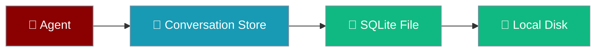
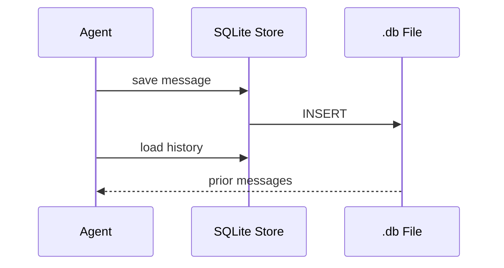

SQLite saves agent conversations to a local `.db` file — no external database required.

```python
from praisonaiagents import Agent, db

agent = Agent(
    name="Assistant",
    instructions="You are a helpful assistant.",
    db=db(database_url="sqlite:///conversations.db"),
    session_id="dev-session",
)
agent.start("Hello — saved to SQLite")
```


The user develops locally; SQLite writes conversations to a single file on disk.



## Quick Start

<Steps>
<Step title="Simple Usage">

```python
from praisonaiagents import Agent, db

agent = Agent(
    name="Assistant",
    db=db(database_url="sqlite:///conversations.db"),
    session_id="session-1",
)
agent.start("Remember my favourite colour is blue")
```

</Step>

<Step title="With Configuration">

Choose sync or async when using the factory directly:

```python
from praisonai.persistence.factory import create_conversation_store

# Sync — scripts and multi-threaded agents
store = create_conversation_store(
    "sqlite",
    path="./conversations.db",
    mode="sync",
)

# Async — FastAPI / asyncio apps
store = create_conversation_store(
    "sqlite",
    path="./conversations.db",
    mode="async",
)
```

</Step>
</Steps>

<Warning>
Before PR #1763, `AsyncSQLiteConversationStore` exposed sync wrappers callable from regular functions. Those wrappers were removed — use `mode="sync"` (`sync_sqlite` backend) when calling from sync code.
</Warning>

---

## How It Works



| Table | Purpose |
|-------|---------|
| `sessions` | Session metadata |
| `messages` | User and agent messages |
| `runs` | Agent execution runs |
| `tool_calls` | Tool usage records |

---

## Sync vs Async

```mermaid
graph TB
    Q1{Plain Python script<br/>or multi-agent?} -->|Sync / multi-thread| SYNC[mode="sync"]
    Q1 -->|FastAPI / asyncio| ASYNC[mode="async"]
    Q1 -->|Not sure| AUTO[mode="auto"<br/>legacy behaviour]

    classDef sync fill:#10B981,stroke:#7C90A0,color:#fff
    classDef async fill:#189AB4,stroke:#7C90A0,color:#fff
    classDef auto fill:#F59E0B,stroke:#7C90A0,color:#fff

    class SYNC sync
    class ASYNC async
    class AUTO auto
```

---

## Configuration Options

| Option | Type | Default | Description |
|--------|------|---------|-------------|
| `mode` | `"sync" \| "async" \| "auto"` | `"auto"` | Backend variant; invalid values raise `ValueError` |
| `path` | `str` | `"praisonai_conversations.db"` | SQLite file path (sync store) |
| `table_prefix` | `str` | `"praison_"` | Table name prefix (alphanumeric only) |

### URL formats

```python
db(database_url="sqlite:///conversations.db")          # relative path
db(database_url="sqlite:////absolute/path/to/db.db") # absolute path
db(database_url="sqlite:///:memory:")                # in-memory (temporary)
```

---

## Best Practices

<AccordionGroup>
<Accordion title="Use sync mode for multi-agent scripts">
The `sync_sqlite` backend (`mode="sync"`) uses per-call connection locking for multi-threaded agents.
</Accordion>
<Accordion title="Use absolute paths in production">
Set the database path via environment variables and use absolute paths for deployments.
</Accordion>
<Accordion title="Enable WAL for better concurrency">
Run `PRAGMA journal_mode=WAL` when multiple readers share the same file.
</Accordion>
<Accordion title="Migrate to PostgreSQL at scale">
SQLite handles thousands of conversations; move to PostgreSQL for multi-instance deployments.
</Accordion>
</AccordionGroup>

---

## Related

<CardGroup cols={2}>
<Card title="PostgreSQL Persistence" icon="elephant" href="/docs/features/persistence-postgres">
  Scale up when you outgrow SQLite
</Card>
<Card title="Database Persistence" icon="database" href="/docs/features/persistence">
  Compare all persistence backends
</Card>
</CardGroup>
