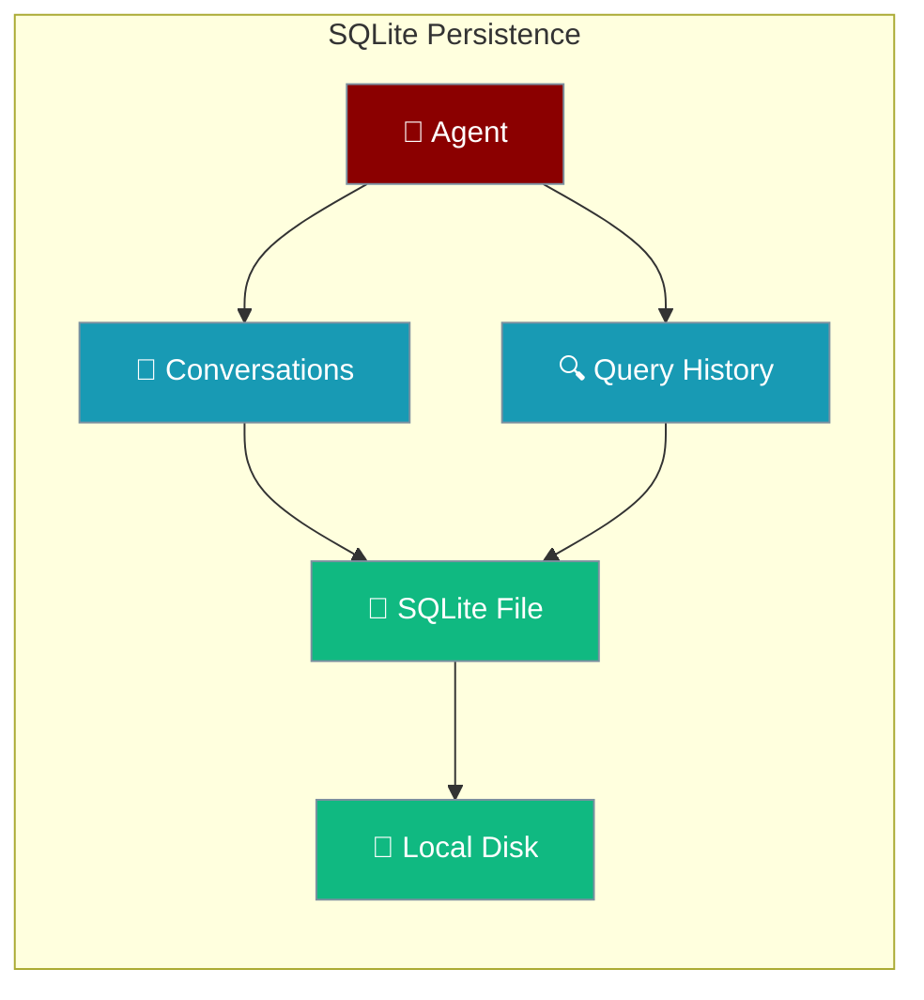
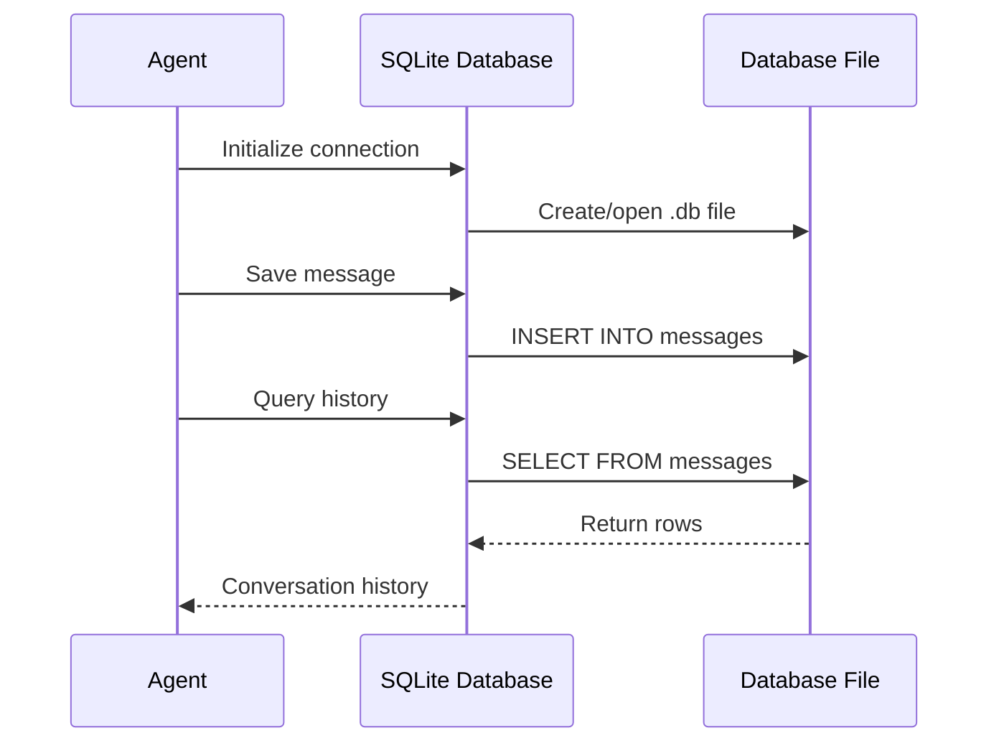

SQLite provides local file-based SQL database persistence, perfect for development, prototypes, and single-instance applications that need reliable data storage without external dependencies.



## Quick Start

<Steps>
<Step title="Basic Setup">
```python
from praisonaiagents import Agent, db

agent = Agent(
    name="LocalBot",
    instructions="You are a helpful assistant.",
    db=db(database_url="sqlite:///agent_conversations.db"),
    session_id="local-session"
)

response = agent.chat("Hello! Can you remember this conversation?")
print(response)  # Conversation automatically saved to SQLite
```
</Step>

<Step title="Custom Database Path">
```python
from praisonaiagents import Agent, db
import tempfile
import os

# Create database in specific location
db_path = os.path.join(tempfile.gettempdir(), "my_agent.db")
my_db = db.SQLiteDB(path=db_path)

agent = Agent(
    name="CustomBot",
    instructions="You are a helpful assistant.",
    db=my_db,
    session_id="custom-session"
)

agent.chat("This is stored in my custom location!")
```
</Step>
</Steps>

---

## How It Works



SQLite stores conversation data in tables within a single file:

| Table | Content | Purpose |
|-------|---------|---------|
| `sessions` | Session metadata | Track conversation sessions |
| `messages` | User and agent messages | Complete conversation history |
| `runs` | Agent execution runs | Track agent processing steps |
| `tool_calls` | Tool usage | Record function calls and results |

---

## Configuration Options

### Database URL Format
```python
# Simple file path
db(database_url="sqlite:///conversations.db")

# Absolute path
db(database_url="sqlite:////absolute/path/to/database.db")

# Relative path with subdirectory
db(database_url="sqlite:///data/agent_storage.db")

# In-memory database (temporary)
db(database_url="sqlite:///:memory:")
```

### Advanced Configuration
```python
from praisonaiagents import Agent, db

# Custom SQLite database with specific options
my_db = db.SQLiteDB(
    path="./data/agents.db",
    # SQLite-specific options can be configured via the database URL
)

agent = Agent(
    name="ConfiguredBot",
    instructions="You are a helpful assistant.",
    db=my_db,
    session_id="configured-session"
)
```

---

## Session Resume Example

```python
from praisonaiagents import Agent, db

# First conversation
agent1 = Agent(
    name="Assistant",
    db=db(database_url="sqlite:///memory.db"),
    session_id="user-alice"
)

agent1.chat("My favorite color is blue")
agent1.chat("I work as a software engineer")

# Simulate application restart
agent1 = None

# Resume conversation - automatically loads history
agent2 = Agent(
    name="Assistant", 
    db=db(database_url="sqlite:///memory.db"),
    session_id="user-alice"  # Same session ID
)

response = agent2.chat("What's my favorite color and job?")
print(response)  # Will reference blue color and software engineering
```

---

## Direct Database Access

For advanced use cases, query the SQLite database directly:

```python
import sqlite3
from praisonaiagents import Agent, db

# Create agent and have conversation
agent = Agent(
    name="DataBot",
    db=db(database_url="sqlite:///analytics.db"),
    session_id="data-session"
)

agent.chat("Analyze quarterly sales data")

# Direct database access for reporting
conn = sqlite3.connect("analytics.db")
cursor = conn.cursor()

# Query conversation history
cursor.execute("""
    SELECT role, content, created_at 
    FROM messages 
    WHERE session_id = 'data-session'
    ORDER BY created_at
""")

messages = cursor.fetchall()
for role, content, timestamp in messages:
    print(f"[{timestamp}] {role}: {content}")

conn.close()
```

---

## Production Considerations

<AccordionGroup>
<Accordion title="File Permissions and Location">
- Ensure the application has write permissions to the database directory
- Use absolute paths for production deployments
- Consider using environment variables for database paths
- Back up the .db file regularly
</Accordion>

<Accordion title="Concurrent Access">
- SQLite supports multiple readers but only one writer
- Use WAL mode for better concurrency: `PRAGMA journal_mode=WAL`
- Consider connection pooling for multi-threaded applications
- For high concurrency, migrate to PostgreSQL or MySQL
</Accordion>

<Accordion title="Database Maintenance">
- Monitor database file size growth
- Use `VACUUM` periodically to reclaim space
- Implement log rotation for old conversations
- Set up automated backups of the .db file
</Accordion>

<Accordion title="Migration Path">
- Start with SQLite for development and MVP
- SQLite can handle thousands of conversations efficiently
- Migrate to PostgreSQL when you need multi-instance deployment
- Export data using SQL dumps for migration
</Accordion>
</AccordionGroup>

---

## Related

<CardGroup cols={2}>
<Card title="PostgreSQL Persistence" icon="elephant" href="/docs/features/persistence-postgres">
  Scale up to production PostgreSQL when you outgrow SQLite
</Card>
<Card title="Database Persistence Overview" icon="database" href="/docs/features/persistence">
  Compare all available persistence backends
</Card>
</CardGroup>